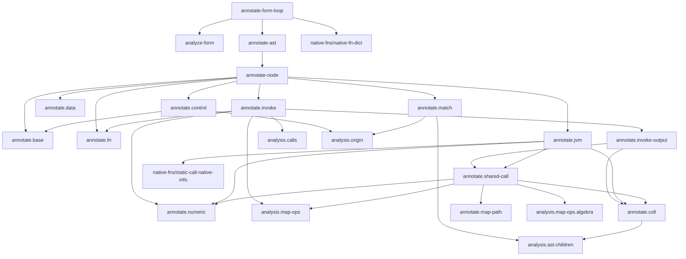

# `skeptic.analysis.annotate` Function Map

This document is source-derived from the current annotate subtree:

- `src/skeptic/analysis/annotate.clj`
- `src/skeptic/analysis/annotate/api.clj`
- `src/skeptic/analysis/annotate/base.clj`
- `src/skeptic/analysis/annotate/coll.clj`
- `src/skeptic/analysis/annotate/control.clj`
- `src/skeptic/analysis/annotate/data.clj`
- `src/skeptic/analysis/annotate/fn.clj`
- `src/skeptic/analysis/annotate/invoke.clj`
- `src/skeptic/analysis/annotate/invoke_output.clj`
- `src/skeptic/analysis/annotate/jvm.clj`
- `src/skeptic/analysis/annotate/map_path.clj`
- `src/skeptic/analysis/annotate/match.clj`
- `src/skeptic/analysis/annotate/numeric.clj`
- `src/skeptic/analysis/annotate/shared_call.clj`
- `src/skeptic/analysis/annotate/test_api.clj`

## Governing Path

The rebuilt annotate subtree is centered on one explicit recursive runner in
`skeptic.analysis.annotate`.

Entry flow:

1. `annotate-form-loop` merges `analysis.native-fns/native-fn-dict` into the
   incoming declaration dictionary.
2. `analyze-form` runs `clojure.tools.analyzer.jvm/analyze` with synthetic
   binding nodes seeded for incoming locals.
3. `annotate-ast` normalizes locals and seeds the annotation context:
   `:dict`, `:locals`, `:assumptions`, `:recur-targets`, `:name`, and `:ns`.
4. `annotate-node` installs itself as `:recurse`, wraps the node in
   `bridge.localize/with-error-context`, dispatches by analyzer `:op`, and
   strips derived display fields from the result.

The design rule is now:

- recursion lives only in `annotate-node`
- helper namespaces never recurse into each other directly
- helper namespaces receive the runner through `ctx`

## Namespace Graph

## Main Flows

- Dispatch flow:
  `annotate-dispatch` sends structural nodes to `base`, control-flow nodes to
  `control`, data literals and exceptional forms to `data`, functions to `fn`,
  ordinary and keyword calls to `invoke`, JVM calls to `jvm`, and `:case` to
  `match`.
- Generic fallback:
  unsupported ops go through `base/annotate-children` and then receive `Dyn`.
- Control/origin flow:
  `control/annotate-do`, `control/annotate-if`, and `match/annotate-case`
  thread assumptions through `analysis.origin`.
- Callable flow:
  `fn/annotate-fn` produces `:arglists`, `:output-type`, and function semantic
  types that `analysis.calls/call-info` consumes later.
- Invoke refinement flow:
  `invoke/annotate-invoke` gets default call metadata from `analysis.calls`,
  then refines outputs through `invoke_output` and `numeric`.
- Keyword access flow:
  `invoke/annotate-keyword-invoke` handles analyzer `:keyword-invoke`
  directly with `analysis.map-ops/map-get-type`.
- Static-call refinement flow:
  `jvm/annotate-static-call` loads native signatures, applies shared map and
  collection specialization first, then numeric narrowing.
- Map-shape flow:
  `shared_call` delegates literal-key assoc and dissoc rewriting to
  `map_path`.
- Tree-rescan flow:
  `control/widen-int-loop-counter-recur-targets`,
  `coll/for-body-element-type`, and `match/case-kw-root-info` rescan typed
  subtrees through `analysis.ast-children/ast-nodes`.

## Namespace Map

### `skeptic.analysis.annotate`

- `node-location`: extracts source location from form metadata.
- `node-error-context`: builds the `with-error-context` payload for one node.
- `annotate-generic`: annotates children structurally and assigns `Dyn`.
- `annotate-dispatch`: ordered `:op` dispatcher for the whole subtree.
- `annotate-node`: the recursive runner. Installs itself in `ctx`, wraps error
  context, delegates to `annotate-dispatch`, and strips derived fields.
- `normalize-locals`: normalizes incoming local entries with
  `analysis.normalize/normalize-entry`.
- `annotate-ast`: seeds the annotation context and starts annotation at the
  root.
- `target-ns`: resolves or creates the namespace used for analysis.
- `analyze-env`: builds the analyzer env, including synthetic bindings for
  incoming locals.
- `analyze-form`: runs `tools.analyzer.jvm/analyze`.
- `annotate-form-loop`: public entrypoint for annotation.

### `skeptic.analysis.annotate.api`

This namespace is the public accessor boundary for production code.

- `def-node-getters`: macro that defines the simple field accessors.
- node accessors:
  `node-op`, `node-form`, `node-type`, `node-output-type`, `node-fn-type`,
  `node-origin`, `node-var`, `node-name`, `node-class`, `node-method`,
  `node-value`, `node-tag`, `node-raw-forms`, `node-test`, `node-body`,
  `node-init`, `node-expr`, `node-ret`, `node-bindings`, `node-target`,
  `node-keyword`, `node-arglists`, `node-arglist`, `call-fn-node`,
  `call-args`, `recur-args`, `call-actual-argtypes`,
  `call-expected-argtypes`, and `binding-init`.
- `node-location`: source-location helper.
- `node-info`: compact call/type metadata projection used internally by
  annotation helpers.
- `synthetic-binding-node`: analyzer-facing synthetic local node builder.
- `node-children`: child-key enumeration in analyzer `:children` order.
- `annotated-nodes`: preorder traversal of all annotated nodes.
- `find-node`: subtree search by predicate.
- `unwrap-with-meta`: strips nested `:with-meta` wrappers.
- classification helpers:
  `local-node?`, `if-node?`, `let-node?`, `recur-node?`, `call-node?`,
  and `invoke-ops`.
- provenance helpers:
  `node-ref`, `callee-ref`, `local-resolution-path`, `local-vars-context`,
  and `call-refs`.
- function/def helpers:
  `function-methods`, `method-body`, `def-init-node`, `then-node`,
  `else-node`, `arglist-types`, `analyzed-def-entry`, `method-result-type`,
  `resolved-def-entry`, and `resolved-def-output-type`.
- branch helpers:
  `branch-origin-kind` and `branch-test-assumption`.
- metadata/compat helpers:
  `typed-call-metadata-only?`, `strip-derived-types`, `def-node?`,
  and `def-value-node`.

### `skeptic.analysis.annotate.test_api`

This namespace owns test-only projections and synthetic fixtures.

- normalization helpers:
  `normalize-symbol`, `normalize-form`, and `var->sym`.
- `stable-keys`: the stable projected node surface used by tests.
- projection helpers:
  `project-ast`, `projected-nodes`, `find-projected-node`,
  `child-projection`, `ast-by-name`, and `node-by-form`.
- `arglist-types`: test-facing passthrough to the production accessor.
- `annotate-form-loop`: test-facing passthrough to the production entrypoint.
- synthetic fixtures:
  `test-local-node`, `test-fn-node`, `test-typed-node`, `test-const-node`,
  `test-invoke-node`, `test-invoke-form-node`, `test-with-meta-node`,
  and `test-static-call-node`.

### `skeptic.analysis.annotate.base`

- `annotate-child`: annotates one child value through the recursive runner.
- `annotate-children`: generic child walker for unsupported or structural
  nodes.
- `annotate-const`: types literal constants with `value/type-of-value`.
- `annotate-binding`: annotates `:init` and copies node info from the init.
- `annotate-local`: resolves current locals, applying active assumptions
  through `analysis.origin/effective-entry`.
- `annotate-var-like`: resolves vars and symbols from the declaration dict.

### `skeptic.analysis.annotate.control`

- nil-check helpers:
  `nil-test-leaf-node`, `nil-check-local-form-in-test?`,
  and `if-init-nil-check-binds-same-name?`.
- `annotate-do`: annotates statements left to right and threads guard
  assumptions into later expressions.
- binding helpers:
  `binding-recur-target-types`, `binding-base-entry`, `binding-alias-origin`,
  `binding-env-entry`, and `annotate-let-binding`.
- `annotate-let`: sequentially annotates bindings, preserves alias/root
  provenance, stores `:binding-init`, and annotates the body with the extended
  local env.
- loop helpers:
  `widen-int-loop-counter-recur-targets`, `loop-one-binding`, and
  `annotate-loop-body-with-recur-target-widening`.
- `annotate-loop`: loop binding annotation plus two-pass recur-target widening.
- `annotate-recur`: annotates recur operands and records expected and actual
  arg types with `BottomType`.
- branch helpers:
  `truthy-literal?`, `nil-const-node?`, and `branch-origin`.
- `annotate-if`: derives branch-local envs from `analysis.origin`, annotates
  both branches, and records branch origin metadata.

### `skeptic.analysis.annotate.data`

- `annotate-def`: annotates def metadata and init, then wraps the init type in
  `VarT`.
- `annotate-vector`: annotates vector items and constructs a `VectorT`.
- `annotate-set`: annotates set members and joins them into a homogeneous set
  type.
- `annotate-map`: annotates keys and values and constructs a semantic map type
  using literal-key typing when available.
- `annotate-new`: annotates constructor calls and special-cases `LazySeq`.
- `annotate-with-meta`: annotates metadata and wrapped expr, then copies the
  wrapped node info upward.
- `annotate-throw`: annotates the exception and returns `BottomType`.
- `annotate-catch`: binds the catch local to the caught class type and types
  the clause by its body.
- `annotate-try`: joins body and catch result types, preserving `:finally`
  structurally.
- `annotate-quote`: types quoted forms from their quoted runtime value.

### `skeptic.analysis.annotate.fn`

- `arg-type-specs`: resolves declared arg specs for a named function arity or
  falls back to `Dyn`.
- `fn-method-param-specs-with-overrides`: overlays temporary parameter type
  overrides.
- `fn-method-merge-param-nodes`: merges parameter specs into analyzer param
  nodes and adds callable metadata for function-typed params.
- `param-locals`: builds the local env entries used inside a function method.
- `annotate-fn-method`: annotates one method body under parameter locals and
  recur targets.
- `method->arglist-entry`: converts one method into the normalized arglist
  entry shape.
- `method-fn-type`: builds the semantic function-method type for one method.
- `annotate-fn`: annotates all methods, joins outputs, builds arglists, and
  produces the final `FunT`.

### `skeptic.analysis.annotate.coll`

- literal/index helpers:
  `const-long-value`, `vec-homogeneous-items?`, `vector-slot-type`.
- element-shape helpers:
  `seqish-element-type`, `vector-to-homogeneous-seq-type`,
  `coll-first-type`, `coll-second-type`, `coll-last-type`,
  and `coll-same-element-seq-type`.
- collection transform helpers:
  `coll-rest-output-type`, `coll-butlast-output-type`,
  `coll-drop-last-output-type`, `coll-take-prefix-type`,
  `coll-drop-prefix-type`, `concat-output-type`, and `into-output-type`.
- `instance-nth-element-type`: `nth` typing for vectors and seqs.
- `invoke-nth-output-type`: invoke-side `nth` helper.
- `for-body-element-type`: scans a `for` body for `cons`-shaped construction.
- `lazy-seq-new-type`: lazy-seq constructor typing and fallback inference.

### `skeptic.analysis.annotate.invoke`

- `resolve-unary-fn-arg-type-hint`: detects the supported unary specialization
  cases for inline `fn` values and locals bound to unary `fn` values.
- `annotate-fn-and-args`: shared callee-and-arg preparation for ordinary
  invokes.
- `build-invoke-node`: assembles the annotated invoke node with normalized call
  metadata.
- `annotate-invoke`: ordinary invoke annotation path.
- `annotate-keyword-invoke`: dedicated analyzer `:keyword-invoke` path using
  `analysis.map-ops/map-get-type`.

### `skeptic.analysis.annotate.invoke_output`

- `invoke-output-type`: ordered invoke-only output refinement chain.
  Shared map and collection operations delegate to `shared_call`;
  collection selectors and transformers delegate to `coll`;
  everything else falls back to the default call output type.

### `skeptic.analysis.annotate.jvm`

- `annotate-instance-call`: conservative JVM instance-call annotation with
  `nth` specialization.
- `shared-static-output-type`: static-call dispatcher for the operations that
  share refinement logic with ordinary invoke.
- `static-native-output-type`: numeric-native narrowing or `Dyn` fallback.
- `annotate-static-call`: full static-call path with native info, expected arg
  types, shared specialization, and numeric narrowing.

### `skeptic.analysis.annotate.shared_call`

- `shared-get-output-type`: `get` typing through `analysis.map-ops`.
- `shared-update-output-type`: literal-key `update` specialization.
- `shared-seq-output-type`: one-arg `seq` specialization for seqs and vectors.
- `shared-call-output-type`: shared refinement entrypoint for `get`, `merge`,
  `assoc`, `dissoc`, `update`, `contains?`, and one-arg `seq`.

### `skeptic.analysis.annotate.map_path`

- `reduce-assoc-pairs`: applies literal keyword assoc pairs to a map type.
- `reduce-dissoc-keys`: applies literal keyword dissoc keys to a map type.

### `skeptic.analysis.annotate.match`

- case literal helpers:
  `case-test-literal-nodes`, `case-test-literals`.
- discriminant recovery helpers:
  `case-discriminant-expr-node`, `case-discriminant-leaf-node`,
  `case-assumption-root-for-local`.
- keyword/get access helpers:
  `case-get-access-kw-and-target`, `case-kw-and-target`, `case-kw-root-info`.
- conditional narrowing helpers:
  `case-predicate-test-map`, `case-predicate-matches-lit?`,
  `case-conditional-branches-from-type`,
  `case-conditional-narrow-for-lits`, and
  `case-conditional-default-narrow`.
- branch builders:
  `annotate-case-one-then` and `default-assumption`.
- `annotate-case`: annotates the case test, arms, and default branch under the
  correct local assumptions, then joins the branch types.

### `skeptic.analysis.annotate.numeric`

- constants:
  `bool-type` and `integral-arg-classes`.
- predicates:
  `integral-ground-type?`, `integral-type?`, `numeric-type?`,
  `non-int-numeric-type?`, and `binary-integral-locals-narrow?`.
- output helpers:
  `numeric-ground-output-type` and `inc-dec-output-type`.
- `invoke-integral-math-narrow-type`: invoke-side numeric narrowing. Unary
  `inc` and `dec` now distinguish `Int`, fine non-`Int` numeric grounds, and
  `NumericDyn`.
- `narrow-static-numbers-output`: static-call analogue for
  `clojure.lang.Numbers`, including the same unary `inc`/`dec` split.

`NumericDyn` is the broad numeric type-domain result for cases like `s/Num`
where the checker knows only that a value is numeric. When the argument already
proves a finer non-`Int` numeric ground such as `Double`, `Float`,
`BigDecimal`, or `Ratio`, the numeric helpers preserve that ground instead of
collapsing it into a broad `Number`.

## Public Boundary Summary

Production code outside `skeptic.analysis.annotate*` should reach annotated AST
details only through:

- `skeptic.analysis.annotate/annotate-form-loop`
- `skeptic.analysis.annotate.api`

Tests outside the annotate subtree should reach test projections and synthetic
annotate-shaped fixtures only through:

- `skeptic.analysis.annotate.test-api`

## Shape Summary

- Recursive runner:
  `annotate-node`
- Structural families:
  `base`, `control`, `data`, `fn`
- Call families:
  `invoke`, `invoke_output`, `jvm`, `shared_call`
- Collection and map helpers:
  `coll`, `map_path`, `numeric`
- Pattern and branch narrowing:
  `match`
- Access boundaries:
  `api`, `test_api`

The key change from the prior structure is that the rewrite is now explicitly
organized around one runner-driven traversal plus thin, non-recursive helper
namespaces. The subtree still annotates analyzer ASTs into first-order typed
ASTs, but the current implementation makes the recursion boundary, API boundary,
and shared refinement paths much more explicit.
