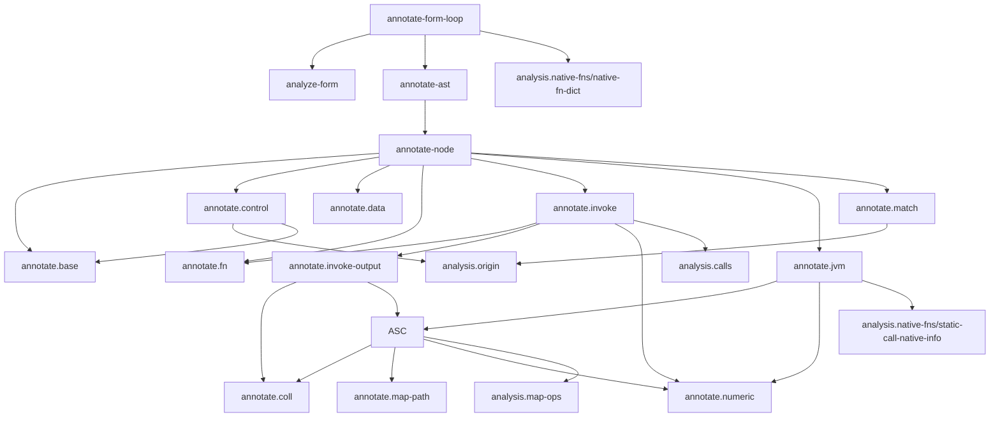

# `skeptic.analysis.annotate` Function Map

This document is source-derived from:

- `src/skeptic/analysis/annotate.clj`
- `src/skeptic/analysis/annotate/base.clj`
- `src/skeptic/analysis/annotate/coll.clj`
- `src/skeptic/analysis/annotate/control.clj`
- `src/skeptic/analysis/annotate/data.clj`
- `src/skeptic/analysis/annotate/fn.clj`
- `src/skeptic/analysis/annotate/invoke.clj`
- `src/skeptic/analysis/annotate/invoke_output.clj`
- `src/skeptic/analysis/annotate/jvm.clj`
- `src/skeptic/analysis/annotate/map_path.clj`
- `src/skeptic/analysis/annotate/match.clj`
- `src/skeptic/analysis/annotate/numeric.clj`
- `src/skeptic/analysis/annotate/shared_call.clj`

## Governing Path

The annotate subtree turns a `tools.analyzer` AST into a typed AST in four steps:

1. `annotate-form-loop` merges native function entries into the declaration dictionary, analyzes the form with `clojure.tools.analyzer.jvm`, and calls `annotate-ast`.
2. `annotate-ast` builds the annotation context, including normalized locals, assumptions, recursion targets, name, and namespace.
3. `annotate-node` dispatches by analyzer `:op` and delegates to one of the `annotate.*` sub-namespaces.
4. The sub-namespaces either annotate structure directly, compute richer output types for calls, or refine types/origins from control-flow facts.

## Interconnection Map

### Namespace-level graph

### Main function-to-function flows

- Entry flow:
  `annotate-form-loop -> analyze-form -> annotate-ast -> annotate-node`.
  `annotate-form-loop` also merges `analysis.native-fns/native-fn-dict` into the declaration dict before annotation starts.
- Dispatch flow:
  `annotate-node` is the central fan-out point.
  It sends `:binding`, `:const`, `:local`, `:the-var`, and `:var` to `annotate.base`.
  It sends `:do`, `:let`, `:loop`, `:recur`, and `:if` to `annotate.control`.
  It sends `:def`, `:map`, `:new`, `:quote`, `:set`, `:throw`, `:try`, `:vector`, and `:with-meta` to `annotate.data`.
  It sends `:fn` and `:fn-method` to `annotate.fn`, `:invoke` to `annotate.invoke`, `:instance-call` and `:static-call` to `annotate.jvm`, and `:case` to `annotate.match`.
- Base/control connection:
  `annotate.control/annotate-let` and `annotate.control/loop-one-binding` both call `annotate.base/annotate-binding` to keep binding annotation logic centralized.
  `annotate.control/binding-env-entry` is the shared helper that turns those annotated bindings into local-environment entries.
- Assumption/origin flow:
  `annotate.control/annotate-do` threads `analysis.origin/guard-assumption` and `analysis.origin/apply-guard-assumption`.
  `annotate.control/annotate-if` and `annotate.match/annotate-case` both call `analysis.origin/branch-local-envs` to derive branch-specific local environments.
  `annotate.base/annotate-local` is the consumer of those assumptions through `analysis.origin/effective-entry`.
- Function/callable flow:
  `annotate.fn/annotate-fn` builds the callable metadata that `analysis.calls/call-info` later consumes at invoke sites.
  `annotate.fn/fn-method-merge-param-nodes` also uses `analysis.calls/fun-type->call-opts` so function-typed parameters can themselves behave like typed callables.
- Invoke hot path:
  `annotate.invoke/annotate-invoke` optionally re-enters `annotate.fn/annotate-fn` through `resolve-unary-fn-arg-type-hint`.
  It then calls `analysis.calls/call-info` for default arg/output typing, `annotate.invoke-output/invoke-output-type` for call-specific output refinement, and `annotate.numeric/invoke-integral-math-narrow-type` for arithmetic narrowing.
- Invoke-output refinement path:
  `annotate.invoke-output/invoke-output-type` is a second dispatcher layered on top of `annotate.invoke/annotate-invoke`.
  For shared map/collection operations it delegates to `annotate.shared-call/shared-call-output-type`.
  For collection selectors and transforms it delegates into `annotate.coll/*`.
- JVM/static-call path:
  `annotate.jvm/annotate-static-call` mirrors the invoke path for analyzer `:static-call` nodes.
  It loads native signatures from `analysis.native-fns/static-call-native-info`, delegates shared specialization to `shared-static-output-type -> annotate.shared-call/shared-call-output-type`, and uses `annotate.numeric/narrow-static-numbers-output` for arithmetic narrowing.
- Collection-typing path:
  `annotate.data/annotate-vector` depends on `annotate.coll/vec-homogeneous-items?`.
  `annotate.data/annotate-new` depends on `annotate.coll/lazy-seq-new-type`.
  `annotate.jvm/annotate-instance-call` depends on `annotate.coll/instance-nth-element-type`.
  `annotate.invoke-output/invoke-output-type` and `annotate.shared-call/shared-call-output-type` are the main consumers of the rest of `annotate.coll/*`.
- Map-shape path:
  `annotate.map-path/reduce-assoc-pairs` and `annotate.map-path/reduce-dissoc-keys` are now reached through `annotate.shared-call/shared-call-output-type`, which is shared by both `annotate.invoke-output` and `annotate.jvm`.
- Case-narrowing path:
  `annotate.match/annotate-case` depends on its own literal-extraction helpers, on `analysis.calls/*` to recognize keyword/get-style access, and on `analysis.origin/branch-local-envs` to apply arm-local narrowing.
- Analyzer traversal path:
  `annotate.control/widen-int-loop-counter-recur-targets`, `annotate.coll/for-body-element-type`, and `annotate.match/case-kw-root-info` are the places in this subtree that rescan already-annotated subtrees via `analysis.ast-children/ast-nodes`.

## Namespace Map

### `skeptic.analysis.annotate`

- `node-location`: Extracts source location fields from a node's form metadata.
- `node-error-context`: Builds the error-context payload used by `bridge.localize/with-error-context`.
- `annotate-node`: Main dispatcher over analyzer `:op`. It recurs through children, calls the appropriate specialized annotator, and strips derived display fields from the result.
- `annotate-ast`: Seeds the annotation context with normalized locals, assumptions, recursion targets, function name, and namespace, then starts annotation at the root node.
- `analyze-form`: Runs `tools.analyzer.jvm/analyze` on one form under a constructed analyzer environment.
- `annotate-form-loop`: Top-level helper that merges native function signatures into the declaration dict, analyzes the form, and annotates the resulting AST.

### `skeptic.analysis.annotate.base`

- `annotate-children`: Generic recursive walker for nodes whose children can just be annotated structurally.
- `annotate-const`: Assigns a type to a literal constant by calling `value/type-of-value`.
- `annotate-binding`: Annotates a binding init and copies its call/type metadata onto the binding node.
- `annotate-local`: Looks up the current local entry, applies any active assumptions/origin refinements, and falls back to `Dyn`.
- `annotate-var-like`: Looks up var or symbol entries in the declaration dict and falls back to `Dyn`.

### `skeptic.analysis.annotate.control`

- `nil-test-leaf-node`: Peels `:do` and `:let` wrappers off a nil-test expression.
- `nil-check-local-form-in-test?`: Recognizes nil checks against one local binding, both for ordinary predicate calls and the JVM `Util/identical` form.
- `if-init-nil-check-binds-same-name?`: Detects the special `let` binding shape where an init is itself an `if` that nil-checks the same symbol.
- `annotate-do`: Annotates statements left-to-right, feeding guard assumptions from earlier statements into later ones and into the return expression.
- `annotate-let`: Annotates bindings in order, builds local entries and alias/root origins, and then annotates the body under the extended local environment.
- `nil-value-type?`: Private helper that recognizes exact `nil` value types.
- `binding-recur-target-types`: Computes the initial target types for loop recur operands, widening exact `nil` to `Maybe Dyn`.
- `binding-base-entry`: Private helper that extracts the reusable metadata payload from one annotated binding.
- `binding-alias-origin`: Private helper that preserves root-origin information for bindings aliased from rooted locals.
- `binding-env-entry`: Private helper that turns one annotated binding into the local-env entry used by `let` and `loop`.
- `widen-int-loop-counter-recur-targets`: Re-scans recur calls in a loop body and widens int loop counters to JVM `Number` when the recur operands come from numeric JVM helpers such as `inc` or `dec`.
- `loop-one-binding`: Annotates one loop binding and prepares the local entry that downstream recur analysis should see.
- `annotate-loop-body-with-recur-target-widening`: Private helper that encapsulates the two-pass loop-body annotation needed after recur-target widening.
- `annotate-loop`: Annotates loop bindings, seeds recur targets, annotates the body, optionally widens recur targets, and re-annotates the body if widening changed the recur contract.
- `annotate-recur`: Annotates recur operands, records `:expected-argtypes` from the active recur targets, and sets the recur expression type to `BottomType`.
- `annotate-if`: Annotates the test, derives branch-local environments from origin assumptions, annotates both branches, and joins or narrows the result type/origin.

### `skeptic.analysis.annotate.data`

- `annotate-def`: Annotates `def` metadata and init expression, then wraps the init type in `VarT`.
- `annotate-vector`: Annotates vector items and builds a `VectorT`, marking it homogeneous when all slot types are equal.
- `annotate-set`: Annotates set items and collapses them into a normalized homogeneous set type.
- `annotate-map`: Annotates key/value nodes and builds a map type keyed by literal key types when available.
- `annotate-new`: Annotates constructor calls and special-cases `LazySeq` creation before falling back to the instantiated class type.
- `annotate-with-meta`: Annotates the metadata expression and underlying expression, then copies the underlying node's call/type info upward.
- `annotate-throw`: Annotates the thrown exception and gives the expression `BottomType`.
- `annotate-catch`: Annotates a catch clause, binds the caught local to the caught class type, and types the clause by its body.
- `annotate-try`: Annotates the body, catches, and optional finally, then joins the body/catch output types.
- `annotate-quote`: Annotates the quoted inner expression and types the quote by the quoted runtime value.

### `skeptic.analysis.annotate.fn`

- `arg-type-specs`: Looks up declared argument specs for a function method by function name and arity, defaulting every parameter to `Dyn`.
- `fn-method-param-specs-with-overrides`: Applies temporary parameter type overrides on top of the declared/default arg specs.
- `fn-method-merge-param-nodes`: Merges parameter specs back into parameter AST nodes and attaches callable metadata when a parameter itself has a function type.
- `annotate-fn-method`: Annotates one function method under parameter locals and recur targets, then records its output type and arglist metadata.
- `method->arglist-entry`: Converts one annotated method into the normalized arglist-entry shape used elsewhere in the checker.
- `annotate-fn`: Annotates all methods of a function, builds the function's arglist map, joins method outputs, and constructs the resulting `FunT`.

### `skeptic.analysis.annotate.coll`

- `const-long-value`: Extracts an integer literal from a `:const` node.
- `vec-homogeneous-items?`: Returns true when every vector slot type is equal.
- `seqish-element-type`: Returns the element type for vectors and seqs, joining heterogeneous members when necessary.
- `vector-to-homogeneous-seq-type`: Converts a vector type into a homogeneous seq type by joining vector slots when needed.
- `vector-slot-type`: Returns one vector slot type when the index is in range.
- `instance-nth-element-type`: Types `nth` over vectors and seqs, using a literal index when present.
- `coll-first-type`: Returns the element type seen by `first`.
- `coll-second-type`: Returns the element type seen by `second`.
- `coll-last-type`: Returns the element type seen by `last`.
- `coll-rest-output-type`: Computes the output type of `rest`.
- `coll-butlast-output-type`: Computes the output type of `butlast` for vectors.
- `coll-drop-last-output-type`: Computes the output type of `drop-last` for vectors when the drop count is known.
- `coll-take-prefix-type`: Computes the output type of `take` for vectors when the take count is known.
- `coll-drop-prefix-type`: Computes the output type of `drop` for vectors when the drop count is known.
- `coll-same-element-seq-type`: Converts a seqish type into a homogeneous seq of the same element type.
- `concat-output-type`: Computes the output type for `concat` by joining the element types of all arguments.
- `into-output-type`: Computes the output type for `into` by combining the destination and source element types.
- `invoke-nth-output-type`: Helper that pulls the target and index arguments into `instance-nth-element-type`.
- `for-body-element-type`: Scans a `for` body for `cons` calls and joins their element types.
- `lazy-seq-new-type`: Special-cases `LazySeq` construction, inferring the element type from the thunk body when possible.

### `skeptic.analysis.annotate.invoke`

- `resolve-unary-fn-arg-type-hint`: Detects unary function invocations where the callee is an inline `fn` or a local bound to one, annotates the actual argument list once, and returns the override payload needed to re-annotate the unary function.
- `annotate-invoke`: Annotates the callee and arguments, computes expected arg types via `calls/call-info`, refines the output via `invoke_output` and `numeric`, and records the normalized function type metadata on the node.

### `skeptic.analysis.annotate.invoke-output`

- `invoke-output-type`: Ordered cond-chain that delegates shared `get`/`merge`/`assoc`/`dissoc`/`update`/`contains?`/`seq` refinement to `annotate.shared-call/shared-call-output-type`, handles invoke-only collection selectors and transforms locally, and otherwise preserves the default output type from `calls/call-info`.

### `skeptic.analysis.annotate.jvm`

- `annotate-instance-call`: Annotates JVM instance calls and special-cases `nth`.
- `shared-static-output-type`: Private dispatcher that recognizes the static-call operations sharing refinement logic with invoke and delegates them to `annotate.shared-call/shared-call-output-type`.
- `static-native-output-type`: Private helper that handles native `clojure.lang.Numbers` output narrowing and the `Dyn` fallback for everything else.
- `annotate-static-call`: Annotates static-call arguments, loads native arity/type info when available, computes expected argument types, and picks the shared specialized or native/default output type.

### `skeptic.analysis.annotate.shared-call`

- `shared-call-output-type`: Shared output-refinement helper for `get`, `merge`, `assoc`, `dissoc`, `update`, `contains?`, and one-argument `seq`, used by both invoke and static-call annotation.

### `skeptic.analysis.annotate.map-path`

- `reduce-assoc-pairs`: Applies a sequence of literal keyword assoc operations to a map type.
- `reduce-dissoc-keys`: Applies a sequence of literal keyword dissoc operations to a map type.

### `skeptic.analysis.annotate.match`

- `case-test-literal-nodes`: Extracts literal test nodes from one `case` arm's analyzer representation.
- `case-test-literals`: Converts those literal nodes into runtime literal values.
- `case-discriminant-expr-node`: Unwraps analyzer-generated local bindings to recover the real discriminant expression for a `case`.
- `case-discriminant-leaf-node`: Peels `:do` and `:let` wrappers off the discriminant.
- `case-assumption-root-for-local`: Recovers a local root origin or synthesizes one when the local only has an opaque origin.
- `case-get-access-kw-and-target`: Private helper that recognizes `get`-style map access on a local and returns the accessed keyword plus the target local.
- `case-kw-and-target`: Generalized keyword-access recognizer that covers keyword invocation and `get`-style access.
- `case-kw-root-info`: Scans the full `case` test subtree to recover keyword-access root information.
- `case-predicate-test-map`: Builds the synthetic map passed to conditional-schema predicates when narrowing a `case` arm by literal.
- `case-predicate-matches-lit?`: Evaluates one conditional-schema predicate against one literal.
- `case-conditional-branches-from-type`: Extracts conditional-schema branches from the discriminant type, directly or from a union member.
- `case-conditional-narrow-for-lits`: Narrows a `case` arm to the first conditional branch that matches each literal, mirroring Plumatic conditional dispatch.
- `case-conditional-default-narrow`: Computes the default-arm narrowing by keeping conditional branches that no explicit arm literal matched.
- `annotate-case-one-then`: Annotates one `case` then-arm under the equality or conditional-branch assumption generated for that arm.
- `annotate-case`: Annotates the test, all explicit arms, and the default arm under branch-local assumptions, then joins the resulting branch types.

### `skeptic.analysis.annotate.numeric`

Supporting defs:

- `bool-type`: Prebuilt `Bool` ground type used by `contains?` and similar branches.
- `integral-arg-classes`: Set of runtime classes treated as integral for narrowing.

Functions:

- `integral-ground-type?`: Recognizes semantic types that should count as integral inputs.
- `inc-dec-narrow-int-output?`: Detects unary `inc`/`dec` situations where the output can be narrowed back to `Int`.
- `binary-integral-locals-narrow?`: Detects binary arithmetic over non-constant integral locals.
- `invoke-integral-math-narrow-type`: Narrows invoke-call arithmetic results for `inc`, `+`, `*`, and `-` when the input types justify an `Int` result.
- `narrow-static-numbers-output`: Static-call analogue of the invoke narrowing logic for `clojure.lang.Numbers`.

## Shape Summary

- Entry flow: `annotate-form-loop -> analyze-form -> annotate-ast -> annotate-node`
- Structural node families: `base`, `control`, `data`, `fn`
- Call-output refinement families: `invoke`, `invoke_output`, `shared_call`, `jvm`, `numeric`, `coll`, `map_path`
- Path-sensitive narrowing family: `match`

The main design pattern in this subtree is: annotate child nodes first, reuse `skeptic.analysis.calls` to recover callable metadata, then attach semantic types, expected argument types, and branch-local refinements back onto the analyzer AST.
