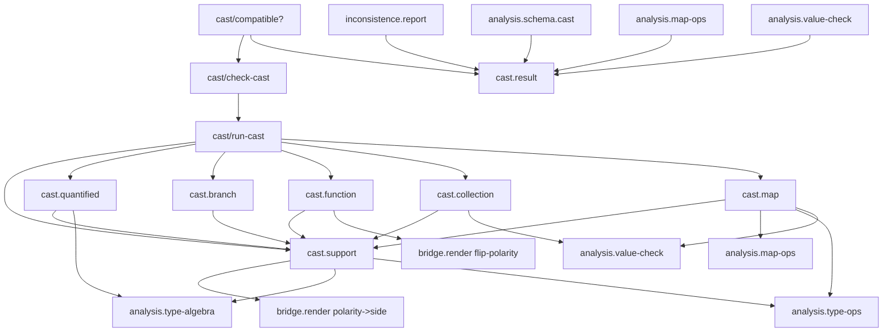

# `skeptic.analysis.cast` Function Map

This document is source-derived from:

- `src/skeptic/analysis/cast.clj`
- `src/skeptic/analysis/cast/support.clj`
- `src/skeptic/analysis/cast/result.clj`
- `src/skeptic/analysis/cast/quantified.clj`
- `src/skeptic/analysis/cast/branch.clj`
- `src/skeptic/analysis/cast/function.clj`
- `src/skeptic/analysis/cast/collection.clj`
- `src/skeptic/analysis/cast/map.clj`

It describes the current rewritten subtree, not the deleted `cast.kernel` layout.

## Governing Path

The rebuilt cast subtree is organized around one public entrypoint, one private
recursive runner, six non-recursive dispatch helper namespaces, and one result
projection namespace:

1. `skeptic.analysis.cast/check-cast` normalizes the two semantic types, sets
   default polarity, and hands work to the private runner.
2. `skeptic.analysis.cast/run-cast` is the only recursive function in the
   subtree. It owns dispatch order and all recursive descent.
3. `skeptic.analysis.cast.support/*` owns cast-result construction, path
   helpers, seal accounting, arity helpers, and cast-aware type tests.
4. `skeptic.analysis.cast.result/*` owns result projections used by reporting
   and by boundary wrappers that only need success or diagnostics.
5. `skeptic.analysis.cast.quantified/*` owns `forall`, abstract type variable,
   sealed dynamic, and scope-exit behavior.
6. `skeptic.analysis.cast.branch/*` owns unions, intersections, conditional
   types, nullable types, and transparent wrappers.
7. `skeptic.analysis.cast.function/*` owns function-method matching and
   contravariant domain checks.
8. `skeptic.analysis.cast.collection/*` owns vectors, seqs, cross-casts, sets,
   and the leaf fallback.
9. `skeptic.analysis.cast.map/*` owns the map coverage algorithm and delegates
   key-domain reasoning to `skeptic.analysis.map-ops`.

## Interconnection Map

### Namespace-level graph

### Main function-to-function flows

- Public entrypoint path:
  `check-cast` normalizes `source-type` and `target-type` with
  `type-ops/normalize-for-declared-type`, injects default
  `:polarity :positive`, and calls the private `run-cast`.
- Recursive runner path:
  `run-cast -> dispatch-cast`.
  `dispatch-cast` is the central ordered dispatcher. It creates `child-run`
  from `run-child`, and every recursive helper receives that function rather
  than calling `check-cast` or each other directly.
- Child-request path:
  `run-child` takes one request map with `:source-type`, `:target-type`, `:opts`,
  and optional `:path-segment`, calls `run-cast` recursively, then attaches the
  path via `support/with-cast-path` if needed.
- Quantified path:
  `dispatch-cast -> quantified/check-quantified-cast`.
  That splits into `generalize-cast` or `instantiate-cast`, both of which run
  exactly one child cast through `child-run`, then call `support/exit-nu-scope`
  through `quantified-success`.
- Abstract/sealed path:
  `dispatch-cast -> quantified/check-abstract-cast`.
  That rule either seals `X -> Dyn`, collapses `SealedDyn(X) -> X`, or returns
  one of the abstract mismatch failures.
- Union/intersection path:
  `dispatch-cast -> branch/check-union-cast` or
  `branch/check-intersection-cast`.
  These helpers build indexed child requests and aggregate them through
  `support/aggregate-children`.
- Conditional path:
  `dispatch-cast -> branch/check-conditional-cast`.
  Source conditionals are checked like source unions and target conditionals are
  checked like target unions, reusing `:source-union` and `:target-union` result
  rules.
- Nullable/wrapper path:
  `dispatch-cast -> branch/check-maybe-cast` or
  `branch/check-wrapper-cast`.
  `check-maybe-cast` attaches a `{:kind :maybe-value}` path segment on its one
  child request; `check-wrapper-cast` unwraps one `OptionalKeyT` or `VarT`
  layer and immediately re-enters the recursive runner.
- Function path:
  `dispatch-cast -> function/check-function-cast ->
  check-function-method -> method-children`.
  Domain requests flip polarity with `bridge.render/flip-polarity`; range
  requests preserve polarity.
- Collection path:
  `dispatch-cast -> collection/check-vector-cast`,
  `check-seq-cast`, `check-seq-to-vector-cast`,
  `check-vector-to-seq-cast`, `check-set-cast`, or `check-leaf-cast`.
  Position-wise collection checks create indexed child requests; the set rule is
  the only collection matcher that tries multiple target candidates per source
  member.
- Map path:
  `dispatch-cast -> map/check-map-cast -> map-children`.
  `map-children` fans out into exact target checks, extra exact source checks,
  and source domain checks.
- External consumer path:
  production code outside the subtree reaches this logic through
  `analysis.map-ops` and `analysis.value-check` via `requiring-resolve
  'skeptic.analysis.cast/check-cast`, and directly uses
  `cast.support/optional-key-inner` and `cast.support/with-cast-path`.
- Result projection path:
  `inconsistence.report`, `analysis.schema.cast`, `analysis.map-ops`, and
  `analysis.value-check` consume `cast.result` helpers to collapse full result
  trees into booleans, root summaries, leaf diagnostics, and primary diagnostics.

### Utility entrypoints not on the main `check-cast` path

- `support/check-type-test`

`check-type-test` is still a cast-subtree API surface, but it is not part of
the `check-cast` dispatch graph. It implements the sealed-value tamper rule for
dynamic type tests.

## Dispatch Order In `skeptic.analysis.cast`

`dispatch-cast` checks rules in this exact order:

1. bottom source
2. exact equality
3. quantified source or target
4. abstract type variable or sealed dynamic
5. dynamic target
6. union
7. intersection
8. conditional
9. nullable
10. transparent wrapper
11. function
12. map
13. vector
14. seq
15. seq-to-vector
16. vector-to-seq
17. set
18. leaf fallback

This ordering is implemented directly in `cast.clj`, so it is the subtree’s
governing control flow rather than a secondary convention.

## Namespace Map

### `skeptic.analysis.cast`

- `run-child`: Adapts one request map back into the recursive runner and
  attaches a path segment after the child result is produced.
- `dispatch-cast`: Implements the ordered rule selection and builds the
  `child-run` adapter that all helper namespaces use for recursive descent.
- `run-cast`: The only recursive function in the subtree.
- `check-cast`: Public entrypoint. Normalizes both input types, sets default
  polarity, and invokes `run-cast`.

### `skeptic.analysis.cast.support`

- `sealed-ground-name`: Pulls a type-variable-style name out of a sealed
  dynamic ground.
- `cast-result`, `cast-ok`, `cast-fail`: Construct the cast-result tree shape
  used throughout the subtree and by reporting code outside it.
- `with-cast-path`: Appends one visible path segment to a result tree. This is
  used both internally and by `analysis.value-check`.
- `all-ok?`, `aggregate-children`: Shared success/failure aggregation helpers.
- `semantic-type-children`, `contains-sealed-ground?`: Walk semantic types
  looking for sealed values tied to a binder.
- `rule-seal-delta`, `seal-balance`, `leaked-sealed-type`: Walk result trees
  and count surviving seals versus matching collapses.
- `exit-nu-scope`: Enforces the quantified boundary check by rejecting any
  result tree or type that still contains a surviving seal for the exiting
  binder.
- `method-accepts-arity?`, `matching-source-method`: Function-arity helpers
  shared by the function rule.
- `optional-key-inner`: Unwraps `OptionalKeyT` for external callers and for
  map-key logic elsewhere in the tree.
- `check-type-test`: Implements the sealed-value tamper rule for dynamic type
  tests and returns `:matches?` metadata for non-sealed checks.

### `skeptic.analysis.cast.result`

- `ok?`: Boolean projection over a result tree.
- `root-summary`: Extracts root-level success, rule, blame, actual type, and
  expected type metadata.
- `leaf-diagnostics`: Flattens failing result trees and accumulates visible
  paths.
- `primary-diagnostic`: Returns the first leaf diagnostic, or the root projection
  when there is no failure leaf.

### `skeptic.analysis.cast.quantified`

- `quantified-failure`: Small helper for wrapping one failed quantified child.
- `quantified-success`: Shared success path for generalize and instantiate. It
  runs `support/exit-nu-scope` before returning the final cast result.
- `generalize-cast`: Implements casts to `forall`. It rejects binder capture via
  `type-algebra/type-free-vars`, then checks the source against the quantified
  body.
- `instantiate-cast`: Implements casts from `forall`. It substitutes the binder
  with dynamic via `type-algebra/type-substitute`, then checks the instantiated
  body against the target.
- `sealed-match?`, `type-var-target-result`: Helpers for the matching-seal
  collapse rule.
- `check-abstract-cast`: Handles `TypeVarT`, `SealedDynT`, sealing, collapse,
  and abstract mismatch failures.
- `check-quantified-cast`: Chooses between generalization and instantiation.

### `skeptic.analysis.cast.branch`

- `indexed-request`, `run-indexed-children`: Build and execute indexed child
  requests for branch-sensitive rules.
- `one-child-result`: Shared wrapper for single-child nullable cases.
- `source-union-result`, `target-union-result`: Implement the source-union and
  target-union branches, preserving source-union precedence when both sides are
  unions.
- `check-union-cast`: Ordered union dispatcher.
- `target-intersection-result`, `source-intersection-result`: Implement the two
  intersection directions.
- `check-intersection-cast`: Ordered intersection dispatcher.
- `source-conditional-result`, `target-conditional-result`: Implement
  conditional-type casts using union-like branch aggregation.
- `check-conditional-cast`: Ordered conditional dispatcher.
- `maybe-child`, `check-maybe-cast`: Handle `MaybeT` on either side, including
  exact `nil` to maybe-target success.
- `unwrap-wrapper`, `check-wrapper-cast`: Strip one `OptionalKeyT` or `VarT`
  layer and immediately re-enter recursive checking.

### `skeptic.analysis.cast.function`

- `domain-request`: Builds contravariant argument checks and flips polarity.
- `range-request`: Builds the covariant return check.
- `method-children`: Executes all domain checks plus one range check for a
  matched source method and target method.
- `missing-method`: Produces the arity-mismatch failure when no source method
  can satisfy a target method.
- `method-result`: Aggregates one target method’s children.
- `check-function-method`: Matches one target method to one source method using
  `support/matching-source-method`.
- `check-function-cast`: Runs `check-function-method` for every target method
  and aggregates them under the `:function` rule.

### `skeptic.analysis.cast.collection`

- `index-request`, `aligned-children`: Shared position-wise child-request
  builders for vector and seq rules.
- `expand-items`, `slot-count`: Implement the homogeneous expansion policy used
  by vectors and vector/seq cross-casts.
- `expanded-collection-result`: Shared helper for rules that allow homogeneous
  expansion.
- `fixed-collection-result`: Shared helper for rules that require exact stored
  arity.
- `set-member-failure`, `set-member-result`: Implement the set rule’s
  “try every target member for one source member” behavior.
- `check-vector-cast`: Vector/vector rule.
- `check-seq-cast`: Seq/seq rule.
- `check-seq-to-vector-cast`: Seq/vector cross-cast rule.
- `check-vector-to-seq-cast`: Vector/seq cross-cast rule.
- `check-set-cast`: Cardinality-sensitive set rule.
- `check-leaf-cast`: Final fallback for exact values, target exact values,
  residual dynamic, placeholders, infinite-cycle types, leaf overlap, and
  function-vs-adapter-leaf checks.

### `skeptic.analysis.cast.map`

- `map-entry-failure`: Builds map-specific failures and attaches visible map-key
  paths through `value-check/with-map-path`.
- `candidate-request`, `candidate-results`: Build and evaluate several target
  candidate value casts for one source entry.
- `exact-target-plan`: Finds source candidates for one exact target key and
  prepares the corresponding child requests.
- `missing-target-entry`, `nullable-key-result`: Exact-target failure helpers.
- `exact-target-results`: Runs required/optional target exact-key checks,
  including nullable-key mismatches.
- `exact-source-results`: Handles extra exact source keys by searching for a
  covering target domain entry and otherwise producing `:unexpected-key`.
- `expand-domain-entry`: Splits a union-valued source domain key into one entry
  per member before coverage checks.
- `domain-entry-result`, `domain-entry-results`: Handle source domain entries
  and emit `:map-key-domain-not-covered` when no target domain covers a source
  branch.
- `map-children`: Orchestrates the three map passes:
  target exact entries,
  extra source exact entries,
  source domain entries.
- `check-map-cast`: Aggregates all map children under the `:map` rule.

## External Boundaries And Consumers

The cast subtree currently exposes four live interfaces that code outside the
subtree depends on:

- `skeptic.analysis.cast/check-cast`
- `skeptic.analysis.cast.support/optional-key-inner`
- `skeptic.analysis.cast.support/with-cast-path`
- `skeptic.analysis.cast.result/{ok?, root-summary, leaf-diagnostics, primary-diagnostic}`

Source-derived consumer paths:

- `analysis.map-ops` calls `check-cast` via `requiring-resolve` and uses
  `optional-key-inner` directly for map descriptor and key-domain logic.
- `analysis.value-check` calls `check-cast` via `requiring-resolve`, uses
  `optional-key-inner` for exact-key extraction, and uses `with-cast-path` to
  attach visible map-key paths.
- `analysis.schema.cast` is the schema-boundary adapter over `check-cast`.
- `analysis.schema.cast`, `analysis.map-ops`, and `analysis.value-check` use
  `cast.result/ok?` when they only need compatibility.
- `inconsistence.report` calls `check-cast` directly to build reporting trees,
  then uses `cast.result/root-summary`, `leaf-diagnostics`, and
  `primary-diagnostic` for report metadata.

## Shape Summary

- Public entrypoint: `check-cast`
- Recursive owner: `run-cast`
- Generic result and path helpers: `support.clj`
- Result projections: `result.clj`
- Quantified and abstract rules: `quantified.clj`
- Union/intersection/conditional/nullable/wrapper rules: `branch.clj`
- Function rules: `function.clj`
- Collection and leaf rules: `collection.clj`
- Map coverage algorithm: `map.clj`

The main design pattern in the rewritten subtree is:

1. `check-cast` normalizes inputs and enters `run-cast`.
2. `dispatch-cast` chooses exactly one rule family in priority order.
3. Helpers build small child request maps and invoke the provided `child-run`.
4. `run-child` is the only bridge back into recursion.
5. `support/*` helpers construct and aggregate result trees with blame metadata
   and visible paths.
6. `result/*` helpers project result trees for reporting and compatibility
   checks outside the cast subtree.
