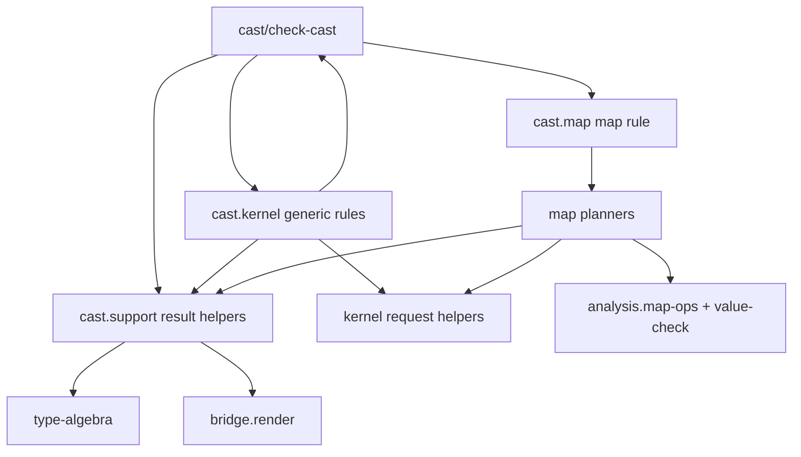

# `skeptic.analysis.cast` Function Map

This document is source-derived from:

- `src/skeptic/analysis/cast.clj`
- `src/skeptic/analysis/cast/kernel.clj`
- `src/skeptic/analysis/cast/map.clj`
- `src/skeptic/analysis/cast/support.clj`

## Governing Path

The cast subtree is organized around one public entrypoint and three support layers:

1. `skeptic.analysis.cast/check-cast` normalizes the two semantic types and dispatches by type shape.
2. `skeptic.analysis.cast.kernel/*` implements the generic cast rules for quantified types, abstract types, unions, intersections, wrappers, functions, vectors, seqs, sets, and leaf types.
3. `skeptic.analysis.cast.map/*` handles the special map-coverage algorithm by planning casts over exact keys, unexpected keys, and domain keys.
4. `skeptic.analysis.cast.support/*` carries result construction, path helpers, sealed-value helpers, and the tamper checks used by quantified casts.

## Interconnection Map

### Namespace-level graph

### Main function-to-function flows

- Dispatcher fan-out:
  `check-cast` either returns directly through `support/cast-ok`, or delegates to `kernel/check-quantified-cast`, `kernel/check-abstract-type-cast`, `kernel/check-union-cast`, `kernel/check-intersection-cast`, `kernel/check-maybe-cast`, `kernel/check-wrapper-cast`, `kernel/check-function-cast`, `map/check-map-cast`, `kernel/check-vector-cast`, `kernel/check-seq-cast`, `kernel/check-seq-to-vector-cast`, `kernel/check-vector-to-seq-cast`, `kernel/check-set-cast`, or `kernel/check-leaf-cast`.
- Recursive cycle:
  Most non-leaf rules do not recurse by calling `check-cast` directly. They build `kernel/cast-request` values, run them through `kernel/run-cast-request` or `kernel/run-cast-requests`, and those helpers call back into `check-cast`.
- Shared aggregation path:
  `kernel/check-union-cast`, `kernel/check-intersection-cast`, `kernel/check-function-cast`, `kernel/check-vector-cast`, `kernel/check-seq-cast`, `kernel/check-seq-to-vector-cast`, `kernel/check-vector-to-seq-cast`, `kernel/check-set-cast`, and `map/check-map-cast` all converge on `kernel/aggregate-all-children`, which in turn converges on `support/cast-ok` or `support/cast-fail`.
- Quantified-state path:
  `kernel/check-quantified-cast` delegates successful quantified children through `kernel/quantified-success`, and that helper runs `support/exit-nu-scope` before returning the final cast result.
- Sealed-abstract path:
  `kernel/check-abstract-type-cast` is the rule that uses `support/sealed-ground-name` and `support/cast-state` to manage the seal/collapse behavior for abstract types.
- Union path:
  `kernel/check-union-cast` now dispatches explicitly through `kernel/source-union-result` and `kernel/target-union-result`.
  When both sides are unions, the source-union rule wins because `check-union-cast` checks `source-type` first.
- Function path:
  `kernel/check-function-cast -> kernel/check-function-method-cast -> kernel/function-domain-requests -> kernel/run-cast-requests`.
  The same method rule also creates one range request with `kernel/cast-request` and `kernel/run-cast-request`.
  Method selection itself goes through `support/matching-source-method` and `support/method-accepts-arity?`.
- Collection path:
  `kernel/check-vector-cast`, `kernel/check-seq-to-vector-cast`, and `kernel/check-vector-to-seq-cast` all use `kernel/collection-aggregate`, which in turn uses `kernel/collection-cast-children`, `kernel/vector-cast-slot-count`, and `kernel/expand-vector-items`.
  `kernel/check-seq-cast` uses `kernel/exact-arity-collection-cast`, which also converges on `kernel/collection-cast-children`.
- Set path:
  `kernel/check-set-cast` uses `kernel/set-cast-children`, which is the only collection matcher in this subtree that tries several target candidates per source element instead of zipping positions.
- Leaf path:
  `kernel/check-leaf-cast` is where the subtree exits into value-level compatibility checks through `analysis.value-check/value-satisfies-type?` and `analysis.value-check/leaf-overlap?`.
- Map path:
  `map/check-map-cast -> map/map-cast-children`.
  `map/map-cast-children` fans out into `map/exact-target-entry-cast-results`, `map/exact-source-entry-cast-results`, and `map/domain-entry-cast-results`.
  Those three functions depend on `map/plan-exact-target-entry-casts`, `map/plan-target-entry-casts`, `map/candidate-requests`, `map/execute-candidate-plan`, plus `kernel/cast-request`, `kernel/run-cast-requests`, and `support/cast-fail`.
- Map-descriptor path:
  The whole map rule is driven by `analysis.map-ops/map-entry-descriptor`, `analysis.map-ops/effective-exact-entries`, `analysis.map-ops/exact-key-candidates`, `analysis.map-ops/exact-key-entry`, and `analysis.map-ops/key-domain-covered?`.
- Path-reporting path:
  `map/map-entry-failure` combines `support/cast-fail` with `analysis.value-check/with-map-path`.
  Generic child requests use `support/with-cast-path` instead.

### Utility entrypoints not on the main `check-cast` path

- `support/check-type-test`

`support/check-type-test` is still defined in the cast subtree but is not referenced by other `skeptic/src` files in the current workspace.

## Namespace Map

### `skeptic.analysis.cast`

- `check-cast`: Public dispatcher. Normalizes both types, sets the active polarity in `opts`, then chooses the rule family in a fixed order: bottom and exact equality first, then quantified and abstract rules, then dynamic/union/intersection/maybe/wrapper/function/map/collection cases, and finally leaf comparison. The wrapper branch is now a single combined dispatch for `OptionalKeyT` and `VarT`.

### `skeptic.analysis.cast.support`

- `ensure-cast-state`: Normalizes the optional `:cast-state` map from opts and now leaves it as `{}` when missing.
- `cast-state`: Reads `:cast-state` from opts and normalizes it through `ensure-cast-state`.
- `sealed-ground-name`: Pulls a type-variable-style name back out of a sealed dynamic ground.
- `contains-sealed-ground?`: Walks a semantic type recursively to see whether a given binder appears inside any sealed dynamic ground.
- `cast-result`: Low-level constructor for the cast result map, including blame-side and blame-polarity fields.
- `cast-ok`: Convenience constructor for successful cast results.
- `cast-fail`: Convenience constructor for failing cast results.
- `with-cast-path`: Appends one visible path segment to a cast result.
- `all-ok?`: Returns true only when every child result succeeded.
- `check-type-test`: Evaluates a dynamic type test. It succeeds for normal values and fails globally for sealed dynamics because those represent tampering-sensitive abstractions.
- `cast-result-tree?`: Detects whether an artifact is already a cast-result tree rather than a plain semantic type.
- `seal-balance`: Walks a successful cast-result tree and counts seals minus matching collapses for one binder.
- `leaked-sealed-type`: Finds one still-live sealed value for a binder inside a cast-result tree.
- `exit-nu-scope`: Checks that a quantified result leaving scope no longer contains unmatched seals for the quantified binder. It accepts either a plain semantic type or a cast-result tree and returns `:nu-tamper` on unmatched seals.
- `method-accepts-arity?`: Arity matcher for `FnMethodT`, including variadic methods.
- `matching-source-method`: Finds the first source function method whose arity can satisfy a target method.
- `optional-key-inner`: Unwraps `OptionalKeyT` and otherwise returns the input unchanged.

### `skeptic.analysis.cast.kernel`

#### Request and child orchestration

- `cast-request`: Packages one recursive cast request, optionally with a path segment.
- `run-cast-request`: Executes one request through the recursive `check-cast` function and attaches the path segment if present.
- `run-cast-requests`: Executes a vector of requests.
- `indexed-cast-requests`: Builds requests over a collection while tagging each one with an indexed path segment.
- `aggregate-all-children`: Returns `cast-ok` when every child succeeded, otherwise `cast-fail` with the accumulated children.
- `collection-cast-children`: Shared helper for position-wise vector and seq casting.
- `expand-vector-items`: Expands a homogeneous vector type into concrete slots for a requested arity.
- `vector-cast-slot-count`: Computes the compatible slot count for vector/vector and vector/seq casts, including homogeneous expansion.
- `set-cast-children`: For each source set member, tries all target members and keeps the first success or records an element failure.
- `quantified-success`: Shared success path for quantified casts. Runs `support/exit-nu-scope` before returning the final quantified result.

#### Quantified, abstract, union, and wrapper rules

- `check-quantified-cast`: Handles both quantified target types (`generalize`) and quantified source types (`instantiate`). Successful quantified casts now flow through `quantified-success`, which enforces the `nu`-scope exit check before returning.
- `check-abstract-type-cast`: Handles type variables and sealed dynamics, including sealing source abstractions, collapsing matching seals, and rejecting raw `Dyn` or placeholders for type-variable targets.
- `source-union-result`: Implements the source-union rule where every source branch must cast to the target.
- `target-union-result`: Implements the target-union rule where any target branch may succeed.
- `check-union-cast`: Chooses between `source-union-result` and `target-union-result`, with source-union precedence when both sides are unions.
- `check-intersection-cast`: For target intersections, every target component must accept the source. For source intersections, each source component is checked against the target.
- `check-maybe-cast`: Handles `MaybeT` on either side, including the special case where exact `nil` satisfies a maybe target.
- `unwrap-wrapper`: Shared helper that strips one `OptionalKeyT` or `VarT` layer.
- `check-wrapper-cast`: Strips `OptionalKeyT` and `VarT` wrappers through `unwrap-wrapper` and then recurs on the inner types.

#### Function rules

- `function-domain-requests`: Builds contravariant argument casts from target inputs to source inputs and flips polarity for those checks.
- `check-function-method-cast`: Checks one target method against a matching source method by combining domain child casts with one range cast.
- `check-function-cast`: Runs `check-function-method-cast` for every target method and aggregates the results.

#### Collection and leaf rules

- `collection-aggregate`: Shared helper for collection casts that use vector-style slot expansion before aggregating child results.
- `exact-arity-collection-cast`: Shared helper for collection casts that require exact positional arity.
- `check-vector-cast`: Aligns vector slots through `collection-aggregate`, expands homogeneous vectors when needed, then casts slot-by-slot.
- `check-seq-cast`: Casts seq items positionally through `exact-arity-collection-cast`.
- `check-seq-to-vector-cast`: Casts seq items into vector slots through `collection-aggregate`.
- `check-vector-to-seq-cast`: Casts vector items into seq slots through `collection-aggregate`.
- `check-set-cast`: Requires equal set cardinality, then matches each source member against some target member.
- `check-leaf-cast`: Final fallback for value, dynamic, placeholder, ground, refinement, adapter-leaf, and function-vs-adapter-leaf combinations.

### `skeptic.analysis.cast.map`

#### Path and failure helpers

- `map-path-segment`: Converts an exact key into a visible `{:kind :map-key ...}` path segment when possible.
- `map-entry-failure`: Builds a map-specific failure result and attaches the failing key path.

#### Candidate execution helpers

- `run-candidate-casts`: Runs a set of requests and collapses the result to a single success when any candidate succeeds; otherwise preserves the full failure set.
- `candidate-requests`: Builds value-cast requests for one source value against several target entries.
- `execute-candidate-plan`: Runs a precomputed request set or returns the caller-provided failure result when there are no candidates.

#### Exact-key planning

- `plan-exact-target-entry-casts`: For one exact target entry, finds candidate source entries and builds the corresponding value-cast requests.
- `exact-target-entry-cast-results`: Executes the target-entry plan and also reports missing required keys or nullable-key mismatches.
- `plan-target-entry-casts`: Shared planner for source-entry-to-target-entry value casts once the target candidate set is known.
- `exact-source-entry-cast-results`: Executes that plan or reports an unexpected source key when no target domain entry covers it.

#### Domain-key planning

- `expand-domain-entry`: Splits a union-valued source domain key into one entry per member so coverage checks happen member-by-member.
- `domain-entry-cast-results`: Finds target domain entries whose key domains cover each expanded source domain entry, then executes those casts or emits a `:map-key-domain` failure when coverage is missing.

#### Map subtree driver

- `map-cast-children`: Builds the full child-result set for a map cast by combining three passes:
  required and optional target exact entries,
  extra exact source entries,
  and source domain entries.
- `check-map-cast`: Public map-rule entrypoint. Runs `map-cast-children` and aggregates the results under the `:map` rule.

## Shape Summary

- Dispatcher: `check-cast`
- Generic recursive rules: `kernel.clj`
- Map-specific coverage algorithm: `map.clj`
- State/result/path utilities: `support.clj`

The main design pattern in this subtree is: build child requests first, run them through the recursive `check-cast`, then aggregate the resulting child tree into one cast result with blame metadata and visible paths.
