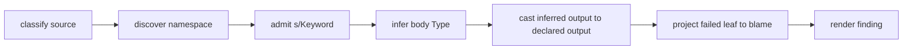

# Pipeline Tour

The first pass through Skeptic is a story, not a reference table: source goes in,
a finding comes out, and every later spoke explains one piece of that trip.

> **Snapshot:** state of Skeptic as of 2026-05-06.

## Prerequisites

Working Clojure and the idea that a type-checker has phases. No Skeptic-specific
vocabulary is required; this spoke introduces the phase names used later.

## Where this fits

This is the first spoke on every reading path. After it, Contributor readers go
to [Three Domains](02-three-domains.md); Gist readers can build just enough
vocabulary to later read [Cast Dispatch](09-cast-dispatch.md).

## A Run End-To-End

The reader starts here with one question: when Skeptic reports a mismatch, what
chain of work produced it? The worked example gives the smallest useful answer.

```clojure
(ns skeptic.walkthrough.example
  (:require [schema.core :as s]))

(s/defn classify :- s/Keyword
  "Demonstrates output-cast blame:
   the :else branch returns a string, but :- s/Keyword expects a Keyword.
   Skeptic reports an output mismatch on classify."
  [n :- s/Int]
  (cond
    (zero? n) :zero
    (even? n) :even
    :else     "odd"))

(s/defn double-or-zero :- s/Int
  "Demonstrates flow-sensitive narrowing on a maybe-typed argument:
   inside the (some? n) branch, n narrows from (maybe Int) to Int,
   so (* 2 n) type-checks cleanly. The else branch returns 0, which fits.
   Skeptic reports nothing for this definition."
  [n :- (s/maybe s/Int)]
  (if (some? n)
    (* 2 n)
    0))
```

`classify` declares `s/Keyword`, but one branch returns `"odd"`. Skeptic does
not compare the source text directly to the schema text. It first turns the
schema into a Type, then annotates the body with an inferred Type, then asks the
cast engine whether the inferred output can be used where the declared output is
expected.

That ordering is the first important mental model. A finding is not born at the
line of source code. It is assembled from artifacts produced by earlier phases:
an admitted declaration, an annotated body, a cast result, and a rendered report.
If a future finding feels surprising, the diagnosis path is to ask which phase
created the surprising artifact.

*Figure: the worked example through the same phases as a real namespace.*



## The Six Phases

**Namespace discovery** selects files and namespaces. At this point the reader
only needs to know that later phases run namespace by namespace after discovery
has found candidates.

Discovery is intentionally shallow in this walkthrough. It decides what to check;
it does not decide what any expression means. That leaves the reader with a clean
boundary: if a namespace is not checked at all, look at discovery and config; if a
checked namespace has an unexpected Type, look later.

**Declaration admission** collects declared types and converts them into the
internal Type domain. For `classify`, the declared output `s/Keyword` becomes a
ground Keyword Type. For `double-or-zero`, `(s/maybe s/Int)` becomes a maybe
Type around Int.

Admission is the first semantic phase. Its output is not "a nicer schema." Its
output is the declaration-side Type information that the rest of the checker
uses. That is why the next two spokes spend time on domains and Type shapes
before returning to admission in detail.

**Annotation** analyzes source forms with `tools.analyzer` and attaches inferred
Types to AST nodes. The important effect for `classify` is that the body has a
branch whose inferred value is a string. The important effect for
`double-or-zero` is that the then-branch sees `n` as non-nil after `(some? n)`.

This is the first time the program body matters. Admission knew what the function
claimed. Annotation works out what the function appears to do. The two are kept
separate until checking so the reader can always ask, "is this the expected side
or the actual side?"

**Checking** casts inferred Types against declared Types. A cast is directional:
source is what the program produced, target is what the declaration expects.

Checking is where `classify` finally fails. The declaration-side target says
Keyword. The inferred body says one possible branch is a string. The checker does
not need to know that the user wrote `s/Keyword`; it only needs the target Type
admission already produced.

**Blame projection** takes a failed cast-result tree and chooses the user-facing
failure: the side, path, rule, and readable message.

Projection exists because cast results can be more detailed than a user wants to
read first. A union failure may contain several passing children and one failing
child. A function failure may contain input and output children. Projection turns
that tree into a reportable diagnosis.

**Output rendering** prints findings either as human text or as porcelain JSONL.
Both modes describe the same finding, but they serve different readers.

Text output is for a human debugging at the terminal. JSONL is for another tool
that wants stable records. If the two outputs disagree, the disagreement belongs
in the output layer, not in checking.

## Where The Example Shows Up

| Phase | `classify` | `double-or-zero` |
|---|---|---|
| Admission | Declared output becomes Keyword Type. | Argument becomes maybe Int Type. |
| Annotation | Body includes keyword branches and a string branch. | Test creates a narrowing opportunity. |
| Checking | Output cast fails. | Body casts succeed after narrowing. |
| Blame | Failure is projected to the return value. | No finding. |
| Output | Text and JSONL render the mismatch. | Nothing emitted. |

This table is the contract for the rest of the walkthrough. Later spokes add
detail only when the reader has the vocabulary to use it.

The table also explains why the walkthrough uses two functions instead of one.
`classify` carries the failing-output story from admission through output.
`double-or-zero` carries the success-through-narrowing story. Together they keep
the reader from learning Skeptic as only a failure reporter; a clean result is
also the product of specific algorithmic work.

### In-depth: Project State Vs Per Namespace

***Skip if reading the Gist path.***

Skeptic builds project-level state before checking individual namespaces. That
lets declaration admission, accessor summaries, and merged native knowledge be
shared across the per-namespace checks instead of rediscovered during every
form. The reader should remember the shape, not the implementation detail: there
is one project pass that prepares context, then per-namespace checks use it.

## Worked Example Here

This spoke is the only numbered spoke that repeats the full example. It follows
`classify` end to end and keeps `double-or-zero` in view for the later narrowing
spoke.

## Source Pointers

- `skeptic/checking/pipeline.clj:project-state` - builds shared project context.
- `skeptic/checking/pipeline.clj:check-namespace` - checks one namespace.
- `skeptic/checking/pipeline.clj:namespace-dict` - performs declaration admission for a namespace.
- `skeptic/checking/pipeline.clj:check-resolved-form` - checks a resolved form.
- `skeptic/checking/pipeline.clj:match-s-exprs` - builds input cast work for a call.

## Glossary Terms Introduced

- Declaration admission
- Annotation
- Cast
- Blame projection
- Output rendering

## Where To Next

- **Continue (Contributor path):** [Three Domains](02-three-domains.md)
- **Continue (Gist path):** [Three Domains](02-three-domains.md)
- **Return:** [Hub](README.md)
