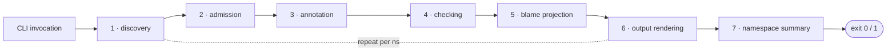

# Pipeline Tour

> *Snapshot of state as of 2026-05-05.*

A run of `lein skeptic` walks every namespace through the same fixed
sequence of phases. This spoke names those phases, traces the worked
example end to end, and explains why each phase exists, what it
produces, and what invariants it maintains.

## Prerequisites

Working Clojure (`s/defn`, project layout, the idea that `tools.analyzer`
gives you ASTs) and the basic vocabulary of typecheckers (a checker
runs in stages; each stage transforms its input). No Skeptic-specific
vocabulary required — this spoke introduces the rest. If any of those
prerequisites are unfamiliar, the
[hub README's reading paths](README.md#reading-paths) point to the
right earlier reading.

## Where this fits

First spoke on every reading path. After this, Contributors continue to
[Three Domains (02)](02-three-domains.md); Gist readers can jump to
[Cast Dispatch (09)](09-cast-dispatch.md) once they have the hub and
this spoke. Diagnose-finding readers also start here, for the phase
names — the rest of that path then chases a finding backward through
phases 5, 4, and 6.

## A run, end to end

The shape of a Skeptic run is fixed. Six per-namespace phases compose
in a strict order; a seventh phase runs once at end-of-run to
summarise across namespaces. The order is *load-bearing*: each phase
consumes the artifact the previous phase produced, and dropping or
reordering one would force the others to do unrelated work.

*Figure: The seven phases. The first six run per-namespace; the
seventh runs once at end-of-run to summarise across all namespaces.*

To make the shape concrete: a user runs `lein skeptic` in a project
that contains `skeptic.walkthrough.example` (the worked example —
two definitions, `classify` and `double-or-zero`). The plugin parses
its CLI flags, picks a Skeptic profile that disables Plumatic's
runtime validation around the analysis pass, and hands control to
the checker. The checker discovers the example namespace from the
project's source paths, then enters the per-namespace pipeline.

Inside the per-namespace pipeline, the checker collects every var's
`:schema` metadata, every var's `:malli/schema` metadata, every
built-in native function descriptor, and any `:type-overrides` from
`.skeptic/config.edn`. Each annotated symbol becomes a Type in a
single declaration dictionary keyed by qualified symbol —
`classify` gets a `FunT` whose method has input `GroundT Int` and
output `GroundT Keyword`; `double-or-zero` gets a `FunT` whose
method has input `MaybeT[GroundT Int]` and output `GroundT Int`.
Then the checker walks every top-level form through `tools.analyzer`,
producing an analyzer AST, and walks the AST attaching a Type to
every node. Inside `classify`'s body, the `cond` desugars to a
chain of `if`s; each leaf gets a Type (`ValueT(:zero)`,
`ValueT(:even)`, `GroundT Str`) and the chain is joined into a
`UnionT`. Inside `double-or-zero`, the `(some? n)` test produces
an assumption that, in the then-branch, narrows `n` from
`MaybeT[GroundT Int]` to `GroundT Int` — flow-sensitive refinement
([spoke 08](08-narrowing-and-origins.md)) running inside the
annotation pass.

For each function, the checker then casts inferred types against
declared types — call sites against declared inputs, function
bodies against declared outputs. `classify`'s body is a `UnionT`
whose `Str` member fails the cast against `GroundT Keyword`.
`double-or-zero`'s body is `GroundT Int` (joined from the two
arms) and fits the declared `GroundT Int` cleanly. The failed cast
produces a cast-result tree; the checker walks the tree, collects
the failing leaves, picks a primary diagnostic, computes a visible
path, and packages the whole thing into a finding map. The
finding is then printed: by default as ANSI-coloured text grouped
per namespace; with `-p`, as a JSON object on its own line. After
all namespaces have been checked, a per-namespace error count and
a final run summary close the run.

Each of those phases gets its own deeper treatment below.

## Phase 1 — Namespace discovery

**This phase teaches: which namespaces will be checked, and what
happens when a namespace fails to load.**

Discovery is the boundary at which Skeptic decides what code it is
about to look at. The Leiningen plugin parses CLI flags, selects the
Skeptic profile, and hands control to the `skeptic.core` checker.
The checker walks the project's source paths and returns a flat
sequence of namespace symbols paired with their source files,
filtered by `.skeptic/config.edn`'s `:exclude-files` patterns. If
the user passed `-n` / `--namespace`, only that namespace is
returned.

Discovery is *non-blocking on load failures*. When a namespace can't
be required — because a parent `(:require)` throws, or the source
file is malformed — the run does not abort. The failure becomes an
`ns-discovery-warning` (in porcelain) or a load-exception block (in
text), and the rest of the project keeps going. The reasoning is
that a single bad namespace shouldn't hide findings in dozens of
healthy namespaces; a contributor running Skeptic in a half-broken
state still benefits from coverage of the working part.

For the worked example, discovery is unremarkable: one namespace
(`skeptic.walkthrough.example`), one source file, no exclusion, no
load failure.

The artifact discovery hands to phase 2 is a `(namespace-symbol,
source-file)` pair. Everything that follows is per-namespace.

## Phase 2 — Declaration admission

**This phase teaches: how a per-namespace declaration dictionary
gets built from four independent sources, and why the dictionary
holds bare Types rather than richer entries.**

Admission is the boundary at which external schemas — Plumatic
schemas, Malli specs, native function descriptors, user-supplied
type overrides — become entries in Skeptic's internal Type domain.
Every later phase reads the dictionary; admission is the only
producer.

Four independent sources contribute, in order of decreasing rank
(see [spoke 04](04-provenance.md) for the full rank table):

1. `:type-overrides` from `.skeptic/config.edn` — the user's
   manual override.
2. `:malli/schema` metadata — admitted via
   `skeptic.malli-spec.collect/typed-ns-malli-results` and
   converted to Types via the Malli bridge.
3. `:schema` metadata (Plumatic) — admitted via
   `skeptic.schema.collect/typed-ns-results` and converted via
   `skeptic.analysis.bridge/schema->type`.
4. Native function descriptors — built-in admissions for
   `clojure.core/*` arithmetic, `clojure.core/get`, etc.,
   produced by `skeptic.analysis.native-fns`.

`namespace-dict` in `skeptic/checking/pipeline.clj` runs the four
collectors and merges their results through
`typed-decls/merge-type-dicts`. When two sources both declare the
same qualified symbol — say, the same var carries a Plumatic
schema *and* a `:malli/schema` *and* the user wrote a type
override — the rank determines who wins. The override beats the
others; the inferred-during-checking source (covered later) is
the lowest rank.

The dictionary is a single map from qualified symbol to **bare
Type**. There is no `:typings`, `:output-type`, `:arglists`, or
similar wrapper around the value. Once admitted, a value is
itself a Type record carrying its own `:prov`. A parallel
provenance map records each entry's *declaration-level* origin —
which collector produced it — keyed by the same qualified symbol.

Why bare Types rather than richer entries? Because every later
phase already speaks Type-domain. Carrying admission-shaped
wrappers (the way an earlier internal version of Skeptic did)
would force every Type-consuming pass to unwrap before it could
work, and would tempt new code to put admission-specific data on
the value side. The single-shape rule prevents that drift.

For the worked example, the admission dictionary at the end of
phase 2 contains two entries:

| symbol                                  | type                                                                                       | provenance |
|-----------------------------------------|--------------------------------------------------------------------------------------------|------------|
| `skeptic.walkthrough.example/classify`        | `FunT[ FnMethodT[ GroundT Int  →  GroundT Keyword ] ]`                                    | `:schema`  |
| `skeptic.walkthrough.example/double-or-zero`  | `FunT[ FnMethodT[ MaybeT[ GroundT Int ]  →  GroundT Int ] ]`                              | `:schema`  |

Plus every native-admitted Clojure core function (`+`, `*`,
`some?`, `zero?`, `even?`, etc.) carries `:native` provenance and
its own admitted `FunT`.

## Phase 3 — Source analysis and annotation

**This phase teaches: how Skeptic produces an annotated AST whose
every node carries a Type, while preserving the rule that
annotation never invents quantified types.**

For each top-level form, Skeptic invokes
`clojure.tools.analyzer.jvm/analyze` (with the declaration dict in
scope) and gets back an AST tree dispatched on `:op` keys
(`:def`, `:fn`, `:invoke`, `:if`, `:let`, `:case`, …). The
checker then walks the tree with `skeptic.analysis.annotate`,
attaching a Type to every node and call metadata
(`:actual-argtypes`, `:expected-argtypes`, `:fn-type`,
`:output-type`) at every call site.

The walk is **first-order**. The annotation pass never produces
a `ForallT`, `TypeVarT`, or `SealedDynT`. Quantified Types
enter the system only at admission (when the user writes one in
a `:type-overrides` map, for example, or when a future Malli
form admits one) or at runtime under cast (where the cast
engine seals values as it reasons through quantified
boundaries — see [spoke 10](10-blame-for-all-and-projection.md)).

The first-order rule isn't an accident; it's a load-bearing
constraint. The cast engine treats quantified types as
*opaque* until the cast actually crosses a quantified boundary;
if annotation could produce them speculatively, the cast engine
would have to handle "maybe-quantified" types pervasively — the
sealing machinery would leak into every call-site cast. By
making annotation strictly first-order, Skeptic confines all
quantified-type reasoning to one set of cast rules.

Three more annotation behaviours deserve a name now and a deeper
treatment in [spoke 06](06-annotation-pass.md):

- **Closed-sum exhaustiveness.** A `case` whose tests cover every
  member of a finite sum (or a `cond` whose final non-default arm
  is provably the last alternative) drops the default arm's
  contribution from the joined Type. Covered in
  [spoke 07](07-closed-sum-exhaustiveness.md).
- **Flow-sensitive narrowing.** A test like `(some? n)` produces
  an *assumption* that refines `n`'s Type inside the then-branch
  and the negation inside the else-branch. Covered in
  [spoke 08](08-narrowing-and-origins.md).
- **Origin tracking.** A local that aliases a sub-expression
  (e.g. `(let [k (:key m)] …)`) carries an *origin* recording
  what it was projected from. Origins let assumptions flow into
  scoped names. Also covered in spoke 08.

For the worked example, phase 3 produces:

- `classify`'s body: a `cond` desugared to two nested `if`s.
  Each leaf gets `ValueT(:zero)`, `ValueT(:even)`, or
  `GroundT Str`. The body's joined Type is
  `UnionT[ValueT(Keyword :zero), ValueT(Keyword :even), GroundT Str]`.
- `double-or-zero`'s body: `(if (some? n) (* 2 n) 0)`. The
  `(some? n)` test produces a type-predicate assumption. The
  then-branch sees `n` narrowed from `MaybeT[GroundT Int]` to
  `GroundT Int`; `(* 2 n)` then casts cleanly. The else-branch
  is the literal `0` → `ValueT(Int 0)`. The body's joined Type
  is `GroundT Int` (the `ValueT(0)` joins with `GroundT Int`).

The artifact phase 3 hands to phase 4 is the annotated AST plus
the dict.

## Phase 4 — Checking (cast)

**This phase teaches: what a "cast" is, what it returns, and
which casts each function definition produces.**

For each annotated form, Skeptic compares inferred Types against
declared Types. The unit of work is a *cast*: a directional
check between a source Type (the inferred side) and a target
Type (the declared side), returning a `CastResult`. The cast
engine ([spoke 09](09-cast-dispatch.md)) is the rule machinery;
this phase is the **what casts to run** layer.

Per `s/defn`, the checker runs two kinds of casts:

- **Output cast.** Source = the body's inferred Type. Target =
  the declared output schema. Polarity = positive (term blame).
  Performed by `def-output-results` in
  `skeptic/checking/pipeline.clj`. If the cast fails, the
  failure is the function's *output mismatch*.
- **Input casts at every call site.** Source = the argument's
  inferred Type. Target = the callee's declared input.
  Polarity = negative (context blame), because functions are
  contravariant in their inputs. Performed by `match-s-exprs`
  in the same file. If a call passes the wrong type to a
  function, the failure is the call's *input mismatch*.

The two kinds matter because they place blame differently. An
output mismatch blames the function's *body* — the term — for
returning the wrong shape. An input mismatch blames the *caller*
— the context — for passing the wrong shape. The polarity
encodes that asymmetry; spoke 09 explains how the cast engine
flips polarity at function-domain boundaries.

A `CastResult` carries `:ok?`, a rule keyword (`:exact`,
`:source-union`, `:function-method`, `:leaf-overlap`, …),
blame side and polarity, source and target Types, child cast
results recursively, an optional reason, and a structural path
(`:function-domain`, `:function-range`, `:map-key`,
`:vector-index`, …). Failed casts become inputs to phase 5.

For the worked example:

- `classify`'s output cast: source
  `UnionT[ValueT(:zero), ValueT(:even), GroundT Str]`, target
  `GroundT Keyword`. The cast engine routes through the
  source-union rule, finds the `GroundT Str` member fails the
  leaf-overlap check against `GroundT Keyword`, and produces a
  failing cast-result tree.
- `classify`'s body has no call sites that fail their input
  casts (the call to `zero?` passes `Int → Bool`, the call to
  `even?` passes `Int → Bool`).
- `double-or-zero`'s output cast: source `GroundT Int`, target
  `GroundT Int`. Rule `:exact`. No finding.
- `double-or-zero`'s `(* 2 n)` input cast: source
  `[GroundT Int, GroundT Int]` against target
  `[NumericDynT, NumericDynT]`. Both legs pass via leaf-overlap.
  No finding.

## Phase 5 — Blame projection

**This phase teaches: how a tree of cast results becomes one
flat finding with a primary diagnostic, a visible path, and a
human-readable message.**

The cast-result tree from phase 4 is rich — it can be dozens of
nodes deep on a complex map cast. The user wants one *finding*:
one headline, one path, one expected-vs-actual pair. Projection
is the lossy compression from the tree to that finding.

Projection runs in three stages:

1. **Walk the tree to collect failing leaves.**
   `cast-result/leaf-diagnostics` (in
   `skeptic/analysis/cast/result.clj`) descends through
   *structural* rules (function, map, vector, set, the
   union/intersection spreaders, generalize/instantiate) and
   stops at non-structural leaves. The result is a flat list
   of leaf diagnostics, each carrying its own source/target,
   rule, reason, blame side and polarity, and the cumulative
   path from root.
2. **Pick a primary diagnostic.** When multiple leaves fail,
   `report/ordered-output-leaves` ranks them: leaves with a
   visible structural path come first, leaves whose actual-type
   is fully concrete (not `Dyn`-shaped) come next, and tie-
   breaking falls back to the original tree order. The first
   leaf in that ranking is the headline. The deeper question
   ("why is a concrete leaf preferred over a `Dyn` leaf?") gets
   a treatment in [spoke 10](10-blame-for-all-and-projection.md).
3. **Project the path to a string.** The path is a vector of
   structural segments, like `[{:kind :function-domain :index 1}
   {:kind :map-key :key :foo}]`. `path/render-visible-path`
   filters out internal-only segments (the union-branch
   bookkeeping segments, which exist for the cast engine's own
   reasons but are never displayable) and joins the rest into
   a user-facing string: `"argument 2 → field :foo"`. An empty
   visible path on an output mismatch renders as
   `"return value"`.

The packaged finding records: namespace, file, line/column, the
blamed expression, the inferred-vs-declared type pair, the
primary rule, the visible path, the cumulative error messages,
and the *source* (read from the blamed Type's `:prov`, telling
the user which admission source's claim the cast was checking).

For the worked example:

- `classify`'s failed cast yields one failing leaf: the `GroundT
  Str` member of the source union vs. `GroundT Keyword`. The
  primary diagnostic is that leaf. Its path is empty after
  visible-path filtering (the union-branch segment is
  internal); rendered as `"return value"`. The `:source` is
  `:schema` (the declared `:- s/Keyword` carries `:schema`
  provenance, and the merge picks the declared side's source —
  see [spoke 04](04-provenance.md)).
- `double-or-zero` produces no finding.

## Phase 6 — Output rendering

**This phase teaches: how findings reach the user, and why both
output modes share the same internal protocol.**

Output is two printers — text and porcelain JSONL — sitting on
top of one *lifecycle protocol*. The protocol is a map keyed by
phase events (`:run-start`, `:discovery-warn`, `:ns-start`,
`:finding`, `:exception`, `:form-debug`, `:ns-end`, `:run-end`),
each value a function that consumes the event's payload and
emits whatever that printer chooses. The selector
`output/printer` in `skeptic/output.clj` picks `text/printer` or
`porcelain/printer` based on the `-p` flag and runs the events
through it.

The shared protocol matters because findings are emitted
*incrementally* as each namespace finishes — not batched at the
end of the run. A long run on a large project shows progress
(text mode) or streams JSONL (porcelain mode) without waiting
for completion. A printer that wanted to *batch* could; a
printer that wanted to *stream* could; the protocol doesn't
prescribe.

Text mode emits ANSI-coloured per-namespace headers, then one
formatted block per finding (path, expected/actual types,
detail lines, blame side); the per-namespace header is
suppressed when no findings were produced unless `-v` is set.
Porcelain mode emits one JSON record per event onto stdout, one
per line. The five porcelain record kinds (`ns-discovery-warning`,
`finding`, `exception`, `namespace-error-summary`, `run-summary`)
are documented in [spoke 11](11-user-facing-surfaces.md). Both
modes honour `--explain-full`, `-c / --show-context`, `-v /
--verbose`, and `-o / --output OUTPUT_FILE`. Exit code is `0` on
clean runs, `1` when any finding is emitted.

For the worked example:

- Text mode: under `Namespace: skeptic.walkthrough.example`, one
  finding block — `classify`'s output mismatch, with a yellow
  `Str` actual type and a yellow `Keyword` expected type and a
  path-line `return value`.
- Porcelain mode: one `finding` record on its own line, with a
  nested `location` object pointing at the `:else "odd"` line
  and `location.source` set to `"schema"`.

## Phase 7 — Namespace summary

**This phase teaches: what closes a Skeptic run after every
namespace has been checked.**

After all per-namespace work is done, Skeptic emits a per-
namespace error count, sorted by error count descending — the
worst-offending namespace first. Zero-count namespaces are
omitted unless `-v` is set. The list answers the question
"where is the most type-trouble in this project right now?"
without requiring the user to grep the per-finding output.

Text mode renders the summary as a yellow-tinted listing
(namespace name, count of findings) under a "Namespaces with
errors" heading, terminated by either `No inconsistencies
found` (clean run) or a final tally line. Porcelain mode emits
one `namespace-error-summary` record (a single map keyed by
namespace symbol with count values) followed by a
`run-summary` record carrying total findings, total exceptions,
total namespaces visited, and the global `errored?` flag.

The exit code follows the run-summary's `errored?`: `0` when
the run produced zero findings and zero exceptions, `1`
otherwise. CI systems integrating Skeptic key on the exit code;
the run-summary record exists for tooling that wants finer
granularity than the exit code provides.

## Where the worked example shows up

| Phase                          | What happens to `classify`                                                                       | What happens to `double-or-zero`                                                       |
|--------------------------------|--------------------------------------------------------------------------------------------------|----------------------------------------------------------------------------------------|
| 1 — discovery                  | namespace loaded                                                                                  | namespace loaded                                                                       |
| 2 — admission                  | dict entry: `FunT[FnMethodT[GroundT Int → GroundT Keyword]]`, prov `:schema`                     | dict entry: `FunT[FnMethodT[MaybeT[GroundT Int] → GroundT Int]]`, prov `:schema`       |
| 3 — annotation                 | `cond` desugars to nested `if`s; arms typed `ValueT(:zero)`, `ValueT(:even)`, `GroundT Str`; body's joined Type is a `UnionT` | `(if (some? n) ...)` typed; the then-branch narrows `n` to `GroundT Int`; body Type is `GroundT Int` |
| 4 — checking                   | output cast: `UnionT` vs. `GroundT Keyword`; the `GroundT Str` member fails leaf-overlap          | input cast at `(* 2 n)`: passes; output cast: `:exact`                                 |
| 5 — blame projection           | failing leaf: `GroundT Str` vs. `GroundT Keyword`, blame side `:term`, path `"return value"`, source `:schema` | nothing to project                                                                     |
| 6 — output rendering           | text: a finding block under `Namespace: skeptic.walkthrough.example`; porcelain: one `finding` record | nothing emitted                                                                        |
| 7 — namespace summary          | namespace contributes 1 to its tally                                                              | contributes 0                                                                          |

This is the canonical worked-example trace; later spokes drill
into a specific phase (admission in [05](05-admission-paths.md),
annotation in [06](06-annotation-pass.md), narrowing in
[08](08-narrowing-and-origins.md), cast in
[09](09-cast-dispatch.md), projection in
[10](10-blame-for-all-and-projection.md), output in
[11](11-user-facing-surfaces.md)) and reference back to this
table.

### In-depth: why one project-wide dict instead of per-namespace dicts

***Skip if reading the Gist path.***

A contributor adding cross-namespace machinery — a new admission
source, a new kind of cross-call analysis, a new descriptor
that needs to look at non-local accessor summaries — hits this
design choice immediately. Understanding *why* it's project-wide
short-circuits a lot of mistakes.

`project-state` in `skeptic/checking/pipeline.clj` builds the
project-wide state once per run, before any namespace is
checked. The state holds the merged declaration dict across
all namespaces, the merged provenance map, and the accessor
summaries for every recognized map-keyed function. Every per-
namespace check then runs against this shared state.

The alternative — per-namespace dicts, built and consumed in the
same pass — is intuitive but breaks two invariants the cast
engine relies on:

- **Cross-namespace var resolution.** When Skeptic encounters
  `(other-ns/some-fn arg)` while annotating a call site, the
  callee's declared Type must already be in scope. With per-
  namespace dicts this requires either an admission ordering
  that respects every dependency edge (a non-trivial topological
  sort over call graphs) or an explicit two-pass project. The
  project-wide dict gets it for free.
- **Conditional discriminator enrichment.** `ConditionalT` types
  in the dict carry a triple `[predicate type discriminator]`
  where the discriminator is filled in by a *second pass* over
  the dict, using accessor summaries collected from any
  namespace. (The summaries describe single-arity `defn`s that
  classify their input via `(:k m)` projection — a kind of
  closed-sum classifier; see [spoke 03](03-type-domain.md).) A
  per-namespace structure would still need a project-wide
  summaries pass; the savings are illusory.

The consequence the contributor needs to internalize: the order
in which namespaces are admitted matters for *provenance only*,
and only when two namespaces declare the same qualified
symbol. That happens when an aliased `(:require [other-ns
:as o])` rebinds a var, or when test fixtures shadow production
declarations. The merge is rank-driven (see
[spoke 04](04-provenance.md)) and not order-driven, so the
shared dict's contents are deterministic across run-orderings.

### In-depth: the lifecycle protocol shared by both printers

***Skip if reading the Gist path.***

A contributor adding a new output mode — a CSV exporter, a
machine-readable diff format, an editor-LSP feed — needs to
know what *protocol* to implement. The answer isn't "extend
text printer with new branches"; the answer is "implement the
lifecycle protocol."

The protocol is a map of phase-event keys to single-event
handler functions:

- `:run-start` — receives run-level options (output target,
  flags). Used by porcelain mode to record nothing on its own,
  but used by text mode to print the run header.
- `:discovery-warn` — receives a non-blocking namespace load
  failure. Porcelain emits an `ns-discovery-warning` record;
  text emits a yellow warning line.
- `:ns-start` — receives the namespace symbol and any errors
  that the admission boundary recorded for that namespace. Text
  emits the per-namespace header; porcelain may record nothing
  if there are no findings yet.
- `:finding` — receives one finding record. Text emits a
  formatted block; porcelain emits one `finding` JSON record.
- `:exception` — receives an exception report (load,
  declaration, read, or expression phase). Text emits an
  exception block; porcelain emits one `exception` JSON record.
- `:form-debug` — receives a debug record (only when `-a` /
  `--analyzer` is set). Text emits the analyzer dump; porcelain
  ignores.
- `:ns-end` — receives the namespace's per-namespace error
  count. Used by text to suppress empty-namespace headers.
- `:run-end` — receives the run-level summary. Both printers
  emit the namespace summary and run summary.

The protocol's key property is that *each event handler is
self-contained*. The handler doesn't see prior events or future
events; if a printer needs cross-event state (e.g. text mode's
suppression of empty-namespace headers), it threads its own
state through closures. Porcelain mode can be (and is) entirely
stateless — every JSON record is a self-describing line.

The protocol's other property is *streaming-by-default*. A
batch-style printer that prefers to collect everything and emit
at `:run-end` is allowed (it just records on each event and
flushes at the end). A streaming-style printer that prefers to
emit on every event is allowed (the default for both built-in
printers). The choice is the printer's; the runtime never
buffers.

The contributor adding a new output mode writes a new printer
namespace, builds the lifecycle map, exposes a `printer`
function, and adds a selector branch in `output/printer`. Six
events, no buffering, no inter-event state required —
typically under 100 lines.

## Marquee functions

| Function              | File                                | Role                                                          |
|-----------------------|-------------------------------------|---------------------------------------------------------------|
| `check-namespace`     | `skeptic/checking/pipeline.clj`     | Per-namespace entry; runs every later phase.                  |
| `project-state`       | `skeptic/checking/pipeline.clj`     | Builds the project-wide dict and accessor summaries once.     |
| `namespace-dict`      | `skeptic/checking/pipeline.clj`     | Phase 2 (admission): merges schema, malli, native results.    |
| `check-resolved-form` | `skeptic/checking/pipeline.clj`     | Phase 4 (checking): runs casts on one annotated form.         |
| `match-s-exprs`       | `skeptic/checking/pipeline.clj`     | Phase 4 (checking): builds input casts at one call site.      |
| `def-output-results`  | `skeptic/checking/pipeline.clj`     | Phase 4 (checking): builds the output cast for a `defn`.      |

## Glossary terms introduced

- Phase
- Discovery
- Admission
- Annotation pass
- Checking (cast phase)
- Blame projection
- Output rendering
- Declaration dictionary
- First-order invariant (cross-referenced from spoke 06)

## Where to next

- **Continue (Contributor path):** [Three Domains (02)](02-three-domains.md)
- **Continue (Gist path):** [Three Domains (02)](02-three-domains.md)
- **Diagnose-finding path:** continue to [Cast Dispatch (09)](09-cast-dispatch.md)
- **Return:** [Hub](README.md)
