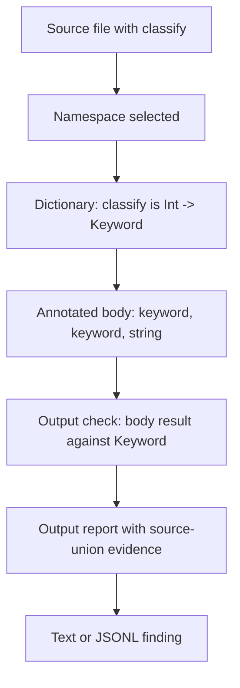

# Pipeline Tour

> *Snapshot of state as of 2026-05-06.*

This walkthrough starts with the full run because every later topic is easier to
understand once the handoffs are visible. Skeptic does not produce a finding in
one step. It moves from files, to declarations, to annotated expressions, to
cast results, to report data, to output.

The worked namespace has two definitions:

```clojure
(ns skeptic.walkthrough.example
  (:require [schema.core :as s]))

(s/defn classify :- s/Keyword
  [n :- s/Int]
  (cond
    (zero? n) :zero
    (even? n) :even
    :else     "odd"))

(s/defn double-or-zero :- s/Int
  [n :- (s/maybe s/Int)]
  (if (some? n)
    (* 2 n)
    0))
```

`classify` fails because one reachable output is a string. `double-or-zero`
passes because its branch test proves the multiplication sees a non-nil integer.
The contrast between those two definitions carries the rest of the walkthrough.

## Discovery Starts With Files, Not Types

Skeptic begins with project paths. The first job is to decide which source files
belong to the run and which namespaces those files provide. At this point,
`classify` is not a Type problem yet. It is just a form inside a selected file.

That distinction matters because later diagnostics are namespace-scoped. A run
can skip a file before admission ever sees its declarations. A run can also find
a namespace but fail to load or analyze one expression in it. Discovery is the
outer boundary that decides which later failures are even possible.

In the worked example, discovery contributes a simple fact: the namespace that
contains `skeptic.walkthrough.example/classify` is in the checking set. The
finding that eventually appears is attached to that namespace, not to a loose
piece of source text.

## Project State Gives Each Namespace A Shared Background

Before individual forms are checked, Skeptic prepares project-level data. This
is where the run gathers declarations and call-shape data that can be reused while
checking namespaces. A function in one namespace can call a var admitted from
another namespace, and call checking needs those declared Types available.

For this tiny example, the project state is almost invisible: both functions are
in one namespace. The same mechanism becomes important as soon as `classify`
calls another declared var or another namespace calls `classify`. The checker is
still reporting a local failing expression, but the expected Type may have come
from project state.

## Admission Turns Declarations Into The Dictionary

Admission reads declarations and creates the dictionary used by later phases. A
dictionary entry maps a qualified symbol to a Type. For `classify`, admission
reads the Schema method:

```text
input:  s/Int
output: s/Keyword
```

and imports it as a function Type with one method:

```text
classify : Int -> Keyword
```

For `double-or-zero`, admission imports:

```text
double-or-zero : Maybe[Int] -> Int
```

At this point Skeptic has declarations, but it has not decided whether the
bodies satisfy them. Admission answers "what did the programmer promise?"
Annotation and checking answer "what can the code actually do?"

## Annotation Gives The Bodies Their Computed Types

Annotation walks analyzed source expressions. It adds computed Types to the AST
nodes and leaves the tree shape available for later checking.

For `classify`, the body has three reachable result expressions:

```text
:zero  -> exact keyword value
:even  -> exact keyword value
"odd"  -> string
```

The body Type is therefore a set of possible results, not a single Keyword. The
string alternative survives because an odd non-zero input reaches the fallback
branch.

For `double-or-zero`, annotation starts with `n` as maybe Int. The test
`(some? n)` produces branch information. In the then branch, `n` is treated as
Int before the multiplication is annotated. In the else branch, the literal `0`
already has an Int-shaped result.

## Checking Compares Computed Types With Expected Types

Checking is where the admitted dictionary and annotated AST meet. For a declared
function output, Skeptic selects the declared method by arity, takes its output
as the expected Type, and compares the annotated method body against it.

For `classify`, the comparison is:

```text
actual body result:   :zero | :even | "odd"
expected declaration: Keyword
```

The two keyword alternatives pass. The string alternative fails. The output
check fails because every possible body result must fit the declared output.

For `double-or-zero`, the comparison is:

```text
actual body result:   Int
expected declaration: Int
```

The narrowed then branch and the literal else branch both satisfy the declared
output, so no output report is produced.

## Projection Builds Report Data From Failed Checks

The failed `classify` check still has to become a report. The report needs to
remember that the failing comparison came from a definition output, that the
expected Type was the declared Keyword output, and that the diagnostic evidence
was the source result containing an unacceptable string alternative.

Projection is the handoff from checking to output. It does not re-check the
program. It turns cast evidence into fields: report kind, source expression,
actual Type, expected Type, rule, diagnostics, and location.

`double-or-zero` never reaches this stage as a finding. Its output comparison
succeeds, so there is no failed cast evidence to project.

## Output Renders The Report

The text printer and porcelain printer consume the report data. Text output is
arranged for a person reading a terminal. JSONL output is arranged for tools.
Both surfaces come after the same checking and projection path.

When the text output says `classify` has an output problem, it is using facts
assembled earlier: the declaration from admission, the body result from
annotation, the failed comparison from checking, and the output report shape
from projection.

## The Whole Movement



That sequence is the basic reading strategy for any Skeptic finding. Start with
the report, then walk backward: output kind, cast evidence, annotated expression
Type, admitted declaration, discovered namespace.

## Source Pointers

- `skeptic/checking/pipeline.clj:check-namespace` - checks one namespace with project state.
- `skeptic/checking/pipeline.clj:project-state` - prepares shared project data.
- `skeptic/checking/pipeline.clj:namespace-dict` - builds admitted declarations.
- `skeptic/checking/pipeline.clj:check-resolved-form` - checks one resolved form.
- `skeptic/checking/pipeline.clj:match-s-exprs` - builds input-check reports for calls.
