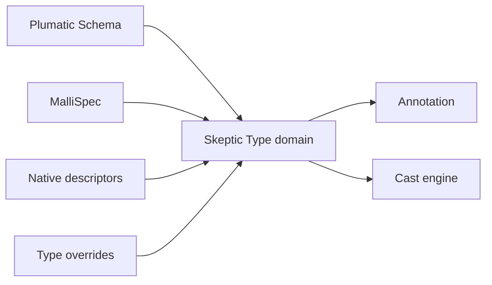

# Three Domains

The next reader question is simple: if Schema annotations, Malli forms, and
Skeptic Types are all "types", which one is the checker actually reasoning
about?

> **Snapshot:** state of Skeptic as of 2026-05-06.

## Prerequisites

[Pipeline Tour (C01)](01-pipeline-tour.md). You know that admission happens
before annotation and checking. No Plumatic Schema or Malli expertise is needed
beyond recognizing that they are external declaration languages.

## Where this fits

This spoke gives the vocabulary required by [Type Domain](03-type-domain.md) and
[Admission Paths](05-admission-paths.md). The reader should leave knowing where
conversion happens and why later phases do not keep asking whether a value came
from Schema syntax or Malli syntax.

## The Three Domains

Skeptic sees three representations.

**Schema domain** is Plumatic Schema: forms such as `s/Int`, `s/Keyword`,
`(s/maybe s/Int)`, map schemas, function schemas, and constrained schemas.
This is the main declaration surface Skeptic reads from user code.

**MalliSpec domain** is Malli metadata. Skeptic admits a limited set of Malli
shapes, enough for the boundary to participate in the same Type pipeline.

**Type domain** is Skeptic's internal semantic language. `GroundT`,
`MaybeT`, `FunT`, `UnionT`, and the other records in
`skeptic.analysis.types` are what annotation and cast rules consume.

The reader's trap at this point is to treat the three names as three spellings of
the same object. They are not. Schema and MalliSpec are intake languages. Type is
the analysis language. Once the checker has a Type, it can be passed through
normalization, narrowing, casting, and rendering without returning to the syntax
that admitted it.

*Figure: external declarations flow one way into the Type domain.*



## Why Conversion Is One-Way

At this point the reader is holding a pipeline diagram and a question: why not
translate back and forth? Skeptic avoids that. Once a declaration crosses
admission, the checker reasons in one internal language. That keeps annotation,
narrowing, and casting from needing a Schema version, a Malli version, and a
native version of the same rule.

The consequence is practical. When `classify` declares `:- s/Keyword`, later
spokes talk about a Keyword Type, not about the literal `s/Keyword` form. When
`double-or-zero` declares `(s/maybe s/Int)`, later spokes talk about `MaybeT`
around an Int Type.

One-way conversion also keeps the reader's debugging questions crisp. If an
admitted Type is wrong, inspect the boundary that admitted it. If an inferred
Type is wrong, inspect annotation and narrowing. If a cast outcome is wrong,
inspect Type-domain compatibility. The phases do not have to negotiate between
external syntaxes after admission.

## What Each Domain Is Allowed To Do

| Domain | Role | Example | File family |
|---|---|---|---|
| Schema | Main external declaration language. | `(s/maybe s/Int)` | `skeptic/analysis/bridge*` |
| MalliSpec | Additional external declaration language. | `[:=> [:cat :int] :string]` | `skeptic/analysis/malli_spec*` |
| Type | Internal semantic language. | `MaybeT[GroundT Int]` | `skeptic/analysis/types*` |

The table answers the reader's next likely confusion: Schema and Malli are not
second analysis languages. They are inputs to the analysis language.

That is why the same cast rule can handle a target Type admitted from Schema and
a target Type admitted from Malli. The rule sees Type shape and provenance, not
the original syntax family.

## One Malli Case

A small Malli function form such as `[:=> [:cat :int] :string]` is admitted as a
function Type with one method: Int input, Str output. The important thing is not
the Malli syntax; it is that the admitted result can be cast, displayed, and
merged with other declarations exactly like a Type produced from Schema.

Malli stays at this altitude in the walkthrough. The reader needs to know that it
is another admission source, not to learn Malli as a library. The rest of the
walkthrough therefore uses Plumatic Schema in the worked example, because that is
the primary user-facing declaration path.

## Boundary Vocabulary

The keyword `:schema` means Plumatic Schema. Malli is named separately as
`:malli`. That distinction matters in provenance and output because a finding can
tell the user which intake source supplied the expectation. It does not matter to
the cast rule that checks Keyword against Str; by then both sides are Types.

The reader should leave this spoke with three short sentences available: Schema
is an external declaration language. MalliSpec is another external declaration
language. Type is Skeptic's internal language for analysis.

## Reader Checkpoint

Before moving on, test the boundary on the worked example. `s/Keyword` is not the
thing the cast engine compares. It is the Schema-domain input that admission
turns into a Keyword Type. `(s/maybe s/Int)` is not a union expression in user
source; it is the Schema-domain input that admission turns into a maybe Type.
The checker's middle phases only need the admitted result.

This is also why the walkthrough can introduce Type records before returning to
admission internals. The reader does not need to know every collection path to
understand the invariant: all declaration paths converge before annotation and
checking. Once that convergence happens, the rest of the pipeline speaks Type.

If you later see a report whose expected Type came from `:schema`, read that as
"the target was admitted from Plumatic Schema." If it came from `:malli`, read it
as "the target was admitted from Malli metadata." Neither case changes how the
cast rule compares the Type shapes.

## Worked Example Here

The worked example contributes two Schema-domain forms:

```clojure
;; classify
:- s/Keyword

;; double-or-zero
[n :- (s/maybe s/Int)]
```

The first becomes a Keyword ground Type. The second becomes a maybe Type around
an Int ground Type. Those Type names are introduced in the next spoke.

## Source Pointers

- `skeptic/analysis/bridge.clj:schema->type` - Schema to Type entry point.
- `skeptic/analysis/malli_spec/bridge.clj:malli-spec->type` - MalliSpec to Type entry point.
- `skeptic/analysis/types.clj:GroundTRec` - representative Type record.
- `skeptic/provenance.clj:source` - reads which source admitted a Type.

## Glossary Terms Introduced

- Schema domain
- MalliSpec domain
- Type domain
- Admission

## Where To Next

- **Continue (Contributor path):** [Type Domain](03-type-domain.md)
- **Continue (Gist path):** [Type Domain](03-type-domain.md)
- **Return:** [Hub](README.md)
