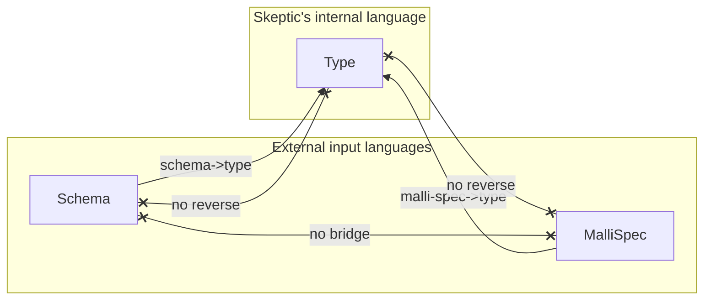

# Three Domains: Schema, MalliSpec, Type

> *Snapshot of state as of 2026-05-05.*

Skeptic deals with three distinct languages of "type": Plumatic Schema,
Malli, and Skeptic's own internal Type. Conversion is one-way into Type;
analysis happens there. This spoke fixes the vocabulary used by every
later spoke that touches admission, annotation, or casting.

## Prerequisites

[Spoke 01 (Pipeline Tour)](01-pipeline-tour.md) — you know the seven
phases. Comfort with the idea that the same "type" idea can have
multiple textual representations. No Plumatic-Schema or Malli expertise
required; the spoke introduces enough.

## Where this fits

Second on the Contributor path. Establishes the vocabulary used by
[Admission Paths (05)](05-admission-paths.md), the Type-domain spokes
[03](03-type-domain.md), [04](04-provenance.md), [09](09-cast-dispatch.md),
and [10](10-blame-for-all-and-projection.md). Skip this spoke only if
you already know the "schema → type, never reverse" rule and what
`:schema` vs. `:malli-spec` mean as keywords inside Skeptic.

## The three domains

Skeptic's code touches three different textual languages of "type."

**Schema** is [Plumatic Schema](https://github.com/plumatic/schema):
Clojure values like `s/Int`, `s/Any`, `(s/maybe s/Int)`,
`(s/optional-key :k)`, `{s/Keyword s/Int}`. Plumatic Schemas are the
language a project author writes in to declare types; Skeptic admits
them but does no internal reasoning in this domain.

**MalliSpec** is [Malli](https://github.com/metosin/malli) data:
keywords like `:int`, `:string`, vector forms like
`[:=> [:cat :int] :string]` (a function from int to string), `[:maybe
:int]`, `[:or :int :string]`, `[:enum :a :b]`. Like Schema, MalliSpec
is an input language; Skeptic admits it at a small subset and does no
internal reasoning in this domain.

**Type** is Skeptic's own internal semantic representation. A Type is
a `defrecord` with a `:prov` field plus shape-specific fields:
`GroundT`, `MaybeT`, `UnionT`, `MapT`, `FunT`, `ConditionalT`, and
twenty more. The Type domain is where the cast engine, blame logic,
narrowing, and exhaustiveness all operate. The full catalogue lives
in [spoke 03](03-type-domain.md).

*Figure: Schema and MalliSpec are external; Type is internal; conversion is one-way into Type.*



## Why the conversion is one-way

There is no `Type → Schema`, no `Type → MalliSpec`, no
`Schema → MalliSpec`, and no `MalliSpec → Schema` in Skeptic. Each
external domain has a single bridge into Type and that is the only
direction conversion ever runs.

The reasoning is mundane: bidirectional bridges are expensive to keep
faithful, and Skeptic doesn't need them. Skeptic's analysis happens
entirely in the Type domain. Schema and MalliSpec are admitted, then
forgotten. The only place Skeptic looks back at the original schema
form is when rendering a Type for the user — and even then, the
"render" path is `Type → display string`, not `Type → Schema`.
Display has the option to fold a structural Type into a known schema
*name* if one was registered (so a `MaybeT[GroundT Int]` admitted from
`(s/maybe s/Int)` displays as `(maybe Int)`), but that's an alias
lookup, not a reconstruction.

The one-way rule has a practical consequence for contributors: do not
write `type->schema` or `schema->malli-spec` even when it would be
convenient. Instead, design the analysis or feature you need so that
it lives in the Type domain.

## `:schema` vs. `:malli-spec` keywords

Inside Skeptic the keyword `:schema` always means Plumatic Schema, and
the keyword `:malli-spec` always means Malli. They never overlap.

This matters in three places. First, the admission boundary keys: the
Plumatic collector reads `:schema` from a var's metadata and emits
entries tagged `:schema`; the Malli collector reads `:malli/schema`
from a var's metadata and emits entries tagged `:malli-spec`. The
keyword tags carry through merging in
[spoke 05](05-admission-paths.md). Second, Provenance source values
(see [spoke 04](04-provenance.md)): a Type admitted from a Plumatic
schema carries `:schema` on its `:prov`; a Type admitted from a Malli
form carries `:malli`. Third, configuration: `:type-overrides` in
`.skeptic/config.edn` are evaluated as Plumatic Schemas and so are
admitted with `:type-override` provenance, not `:malli`.

The discipline is straightforward: if a function or keyword in
Skeptic's source uses `:schema`, it is talking about Plumatic. If
it uses `:malli` or `:malli-spec`, it is talking about Malli. There
is no shared parent keyword like `:declared-spec` that would be
ambiguous.

## What each domain is allowed to do

| Domain     | Role                                                                | Example                                              | Skeptic file family                              |
|------------|---------------------------------------------------------------------|------------------------------------------------------|--------------------------------------------------|
| Schema     | Input — collected from var metadata; converted to Type              | `(s/maybe s/Int)`                                    | `skeptic.schema.*`, `skeptic.analysis.bridge.*`  |
| MalliSpec  | Input — collected from `:malli/schema` var metadata; converted to Type | `[:=> [:cat :int] :string]`                       | `skeptic.malli-spec.*`, `skeptic.analysis.malli-spec.bridge` |
| Type       | Internal — the only domain in which analysis happens                | `(at/->MaybeT prov (at/->GroundT prov :int 'Int))`    | everything else (`skeptic.analysis.*`, `skeptic.checking.*`) |

The boundary rule: real semantic work — checking, narrowing,
exhaustiveness, cast dispatch, blame — happens in Type. Schema and
MalliSpec are never the analysis language; they are formats from
which Types are admitted. New analysis features should be designed in
the Type domain. The only Schema-shaped or MalliSpec-shaped code in
Skeptic lives at the admission boundary or at the display boundary.

## One illustrative Malli case

`[:=> [:cat :int] :string]` — Malli's syntax for "a function from int
to string" — admits to:

```clojure
(at/->FunT prov
           [(at/->FnMethodT prov
                            [(at/->GroundT prov :int 'Int)]
                            (at/->GroundT prov :string 'Str))])
```

That is a `FunT` (the function-type wrapper), wrapping a single
`FnMethodT` (one arity), whose input list is `[Int]` and whose output
is `Str`. The same admitted shape would result from
`(s/=> s/Str s/Int)` in Plumatic (modulo provenance source). The
admission walk is recursive over the Malli form and is described in
[spoke 05's Malli subsection](05-admission-paths.md#the-four-sources).

The point is not the Malli syntax; it is that *whatever* the input
language, the result lives in the same Type vocabulary. A reader who
knows `FunT` and `FnMethodT` (see [spoke 03](03-type-domain.md)) can
read the result without reading Malli.

## Marquee functions

| Function           | File                                                 | Role                                                       |
|--------------------|------------------------------------------------------|------------------------------------------------------------|
| `schema->type`     | `skeptic/analysis/bridge.clj`                        | The Schema → Type boundary entry point.                    |
| `malli-spec->type` | `skeptic/analysis/malli_spec/bridge.clj`             | The MalliSpec → Type boundary entry point.                 |
| `at/->GroundT`     | `skeptic/analysis/types.clj`                          | One representative Type-domain constructor (prov-first).    |
| `prov/source`      | `skeptic/provenance.clj`                              | Reads which domain a Type came from.                       |

## Worked example here

`(s/maybe s/Int)` from `double-or-zero`'s argument schema is the
illustrative Schema → Type case: it admits to
`MaybeT[GroundT Int]` with `:schema` provenance. `:- s/Keyword` from
`classify` is the illustrative declared-output case: it admits to
`GroundT Keyword`, again with `:schema` provenance. Both are
re-encountered in [spoke 05](05-admission-paths.md) where the
admission walk is shown step by step.

## Where to next

- **Continue (Contributor path):** [Type Domain (03)](03-type-domain.md)
- **Continue (Gist path):** [Type Domain (03)](03-type-domain.md)
- **Return:** [Hub](README.md)
