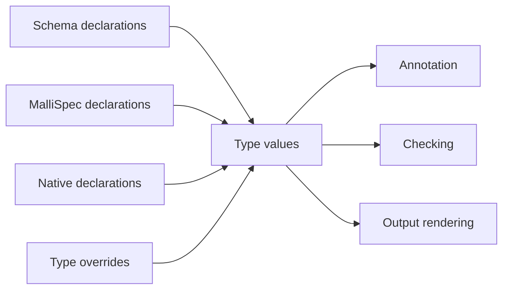

# Three Domains

> *Snapshot of state as of 2026-05-06.*

Skeptic has three type-shaped languages at its boundary: Plumatic Schema,
MalliSpec, and Type. The first two are input languages. The third is the
semantic model used by annotation, narrowing, casting, and output.

## Why The Domains Must Be Separated

Look at the two declarations in the worked example:

```clojure
:- s/Keyword
[n :- (s/maybe s/Int)]
```

Those are Schema forms. They are meaningful because Plumatic Schema gives them
meaning. But the cast engine does not compare raw `s/Keyword` forms with raw
body expressions. Admission first translates the declaration into Type values.

That separation gives Skeptic one shared semantic language. A Schema declaration, a
Malli function spec, a native declaration, and a configured override can all
meet as Types. Later phases can then ask the same questions of each source:
what is the input Type, what is the output Type, what provenance does it carry,
and which cast rule applies?

## Schema At The Boundary

Schema means Plumatic Schema. It appears in `s/defn`, `s/defschema`, map
schemas, `s/maybe`, `s/cond-pre`, `s/either`, and related forms. In this
walkthrough, the important Schema facts are small:

```text
s/Keyword          -> declared output of classify
s/Int              -> declared input of classify
(s/maybe s/Int)    -> declared input of double-or-zero
```

Admission reads those forms from declarations and imports them. After import,
the rest of Skeptic does not inspect the original Schema form to check the body.
It uses the Type value created from the Schema form.

For `classify`, that means the output check is not "does the body match the
text `s/Keyword`?" It is "does the annotated body Type fit the Type admitted
from `s/Keyword`?"

## MalliSpec At The Boundary

MalliSpec is a separate input source. A form such as:

```clojure
[:=> [:cat :int] :string]
```

describes a one-argument function that accepts Int and returns String. Admission
can import that shape into the same Type family used for Schema declarations:
one function Type, one method, one input Type, one output Type.

The separation from Schema matters because the two input languages are not
aliases for each other. `:schema` refers to Plumatic Schema. MalliSpec has its
own bridge and its own provenance source. Once either source is admitted,
checking sees the resulting Type.

## Type Inside Skeptic

Type is the semantic model used after admission. A Schema `s/Keyword` becomes a
ground Keyword Type. `(s/maybe s/Int)` becomes a maybe Type whose inner Type is
Int. A function declaration becomes a function Type with method entries.

The Type value carries more than display text. It has a record shape, provenance,
and structural fields that downstream code can recurse through. The cast engine
can ask whether a Type is a union, function, map, maybe, or leaf. Narrowing can
split a maybe Type. Output can render a Type into text or JSON data.

## One-Way Conversion



The checking path points into Type. Rendering can later print a Type in a
Schema-like or structural form, but that printed form is not the state used by
the checker. It is a display surface.

This is why the worked example can be described consistently across phases:
`s/Keyword` is Schema at admission, Keyword Type during checking, and a rendered
expected Type in output.

## The Worked Example Through The Boundary

For `classify`, the output declaration crosses the boundary like this:

```text
Schema form:     s/Keyword
Admitted Type:   Ground keyword Type with schema provenance
Checking role:   expected output Type
Output role:     declared return expectation
```

For `double-or-zero`, the argument declaration crosses like this:

```text
Schema form:     (s/maybe s/Int)
Admitted Type:   Maybe Type containing Int
Annotation role: starting Type for local n
Narrowing role:  remove nil in the positive some? branch
```

Nothing in the later branch check has to reopen the original Schema form. The
maybe structure is already present in the Type.

## Source Pointers

- `skeptic/analysis/bridge.clj:schema->type` - imports Schema into Type.
- `skeptic/analysis/malli_spec/bridge.clj:malli-spec->type` - imports MalliSpec into Type.
- `skeptic/analysis/types.clj:->GroundT` - constructs a ground Type.
- `skeptic/provenance.clj:source` - reads the source carried by Provenance.
