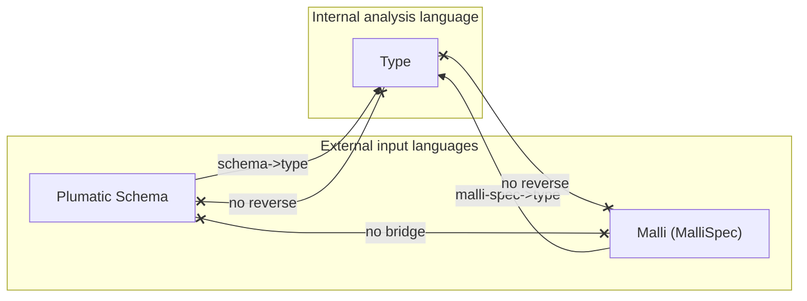

# Three Domains: Schema, MalliSpec, Type

> *Snapshot of state as of 2026-05-05.*

Skeptic deals with three distinct languages of "type." Plumatic Schema
and Malli are external — what a project author writes — and Type is
internal — what Skeptic's analysis runs on. Conversion is one-way into
Type; analysis happens there. This spoke fixes the vocabulary used by
every later spoke that touches admission, annotation, or casting, and
explains *why* the boundary is shaped the way it is.

## Prerequisites

[Spoke 01 (Pipeline Tour)](01-pipeline-tour.md) — you know the seven
phases and that admission is one of them. Comfort with the idea that
the same "type" idea can have multiple textual representations. No
Plumatic-Schema or Malli expertise required; this spoke introduces
enough.

## Where this fits

Second on the Contributor path. Establishes the vocabulary used by
[Admission Paths (05)](05-admission-paths.md), the Type-domain spokes
[03](03-type-domain.md), [04](04-provenance.md),
[09](09-cast-dispatch.md), and
[10](10-blame-for-all-and-projection.md). Skip this spoke only if you
already know the "schema → type, never reverse" rule, what `:schema`
vs. `:malli-spec` mean as keywords inside Skeptic, and *why* the
asymmetry between Plumatic admission and Malli admission exists.

## Why three domains

A type-checker for Clojure projects has to meet users where they are.
Project authors don't all write types the same way. Some annotate with
Plumatic Schema; some write Malli `:malli/schema` metadata; some have
neither and rely on Skeptic's built-in declarations for `clojure.core`.
A checker that supports only one of these formats serves only the
slice of the ecosystem that uses it.

But running analysis directly against multiple input formats gets
expensive fast. A cast rule that has to handle "is this `s/Int`, is
this `:int`, is this a class, is this `s/Num` or is it `java.lang.Number`?"
turns into branch noise that distracts from the real algorithmic work.
The cast engine doesn't care whether `Int` came from Plumatic or
Malli; it cares about the *shape* of the type — is this a leaf, a
union, a function with these inputs and that output? — and what the
cast rules are.

Skeptic's answer is to define one *internal* type language — the Type
domain — that captures every shape the cast engine needs to reason
about. External formats are admitted at the boundary and converted
into the Type domain; internal analysis runs entirely there. New
analysis features (a new cast rule, a new narrowing pattern, a new
exhaustiveness shape) are designed against Type kinds, not against
Plumatic or Malli forms.

The three domains, then, are the user-facing input languages
(Plumatic and Malli) and the internal analysis language (Type). The
asymmetry is deliberate — input languages are admitted, the internal
language is reasoned in — and it shapes the rest of Skeptic's
architecture.

*Figure: Schema and MalliSpec are external input languages; Type is
internal; conversion is strictly one-way into Type; no bridges run
between the two external languages.*

## Schema domain

**This section teaches: what a "Plumatic schema" is in Skeptic's
sense, what shapes the admission boundary recognizes, and why the
admission boundary is so much richer than Malli's.**

The Schema domain is [Plumatic Schema](https://github.com/plumatic/schema)
— Clojure values like `s/Int`, `s/Any`, `(s/maybe s/Int)`,
`(s/optional-key :k)`, `{s/Keyword s/Int}`, `[s/Int]`, `(s/=> s/Str
s/Int)`, `(s/cond-pre s/Int s/Str)`, `(s/conditional even? s/Int :else
s/Str)`, plus user-defined schemas via `(def MyType …)` and
`(s/defschema …)`. The admission boundary recognizes a wide range of
shapes:

- **Primitive grounds.** `s/Int`, `s/Str`, `s/Keyword`, `s/Symbol`,
  `s/Bool`, plus most Java classes, become `GroundT` Types tagged by
  the appropriate keyword.
- **Numeric dynamic.** `s/Num` and `java.lang.Number` become
  `NumericDynT` — a subtype of `Dyn` that overlaps every primitive
  numeric ground (see [spoke 03](03-type-domain.md)).
- **Broad dynamic.** `s/Any` and `Object` become `Dyn`.
- **`(s/maybe X)`.** Becomes `MaybeT[X→Type]`.
- **`(s/optional-key :k)`.** Becomes `OptionalKeyT` wrapping the
  inner key.
- **`(s/eq X)` and literal map keys.** Become `ValueT`.
- **`(s/enum a b c)`.** Becomes `UnionT` of `ValueT`s.
- **`(s/cond-pre X Y)`, `(s/either X Y)`, `(s/join X Y)`.** Become
  `UnionT[X, Y]`.
- **`(s/both X Y)`.** Becomes `IntersectionT[X, Y]`.
- **`(s/conditional pred X :else Y)`.** Becomes `ConditionalT` with
  predicate slots, preserved for narrowing-aware casts.
- **`(s/=> output [inputs])`.** Becomes `FunT` of one or more
  `FnMethodT`s.
- **Map schemas `{key value, …}`.** Become `MapT` keyed by inner
  Types (the keys themselves are admitted recursively, so a
  `s/Keyword` key becomes a `GroundT Keyword` key in the resulting
  `MapT`).
- **Vector schemas `[X]` or `[(s/one prefix) … rest]`.** Become
  `VectorT` with prefix items and an optional tail.
- **Set schemas `#{X}`.** Become `SetT`.
- **Sequence schemas (lists used as schemas).** Become `SeqT`.
- **`(s/pred predicate-symbol)`.** When the predicate is one Skeptic
  recognizes (about 20 well-known predicate symbols are mapped to
  ground witness types), the result is the witness; otherwise an
  `AdapterLeafT` carrying the predicate as an opaque check.
- **`(s/constrained X pred)`.** Becomes `RefinementT` over the
  unconstrained inner.
- **Recursive schemas (defs that reference themselves).** The
  reference becomes a `PlaceholderT` carrying the var symbol; if
  the recursion is detected mid-admission, an `InfCycleT` short-
  circuits the descent. The cast engine resolves these lazily via
  the `with-active` stack ([spoke 09](09-cast-dispatch.md)).

The richness reflects a design decision: Plumatic Schema is the
flagship input format, the format Skeptic is built around, and most
of Skeptic's user base writes types in this language. Investing in a
faithful admission of the language pays back across every project.

The boundary lives in `skeptic/analysis/bridge.clj`, with helpers in
`skeptic/analysis/bridge/canonicalize.clj`,
`skeptic/analysis/bridge/localize.clj`, and
`skeptic/analysis/bridge/render.clj`. The entry function is
`schema->type`, but it does its work in two stages: `admit-schema`
validates the input is in the schema domain (throwing
`IllegalArgumentException` if not), and `import-schema-type` produces
the Type. The two-stage shape isn't ornamental — `schema-domain?` is a
public predicate that answers "is this value in the schema domain?"
without producing a Type, and contributors building cross-domain
tooling rely on it.

## MalliSpec domain

**This section teaches: what Malli is to Skeptic, what subset of
Malli is currently admitted, and what happens to forms outside that
subset.**

The MalliSpec domain is [Malli](https://github.com/metosin/malli) data
— keywords like `:int`, `:string`, vector forms like `[:=> [:cat
:int] :string]` (a function from int to string), `[:maybe :int]`,
`[:or :int :string]`, `[:enum :a :b]`. Like Plumatic, MalliSpec is an
input language; unlike Plumatic, only a small subset is admitted to
Type today.

The admission boundary lives in
`skeptic/analysis/malli_spec/bridge.clj`. The entry is
`malli-spec->type`, which (like `schema->type`) does its work in two
stages: `admit-malli-spec` runs `(m/form (m/schema value))` to canonicalize
the form via Malli's own machinery, and `form->type` walks the
canonicalized form recursively.

The currently-supported subset is intentionally narrow:

- **Five primitive leaves.** `:int → Int`, `:string → Str`,
  `:keyword → Keyword`, `:boolean → Bool`, `:any → Dyn`.
- **The function shape.** `[:=> [:cat & inputs] output]` becomes a
  `FunT` with one `FnMethodT`. Multi-arity isn't admitted.
- **Maybe.** `[:maybe X]` becomes `MaybeT`.
- **Or.** `[:or X Y …]` becomes `UnionT`.
- **Enum.** `[:enum a b …]` becomes `UnionT` of `ValueT`s.
- **Bare predicate symbols.** A symbol like `int?` or `string?` is
  resolved against Skeptic's predicate registry; if recognized,
  the result is the witness type, otherwise `Dyn`.

Everything else returns `Dyn`. That includes `:map`, `:vector`,
`:set`, `:tuple`, registry references, sequence/regex combinators
(`:cat`, `:alt`, `:?`, `:+`, `:*`), function-schema variants other
than `[:=>]`, and the rich Malli registry features. Malli admits the
form (Malli's own `m/schema` doesn't reject it); Skeptic just doesn't
have a recognizer for it yet.

The asymmetry — rich Plumatic admission, narrow Malli admission — is
a deliberate scoping choice. Malli support in Skeptic is *experimental*:
the Malli forms that users have asked for first are the
function-arrow shape (so `:malli/schema` metadata on a `defn` carries
type information through to call-site casts) and the basic leaves.
Map, vector, and registry support are deferred until there's user
demand and the conversion shape is well-understood. A Malli form
that admits to `Dyn` doesn't *break* anything — call sites against
that var get treated as if the function takes and returns `Any` —
but it doesn't help, either. The user gets the message "Malli
support is experimental" by seeing `Dyn`s where they expected
something narrower.

## Type domain (preview)

**This section teaches: what a "Type" is in Skeptic's sense and why
its design supports analysis without leaking into the input
languages.**

The Type domain is Skeptic's internal semantic representation. A Type
is a `defrecord` with a `:prov` field as its first field
([spoke 04](04-provenance.md) explains provenance) plus shape-specific
fields. The Type catalogue ([spoke 03](03-type-domain.md)) has 23
records covering grounds, leaves, dynamics, wrappers, composites,
abstract types, and quantified types.

A few defining properties of Type, named here so the rest of the
spokes can use them:

- **Bare records, no admission wrappers.** Once a value is in the
  Type domain, no `:typings` / `:output-type` / `:arglists` /
  `:accessor-summary` / `:type` envelope wraps it. Each Type record
  *is* the value.
- **Provenance on every Type.** Field 1 is `:prov`, a `Provenance`
  record (see spoke 04). The `:prov` is set at admission and
  preserved through every internal operation.
- **Construction via positional `at/->KindT`.** The constructors are
  positional; provenance is always the first argument. Helpers like
  `at/Dyn`, `at/NumericDyn`, `at/BottomType` keep the same
  contract.
- **Equality is shape-only via `at/type=?`.** Defrecord `=` would
  compare `:prov` too, which would distinguish two structurally-
  identical types from different sources. `at/type=?` strips
  `:prov` recursively and is the equality function for shape-
  sensitive code.

The internal language captures the shapes external languages can
express, plus a handful of shapes only the cast engine produces:
`SealedDynT` (a sealed quantified value in flight),
`ConditionalT` with discriminator slots (filled during the dict's
enrichment pass — see [spoke 03](03-type-domain.md) and
[spoke 01](01-pipeline-tour.md#in-depth-why-one-project-wide-dict-instead-of-per-namespace-dicts)),
`PlaceholderT` and `InfCycleT` (recursive references mid-resolution).
These don't have direct analogues in Plumatic or Malli — they exist
because the cast engine needs them, and they appear in Type because
*Type is the analysis language*.

Spoke 03 enumerates the 23 records with their fields and constructors.

## Conversion direction is one-way

**This section teaches: the rule that conversion only runs into Type,
never out of it; and what that rule prevents.**

There is no `Type → Schema`, no `Type → MalliSpec`, no `Schema →
MalliSpec`, and no `MalliSpec → Schema` in Skeptic. Each external
domain has a single bridge into Type and that is the only direction
conversion ever runs.

Two reasons.

First, bidirectional bridges are expensive to keep faithful. A
roundtrip `Schema → Type → Schema` would have to recover every shape
the original carried — including Plumatic-specific niceties like
`(s/named X 'somename)` aliasing or recursive `Recursive` references
— and Skeptic doesn't need that recovery. Skeptic admits a value,
analyses in Type, and either reports a finding (in user-facing terms,
which are not necessarily the original schema syntax) or says
nothing.

Second, the cast engine and the rest of the analysis layer would
become harder to evolve if changes had to preserve roundtrip
fidelity. Adding a new internal type kind (say, an upgrade to
`ConditionalT`'s shape) that didn't have a faithful Schema or Malli
representation would force a choice between blocking the change and
introducing a lossy reverse bridge. With one-way conversion, internal
representation is free to evolve.

There's a small *display-time* exception that's worth being clear
about. When Skeptic renders a Type for the user — in a finding's
"actual type" or "expected type" line — it can fold a structural
Type back into its declared schema *name* if one was registered.
A `MaybeT[GroundT Int]` whose `:prov` carries a known schema name
displays as `(maybe Int)` rather than the structural form. This is
*alias lookup*, not reconstruction: Skeptic stores the schema's
display form alongside the Type at admission and reuses it in
display. The folding only fires for foldable sources —
`#{:schema :malli :type-override}`, the three named-source values
that could have a user-recognizable display form. Native and
inferred provenance never fold (no source name to fold to).

Folding is *opt-out* via `--explain-full`, which forces the
structural form. A contributor debugging a finding sometimes wants
to see what Skeptic actually computed, not what the schema author
named it.

## `:schema` vs. `:malli-spec` vs. the Provenance source values

**This section teaches: the keyword discipline that keeps the two
external languages from being confused inside Skeptic's source.**

Inside Skeptic the keyword `:schema` always means Plumatic Schema,
and the keyword `:malli-spec` always means Malli. They never overlap.
Three places this discipline matters:

- **Admission boundary keys.** The Plumatic collector reads
  `:schema` from a var's metadata and emits entries with `:schema`
  provenance; the Malli collector reads `:malli/schema` from a var's
  metadata and emits entries with `:malli` provenance. The keyword
  `:malli-spec` is the *domain name* — used in `MalliSpecDesc`
  schemas inside Skeptic — never to read user-facing metadata.
- **Provenance source values.** A Type admitted from a Plumatic
  schema carries source `:schema`; from Malli, `:malli`. The five
  named-source values are `:schema`, `:malli`, `:native`,
  `:type-override`, `:inferred`; covered fully in
  [spoke 04](04-provenance.md).
- **Configuration.** `:type-overrides` in `.skeptic/config.edn` are
  evaluated as Plumatic Schemas (the `(:as s)` namespace alias is
  in scope), so they admit through `schema->type` and carry
  `:type-override` provenance. They are not Malli-shaped.

The discipline is straightforward but worth naming: if a function
or keyword in Skeptic's source uses `:schema`, it is talking about
Plumatic; if it uses `:malli` or `:malli-spec`, it is talking about
Malli. There is no shared parent keyword like `:declared-spec` that
would be ambiguous. Reaching for one would be tempting (a "generic
declared spec" abstraction over both), but it would force the
admission boundary to round-trip through the abstraction and would
re-introduce the dual-language analysis problem the Type domain
was supposed to eliminate.

### In-depth: the three boundary predicates

***Skip if reading the Gist path.***

A contributor building a feature that bridges domains — a debug
inspector that says "is this thing schema-shaped or type-shaped?",
a tooling helper, a config-value validator — needs to know what's
on offer at the boundary. There are three predicates, with
different costs and meanings.

- **`schema-domain?`** in `skeptic/analysis/bridge.clj`. Answers
  "is this value in the Plumatic schema domain?" by *attempting*
  admission via `admit-schema` and returning whether it succeeded.
  Cost: equivalent to admitting the value (recursive walk over
  the schema form). Use this when the answer needs to be
  authoritative — e.g., before writing a value to a place that
  expects a schema.
- **`malli-spec-domain?`** in
  `skeptic/analysis/malli_spec/bridge.clj`. Answers "is this value
  in the Malli spec domain?" by attempting `admit-malli-spec`
  (which delegates to Malli's own `m/schema`). Cost: depends on
  Malli's validation cost.
- **`at/semantic-type-value?`** in
  `skeptic/analysis/types.clj`. Answers "is this value a Type?"
  by checking whether it satisfies the protocol marker. Cost:
  protocol dispatch (cheap).

The three are *not transitive*. A value that is `schema-domain?`-true
is *not* `malli-spec-domain?`-true (unless by coincidence — a bare
class is in both, for example). Type values are in neither external
domain. A contributor who needs "give me the domain this value
belongs to" needs to test all three, in order: Type first (cheapest),
then Schema, then Malli. The three branches are mutually exclusive
in practice if the value originated from a known source, but if the
value is a free input, all three need to be tried.

A subtle point: `admit-schema` *throws* on invalid input;
`schema-domain?` catches the throw. `admit-malli-spec` also throws
on invalid Malli input; `malli-spec-domain?` catches. A contributor
calling `admit-schema` directly must either guard with a
`schema-domain?` check or be prepared for the exception. The
admission collectors in `skeptic.schema.collect` and
`skeptic.malli-spec.collect` use the safe pattern (try / catch /
record an admission error) so a single bad declaration doesn't
abort the whole namespace.

A second subtle point: there is no `admit-type-override` predicate.
`:type-overrides` are admitted as Plumatic schemas. The override
mechanism is *Plumatic-flavoured*: a contributor wanting Malli-
shaped overrides would have to decide whether to extend the
override semantics or admit them differently, and that decision
hasn't been made.

### In-depth: why no `Schema → MalliSpec` bridge

***Skip if reading the Gist path.***

A contributor sometimes wants a tool that translates one input
language into another — for example, "I have a Plumatic schema; I
want to publish it as a `:malli/schema`." It would be tempting to
build that as a sibling of `schema->type` and `malli-spec->type`.

Skeptic does not provide it, and the reason is the same one that
makes one-way-into-Type a load-bearing rule.

A faithful `Schema → MalliSpec` bridge would have to translate every
shape Plumatic admission accepts. Plumatic admits roughly 20 shape
families ((s/maybe), (s/optional-key), (s/cond-pre), (s/conditional),
(s/both), (s/=>), maps, vectors, sets, seqs, (s/pred), (s/constrained),
recursive defs, `(s/eq)`, `(s/enum)`, `(s/named)`, `Recursive`,
`One`, classes, predicates). Malli admission today recognizes 8.
Translating from a Plumatic shape that Malli's own format admits
but Skeptic's *Malli-to-Type* doesn't recognize would produce a
form that round-trips through Malli but admits to `Dyn` in
Skeptic — *worse* than the original Plumatic, which admitted to a
real Type.

The bridge would also have to maintain its own translation tests,
which would drift any time either external domain or the Type
domain changes. In a one-way-into-Type world, that drift surface
doesn't exist.

The contributor who wants this is better served by adding more
shape recognizers to the Malli admission boundary directly. Each
new recognizer makes Malli admit faithfully into Type, which is the
real benefit. A `Schema → MalliSpec` bridge would just paper over
the missing recognizers.

## Marquee functions

| Function           | File                                                 | Role                                                       |
|--------------------|------------------------------------------------------|------------------------------------------------------------|
| `schema->type`     | `skeptic/analysis/bridge.clj`                        | The Schema → Type boundary entry point.                    |
| `admit-schema`     | `skeptic/analysis/bridge.clj`                        | The validate-and-admit step preceding `schema->type`.      |
| `schema-domain?`   | `skeptic/analysis/bridge.clj`                        | Public predicate: "is this in the Plumatic schema domain?" |
| `malli-spec->type` | `skeptic/analysis/malli_spec/bridge.clj`             | The MalliSpec → Type boundary entry point.                 |
| `malli-spec-domain?` | `skeptic/analysis/malli_spec/bridge.clj`           | Public predicate for the Malli domain.                     |
| `at/type=?`        | `skeptic/analysis/types.clj`                          | Type-domain shape equality (strips `:prov`).               |

## Worked example here

`(s/maybe s/Int)` from `double-or-zero`'s argument schema admits to
`MaybeT[GroundT Int]` with `:schema` provenance. `:- s/Keyword` from
`classify` admits to `GroundT Keyword`, again with `:schema`
provenance. The pair illustrates two of the recognized Plumatic
shapes (the unary `(s/maybe X)` wrapper and the bare ground class).
A Malli equivalent would be `[:maybe :int]` and `:keyword` — same
internal Type, different `:prov` source value. Both are
re-encountered in [spoke 05](05-admission-paths.md) where the
admission walk is shown step by step.

## Glossary terms introduced

- Schema domain
- MalliSpec domain
- Boundary (admission)
- One-way conversion (boundary rule)
- Domain predicate
- Foldable source

## Where to next

- **Continue (Contributor path):** [Type Domain (03)](03-type-domain.md)
- **Continue (Gist path):** [Type Domain (03)](03-type-domain.md)
- **Return:** [Hub](README.md)
