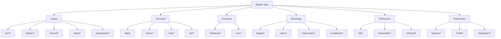
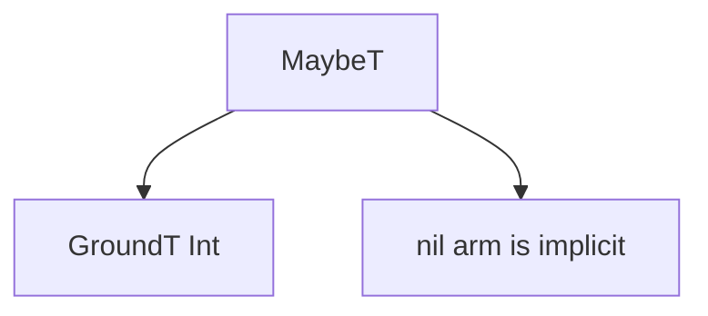

# Type Domain

The reader now knows that later phases use Skeptic Types. This spoke gives the
mental inventory needed to recognize those values when casts and annotations
start passing them around.

> **Snapshot:** state of Skeptic as of 2026-05-06.

## Prerequisites

[Pipeline Tour (C01)](01-pipeline-tour.md) and
[Three Domains (C02)](02-three-domains.md). Comfort with Clojure records helps,
because each Type kind is represented as a record-like value with `:prov` plus
kind-specific fields.

## Where this fits

Third on the Contributor path. After this spoke, [Provenance](04-provenance.md)
can explain where Type values came from, and [Cast Dispatch](09-cast-dispatch.md)
can explain how source and target Types choose a rule.

## What A Type Is

A Skeptic Type is a semantic value, not the original source form. The source form
`s/Int` admits to a ground Type. `(s/maybe s/Int)` admits to a maybe Type whose
inner member is the Int ground Type. A function declaration admits to a function
Type with one or more method Types.

That shift matters because annotation also produces Types. Once both the
declared expectation and the inferred program behavior are in the same domain,
the cast engine can compare them without knowing which syntax created them.

Every Type also carries provenance, covered in the next spoke. For now, read
`:prov` as "where this Type came from" and the other fields as "what shape this
Type describes." Separating those two ideas lets Skeptic compare Type meaning
while still reporting useful origins.

## The Type Families

*Figure: Type record families at a glance.*

The most common leaves are `GroundT` for named categories such as Int, Str, and
Keyword; `ValueT` for exact values such as `:zero`; `DynT` for unknown gradual
values; and `BottomT` for impossible values.

The common structural Types are maps, vectors, sequences, and sets. The common
branching Types are `MaybeT`, `UnionT`, `IntersectionT`, and `ConditionalT`.
Function Types are split into `FunT` and `FnMethodT` because Clojure functions
can have multiple arities.

| Family | Kinds to recognize first | Reader question answered |
|---|---|---|
| Leaves | `GroundT`, `ValueT`, `DynT`, `BottomT`, `NumericDynT` | What kind of value is this? |
| Structural | `MapT`, `VectorT`, `SeqT`, `SetT` | Where inside a collection did the mismatch occur? |
| Functions | `FunT`, `FnMethodT` | Which arity and return path is being checked? |
| Branching | `MaybeT`, `UnionT`, `IntersectionT`, `ConditionalT` | Which alternatives are possible? |
| References | `VarT`, `PlaceholderT`, `InfCycleT` | Is this Type standing in for a named or recursive declaration? |
| Polymorphic | `TypeVarT`, `ForallT`, `SealedDynT` | Is abstraction being preserved across a cast boundary? |

This table is not exhaustive documentation. It gives the reader a way to sort an
unfamiliar Type before opening the source.

## The Eight You Will See Most

`GroundT` represents a named ground such as Int, Str, Keyword, Bool, or a class.
It is what `s/Int` and `s/Keyword` become in the worked example.

`ValueT` represents one exact value. The keyword branches in `classify` infer as
exact values before later joins generalize them enough for checking.

`MaybeT` represents nil-or-T. `double-or-zero` starts with `MaybeT[GroundT Int]`
and narrowing removes nil on the then-branch.

`UnionT` represents alternatives. The body of `classify` is naturally discussed
as a union of possible branch outputs.

`MapT`, `VectorT`, `SeqT`, and `SetT` carry element or entry Types. They matter
when a cast failure has a path such as a field, index, or element.

`FunT` contains `FnMethodT` values. A method carries input Types and output Type;
function casts compare methods by arity.

`ConditionalT` is a Type whose branches depend on a discriminator. It connects
annotation-side branch reasoning to cast-side checking.

`ForallT` and `SealedDynT` are named here so the reader recognizes them later.
Their operational meaning belongs to
[Blame for All and Projection](10-blame-for-all-and-projection.md).

Two more Types are worth keeping in the background. `PlaceholderT` and
`InfCycleT` show up when admitted declarations point through names or recursive
shapes. The cast dispatcher has special handling for those because expanding a
recursive schema naively would loop. The Gist path can ignore them; a contributor
debugging a recursive declaration cannot.

## Reading A Type In A Cast

When a cast failure says actual is `GroundT Str` and expected is
`GroundT Keyword`, the reader can act immediately: the program produced a string
where a keyword was required. When the failure says actual is a `UnionT`, read it
as "any member may appear at runtime." When it says expected is a `FunT`, read it
as "the context wants a callable value with matching method shape."

This is the main payoff of the spoke. The cast engine has many rules, but the
first diagnosis step is usually just identifying the Type family on each side.

## Small Reading Exercises

Use these as quick checks before moving into provenance.

| You see | First reading |
|---|---|
| `MaybeT[GroundT Int]` | The value may be nil or an Int. |
| `UnionT[ValueT :zero, GroundT Str]` | Runtime may produce either alternative; a source-union cast must check both. |
| `FunT` with one method | A callable value with one arity shape. |
| `MapT` with a key path in a finding | The failure is inside a map structure, not at the root alone. |
| `ForallT` | Ordinary leaf comparison is not enough; quantified cast rules apply. |

These readings are intentionally informal. The goal is to orient quickly, then
open the source only when the Type family tells you which subsystem matters.

## What Type Domain Does Not Mean

The Type domain is not a new surface syntax for users to write everywhere. Users
mostly write Schema, limited Malli metadata, or overrides. The Type domain is the
checker language that makes those declarations comparable to inferred program
behavior. That distinction keeps the walkthrough from treating internal records
as if they were the user API.

It also keeps examples honest. The walkthrough may write
`MaybeT[GroundT Int]` to help the reader see structure, but a real user usually
writes `(s/maybe s/Int)`. Admission connects those two levels; the Type domain is
the level at which algorithms run.

## Composite Types Carry Structure

When a Type contains other Types, the outer value answers a different question
from its members. A `UnionT` says "one of these alternatives"; a `MapT` says
"this map shape"; a `FunT` says "this callable shape." The members still matter,
but the container has its own identity.

*Figure: `MaybeT[GroundT Int]` as a container with one inner Type.*

That distinction prepares the reader for provenance. If a composite Type is
built during inference, the composite's origin can differ from the origins of
the pieces it contains.

The same distinction prepares the reader for paths. A mismatch inside a map entry
or function return is a failure inside a composite Type. The cast result carries
the child path so the user does not have to infer the location from a large Type
display.

### In-depth: Equality And Normalization

***Skip if reading the Gist path.***

Two Types can be semantically equal even if their provenance differs. Use the
shape-aware equality function when asking whether two Types mean the same thing,
and normalize before operations that depend on canonical shape. The cast entry
point normalizes source and target before dispatch so individual rules can work
with a stable representation.

## Worked Example Here

`classify` contributes `GroundT Keyword` for the declared output and a branchy
body whose alternatives include exact keywords and a string. `double-or-zero`
contributes `MaybeT[GroundT Int]`, which is the shape the narrowing spoke will
refine under `(some? n)`.

## Source Pointers

- `skeptic/analysis/types.clj:MaybeTRec` - maybe Type record.
- `skeptic/analysis/types.clj:type=?` - semantic Type equality.
- `skeptic/analysis/types.clj:dedup-types` - deduplicates Type alternatives.
- `skeptic/analysis/type_ops.clj:normalize` - canonicalizes Type-like values.
- `skeptic/analysis/types.clj:select-method` - picks a function method by arity.
- `skeptic/analysis/types.clj:semantic-type-value?` - recognizes semantic Types.

## Glossary Terms Introduced

- Type domain
- Ground type
- Value type
- Maybe type
- Union type
- Conditional type
- Quantified type
- Sealed dynamic value

## Where To Next

- **Continue (Contributor path):** [Provenance](04-provenance.md)
- **Continue (Gist path):** [Cast Dispatch](09-cast-dispatch.md)
- **Return:** [Hub](README.md)
