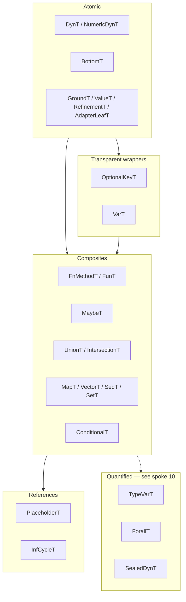

# The Type Domain

> *Snapshot of state as of 2026-05-05.*

The Type domain is Skeptic's internal language of types — the
representation every later phase of the pipeline reasons about. This
spoke catalogues the 24 record kinds, explains their families and
the rules they collectively enforce, and walks the eight kinds the
reader will encounter on every nontrivial Skeptic run.

## Prerequisites

[Spoke 01 (Pipeline Tour)](01-pipeline-tour.md) — you know that
admission produces Types and that everything downstream consumes
them. [Spoke 02 (Three Domains)](02-three-domains.md) — you know
why Type is internal and why Schema and MalliSpec are external.
Comfort with `defrecord`, Clojure's `instance?` checks, and
Clojure protocols. If any of these are unfamiliar, the
[hub README's reading paths](README.md#reading-paths) point to
the right earlier reading.

## Where this fits

Third on the Contributor path. After this spoke, the reader can
read any function in the Type domain (`type-ops.clj`,
`type-algebra.clj`, the cast namespaces, the annotate sub-
namespaces) and recognize what each value is and what shape
operations on it would take. [Spoke 04](04-provenance.md) builds
on this by explaining how Provenance threads through every Type;
[spoke 05](05-admission-paths.md) shows how Types arrive in the
declaration dictionary.

## What a Type is

**This section teaches: what makes something a Type in Skeptic, and
what the universal contract on every Type record is.**

In Skeptic, a Type is a `defrecord` whose first field is `:prov`
(a `Provenance` record — see [spoke 04](04-provenance.md)) and
whose remaining fields encode the type's shape. The records are
defined in `skeptic/analysis/types.clj`. Three rules apply
without exception:

1. **`:prov` is field 1, always.** Every positional constructor —
   `at/->DynT`, `at/->GroundT`, `at/->FunT`, … — takes provenance
   first. The arrow constructors are *strict*: each one calls
   `ensure-prov!` and throws `IllegalArgumentException` if `prov`
   is `nil`. There is no `prov/unknown` sentinel; a Type without
   a real provenance does not exist in Skeptic.
2. **Every Type extends `proto/SemanticType`.** This is a *tag
   protocol* — it carries one method, `semantic-tag`, which
   returns the per-record namespaced keyword tag (e.g.
   `:skeptic.analysis.types/ground-type`). The protocol marker
   distinguishes Type records from arbitrary maps; the tag
   keyword identifies which kind without protocol dispatch when
   that's awkward (display, JSON serialization).
3. **Equality is shape-only via `at/type=?`.** Defrecord `=`
   compares `:prov` too, which would distinguish two structurally
   identical Types from different sources. `at/type=?` strips
   `:prov` recursively. The cast engine's leaf comparison, the
   union deduplicator, and any test asserting "this Type equals
   that Type" all use `at/type=?`. Plain `=` is a bug-magnet here.

Two universal predicates round out the contract.
`at/semantic-type-value?` tests whether a value is *some* Type;
the per-kind predicates (`at/dyn-type?`, `at/ground-type?`, …)
test whether it is the specific kind. They are `instance?`
checks, so they are cheap.

## The 24 Type kinds

**This section teaches: the full catalogue of Type kinds, grouped
by family. The reader does not memorize all 24, but does
recognize each on sight.**

The 24 records group into six families. Each row gives the
constructor name, the record's positional fields after `:prov`,
and what the kind represents.

| Family       | Constructor          | Fields after `:prov`            | Represents                                                          |
|--------------|----------------------|---------------------------------|---------------------------------------------------------------------|
| Dynamic      | `->DynT`             | (none)                          | The gradual `?`; cast to it always succeeds.                        |
| Dynamic      | `->NumericDynT`      | (none)                          | A "some number" sub-Dyn that overlaps every numeric ground.         |
| Empty        | `->BottomT`          | (none)                          | The empty type; cast from it always succeeds (vacuous).             |
| Leaves       | `->GroundT`          | `ground display-form`           | A primitive named type (`Int`, `Str`, `Keyword`, `Bool`, …).        |
| Leaves       | `->ValueT`           | `inner value`                   | A specific value of a specific inner Type.                          |
| Leaves       | `->RefinementT`      | `base display-form accepts? adapter-data` | A value of `base` that also satisfies a runtime predicate.          |
| Leaves       | `->AdapterLeafT`     | `adapter display-form accepts? adapter-data` | A leaf wrapping an opaque schema/predicate adapter.                 |
| Wrappers     | `->OptionalKeyT`     | `inner`                         | Marks a map key as optional; transparent for cast.                  |
| Wrappers     | `->VarT`             | `inner`                         | Reference to a declared symbol's Type; transparent for cast.        |
| Function     | `->FnMethodT`        | `inputs output min-arity variadic? names` | One arity of a function: input list, output, arity descriptor.      |
| Function     | `->FunT`             | `methods`                       | A function — a collection of `FnMethodT`s, one per arity.           |
| Composites   | `->MaybeT`           | `inner`                         | `inner` or `nil`; cast splits into nil-case and inner-case.         |
| Composites   | `->UnionT`           | `members`                       | A type whose inhabitants are alternatives; deduplicated by shape.   |
| Composites   | `->IntersectionT`    | `members`                       | A type whose inhabitants satisfy every member.                      |
| Composites   | `->MapT`             | `entries`                       | A map type; entries are `key-Type → value-Type`.                    |
| Composites   | `->VectorT`          | `items tail`                    | A vector with optional tuple-prefix `items` plus an element `tail`. |
| Composites   | `->SetT`             | `members homogeneous?`          | A set; `homogeneous?` distinguishes `#{Int}` from a tuple-set.      |
| Composites   | `->SeqT`             | `items tail`                    | Like `VectorT` but for a `seq` value.                               |
| Conditional  | `->ConditionalT`     | `branches`                      | A type that depends on which branch of a discriminator was taken.   |
| References   | `->PlaceholderT`     | `ref`                           | A placeholder used during recursive admission.                      |
| References   | `->InfCycleT`        | `ref`                           | A guarded marker for self-referential schemas.                      |
| Quantified   | `->TypeVarT`         | `name`                          | A bound type variable inside a `ForallT` body.                      |
| Quantified   | `->ForallT`          | `binder body`                   | `forall X. T` — a polymorphic type.                                 |
| Quantified   | `->SealedDynT`       | `ground`                        | A value of an abstract type variable cast into Dyn; tamper-protected. |

The 24 kinds aren't a flat list of unrelated shapes — they're
grouped because their roles in the system are grouped. The leaves
are atomic; the wrappers add metadata without changing identity;
the composites build structure from inner Types; the function
family describes callable values; the conditional family is
discriminator-aware; the references break recursion; the
quantified kinds appear only at the polymorphic boundary.

The cast engine ([spoke 09](09-cast-dispatch.md)) dispatches on
these families, not on individual record kinds. A "structural
collection rule" is one rule that applies to vector, seq, set;
a "wrapper rule" applies to OptionalKey and Var equally. The
families are the unit of dispatch design.

## The eight you'll see most

**This section teaches: the eight kinds that account for nearly
every Type in any real Skeptic run, with a tiny worked-example
value for each.**

These eight are the kinds you'll recognize first when reading
unfamiliar Skeptic code. Each subsection gives the constructor
signature plus a concrete example drawn from `classify` or
`double-or-zero`.

### `GroundT` — primitive named types

```clojure
(at/->GroundT prov ground display-form)
```

`ground` is a small keyword (`:int`, `:str`, `:keyword`, `:bool`,
`:symbol`) or a class descriptor (`{:class some-class}`);
`display-form` is the Clojure-side display name (`'Int`, `'Str`,
`'Keyword`, …). Every primitive admitted from a Plumatic schema
or a Malli leaf becomes a `GroundT`. Two `GroundT`s overlap if
their `:ground` tags match, which is the leaf compatibility
relation the cast engine uses.

The declared output of `classify` is `GroundT prov :keyword
'Keyword`. `Int` and `Keyword` are *disjoint* under leaf overlap,
which is why `classify`'s output cast against `GroundT Str`
fails: the source's `:str` ground doesn't overlap the target's
`:keyword`.

### `MaybeT` — `T` or `nil`

```clojure
(at/->MaybeT prov inner)
```

`MaybeT` represents a value that can be `nil`. It comes from
`(s/maybe X)`, `[:maybe X]`, optional-key map *values*, and
unions that include `nil`. `double-or-zero`'s declared argument
is `MaybeT[GroundT Int]`. The cast engine treats `MaybeT`
specially: a cast from `MaybeT[T]` to a non-nil target splits
into the nil case (does the target accept `nil`?) and the inner
case (recursive cast of `T`); a cast from any source to a
`MaybeT[T]` target succeeds for `nil`-valued sources and recurses
for the rest.

This split is what makes flow-sensitive narrowing
([spoke 08](08-narrowing-and-origins.md)) productive: the
narrowing test (`(some? n)`) tells the cast engine, on the
then-branch, that the `MaybeT` has been refined to its inner
Type.

### `UnionT` — alternatives

```clojure
(at/->UnionT prov members)
```

`UnionT` represents a value whose Type is one of `members`.
Construction goes through helpers in `type-ops.clj` that
deduplicate by shape (using `at/type=?`) and short-circuit
single-member unions back to the single Type. So `UnionT[Int,
Int]` becomes `UnionT[Int]` becomes just `Int`. The members
order is preserved; deduplication keeps the first occurrence.

`classify`'s body, before any cast, is roughly
`UnionT[ValueT(:zero) : Keyword, ValueT(:even) : Keyword,
GroundT Str]` — three leaf alternatives joined from the `cond`'s
three arms. A cast against a target with a `UnionT` source
recurses on each member; if any member fails, the union fails
([spoke 09](09-cast-dispatch.md)).

### `MapT` — keyed maps

```clojure
(at/->MapT prov entries)  ; entries: map of key-Type → value-Type
```

`MapT` represents a Clojure map with declared key and value
Types. `entries` is itself a map, with both keys and values
being Types. Two flavours of entry coexist:

- **Exact-key entries.** Key is a `ValueT` carrying a literal
  keyword or string. The map value is the value-Type for *that*
  key.
- **Broad-key entries.** Key is a more general Type
  (`GroundT Keyword`, `UnionT[GroundT Str, GroundT Keyword]`,
  …). The map value is the value-Type for *any* key in that
  domain.

The cast engine matches entries by key compatibility. A target's
exact-key entry checks against a source's exact-key entry of the
same key (or against a source's domain entry whose key-domain
covers the exact key); a target's domain entry checks against
source domain entries whose key-domains it covers. The full
matching algebra is in [spoke 09](09-cast-dispatch.md).

### `FunT` (with `FnMethodT`) — functions

```clojure
(at/->FunT prov methods)                 ; methods: vector of FnMethodT
(at/->FnMethodT prov inputs output min-arity variadic? names)
```

A `FunT` carries a *vector* of `FnMethodT`s, one per arity. Each
`FnMethodT` records its input list (`inputs`, a vector of
Types), its output (`output`, a single Type), the smallest
accepted arity (`min-arity`), whether the method is variadic
(`variadic?`), and the parameter names (`names`, one symbol
per input — used for diagnostic messages).

`classify`'s declared Type is `FunT[FnMethodT[GroundT Int →
GroundT Keyword]]` — one `FnMethodT`, fixed arity 1, one
input. `clojure.core/+` admits to a `FunT` with several
`FnMethodT`s (zero-arity, unary, binary, variadic), and
`at/select-method` picks the right one for a given call site
based on its arity.

### `ValueT` — singleton-valued leaves

```clojure
(at/->ValueT prov inner value)
```

`ValueT` represents a *specific* value of a *specific* inner
Type. The keyword literal `:zero` annotates as `ValueT prov
(GroundT prov :keyword 'Keyword) :zero`. Two `ValueT`s are
shape-equal iff both their inner Types and their value fields
are equal.

`ValueT`s are how Skeptic recognizes that `(if (zero? n) :zero
…)` returns a keyword *specifically equal to* `:zero`, which
matters for closed-sum exhaustiveness
([spoke 07](07-closed-sum-exhaustiveness.md)). Without
`ValueT`, a `case`'s arms would all annotate as `GroundT
Keyword` and exhaustiveness would never fire.

### `ConditionalT` — branch-discriminated types

```clojure
(at/->ConditionalT prov branches)
;; each branch: [predicate type discriminator]
```

`ConditionalT` represents "the type of this value depends on
which branch was taken." Each branch is a triple of a predicate
form, the type produced when that predicate held, and a
*discriminator* — a description of which observable was tested.

`ConditionalT` is built during annotation when an `if` produces
a value whose Type differs across arms and the test is a
recognizable predicate on a single observable. The discriminator
slot starts as `nil` and is *back-filled* by a second pass over
the dictionary (`enrich-conditional-type` in
`skeptic/checking/pipeline.clj`) once accessor summaries from
every namespace are available.

The cast engine treats `ConditionalT` similarly to `UnionT` for
casting (every branch's type must fit, source-side; some
branch's type must fit, target-side) but preserves the
discriminator information for narrowing. See the in-depth
section below for the back-fill rationale.

### `SealedDynT` — sealed dynamic values

```clojure
(at/->SealedDynT prov ground)
```

`SealedDynT` is the runtime artefact of casting a value of an
abstract type variable into Dyn. It carries the original
`TypeVarT` as `ground` and is *tamper-protected*: inspecting it
via predicates (the cast-time analogue of `is`-like operations)
raises `:is-tamper`; smuggling it across the binder's scope (so
the seal would outlive its meaning) raises `:nu-tamper`.

Sealed values appear only when the cast engine traverses
quantified types — an admitted `forall` flowing through
generalize/instantiate ([spoke 10](10-blame-for-all-and-projection.md)).
Annotation never produces them; that's the first-order
invariant from [spoke 06](06-annotation-pass.md).

## Composite Types and their anchors

**This section teaches: the rule that combinators which build a
composite Type from its parts must be told which provenance the
composite carries — and why "derive it from the items" is wrong.**

Many places in Skeptic build a *composite* Type from constituent
Types: a `UnionT` from arm Types, a `MapT` from entries, an
`IntersectionT` from members, a joined output Type from method
candidates. The composite is itself a Type; it has its own
`:prov`. The rule is **container-owns-identity**: when a
combinator joins or merges existing Types into a new composite,
the result carries an *anchor provenance* supplied by the
caller — the container's own prov — not a provenance derived
from the items.

The reasoning is that the composite is a new artifact whose
*location of origin* is the call site doing the building, not
any of the items it joined. A union built at one call site that
happens to have the same members as a union built elsewhere is
still a different composite; rendering, blame, and finding
attribution all key on the composite's own prov.

Combinators that build composites take an explicit anchor first
parameter. Examples:

- `av/join anchor-prov types` — joins typed arms (e.g., the
  `then` and `else` arms of an `if`) into a composite Type.
- `amo/merge-map-types anchor-prov types` — merges multiple
  inferred map Types into one.
- `amoa/merge-types anchor-prov types` — generic merge for
  collection-shaped composites.
- `coll/concat-output-type anchor-prov args` — output joiner
  for variadic-style functions.

The contributor adding a new composite-building helper has to
*pass an explicit anchor* through. The temptation to skip the
parameter — "I'll just use the first item's prov" — leads to
findings whose `:source` mis-attributes the cast: a finding on
a composite mistakenly looks like it came from one of the
items. The combinator-anchor rule is what keeps blame
attribution faithful.

[Spoke 04](04-provenance.md) explains the rank-based merge
that decides between a composite's own anchor prov and the prov
of the *blamed item* on findings; this spoke just establishes
the rule that the composite itself owns an anchor.

## NumericDyn — the half-known numeric

**This section teaches: what `NumericDynT` is, why it exists as a
distinct kind, and how it interacts with the cast engine's leaf
comparison.**

`NumericDynT` is "some kind of number" — a sub-`Dyn` that overlaps
every numeric ground (`Int`, `Long`, `Double`, …) but commits to
none of them. It admits from `s/Num`, from `java.lang.Number`,
and from numeric-shaped Malli leaves. The native admissions for
`clojure.core/*`, `clojure.core/+`, `clojure.core/-`, etc., use
`NumericDynT` as their input and output Types.

Without `NumericDynT`, `(* 2 n)` where `n` is `Int` would either
have to type-check at full `Dyn` (losing every guarantee) or
force a commitment to `Int`, which is wrong (`*` returns
something — a Long, a BigInt, a Double, depending on inputs).
`NumericDynT` is the cast-engine's escape hatch: a leaf that
says "I'm a number, but I'm not committing further."

The leaf-overlap relation in the cast engine treats
`NumericDynT` as overlapping any numeric ground in either
direction:

- `GroundT Int` against `NumericDynT` target: passes.
- `NumericDynT` against `GroundT Int` target: passes.
- `GroundT Str` against `NumericDynT`: fails (Str isn't numeric).

This means `(* 2 n)` in `double-or-zero` casts cleanly even
though `n`'s declared Type is `Int` and `*`'s declared input is
`NumericDynT`. The *output* of `*` is also `NumericDynT`, which
flows back into the surrounding cast. When `double-or-zero`'s
declared output is `Int`, the joined body Type is
`UnionT[NumericDynT, ValueT(0)]`, and `NumericDynT` overlaps
`Int` so the cast succeeds.

A contributor might wonder: shouldn't the body Type be tightened
to `Int` after seeing the `(* 2 n)` arm of an `Int → Int`
function? The answer is *no, not at this layer*. The cast
engine reasons about leaf overlap at admission-declared
granularity; it does not back-propagate type narrowings into
inferred Types. Skeptic's approach is to admit the user's
declared types as authoritative and to check that the body's
*inferred* type fits — and `NumericDynT` lets `(* 2 n)` carry
the precision it has without overclaiming.

## Transparent wrappers — `OptionalKeyT` and `VarT`

**This section teaches: why two Type kinds carry no semantic
content of their own, and how the cast engine peels them.**

`OptionalKeyT` and `VarT` are *transparent wrappers*. Their job
is to carry metadata about a Type — that this map key is
optional, that this Type is the inner of a referenced var —
without contributing to the Type's *semantic* content.

The cast engine peels them: the wrapper-rule clause in
`dispatch-cast` ([spoke 09](09-cast-dispatch.md)) unwraps the
inner and recurses. The wrappers exist because admission needs
to remember the wrapping (the Schema collector saw an
`(s/optional-key :k)`, and the rendering layer should remember
that fact for diagnostic messages), but the cast itself is
about the inner.

A consequence: a contributor adding a new wrapper-shaped Type
kind should think hard about whether the kind is genuinely
needed or whether the metadata could ride on `:prov` or on a
sibling map. Adding a wrapper means adding a `dispatch-cast`
clause, a render branch, an equality leg, and an `at/type=?`
case — five places to keep in sync.

## Sealed-Dyn and Forall — named here, explained in 10

**This section teaches: the two Type kinds the reader will see
named in cast traces but should not try to fully understand
without crossing to spoke 10.**

`ForallT` represents `forall X. T` — a polymorphic type. It
admits from explicit user-supplied type-overrides that contain
type variables; future Malli admission may produce them. It
carries a `binder` (the type variable's name) and a `body` (a
Type that may reference the binder via `TypeVarT`).

`SealedDynT` is a runtime artifact only. It appears under cast
when a value is cast across a quantified boundary into Dyn; the
seal preserves the binder's identity so it can be discharged on
the way back out.

Both are named here for completeness but their *semantics* —
when they fire, what casting them does, how they interact with
the seal/collapse machinery — belongs to
[spoke 10](10-blame-for-all-and-projection.md). The first-order
invariant ([spoke 06](06-annotation-pass.md)) tells you: these
two never appear in the output of annotation. They enter only
through admission or through the cast engine's own quantified
rules.

*Figure: Type families and how they relate. Leaves and dynamics
are atomic; wrappers add metadata; composites build structure;
references break recursion; quantified kinds appear only at
the polymorphic boundary.*



### In-depth: ConditionalT and the discriminator back-fill

***Skip if reading the Gist path.***

A contributor who wonders why `ConditionalT` has a discriminator
slot at all — and why that slot starts `nil` and gets back-
filled later — needs the project-wide-pass story.

A `ConditionalT` branch is a triple `[predicate type
discriminator]`. The first two positions are filled during
ordinary annotation: when an `if` produces a value whose Type
differs across arms, each arm contributes `[predicate type
nil]`. The third position is filled by `enrich-conditional-type`
in `skeptic/checking/pipeline.clj`, which runs as a *second
pass* over the merged dictionary after admission completes for
the whole project.

The discriminator captures *what observable* the predicate was
testing — a local, a map-key lookup, a class test, a project-
wide accessor summary's classification result. The
back-fill consults the project-wide accessor summaries
(collected during phase 2 of the pipeline tour) to identify
when a predicate is *actually* testing one of those summaries'
recognized observables; that match is what makes a
`ConditionalT` narrowable downstream
([spoke 08](08-narrowing-and-origins.md)).

Why the back-fill rather than filling the discriminator during
annotation? Because accessor summaries are a project-wide
property: a `(:k m)` lookup against a map whose `:k` value is
declared in another namespace can only be classified after that
namespace's declarations are admitted. If annotation tried to
fill the discriminator immediately, every cross-namespace
classifier predicate would silently fail to be recognized.

The cost is one extra pass over the dictionary; the benefit is
that conditional narrowing works across namespaces without
ordering constraints on admission. The contributor adding new
predicates to the recognized-classifier set should expect them
to fire only after this pass — i.e., during checking, not
during annotation.

### In-depth: why deduplication uses shape rather than value

***Skip if reading the Gist path.***

`at/dedup-types` deduplicates a sequence of Types by *shape*,
preserving the first occurrence of each shape. Concretely:

```clojure
(at/dedup-types [(at/->GroundT prov-a :int 'Int)
                 (at/->GroundT prov-b :int 'Int)
                 (at/->GroundT prov-c :str 'Str)])
;; => #{(at/->GroundT prov-a :int 'Int)  ; first :int kept; prov from prov-a
;;     (at/->GroundT prov-c :str 'Str)}
```

The two `:int` Types are deduplicated even though their `:prov`
fields differ. Construction of `UnionT` runs through this dedup,
which is why `UnionT[Int, Int, Str]` collapses to
`UnionT[Int, Str]` and why `UnionT[T]` collapses to `T`.

The contributor question is: *why dedupe by shape rather than by
value-equality?* The answer is bounded cost.

If dedup ran on value-equality, two `GroundT Int` Types from
different sources (one from a Plumatic schema, one from a
native admission) would count as distinct members of a union.
A `clojure.core/+` call returning `Int` mixed with a user-
declared `Int` would produce `UnionT[GroundT Int(:native),
GroundT Int(:schema)]` — semantically wrong (one Int) and
inflating cast costs proportionally to the number of admission
sources.

Dedup-by-shape avoids that: a `UnionT` of multi-source
inhabitants of the same shape is one member, with `:prov`
preserved from the first occurrence. The casting layer
operates on shape only (via `at/type=?`) and is unaffected.
The rendering layer reads `:prov` for `:source` attribution
and gets one source per blame — the *first* source.

A subtle consequence: the order of construction of a union
matters for `:source` attribution but not for cast verdicts. If
a contributor wants a particular source to attach, they
construct the union with that source's Type first.

## Marquee functions

| Function                  | File                              | Role                                                                |
|---------------------------|-----------------------------------|---------------------------------------------------------------------|
| `at/->MaybeT`             | `skeptic/analysis/types.clj`      | Representative constructor; signature shows the prov-first pattern. |
| `at/type=?`               | `skeptic/analysis/types.clj`      | Provenance-stripping equality.                                      |
| `at/dedup-types`          | `skeptic/analysis/types.clj`      | Shape-based deduplicator over a sequence of Types.                  |
| `at/select-method`        | `skeptic/analysis/types.clj`      | Picks the matching `FnMethodT` for a call's arity.                  |
| `at/semantic-type-value?` | `skeptic/analysis/types.clj`      | Universal "is this a Type?" predicate.                              |
| `ato/normalize`           | `skeptic/analysis/type_ops.clj`   | Canonical form before dispatch / equality / display.                |

## Worked example here

`classify`'s body, fully annotated, is roughly:

```text
UnionT[ValueT(:zero) : GroundT Keyword,
       ValueT(:even) : GroundT Keyword,
       GroundT Str]
```

Three leaves: two `ValueT`s wrapping the literal keywords
`:zero` and `:even`, and one `GroundT Str` from the `:else`
arm. The declared output is `GroundT Keyword`. Casting the
union against the keyword fails on the third member because
`:str` and `:keyword` ground tags don't overlap
([spoke 09](09-cast-dispatch.md)).

`double-or-zero`'s declared argument is `MaybeT[GroundT Int]`.
Inside the then-branch (after narrowing in
[spoke 08](08-narrowing-and-origins.md)) it becomes
`GroundT Int`; the body is `(* 2 n)`, which casts cleanly
(`GroundT Int` overlaps `NumericDynT`). The output cast against
the declared `GroundT Int` succeeds.

## Glossary terms introduced

- Type domain (full)
- Type kind / Type record
- Family (atomic / wrapper / composite / reference / quantified)
- Anchor provenance (combinator rule)
- Foldable source — see also [spoke 02](02-three-domains.md)
- Transparent wrapper
- NumericDyn
- ConditionalT (introduced; semantics deepened in spoke 07)
- ValueT
- Sealed-Dyn (named; semantics in spoke 10)
- Forall (named; semantics in spoke 10)

## Where to next

- **Continue (Contributor path):** [Provenance (04)](04-provenance.md)
- **Continue (Gist path):** [Cast Dispatch (09)](09-cast-dispatch.md) — marquee only
- **Return:** [Hub](README.md)
