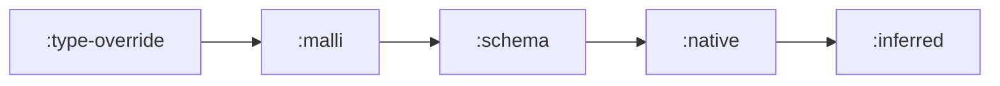

# Provenance

The reader now recognizes Type shapes. The next question is attribution: when a
Type participates in a finding, how does Skeptic remember where that expectation
or inference came from?

> **Snapshot:** state of Skeptic as of 2026-05-06.

## Prerequisites

[Type Domain (C04)](03-type-domain.md). You should be comfortable reading a Type
as a value with fields. This spoke explains the `:prov` field that appears on
every semantic Type.

## Where this fits

Fourth on the Contributor path. [Admission Paths](05-admission-paths.md) uses
provenance to explain declaration sources. [Blame for All and Projection](10-blame-for-all-and-projection.md)
uses it again when cast failures become findings.

## Every Type Carries Provenance

Provenance is Skeptic's answer to a reader's natural debugging question: "why is
this Type here?" A Provenance value records a named source such as `:schema` or
`:inferred`, plus optional symbol and namespace context.

For the worked example, the declared output of `classify` has `:schema`
provenance because it came from `:- s/Keyword`. The body Type has `:inferred`
provenance because annotation produced it from code. When those meet in a cast,
Skeptic can report both the mismatch and where the expectation came from.

This prevents a common reading mistake. The Type shape answers "what kind of
value?" Provenance answers "according to which source?" A Keyword target with
Schema provenance and a Keyword target with native provenance have the same
semantic shape but different explanatory histories.

## The Five Sources

| Source | What creates it | Where the reader sees it |
|---|---|---|
| `:type-override` | `.skeptic/config.edn` or expression metadata override. | Explicit user replacement of a Type. |
| `:malli` | Malli metadata admission. | Declarations admitted from Malli forms. |
| `:schema` | Plumatic Schema admission. | Most declared function expectations. |
| `:native` | Built-in descriptors for known functions. | Calls to known `clojure.core` functions. |
| `:inferred` | Annotation of source code. | Actual Types produced by expressions. |

The sources are ranked in that order. Lower rank wins when provenance values
must be merged, so explicit declarations keep their identity when they meet
inferred values.

*Figure: provenance sources from most explicit to inferred.*



## Composite Values Need Their Own Origin

A reader who has just seen `UnionT` and `MaybeT` may expect a composite Type to
derive all identity from its members. That is not enough. The union produced by
an expression is itself an inferred expression result, even if some alternatives
came from declared or native knowledge. The container has a provenance of its
own, and the contained Types keep theirs.

This is most visible in diagnostics. A failure can talk about the root cast while
also carrying detailed leaves. Provenance lets those levels stay distinct.

For example, a union produced by a `cond` expression may contain alternatives
whose values are exact keywords and strings. The union itself is inferred from
the expression. If one branch later fails against a declared target, the report
can still distinguish the inferred actual branch from the declared expected
contract.

## Provenance And Findings

A finding is not just "actual did not fit expected." It is also "this mismatch is
attached to this source of expectation." For `classify`, the expected output came
from Schema. That is why the user-facing finding can point back to a declared
return expectation rather than presenting the mismatch as an abstract Type fact.

The reader should carry this into the output spoke. When a JSONL record includes
a source-like field, that field is not guessed from file names or from the
printed Type. It is derived from provenance that has been carried through the
pipeline.

## When Provenance Merges

Provenance merging happens when multiple Type facts combine into a new fact:
unions of alternatives, joins of branch outputs, merged declarations, and
structural summaries. The ranking keeps more explicit sources from being washed
out by inferred ones. That is why a declared contract can remain the visible
source of an expectation even after the checker has passed it through several
internal structures.

The reader does not need to memorize every merge site. The diagnostic habit is
enough: if a Type has the wrong source, look for the place where two Type facts
became one.

## Following A Type's Story

Take the failed branch in `classify`. The literal `"odd"` is inferred from source
code, so its Type starts with inferred provenance. The declared return target was
admitted from Schema, so it starts with Schema provenance. The cast compares the
two. Projection can then say both things at once: the actual value came from the
body, and the violated expectation came from the declaration.

That dual story is why provenance is introduced before admission details. Once
the reader sees a declaration source and an inferred source meet, later merge and
output behavior has an explanation. Without provenance, every Type display would
look like an isolated shape.

## Debugging With Provenance

When a finding feels attached to the wrong source, do not start with rendering.
Ask which Type became the target, which Type became the actual, and where their
provenance values were created or merged. Rendering can only show the story that
the earlier phases preserved.

For the contributor, this is often the shortest path to the bug. If a Type has
the right shape but wrong source, changing cast compatibility will not help. The
shape and the attribution are separate facts.

### In-depth: Analyzer Context Provenance

***Skip if reading the Gist path.***

During annotation, inferred Types need a current provenance without each
annotator manually rebuilding it. The analyzer context carries that current
Provenance; helper functions read it when constructing inferred Types. The reader
does not need the key name. The important shape is: context enters the recursive
annotation walk, and every Type produced by that walk can say "I was inferred
here."

## Worked Example Here

`classify` sets up the central contrast:

```clojure
;; declared expectation: :schema provenance
:- s/Keyword

;; inferred actual: :inferred provenance
:else "odd"
```

That contrast is what later lets the cast and output spokes explain why the
finding is tied to the declared return.

## Source Pointers

- `skeptic/provenance.clj:make-provenance` - canonical constructor.
- `skeptic/provenance.clj:of` - reads provenance from a Type.
- `skeptic/provenance.clj:source` - reads the source keyword.
- `skeptic/provenance.clj:with-ctx` - retrieves annotation-context provenance.
- `skeptic/provenance.clj:merge-provenances` - merges by source rank.

## Glossary Terms Introduced

- Provenance
- Source rank
- Inferred source

## Where To Next

- **Continue (Contributor path):** [Admission Paths](05-admission-paths.md)
- **Return:** [Hub](README.md)
