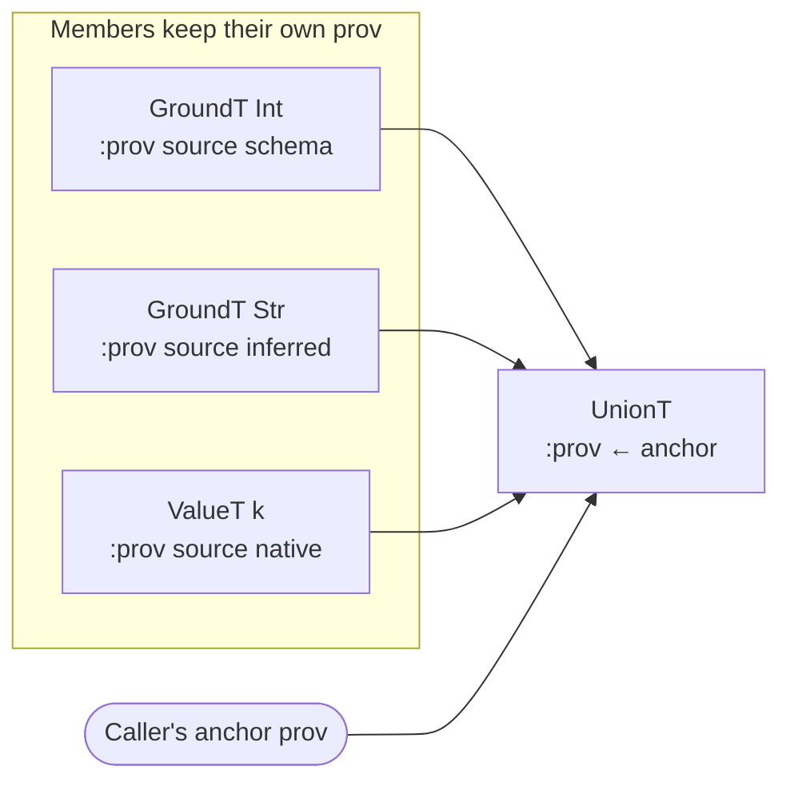

# Provenance

> *Snapshot of state as of 2026-05-05.*

Every Type carries a `:prov` field that records where the Type came
from. Provenance is what makes a finding's `:source` field meaningful,
what governs the rank-based merge that decides whose claim a cast was
checking, and what makes blame attribution faithful across composite
types. This spoke fixes the contract.

## Prerequisites

[Spoke 03 (Type Domain)](03-type-domain.md). You know that every Type
record has `:prov` as its first field, that the constructors are
`:prov`-first, and that two Types can be shape-equal while having
different `:prov`. Comfort with the idea that a value can carry
metadata about where it came from.

## Where this fits

Fourth on the Contributor path. Provenance feeds two places that
matter for the rest of the walkthrough: it makes the `:source` field
on a finding meaningful (rendered in
[spoke 11](11-user-facing-surfaces.md)), and it governs the rank-based
merge at admission and at cast-result construction
([spokes 05](05-admission-paths.md) and
[09](09-cast-dispatch.md)).
[Spoke 05](05-admission-paths.md) builds on this by showing how each
admission path stamps its source onto the Types it produces.

## Every Type carries `:prov`

**This section teaches: that there is no Type without a Provenance,
and *why* this strictness is non-negotiable.**

Every Type record's first field is `:prov`. Every positional
constructor — `at/->GroundT`, `at/->MapT`, `at/->FunT`,
`at/->FnMethodT`, `at/->MaybeT`, `at/->UnionT`, all 24 of them — takes
a `Provenance` as its first argument. The constructors are *strict*:
each calls an internal `ensure-prov!` that throws
`IllegalArgumentException` if `prov` is `nil`. There is no Type
record without a `:prov`, and there is no `prov/unknown` sentinel for
"I'd rather not say."

The reader `prov/of` enforces the same contract from the other
direction: it throws if you pass it a value that isn't a Type *or* a
Type whose `:prov` is missing. The two strictness checks together
mean a contributor cannot accidentally produce or consume a
provenance-less Type without an exception firing at the offending
line.

Why no sentinel? Because a sentinel is corrosive. The first time a
sentinel exists, the second time someone constructs a Type they
"don't have a real prov for," they reach for it. By the third
quarter, half of the dict's Types carry the sentinel and the
finding renderer has to handle it as a special case. Skeptic's
predecessor design carried a `prov/unknown` for exactly this
reason; it was removed because it was making blame attribution
nondeterministic and was masking real construction-site bugs. The
strict constructors are the antibody.

A `Provenance` is a small record with five fields:

```clojure
(prov/make-provenance
  source         ; one of the five named sources (see below)
  qualified-sym  ; the symbol the value came from, if any
  declared-in    ; the namespace the declaration lived in
  var-meta       ; original metadata, when relevant
  refs)          ; cross-references for display
```

The 4-arg `make-provenance` defaults `refs` to `[]`. `with-refs`
exists for the case where a combinator constructs a composite and
needs to thread constituent provs into the new prov's `:refs` for
display.

## The five named sources

**This section teaches: what each `:source` value tells you about
how a Type entered the system, and why the renderer can read it as
a statement of responsibility.**

Every `Provenance`'s `:source` is one of exactly five values. They
are not arbitrary tags; each names a *responsibility-bearing*
admission path. The renderer's `[source: …]` line on a finding is
literally this keyword.

**`:schema`** — the Type was admitted from a Plumatic Schema. Created
by `skeptic.analysis.bridge/schema->type` and the helpers it calls.
This is the dominant source in most projects: every `:- s/Int`
annotation, every `(s/defschema MyType …)` reference, every map
schema in user code becomes a Type with this source. When a finding
is `[source: schema]`, the user's claim that the value should fit a
Plumatic schema was the constraint Skeptic was checking.

**`:malli`** — the Type was admitted from a `:malli/schema`
metadata value. Created by
`skeptic.analysis.malli-spec.bridge/malli-spec->type`. Currently
narrower than `:schema` (Skeptic's Malli admission only recognizes
a subset of Malli forms — see
[spoke 02](02-three-domains.md)) but the same flavour: a user
declaration the Type instantiates.

**`:native`** — the Type was admitted from a built-in Skeptic
descriptor. Created by `skeptic.analysis.native-fns/static-call-native-info`
and friends. The native dict covers `clojure.core` arithmetic and
collection functions whose Plumatic schemas are not always
informative — `*`, `+`, `get`, `assoc`, `conj`, etc. A
`[source: native]` finding tells the user the constraint came from
Skeptic's built-in knowledge, not from any user declaration.

**`:type-override`** — the Type was admitted from a
`:type-overrides` entry in `.skeptic/config.edn`, or from a
`^{:skeptic/type T}` metadata expression on user code. Created by
`skeptic.config` and consumed by `skeptic.typed-decls` (and by
`apply-type-override` in the annotation pass). A `[source:
type-override]` finding tells the user the constraint came from
their own override — usually a deliberate "I know this expression
returns X, type-check it against X."

**`:inferred`** — the Type was produced by the analyzer rather
than admitted. Created by `prov/inferred` (which takes a
`{:name … :ns …}` descriptor identifying the form's name and
namespace) and by the constructors in `skeptic.analysis.value` and
`skeptic.analysis.type-ops`. Every Type the annotation pass
attaches to a node carries `:inferred` provenance — the body of a
function, the result of a `(let …)`, the joined arms of an `if`.

The five values together form a *responsibility ladder*: the user
asked for it (`:type-override`), the user declared it (`:malli`,
`:schema`), the library knew about it (`:native`), or Skeptic
inferred it (`:inferred`). The rank function that decides who wins
in a merge is grounded in this ladder.

## Source rank and `merge-provenances`

**This section teaches: why merging two Provenances picks the
lower-rank source, and why the rank order is what it is.**

When two Types meet — at a union construction, at a cast result
root, at dict admission with a key collision — Skeptic computes a
single Provenance for the result via `prov/merge-provenances`. The
merge is governed by a total order over `:source` values:

| Source           | Rank |
|------------------|------|
| `:type-override` |  0   |
| `:malli`         |  1   |
| `:schema`        |  2   |
| `:native`        |  3   |
| `:inferred`      |  4   |

The *lower-rank source wins*. The intuition: explicit user intent
beats user declaration beats library declaration beats library
inference. A `:type-override` is the user telling Skeptic
explicitly to forget what it would otherwise compute; that beats
even a Plumatic-schema declaration. `:schema` and `:malli` are
declarations the user wrote; they beat both `:native` (the
library's built-in claims) and `:inferred` (whatever the analyzer
produced). `:native` is the library's knowledge; it beats only
`:inferred`. `:inferred` is the floor.

Two consequences worth internalizing.

First, **the rank determines who is responsible for a finding's
constraint.** When the cast root merges the source-side and
target-side provs, the lower-rank prov wins. A cast of inferred
source against schema target — the common case — yields a finding
with `:source :schema`, telling the user the constraint lives in
their declared schema. A cast of inferred source against native
target yields `:source :native`, telling the user the constraint
came from Skeptic's built-in knowledge of the function they
called.

Second, **ties favour `p1`.** The literal merge is
`(if (<= rank-p1 rank-p2) p1 p2)` — equal ranks return the first
argument. Callers that care about the order treat `p1` as the
"primary" or "container" prov, and `p2` as the "incoming" prov.
The cast machinery uses this to ensure the source-side prov wins
ties on cast roots, which is the right answer for blame
attribution: when source and target are both inferred, the one
the cast started from owns the merged prov.

A contributor question worth foreseeing: *why this particular
order? Could `:malli` and `:schema` swap?* The order encodes a
deliberate choice. `:type-override` at rank 0 is unambiguous —
overrides are intentional and rare. `:inferred` at rank 4 is also
unambiguous — inference is whatever the analyzer guessed and
defers to anything more explicit. The ordering of `:malli`,
`:schema`, `:native` between them reflects (a) Skeptic's primary
support for Plumatic, (b) the experimental status of Malli (so
its declarations beat library claims for the user-asked-for
ones), and (c) the role of `:native` as a *library* of
declarations rather than *user* declarations. Swapping `:schema`
and `:malli` would mean Plumatic claims took precedence over
Malli claims; that would surprise a user writing
`:malli/schema` and expecting it to govern.

## Combinator anchor provenance

**This section teaches: when a combinator builds a composite Type,
the result's `:prov` is supplied by the *caller* — and why.**

When a combinator builds a *composite* Type — a union of members,
an intersection, a merged map, a joined seq — the result carries
an **anchor provenance** supplied by the caller. Constituents
keep their own provs on themselves; the composite owns its own.

Concretely, the combinators that take an explicit anchor first
parameter:

| Combinator                                   | Anchor parameter | Builds                          |
|----------------------------------------------|------------------|---------------------------------|
| `av/join anchor-prov types`                  | first arg        | union from a sequence           |
| `amo/merge-map-types anchor-prov types`      | first arg        | merged `MapT`                   |
| `amoa/merge-types anchor-prov types`         | first arg        | shape-driven combination        |
| `coll/concat-output-type anchor-prov args`   | first arg        | `concat`-style output           |
| `ato/union-type anchor-prov types`           | first arg        | dedupped union (the workhorse)  |

Why anchor-from-caller and not anchor-derived-from-items?

Because a composite has its own *identity at the construction
site*. A union built at one analyzer node owns its location; it
doesn't inherit identity from the random mix of declared and
inferred members thrown into it. The combinator's job is to
compute the *shape* of the composite — what members, what
deduplication, what joining. The combinator's caller knows
*where the composite lives* in the analyzer's reasoning and
supplies the anchor.

The bug pattern this rule prevents: a union built from one
declared member and one inferred member would have ambiguous
provenance if the combinator picked one of them. Caller-supplied
anchor provenance is what makes a finding's `:source` faithful
to where the union *was constructed*, not to the accident of
which member was first.

A second pattern worth naming. Sometimes the caller doesn't know
which prov to use — it has none of its own and wants to derive
one from the items. The right move is to compute a fresh
Provenance via `composite-node-prov` (in
`skeptic/analysis/bridge.clj`) that records the children's
provs in `:refs` while keeping its own `:source` and
`:qualified-sym`. The wrong move is to grab the first item's
prov and treat the composite as if it came from that item; that
produces nondeterministic blame attribution depending on
construction order.

*Figure: A `UnionT` whose three members were admitted from
different sources; the composite's anchor provenance comes from
the caller, and each member's own prov is preserved on the
member.*



## The provenance map vs. the dict

**This section teaches: why admission produces *two* maps keyed by
qualified symbol, and what each is for.**

After admission ([spoke 05](05-admission-paths.md)), `namespace-dict`
in `skeptic/checking/pipeline.clj` returns *two* maps keyed by
qualified symbol:

- The **declaration dict** `{qualified-sym → Type}` — what the cast
  engine reads.
- The **provenance map** `{qualified-sym → Provenance}` — what the
  finding renderer reads.

The Type in the declaration dict already carries its own `:prov`
(it must — every Type does). So why a parallel map?

The answer is that the two maps record *different layers of the
same fact*. The provenance map records the *declaration-level*
origin: which file, which namespace, which `:source`. The Type's
own `:prov` records the *construction-level* origin of *that
particular Type record*, which can be the same as the declaration
prov or finer-grained. They agree at the dict's top level —
admission stamps both with the same source — and diverge only when
downstream code rebuilds a Type without re-fetching the dict
(which is rare and intentional, e.g., when the cast engine
constructs a fresh `SealedDynT` mid-cast).

For finding rendering, Skeptic reads the parallel map for the
declaration-level statement. For type reasoning, the cast engine
reads the Type's own `:prov` because the cast engine needs to know
about the *Type instance* in front of it, not the declaration
whence it came.

A subtlety: the parallel map is *not* a redundancy that could be
collapsed. The Type's own `:prov` evolves through composite
construction (a `UnionT` built from dict members has an anchor
prov that may be different from any of the members'), but the
declaration map remains stable across the run. The renderer wants
the stable, declaration-level fact for `[source: …]`; the cast
engine wants the construction-level fact for everything else.

## `apply-type-override` and the `^{:skeptic/type T}` machinery

**This section teaches: how the user's `^{:skeptic/type T}` metadata
gets converted into a Provenance with `:source :type-override` and
threaded through annotation.**

A user writing `^{:skeptic/type s/Int} (some-call-that-returns-any)`
asks Skeptic to treat the expression's value as `s/Int` rather
than whatever the analyzer would otherwise infer. The mechanism:

1. The annotation pass sees a node with `:skeptic/type` metadata.
2. `apply-type-override` (in `skeptic/analysis/annotate.clj`) reads
   the value, calls `schema->type` against it (overrides are
   Plumatic-shaped), and wraps the resulting Type with a
   Provenance whose `:source` is `:type-override`.
3. The wrapped Type replaces the inferred Type for that node.

The override's provenance carries `:source :type-override` rank 0,
which means subsequent merges (against any other source) keep the
override. This is exactly the right behaviour: the user said
"trust me on this one"; the merge mechanism doesn't second-guess.

The same machinery handles project-level `:type-overrides` from
`.skeptic/config.edn` — the entries are admitted at admission
time rather than at annotation time, but the `:source
:type-override` provenance rule is identical.

### In-depth: `with-ctx` and `prov/inferred` — how analyzer-time provenance is threaded

***Skip if reading the Gist path.***

A contributor adding a new annotation case (a new `:op` branch, a
new sub-namespace under `annotate/`) must construct Types for the
analyzer's nodes. Doing this without breaking the provenance
discipline requires understanding *how* analyzer-time provenance
is threaded.

Inside the analyzer, the Provenance for *inferred* values comes
from the analyzer's *ctx* — a map carried through every recursive
call. The pattern is:

```clojure
;; somewhere inside an annotator
(let [p (prov/with-ctx ctx)]
  (at/->GroundT p :int 'Int))
```

`prov/with-ctx` reads the ctx-bound Provenance (under a known
internal key) and returns it. New inferred Types use that
Provenance as their `:prov`, so every Type produced under that
ctx threads the analyzer's identity through the node.

The ctx Provenance is set when the analyzer enters a top-level
form. The setter is `prov/set-ctx ctx prov`, returning a new ctx
with the prov installed. The annotator's recursive runner threads
this enriched ctx into every sub-call, so the entire annotation
of a top-level form sees the same Provenance unless an inner case
explicitly rebinds it.

`prov/inferred` is a thin convenience that builds an
`:inferred`-source Provenance from a `{:name … :ns …}`
descriptor — typically the form's name and namespace, derived
from the source location. The annotator's entry point uses it to
produce the *initial* Provenance the ctx will carry; thereafter,
`with-ctx` reads it and inferred-Type construction uses it.

A second contributor question: *what about `apply-type-override`?
Does it use `with-ctx`?* No. The override is the user's claim, not
the analyzer's inference, so it produces its own
`:source :type-override` Provenance independent of the ctx. The
ctx-derived prov is for *inferred* Types only. Code that's
reaching for `with-ctx` to wrap an admission-derived Type has
made a mistake — the Type already has its own admission-time
prov, and overwriting it with `:inferred` would forget the
declaration.

The contract for new annotation code is therefore:

- Inferred Types (built from a node's value, not from a
  declaration): use `(prov/with-ctx ctx)` as the prov.
- Admission-derived Types (read from the dict, evaluated from a
  type-override): keep the prov they already have.
- Composite Types (built by joining inferred Types): pass an
  anchor prov to the combinator — typically the same
  `(prov/with-ctx ctx)` Provenance.

If a contributor reaches for a sentinel "inferred" prov outside
the ctx machinery, they have stepped outside the analyzer's
provenance discipline. There is no escape hatch.

### In-depth: the rank table and tie semantics

***Skip if reading the Gist path.***

A contributor designing a new admission source — or wondering
whether the order of `:malli` and `:schema` could be swapped —
benefits from understanding how the rank table is consulted and
what alternative tables Skeptic considered.

The literal merge function is two lines:

```clojure
(s/defn merge-provenances :- provs/Provenance
  [p1 p2]
  (if (<= (source-rank p1) (source-rank p2)) p1 p2))
```

`source-rank` is a lookup against the rank map, with a default of
999 for any source value not in the map. (No new source values
exist; the default is paranoia.) Three properties:

- **Total order.** Every comparison resolves; there is no "equal,
  tie-break unspecified" case. The `<=` makes ties favour `p1`.
- **Caller-supplied order matters.** A caller that passes
  `(merge-provenances p-source p-target)` will keep `p-source` on
  ties; reversing the order reverses the tie behaviour. This is
  by design — the cast machinery wants source-side wins on ties
  because the source is the value being checked.
- **No new ranks at runtime.** The rank table is a literal
  source-level map; no `register-source!` mechanism exists. New
  sources require code change.

The alternative designs Skeptic considered and rejected:

- **Equal-rank picks the older.** If two sources had the same
  rank, the merge could prefer the older Provenance (by reading
  a timestamp). This was rejected because timestamps are
  fragile, mock-able, and race-prone, and because it changed
  blame attribution between runs of the same code.
- **Equal-rank picks the *more specific* qualified-sym.** Same
  rank but one prov has a qualified-sym and the other has nil:
  prefer the one with the symbol. Plausible, but adds a second
  comparison axis the caller can't predict, and the cast machinery
  has no way to ensure the prov it cares about has a sym while
  the merger doesn't. Rejected for predictability.
- **Total-order over (source, qualified-sym).** Make the rank
  comparison stable across both axes. This was the closest
  alternative considered. The reason it was rejected: rank
  reflects *responsibility-source*, not symbol-specificity. A
  finding `[source: schema]` should be the same finding whether
  the symbol's name is `foo` or `bar`; mixing the axes muddles
  the message.

The current rule — pure source-rank, ties to `p1` — is the
simplest rule that maps cleanly onto the responsibility ladder.

A contributor adding a new source must (a) decide where it fits
in the rank table (the location is the rule), (b) update
`source-rank-map` and `Source` in `provenance/schema.clj`, (c)
update the `:type` field in the memory's `Source` schema if
applicable, and (d) audit every existing call site that hard-codes
"five named sources" in prose. Each new source is a real change to
the responsibility model.

## Marquee functions

| Function                 | File                       | Role                                                                  |
|--------------------------|----------------------------|-----------------------------------------------------------------------|
| `prov/make-provenance`   | `skeptic/provenance.clj`   | Canonical constructor with source assertion.                          |
| `prov/of`                | `skeptic/provenance.clj`   | Strict reader; throws if a Type lacks `:prov`.                        |
| `prov/source`            | `skeptic/provenance.clj`   | Reads the named source from a Provenance.                             |
| `prov/with-ctx`          | `skeptic/provenance.clj`   | Reads the analyzer-ctx provenance for inferred-Type construction.     |
| `prov/inferred`          | `skeptic/provenance.clj`   | Builds an `:inferred`-source Provenance from a `{:name :ns}` descriptor. |
| `prov/merge-provenances` | `skeptic/provenance.clj`   | Source-rank-based merge; lower rank wins; ties favour `p1`.           |

## Worked example here

`classify`'s declared output Type is `GroundT prov-schema :keyword
'Keyword`, where `prov-schema` carries `:source :schema` and
`:qualified-sym 'skeptic.walkthrough.example/classify`. The
inferred body Type is a `UnionT` whose `:prov` carries
`:source :inferred` (and a source-location reference to the cond
form).

When the cast root is built, `merge-provenances` reduces the
source and target's provs: `:schema` (rank 2) beats `:inferred`
(rank 4), so the cast root carries `:schema`. The eventual
finding's `:source` field is `schema`. That's why Skeptic reports
the failure as the schema-declared constraint: the responsibility
for the constraint lies with the declaration, not the inferred
body.

Compare with a hypothetical: had `classify` been declared with
`^{:skeptic/type s/Keyword}` rather than `:- s/Keyword`, the
target would carry `:source :type-override` (rank 0), still
beating `:inferred` (rank 4); the finding's `:source` would
be `type-override`. And had Skeptic *only* known about
`:keyword` from a native admission, the target would carry
`:source :native` (rank 3), still beating `:inferred`; the
finding's `:source` would be `native`.

## Glossary terms introduced

- Provenance (concept and record)
- Named source (the five values)
- Source rank
- Anchor (composite-prov rule)
- Provenance map (the parallel map)
- Tie semantics (p1-wins)

## Where to next

- **Continue (Contributor path):** [Admission Paths (05)](05-admission-paths.md)
- **Return:** [Hub](README.md)
