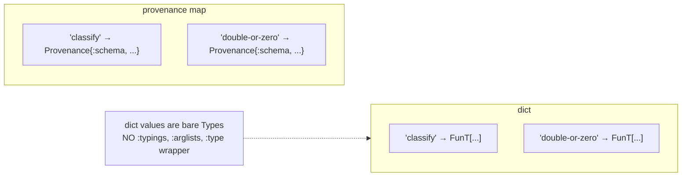

# Admission: Schema, Malli, Native, Override

> *Snapshot of state as of 2026-05-05.*

Admission is the boundary at which external schemas — Plumatic Schema,
Malli, native function descriptors, and `:type-overrides` config —
become Types in a single declaration dictionary. This spoke walks
each path and the merge rule, then shows the dict-after-admission
invariant.

## Prerequisites

[Spokes 02](02-three-domains.md), [03](03-type-domain.md), and
[04](04-provenance.md). Plumatic-Schema literacy at the level of "I
have used `s/defn` and `s/maybe` before."

## Where this fits

Fifth on the Contributor path. After this spoke, the reader can look
at any declared schema in a project and predict the Type that
admission produces. The next spoke ([06](06-annotation-pass.md))
shows what annotation does on top of that dict.

## What admission is

Admission is a one-shot pass per namespace that converts every
declared schema into a Type and stores them in a dictionary keyed by
qualified symbol. The pass also produces a parallel provenance map
(see [spoke 04](04-provenance.md)) and an `:ignore-body` set marking
functions whose bodies should not be checked.

The resulting dict is the only thing downstream phases consume.
There is no intermediate entry-map shape between admission and dict
insertion. Each value is a bare Type; no `:typings`, `:output-type`,
`:arglists`, `:accessor-summary`, or `:type` wrapper survives.

In Skeptic this work is dispatched per namespace by `namespace-dict`
in `skeptic/checking/pipeline.clj`. The pipeline's project-state pass
calls `namespace-dict` for each namespace, then merges the results
into a project-wide dict via `merge-type-dicts`.

*Figure: Four input lanes (Schema, Malli, Native, Override) merging into a per-namespace dict.*

```mermaid
flowchart LR
  schema[Schema collector<br/>schema.collect]
  malli[Malli collector<br/>malli-spec.collect]
  native[Native dict<br/>native-fns]
  override[(:type-overrides<br/>config)]

  schema --> bridge1[schema->type]
  malli  --> bridge2[malli-spec->type]
  override -. evaluated as Schema .-> bridge1

  bridge1 --> dict[Per-namespace dict<br/>{sym → Type}<br/>+ provenance map]
  bridge2 --> dict
  native --> dict
```

## The four sources

Each source has its own collector and bridge.

### Plumatic Schema

The Plumatic collector walks `(ns-interns ns)` and reads `:schema`
metadata from each var, plus `:always-validate` and friends. It
produces a map of qualified symbol → admitted-schema-description.
Each description is then converted to a Type by
`skeptic.typed-decls/typed-ns-results`, which calls
`skeptic.analysis.bridge/schema->type` for each entry.

The conversion is recursive. `s/Int` admits to `GroundT Int`;
`(s/maybe s/Int)` admits to `MaybeT[GroundT Int]`; an `s/defn`'s
`:- T` annotation plus `[x :- A, y :- B]` arglist admits to
`FunT[FnMethodT[A B → T]]` (modulo recursion through `A`, `B`, `T`
themselves). The recursion is broken via `PlaceholderT` and
`InfCycleT` for self-referential schemas; see the in-depth section
below.

The provenance stamp is `:schema`.

### MalliSpec

The Malli collector walks the same `(ns-interns ns)` but reads
`:malli/schema` metadata instead. It emits entries tagged
`:malli-spec`. The bridge is
`skeptic.analysis.malli-spec.bridge/malli-spec->type`.

The supported subset is small. The function shape `[:=> [:cat …] …]`
admits to a `FunT[FnMethodT[…]]`. Primitive leaves `:int`, `:string`,
`:keyword`, `:boolean`, `:any` admit to the corresponding `GroundT`s
(or `Dyn` for `:any`). `[:maybe X]` admits to `MaybeT[X]`. `[:or X Y …]`
admits to a union over the converted members. `[:enum :a :b …]` admits
to a union of `ValueT`s. Bare predicate symbols Skeptic recognizes
admit to the appropriate ground.

Every other Malli form — `:map`, `:vector`, registry refs, sequence
and regex combinators — currently returns `Dyn`. Skeptic admits the
form (so the var is in the dict and call sites resolve), but the
Type is dynamic, so callers won't get useful checks. This is
documented as experimental in the README.

The provenance stamp is `:malli`.

### Native function descriptors

Skeptic ships a fixed dict of `clojure.core` declarations for
functions whose Plumatic schemas (when present) don't reflect their
actual behaviour — arithmetic functions, collection accessors, and
the like. The dict lives in `skeptic.analysis.native-fns/native-fn-dict`.
Each entry is constructed at compile time and goes straight into the
admission output without going through `schema->type`.

The provenance stamp is `:native`.

### `:type-overrides` from config

`.skeptic/config.edn` may carry a `:type-overrides` map from
qualified symbol to an override map with any of `:schema`, `:output`,
`:arglists`. Values are Plumatic Schema expressions evaluated with
`[schema.core :as s]` in scope. `skeptic.config` reads the file;
`skeptic.typed-decls` consumes the overrides and calls `schema->type`
on the values, producing Types with `:type-override` provenance.

The provenance stamp is `:type-override`.

A second mechanism produces the same provenance: `^{:skeptic/type T}`
metadata on an expression. That hook fires inside the annotation pass
([spoke 06](06-annotation-pass.md)) rather than at admission, but the
resulting Type is admitted with the same `:type-override` stamp.

## Merging the four

`skeptic.typed-decls/merge-type-dicts` combines the per-source dicts.
On a key collision (the same qualified symbol in two sources), the
lower-rank source wins — same rank as `prov/merge-provenances` (see
[spoke 04](04-provenance.md)).

The pipeline merges in a fixed order: `[schema malli native]`.
Type-overrides rewrite individual entries inside the schema-source
step, so an overridden symbol enters the merge with `:type-override`
provenance already attached and dominates any later same-symbol
entry.

The merge is shallow: each qualified symbol gets exactly one entry
across the four sources, and that one entry is whatever survives the
rank competition. There is no "merge two `FunT`s by adding methods"
or "intersect two `MapT` shapes." If two sources declare the same
symbol with different shapes, the lower-rank source's shape wins
outright.

## The dict-after-admission invariant

After admission, a per-namespace dictionary value is a *bare Type*,
nothing more. No wrapper map. No `:typings`, no `:output-type`,
no `:arglists`, no `:accessor-summary`, no `:type` keyed value.

A second per-namespace map records the declaration-level provenance
for each entry:

```clojure
{:dict        {qualified-sym → Type}
 :provenance  {qualified-sym → Provenance}
 :ignore-body #{qualified-sym ...}}
```

The dict is what the cast engine reads; the provenance map is what
the finding renderer reads for `:source`; the `:ignore-body` set is
the union of `:skeptic/ignore-body` markers admitted from var
metadata.

The pipeline's phase 2 (`namespace-dict`) produces all three
atomically. There is no intermediate "entry record" that gets later
unwrapped; entries are bare Types from the moment they leave the
admission boundary.

## How the worked example admits

`classify`. The var has metadata
`{:schema (=> Keyword Int)}` (set by `s/defn`). The Plumatic
collector reads it; the bridge admits it. The result:

```text
dict["skeptic.walkthrough.example/classify"]
  = FunT (prov: schema)
      [FnMethodT (prov: schema)
         [GroundT Int (prov: schema)]
         (GroundT Keyword (prov: schema))]
provenance["skeptic.walkthrough.example/classify"]
  = Provenance{source :schema, qualified-sym 'classify, declared-in 'example}
```

`double-or-zero`. The metadata is
`{:schema (=> Int (maybe Int))}`. The bridge admits:

```text
dict["skeptic.walkthrough.example/double-or-zero"]
  = FunT (prov: schema)
      [FnMethodT (prov: schema)
         [MaybeT (prov: schema) (GroundT Int (prov: schema))]
         (GroundT Int (prov: schema))]
provenance["skeptic.walkthrough.example/double-or-zero"]
  = Provenance{source :schema, qualified-sym 'double-or-zero, declared-in 'example}
```

Both entries are bare `FunT`s. There are no wrappers. The provenance
map carries the declaration-level facts.

*Figure: Dict entry shape (Type only) and parallel provenance map; "no sidecar wrapper" callout.*



### In-depth: canonicalize, localize, and render

***Skip if reading the Gist path.***

Plumatic's input language has redundancies and conveniences: `s/either`
collapses to `s/cond-pre` and on to plain unions; map schemas may
mix exact-key and broad-key entries; named schemas are vars whose
values are themselves schemas. The bridge has three companion
namespaces that handle these.

`skeptic.analysis.bridge.canonicalize/canonicalize-schema` normalizes
the schema *form*. It flattens unions, recurses into map entries
(each entry is canonicalized independently), strips named wrappers
when the wrapper carries no semantic information, and is the input
side of the bridge.

`skeptic.analysis.bridge.localize/localize-value` resolves vars to
their values or to placeholders, walks recursive var references using
a `seen-vars` set to break cycles, and is the entry point for the
dynamic `*error-context*` binding (which any subsequent error
message reads). Localization runs before the actual `schema->type`
walk, ensuring the bridge sees concrete schema values, not
unresolved vars.

`skeptic.analysis.bridge.render/render-type-form*` is the
inverse-direction *display* path. Given a Type with `:schema`,
`:malli`, or `:type-override` provenance and a `:qualified-sym`
that maps to a known declared symbol, it renders the Type as that
symbol's *declared name* (so `MaybeT[GroundT Int]` displays as
`(maybe Int)` rather than its structural form). For `:inferred` or
`:native` Types — where no declared name exists — render falls
through to a structural form. `--explain-full` forces the structural
form regardless.

The three together are the boundary's input layer
(canonicalize / localize) and output layer (render). All three
operate on Schema-domain forms or on Types-with-Schema-prov; none of
them does Type-domain semantic reasoning.

*Figure: Canonicalize/Localize at the input edge; Render at the output edge; Type domain in the middle.*


### In-depth: form-refs and recursive schemas

***Skip if reading the Gist path.***

Some declared schemas reference vars that haven't yet been resolved
in the current admission pass — typically self-referential schemas
or pairs of mutually recursive ones. The bridge handles these via a
shared `form-refs` `IdentityHashMap` per namespace, threaded through
the dynamic `ab/*form-refs*` binding.

The mechanism: when `localize-value` encounters a var reference, it
checks `form-refs`. If the var is already being resolved (i.e., we
are in the middle of resolving its schema), `localize-value` returns
a `PlaceholderT` carrying the var; otherwise it adds the var to
`form-refs` and recurses. After admission completes, a second pass
resolves placeholders to their resolved Types where possible. Any
remaining placeholders become `InfCycleT` markers, which the cast
engine treats as residual-dynamic ([spoke 09](09-cast-dispatch.md)).

The IdentityHashMap is per-namespace because schema cycles are
typically intra-namespace; cross-namespace cycles are rare and break
the cycle naturally because cross-namespace admission has already
completed by the time annotation runs.

## Marquee functions

| Function                 | File                                       | Role                                                       |
|--------------------------|--------------------------------------------|------------------------------------------------------------|
| `namespace-dict`         | `skeptic/checking/pipeline.clj`            | Per-namespace admission dispatcher.                         |
| `schema->type`           | `skeptic/analysis/bridge.clj`               | The Schema → Type entry; in-depth in this spoke.            |
| `malli-spec->type`       | `skeptic/analysis/malli_spec/bridge.clj`    | The MalliSpec → Type entry.                                 |
| `merge-type-dicts`       | `skeptic/typed_decls.clj`                   | Combines the four sources by rank.                          |
| `canonicalize-schema`    | `skeptic/analysis/bridge/canonicalize.clj`  | Boundary input normalization.                               |
| `render-type-form*`      | `skeptic/analysis/bridge/render.clj`        | Boundary output (used in spoke 11 as well).                 |

## Worked example here

Both definitions are admitted as shown above. `classify`'s output
schema becomes `GroundT Keyword` with `:schema` prov. `double-or-zero`'s
argument schema becomes `MaybeT[GroundT Int]` with `:schema` prov.
Both are shown verbatim in the dict snapshot above.

## Where to next

- **Continue (Contributor path):** [Annotation Pass (06)](06-annotation-pass.md)
- **Return:** [Hub](README.md)
