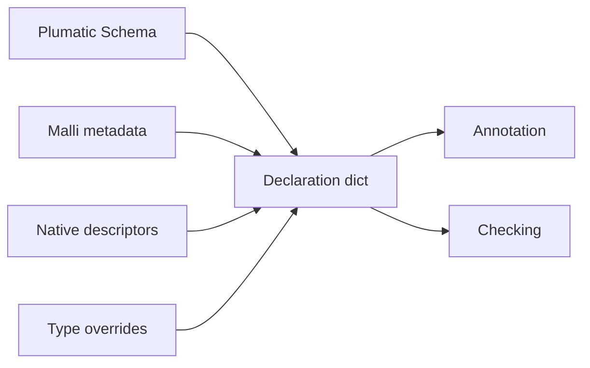

# Admission Paths

The reader now has the internal Type vocabulary and provenance vocabulary.
Admission answers the next question: how do declarations in a project become the
Type expectations that later phases check against?

> **Snapshot:** state of Skeptic as of 2026-05-06.

## Prerequisites

[Three Domains (C02)](02-three-domains.md),
[Type Domain (C04)](03-type-domain.md), and
[Provenance (C05)](04-provenance.md). You should know that external declaration
forms flow one way into Skeptic Types and that each Type carries provenance.

## Where this fits

Fifth on the Contributor path. This spoke produces the declaration-side story.
[Annotation Pass](06-annotation-pass.md) then produces the inferred-side story
from source code.

## What Admission Is

Admission is a boundary pass. It collects the declarations Skeptic knows how to
read, converts each declaration into the Type domain, attaches provenance, and
returns the per-namespace declaration dictionary used by annotation and checking.

For the reader, the key state change is this: before admission, `classify` has
source syntax `:- s/Keyword`; after admission, Skeptic has a qualified function
symbol associated with a function Type whose output is Keyword.

That state is deliberately early in the pipeline. Later annotation can ask "what
Type did the user declare for this var?" without rereading source metadata.
Later checking can ask "what target should the inferred body cast against?"
without knowing which external language supplied the target.

## The Four Sources

*Figure: four declaration sources fan into one Type dictionary.*



**Plumatic Schema** is the main path. `s/defn`, map schemas, maybe schemas, and
function schemas are collected from code and converted through the Schema bridge.
This is how both functions in the worked example enter Skeptic.

For `s/defn`, the admission result preserves method shape: inputs and output.
The next time the reader sees a function cast, the target method came from this
earlier work.

**Malli metadata** is a smaller path. It lets Malli function declarations enter
the same Type dictionary. Once admitted, the later phases do not need a separate
Malli branch.

This is the pattern for adding future declaration languages as well. The
language-specific work belongs at the boundary; the middle of Skeptic should see
ordinary Types.

**Native descriptors** describe functions Skeptic already knows about, such as
selected `clojure.core` functions. They give calls a declared target even when
the project did not write a Schema annotation for that function.

This is why `double-or-zero` can check a call to `*`. The project did not declare
`clojure.core/*`, but Skeptic has native knowledge for common functions. The
call can therefore be checked as an invocation with expected argument and output
Types.

**Type overrides** are explicit replacements from configuration or metadata.
They are useful when a library declaration is missing or when a local expression
needs a stronger type for checking.

Because overrides are explicit user input, their provenance outranks ordinary
Schema and inferred values. If an override is wrong, Skeptic will faithfully
check against the wrong expectation; that is a user-controlled boundary.

## How The Worked Example Admits

For `classify`, admission sees the declared input `s/Int` and output
`s/Keyword`. The result is a function Type with one method: Int input and Keyword
output, carrying Schema provenance.

For `double-or-zero`, admission sees the declared input `(s/maybe s/Int)` and
output `s/Int`. The result is a function Type whose method input is
`MaybeT[GroundT Int]` and whose output is `GroundT Int`.

The reader should pause here because the next spoke depends on this exact state:
annotation will infer what the bodies produce, but the expected shapes already
exist.

| Definition | Admitted input | Admitted output | Why it matters later |
|---|---|---|---|
| `classify` | `GroundT Int` | `GroundT Keyword` | Output cast has a concrete target. |
| `double-or-zero` | `MaybeT[GroundT Int]` | `GroundT Int` | Narrowing must remove nil before multiplication. |

This table is the reader's handoff into annotation. The body may infer many
intermediate Types, but these declarations are the expectations they will meet.

## Merging Sources

When the same qualified symbol has more than one possible declaration source,
Skeptic chooses by provenance rank. The practical rule is that explicit user
knowledge beats inferred fallback knowledge. That keeps a declared return type
available as the target of the output cast, even if the body later infers a
different shape.

This is not a separate conceptual language. It is still the same Type domain
after the merge.

### In-depth: Canonicalize, Localize, Render

***Skip if reading the Gist path.***

The Schema bridge has three reader-visible moves. First, canonicalization puts
equivalent schema shapes into a regular form. Then localization resolves values
and references in the context of the namespace being admitted. Later, rendering
can turn a Type back into a readable form for messages.

Those moves live at the boundary. Their purpose is to keep the middle of the
checker from having to remember every surface syntax that could have created a
Type.

Rendering appears to run "backwards," but it is not analysis. It is a display
service. The checker still reasons over Types; rendering only gives humans and
tools a readable representation of those Types.

## Admission Questions To Ask While Debugging

If a declaration seems absent, ask whether its namespace was discovered and
whether the collector for that declaration source saw it. If the declaration is
present but too vague, ask whether the bridge converted the external form into a
precise enough Type. If two sources disagree, ask which provenance rank should
win.

Those questions matter because downstream phases usually cannot recover
precision that admission never supplied. Annotation can infer body behavior, but
it cannot guess a missing declared target for a library function. Cast dispatch
can compare source and target, but it cannot decide that a target should have
been different. Admission is where the expectation enters the checker.

## Why Native Knowledge Belongs Here

Native function descriptors may feel different from user declarations because
they are built into Skeptic, but they serve the same reader need: provide a target
Type for code that calls known functions. In `double-or-zero`, the multiplication
call only becomes meaningful to the checker because the callee has a known
function shape. The caller's argument Types can then be cast against that shape.

## What Admission Does Not Decide

Admission does not decide whether `classify` is correct. It does not inspect the
body branch returning `"odd"`. It only records the declared expectation. That is
why a bad declaration and a bad implementation are distinguishable: admission
can be perfectly correct while checking later reports that the implementation
does not satisfy the admitted contract.

This distinction matters for fixes. If the declaration is wrong, change the
declaration or override. If the body is wrong, change the implementation. If the
admitted Type does not match the declaration, inspect the bridge. Those are three
different reader states, and admission is where they separate.

## Worked Example Here

```clojure
;; classify: declaration-side expectation
[n :- s/Int]        ;; input Type: GroundT Int
:- s/Keyword        ;; output Type: GroundT Keyword

;; double-or-zero: declaration-side expectation
[n :- (s/maybe s/Int)] ;; input Type: MaybeT[GroundT Int]
:- s/Int               ;; output Type: GroundT Int
```

These are the target Types. The next spoke explains where the source Types come
from.

## Source Pointers

- `skeptic/checking/pipeline.clj:namespace-dict` - admission dispatcher for a namespace.
- `skeptic/analysis/bridge.clj:schema->type` - Schema admission entry point.
- `skeptic/analysis/malli_spec/bridge.clj:malli-spec->type` - MalliSpec admission entry point.
- `skeptic/typed_decls.clj:merge-type-dicts` - combines admitted declaration sources.
- `skeptic/analysis/bridge/canonicalize.clj:canonicalize-schema` - normalizes Schema inputs.
- `skeptic/analysis/bridge/render.clj:render-type-form*` - renders Types for human surfaces.

## Glossary Terms Introduced

- Admission
- Declaration dict
- Native descriptor
- Type override

## Where To Next

- **Continue (Contributor path):** [Annotation Pass](06-annotation-pass.md)
- **Return:** [Hub](README.md)
