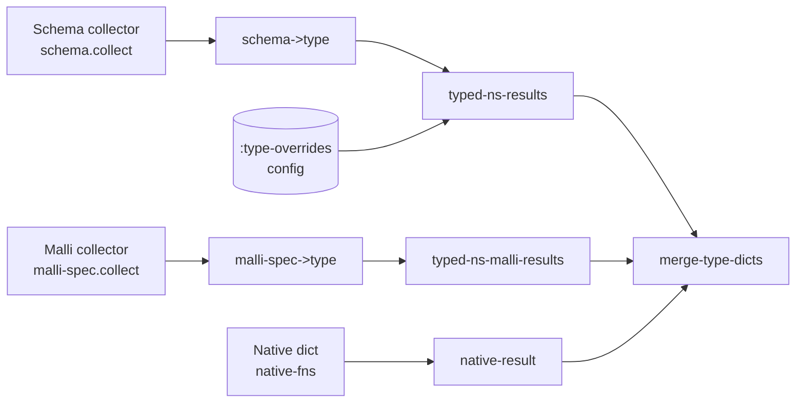
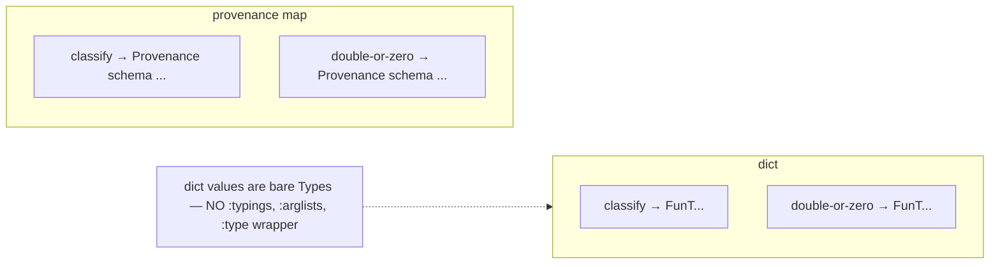

# Admission: Schema, Malli, Native, Override

> *Snapshot of state as of 2026-05-05.*

Admission is the boundary at which external schemas — Plumatic Schema,
Malli, native function descriptors, and `:type-overrides` — become
Types in a single per-namespace declaration dictionary. This spoke
walks the four lanes and the merge rule, explains how overrides
displace schema entries before the merge, and shows the
dict-after-admission invariant the rest of Skeptic relies on.

## Prerequisites

[Spoke 02 (Three Domains)](02-three-domains.md), [03 (Type
Domain)](03-type-domain.md), and [04 (Provenance)](04-provenance.md).
Plumatic-Schema literacy at the level of "I have used `s/defn` and
`s/maybe` before." Familiarity with the rank table for `:source`
values from spoke 04. If any of these are unfamiliar, the
[hub README's reading paths](README.md#reading-paths) point to the
right earlier reading.

## Where this fits

Fifth on the Contributor path. After this spoke, the reader can look
at any declared schema in a project and predict the Type that
admission produces, the Provenance attached to it, and what
happens when two sources declare the same qualified symbol. The
next spoke ([06](06-annotation-pass.md)) shows what the annotation
pass does on top of the admission dict.

## What admission is

**This section teaches: that admission is a single one-shot pass per
namespace producing three artifacts (dict, provenance map,
ignore-body set), and that the dict's values are bare Types.**

Admission is a one-shot pass per namespace that converts every
declared schema into a Type and stores them in a dictionary keyed
by qualified symbol. The pass also produces a parallel provenance
map (see [spoke 04](04-provenance.md)) and an `:ignore-body` set
marking functions whose bodies the user asked Skeptic not to check.

The resulting dict is the only thing downstream phases consume.
There is no intermediate entry-map shape between admission and
dict insertion. Each value is a *bare Type*; no `:typings`,
`:output-type`, `:arglists`, `:accessor-summary`, or `:type`
wrapper survives. Earlier internal versions of Skeptic carried
admission-shaped wrappers — they tempted later code to read the
wrappers' fields instead of working in the Type domain, and they
made the analysis layer dependent on the admission boundary's
shape. The current invariant — bare Types only — keeps the
analysis layer insulated from admission's evolution.

The pipeline dispatches per namespace via `namespace-dict` in
`skeptic/checking/pipeline.clj`. Inside `namespace-dict`, the four
input lanes — Schema, Malli, Native, Override — each produce a
result map of the shape:

```clojure
{:dict        {qualified-sym → Type}
 :provenance  {qualified-sym → Provenance}
 :ignore-body #{qualified-sym ...}
 :errors      [exception-record ...]}
```

The four results then merge through `merge-type-dicts` in
`skeptic/typed_decls.clj`. Merging is per-key, but the *rules*
are different for the Type and the Provenance — see the merge
section below.

*Figure: Four input lanes (Schema, Malli, Native, Override) merging
into a per-namespace dict. Override does not stand alone; it
displaces Schema entries before the merge.*



## Path 1 — Plumatic Schema

**This section teaches: how `:schema` metadata becomes a `FunT`/`MapT`/etc.,
and what the descriptor pipeline does between metadata and Type.**

The Plumatic collector's entry is `ns-schema-results` in
`skeptic/schema/collect.clj`. It walks `(ns-interns ns)` plus
`(ns-refers ns)`, and for each var that has `:schema` metadata
(and is not a macro and is not marked `:skeptic/opaque`), it
produces a *descriptor*: a small map with `:schema`, `:output`,
`:arglists`, and a flag for `:skeptic/ignore-body`. Macros are
skipped because they don't have runtime values; opaque vars are
skipped because the `:skeptic/opaque` mechanism asks Skeptic to
treat the function as a black box (see
[spoke 11](11-user-facing-surfaces.md) on suppression).

The descriptor's `:schema` field is the full Plumatic schema
expression as the user wrote it. The collector calls
`extract-raw-declaration` to capture it, then
`build-annotated-schema-desc!` to canonicalize the form
(`canonicalize-schema` from `bridge/canonicalize.clj`) and
*assert* that every annotation slot — `:schema`, `:output`, and
each arglist's `:schema` — admits successfully via
`ab/admit-schema`. If any slot fails, the var is rejected with a
declaration-error result; admission of that one var doesn't
proceed, but the rest of the namespace continues.

`typed-ns-results` in `skeptic/typed_decls.clj` then runs each
descriptor through `desc->type`, which calls
`skeptic.analysis.bridge/schema->type` with three things: the
provenance to stamp on the resulting Type (made via
`(prov/make-provenance :schema qualified-sym ns nil)`), the raw
schema, and an optional `form-descriptor` recovered from a
per-namespace `IdentityHashMap` (`*form-refs*`) that lets the
bridge attribute pieces of the Type back to specific source
forms.

The conversion is recursive. `s/Int` admits to `GroundT :int 'Int`;
`(s/maybe s/Int)` admits to `MaybeT (GroundT :int 'Int)`; an
`s/defn`'s `:- T` annotation plus `[x :- A, y :- B]` arglist
admits to `FunT[FnMethodT[A B → T]]` (modulo recursion through
`A`, `B`, `T`). Recursion is broken via `PlaceholderT` and
`InfCycleT` for self-referential schemas; the in-depth section
on form-refs explains the mechanism.

The provenance stamp is `:schema`. The descriptor's `:schema`
field becomes the Type; the `:output` and `:arglists` fields are
not the Type's *content* — they feed source attribution so each
sub-Type's `:prov` knows which slot the user wrote it in.

## Path 2 — Malli

**This section teaches: how `:malli/schema` metadata is collected
and converted, and why the recognized subset is small.**

The Malli collector walks the same `(ns-interns ns)` but reads
`:malli/schema` metadata instead of `:schema`. Its entry is
`typed-ns-malli-results` in `skeptic/typed_decls/malli.clj`. It
emits descriptors of the same shape as the Plumatic side, except
the value lane is the admitted Malli form rather than a Plumatic
schema.

The bridge is `skeptic.analysis.malli-spec.bridge/malli-spec->type`,
which walks the Malli form recursively. Recognized shapes:

- The function shape `[:=> [:cat & inputs] output]` admits to a
  `FunT` with one `FnMethodT`. Multi-arity isn't admitted.
- Five primitive leaves: `:int → Int`, `:string → Str`,
  `:keyword → Keyword`, `:boolean → Bool`, `:any → Dyn`.
- `[:maybe X]` admits to `MaybeT` over the inner.
- `[:or X Y …]` admits to `UnionT` over the converted members.
- `[:enum a b …]` admits to `UnionT` of `ValueT`s.
- Bare predicate symbols Skeptic recognizes admit to the
  appropriate ground.

Every other Malli form — `:map`, `:vector`, `:set`, `:tuple`,
registry refs, sequence/regex combinators, function-schema
variants other than `[:=>]`, the rich Malli registry features —
currently admits to `Dyn`. Skeptic *admits* the form (so the var
is in the dict and call sites resolve to a real entry), but the
Type carries no internal structure beyond "I'm dynamic." This is
the experimental status of Malli support; spoke 02 explains why
the asymmetry exists.

The provenance stamp is `:malli`.

## Path 3 — Native function descriptors

**This section teaches: that Skeptic ships its own admissions for
core Clojure functions, and why these admissions go straight into
the dict without going through `schema->type`.**

Skeptic ships a fixed dict of admissions for `clojure.core`
functions whose Plumatic schemas (when present) don't reflect
their actual behaviour. Arithmetic functions
(`+`, `-`, `*`, `/`, `inc`, `dec`, `mod`, `rem`, …); collection
accessors (`get`, `contains?`, `assoc`, `dissoc`, `conj`, `seq`,
`first`, `rest`, `count`, `keys`, `vals`); predicate functions
(`some?`, `nil?`, `zero?`, `even?`, `pos?`, `neg?`, …); and a
handful of others. The native dict lives in
`skeptic.analysis.native-fns/native-fn-dict`.

Each native entry is constructed at *Skeptic compile time*:
the constructors are called in the namespace's top-level forms,
producing real `FunT`s with real `:prov` carrying
`:source :native`. There is no `schema->type` step; the entries
are already Types when the namespace is loaded.

The reason is precision and control. Plumatic's schemas for
Clojure core (where they exist) don't always express what's
needed for casting — for example, `clojure.core/*`'s declared
schema doesn't necessarily say "any number to a number" the way
a numeric-dyn analysis wants. Native admissions express exactly
what the cast engine should treat the function as taking and
producing, in Type-domain terms.

The provenance stamp is `:native`.

A native entry can be *overridden* by a user `:type-override`
(rank 0 beats rank 3). It can be *contradicted* by a user's
`:malli/schema` or `:- T` annotation on a re-defed wrapper, but
that requires the wrapper, not just the original `clojure.core`
function.

## Path 4 — `:type-overrides` and `^{:skeptic/type T}`

**This section teaches: the two override mechanisms, where each
takes effect, and why both produce `:type-override` provenance.**

`:type-overrides` come from `.skeptic/config.edn`. The format:

```clojure
{:type-overrides
 {clojure.tools.logging/infof {:output (s/eq nil)}}}
```

The keys are qualified symbols; the values are Plumatic-shaped
override descriptions (`:schema`, `:output`, `:arglists`).
`skeptic.config` reads the file and produces a map; the map is
threaded into options (under `:skeptic/type-overrides`) and
consumed by `typed-ns-results`.

Inside `typed-ns-results`, the override application happens *after*
schema admission for that namespace and *before* the result is
returned for the multi-source merge. Concretely, the function
runs schema admission, then for every entry in the override map,
it `assoc-in`s the override Type into the result's `:dict` and
the override Provenance (with `:source :type-override`) into the
result's `:provenance`. Whatever schema-admitted entry was at
that key is *replaced*, not merged.

The reasoning is the responsibility ladder from
[spoke 04](04-provenance.md). A `:type-override` is the user
saying "treat this function as if I declared it this way,
overriding any Plumatic schema you'd find." Replacement is the
right semantics; merging would require a way to combine two
declared types, and the user's intent in writing the override
is to *displace*, not *augment*.

The second override mechanism is `^{:skeptic/type T}` metadata
on a *specific expression* in user code. That hook fires inside
the annotation pass ([spoke 06](06-annotation-pass.md)) rather
than at admission, but the resulting Type carries the same
`:type-override` provenance. The two mechanisms have the same
rank, the same display, and the same precedence in a merge.

The provenance stamp is `:type-override`.

## Merging the four sources

**This section teaches: that `merge-type-dicts` *intersects* the
Types and *rank-merges* the Provenances — two different rules
operating on the same merge.**

`skeptic.typed-decls/merge-type-dicts` combines the four per-source
results into a single per-namespace result. The pipeline calls it
with the results in order: `[schema-result malli-result
native-result]`. (The Override path does not appear at this stage
because overrides have already replaced their schema entries
inside `typed-ns-results`, before `merge-type-dicts` runs.)

For each qualified symbol that appears in *any* of the source
dicts:

- The **Type** is the *intersection* of every Type that source
  declared for that key. Concretely:

  ```clojure
  (ato/intersection (distinct types))
  ```

  If only one source declared the key, the intersection of one
  is that one Type. If two sources both declared it, the result
  is an `IntersectionT` over the two — semantically, "this var
  must satisfy both claims."

- The **Provenance** is the rank-merged Provenance via
  `prov/merge-provenances` (see [spoke 04](04-provenance.md)).
  The lower-rank source wins; ties favour the first argument.

- The **`:ignore-body`** set is the union across sources.

- The **`:errors`** vector is concatenated.

The two merges differ for a deep reason: the *shape* of a Type
must reflect every claim made about it, while the *provenance*
attached to a finding should attribute responsibility to the most
*explicit* claim. Intersection captures the conjunction of
declared shape; rank captures the most-specific responsibility.

A consequence: if a project author writes both a Plumatic schema
and a `:malli/schema` for the same var, and the two declare
incompatible shapes, the resulting dict entry is the
intersection — which casts may fail to satisfy, producing
findings. Skeptic does *not* warn at admission about
contradictory same-symbol declarations; it lets the cast engine
discover the contradiction at use sites. (A future contributor
might add an admission-time warning.)

A second consequence: when a function is admitted by both
Plumatic (the user's `:- T` annotation) and Native (Skeptic's
built-in dict), the result is the intersection of the two
claims, with `:source :schema` because schema (rank 2) outranks
native (rank 3). The user's claim is stronger semantically (it's
an intersection — the user's claim *plus* the native claim) but
the *attribution* is to the user. This is how Skeptic gives the
user precise blame for findings that arose from their declared
narrowing of a native function's broad signature.

## The dict-after-admission invariant

**This section teaches: the contract every later phase depends
on, in three sentences plus a worked-example check.**

After admission, three things are true of the per-namespace
result:

1. **Every dict value is a bare Type.** No `:typings`, no
   `:output-type`, no `:arglists`, no `:accessor-summary`, no
   `:type` wrapper. The Type record is the value.
2. **Every Type's `:prov` is a real Provenance.** No `nil`, no
   sentinel, no `prov/unknown`. The strict constructors enforce
   this; `prov/of` enforces it from the read side.
3. **The provenance map is parallel.** Same keys as the dict;
   each value is the declaration-level Provenance. The Type's
   own `:prov` may be more granular (a `MaybeT`'s inner
   `GroundT` carries its own `:prov` slot from the recursion);
   the parallel map captures the *declaration's* prov.

The pipeline's phase 2 (`namespace-dict`) produces all three
atomically. No intermediate "entry record" exists.

For the worked example, the dict after admission looks like:

```clojure
{:dict
 {'skeptic.walkthrough.example/classify
    (FunT prov-c
      [(FnMethodT prov-c [(GroundT prov-c :int 'Int)]
                  (GroundT prov-c :keyword 'Keyword)
                  1 false ['arg0])])

  'skeptic.walkthrough.example/double-or-zero
    (FunT prov-d
      [(FnMethodT prov-d [(MaybeT prov-d (GroundT prov-d :int 'Int))]
                  (GroundT prov-d :int 'Int)
                  1 false ['arg0])])}

 :provenance
 {'skeptic.walkthrough.example/classify       prov-c
  'skeptic.walkthrough.example/double-or-zero prov-d}

 :ignore-body #{}
 :errors      []}
```

where `prov-c` and `prov-d` are Provenances with
`:source :schema`, `:qualified-sym` the corresponding symbol,
and `:declared-in 'skeptic.walkthrough.example`. Both entries
are bare `FunT`s. The provenance map records the declaration-
level facts; the Types' own `:prov`s record the construction-
level facts (which are equal here, because admission stamped
both with the same Provenance).

*Figure: Dict entry shape (Type only) and parallel provenance
map; "no sidecar wrapper" callout.*



### In-depth: canonicalize, localize, and render — the boundary's three companions

***Skip if reading the Gist path.***

A contributor extending the Plumatic admission boundary — adding
a new shape recognizer, fixing a display issue, supporting a new
schema convenience — works against three companion namespaces
that handle different aspects of the boundary.

**`skeptic.analysis.bridge.canonicalize/canonicalize-schema`**
normalizes the schema *form*. It flattens unions, recurses into
map entries (each entry is canonicalized independently), strips
named wrappers when the wrapper carries no semantic information,
and is the input side of the bridge. The collector calls it
before `assert-admitted-schema-slots!` so the assertion checks the
canonical shape; the bridge can then assume a normal-form input.

The reason canonicalization is its own pass — separable from the
bridge — is testability. A new schema convenience that sugars
existing forms can be added by extending `canonicalize-schema`
without touching the bridge; conversely, a new internal type
kind that the bridge produces requires no canonicalize change.

**`skeptic.analysis.bridge.localize/localize-value`** resolves
vars to their values or to placeholders, walks recursive var
references using a `seen-vars` set to break cycles, and
establishes the dynamic `*error-context*` binding that any
subsequent error message reads. Localization runs before the
actual `schema->type` walk, ensuring the bridge sees concrete
schema values rather than unresolved vars.

The reason localization is separate from the schema walk is
recursion. If the bridge encountered a recursive var directly,
it would have to track active references mid-walk; with
localization handling that traversal first and substituting
`PlaceholderT` markers, the bridge can be a clean recursive
descent without needing a stack guard.

**`skeptic.analysis.bridge.render/render-type-form*`** is the
*reverse* path — the inverse-direction *display* helper for
findings. Given a Type with `:schema`, `:malli`, or
`:type-override` provenance and a `:qualified-sym` that maps to
a known declared symbol, it renders the Type as that symbol's
declared name (so `MaybeT[GroundT Int]` displays as
`(maybe Int)` rather than its structural form). For `:inferred`
or `:native` Types — where no declared name exists — render falls
through to a structural form. The foldable-source set is
`#{:schema :malli :type-override}`. `--explain-full` forces the
structural form regardless of source.

The three together are the boundary's input layer (canonicalize
/ localize) and output layer (render). Note: per
[spoke 02](02-three-domains.md), this is *not* a `Type → Schema`
reverse bridge — it's an alias lookup that happens to use the
admitted schema's display form for known declared names. A new
admission source that wants its admitted shapes to fold for
display has to register them with the renderer; native
admissions don't, which is why a finding involving a native-
admitted Type displays structurally.

*Figure: Canonicalize/Localize at the input edge; Render at the
output edge; Type domain in the middle does not see schema-
shaped data.*


### In-depth: form-refs and recursive schemas

***Skip if reading the Gist path.***

Some declared schemas reference vars that haven't yet been
resolved in the current admission pass — typically self-
referential schemas (`(s/defschema Tree (s/cond-pre s/Int [Tree]))`)
or pairs of mutually recursive ones. The bridge handles these via
a shared `form-refs` `IdentityHashMap` per namespace, threaded
through the dynamic `ab/*form-refs*` binding.

The mechanism has three moving parts:

1. **Per-namespace map.** `namespace-dict` creates a fresh
   `IdentityHashMap` and binds it as `ab/*form-refs*`. The map's
   keys are vars; the values are partial schema descriptors used
   for source attribution.
2. **Build-time pre-pass.** `build-form-refs!` reads the
   namespace's source file and pre-populates the map with
   declared form snippets so the bridge can attribute parts of a
   Type to specific source forms.
3. **Bridge-time recursion guard.** When `schema->type` (via
   `var-import-type`) encounters a var reference that is already
   on the active-refs stack, it returns a `PlaceholderT` carrying
   the var's qualified symbol. The placeholder is later resolved
   by the cast engine when it visits the position.

After admission completes, any placeholders that were never
resolved (because their referent wasn't admitted in this
namespace) become `InfCycleT` markers, which the cast engine
treats as residual-dynamic when it can't make progress
([spoke 09](09-cast-dispatch.md)).

The IdentityHashMap is per-namespace because schema cycles are
typically intra-namespace; cross-namespace cycles are rare and
break the cycle naturally because cross-namespace admission has
already completed by the time annotation runs. The contributor
adding a new admission source must decide whether to share
this map or have its own; the Malli admission currently doesn't
need one because Malli's recursion is registry-based and the
narrow admitted subset doesn't include registry refs.

### In-depth: why intersection rather than first-wins

***Skip if reading the Gist path.***

A contributor coming from a "merge by precedence" mental model
might expect `merge-type-dicts` to *replace* lower-rank entries
with higher-rank ones — Plumatic beats Malli beats native. That
is what the Provenance merge does. The Type merge does
*intersection* instead. Why?

The answer is what the Type fundamentally *means* in the dict. A
Type at a key answers the question "what shape can this var
take?" When two sources both declare a shape — say, Plumatic
declares `(=> Int Int)` (Int → Int) and a native admission
declares `(=> Number Number)` (Num → Num) — the var must satisfy
*both*. The intersection captures the conjunction.

If the merge were first-wins by rank, the user's declared
`(=> Int Int)` would replace the native `(=> Number Number)`,
and Skeptic would treat the function as taking `Int` and
returning `Int`. That's *less* information than is available;
the native admission was telling Skeptic "this is also a
number-typed function," and discarding that loses precision.

If the merge were last-wins by rank (native beats Plumatic), the
user's narrow `Int → Int` declaration would be discarded in
favour of the broad `Num → Num`, defeating the purpose of
declaring schemas at all.

Intersection threads the needle: the Type captures *every*
claim, and the cast engine is left to discover whether the
claims are consistent. If they're not, casts will fail, and the
findings tell the user where.

A second pattern this rule enables: native admissions can be
*narrowed* by user declarations. The native admission for
`clojure.core/+` is broad (`NumericDyn`-typed); a user
declaring `(s/defn my-add :- s/Int [a :- s/Int b :- s/Int]
(+ a b))` has admission Type
`Intersection[FunT (NumericDyn → NumericDyn), FunT (Int → Int)]`
when `my-add` is also in the native dict — but it isn't. Native
admissions are for `clojure.core` symbols; a user-defined wrapper
gets *only* the user's declaration. The intersection rule fires
only when both sources actually admit the same qualified symbol,
which is rare in practice but precise when it happens.

## Marquee functions

| Function                 | File                                       | Role                                                       |
|--------------------------|--------------------------------------------|------------------------------------------------------------|
| `namespace-dict`         | `skeptic/checking/pipeline.clj`            | Per-namespace admission dispatcher.                        |
| `typed-ns-results`       | `skeptic/typed_decls.clj`                   | Schema admission + override displacement.                  |
| `merge-type-dicts`       | `skeptic/typed_decls.clj`                   | Intersects Types; rank-merges Provenances.                 |
| `schema->type`           | `skeptic/analysis/bridge.clj`               | Plumatic Schema → Type entry.                              |
| `malli-spec->type`       | `skeptic/analysis/malli_spec/bridge.clj`    | MalliSpec → Type entry.                                    |
| `canonicalize-schema`    | `skeptic/analysis/bridge/canonicalize.clj`  | Boundary input normalization.                              |
| `render-type-form*`      | `skeptic/analysis/bridge/render.clj`        | Boundary display side; alias-folds known declared names.   |

## Worked example here

`classify` (Plumatic side). The var has metadata
`{:schema (=> Keyword Int)}` (set by `s/defn`). The Plumatic
collector reads it; the bridge admits it. The result:

```text
dict["skeptic.walkthrough.example/classify"]
  = FunT prov-schema
      [FnMethodT prov-schema
         [GroundT prov-schema :int 'Int]
         (GroundT prov-schema :keyword 'Keyword)
         1 false ['arg0]]
provenance["skeptic.walkthrough.example/classify"]
  = Provenance{:source :schema, :qualified-sym 'classify, :declared-in 'example}
```

`double-or-zero` (Plumatic side). The metadata is
`{:schema (=> Int (maybe Int))}`. The bridge admits:

```text
dict["skeptic.walkthrough.example/double-or-zero"]
  = FunT prov-schema
      [FnMethodT prov-schema
         [MaybeT prov-schema (GroundT prov-schema :int 'Int)]
         (GroundT prov-schema :int 'Int)
         1 false ['arg0]]
provenance["skeptic.walkthrough.example/double-or-zero"]
  = Provenance{:source :schema, :qualified-sym 'double-or-zero, :declared-in 'example}
```

Neither symbol is in the native dict (they're user-defined),
neither has a `:malli/schema`, and neither is in
`:type-overrides`. So the merge for each is a no-op: the
Plumatic-admitted Type and Provenance pass through unchanged.

For comparison: when `classify`'s body calls `clojure.core/even?`,
the call site's callee Type is read from the project-wide dict.
`clojure.core/even?` is in the native dict only, with
`:source :native`; no Plumatic or Malli declaration competes; the
intersection of one is that Type. The cast at the call site uses
the native Type with `:source :native` Provenance.

## Glossary terms introduced

- Admission (concept and pass)
- Declaration dictionary
- Provenance map (parallel)
- Type-override (the two mechanisms)
- Native function admission
- Form-refs (admission-time recursion machinery)

## Where to next

- **Continue (Contributor path):** [Annotation Pass (06)](06-annotation-pass.md)
- **Return:** [Hub](README.md)
