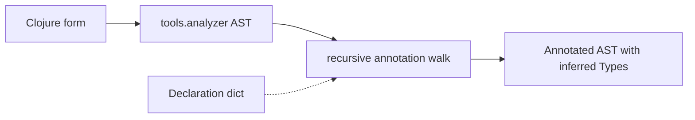
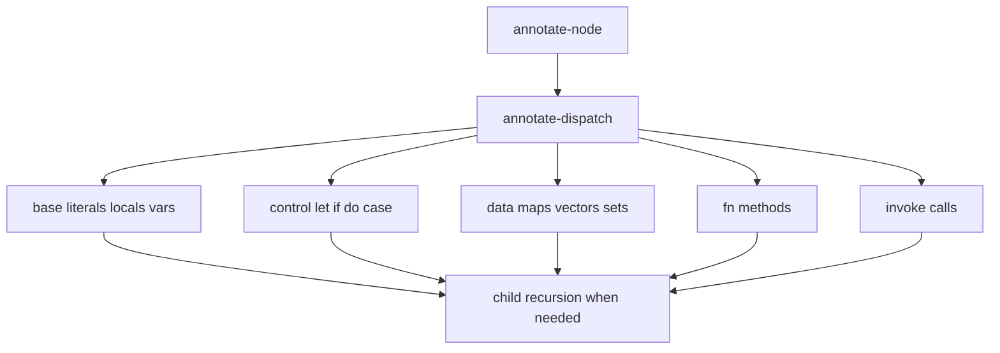

# Annotation Pass

Admission gave the reader declared target Types. Annotation answers the other
side of every cast: what Types does the program body actually produce?

> **Snapshot:** state of Skeptic as of 2026-05-06.

## Prerequisites

[Type Domain (C04)](03-type-domain.md),
[Provenance (C05)](04-provenance.md), and
[Admission Paths (C03)](05-admission-paths.md). A passing familiarity with
`tools.analyzer` AST `:op` names helps, but this spoke only uses a few.

## Where this fits

Sixth on the Contributor path. This spoke closes the gap between source code and
inferred Types. [Closed-Sum Exhaustiveness](07-closed-sum-exhaustiveness.md) and
[Narrowing and Origins](08-narrowing-and-origins.md) then refine how branchy
code is understood.

## What Annotation Produces

The reader enters this spoke holding a declaration dictionary. Annotation walks
an analyzer AST and returns the same program shape enriched with Types. A literal
node gets the Type of its value. A local node gets the Type from the local
environment. An invocation node gets an output Type computed from the function
and argument Types.

The output is still an AST. That matters because later checking needs both the
inferred Type and enough source context to report a useful finding.

A reader debugging annotation should therefore ask two questions for any node:
what Type did this node receive, and what surrounding source context remained
available? If the Type is wrong, inspect the node's annotator. If the Type is
right but the later message is unhelpful, the problem may be projection or
output, not annotation.

*Figure: annotation keeps the AST shape and adds Type information.*



## The First-Order Invariant

At this point the reader may wonder whether annotation can infer every Type kind.
It cannot, and should not. Annotation is first-order: it attaches ordinary value
Types to expression nodes, but it does not invent quantified Types.

The reason belongs to the reader's current state. Quantified Types represent
external polymorphic contracts. They need a boundary where abstraction is
preserved. Admission can introduce such a contract from an explicit declaration;
the cast engine can enforce it. If annotation fabricated a quantified Type from
an expression body, the checker would be treating inferred implementation detail
as if it were a user-supplied polymorphic boundary.

So the promise is narrow and useful: annotation tells checking what the program
appears to produce at each node. It does not create new polymorphic contracts.

This is also why the first-order invariant is a walkthrough concept rather than
a maintenance rule. The reader has just learned that admitted declarations can
be polymorphic and inferred expression Types can be checked against them. The
invariant explains which side is allowed to introduce that kind of abstraction.

## Dispatch On AST Shape

Annotation is organized around the AST node's `:op`. Constants, locals, vars,
`let`, `if`, `fn`, invoke, maps, vectors, sets, and host forms each have a small
piece of annotation logic. The reader should not memorize the list. The point is
that an unfamiliar inferred Type can usually be traced to the annotator for that
node shape.

For example, a surprising Type on a vector literal belongs near data annotation.
A surprising Type on an invocation belongs near invoke annotation or the callee's
admitted Type. A surprising Type inside an `if` may belong to branch-local
environments, which is why narrowing gets its own spoke.

*Figure: one recursive runner delegates by node kind, then recurses into
children.*



## Representative Cases

A literal such as `"odd"` gets a string ground Type. A keyword such as `:zero`
gets an exact value Type whose ground is Keyword. A local such as `n` gets the
Type currently assigned to that local. A function body joins branch outputs to
produce an output Type for the method.

For `classify`, this means the body contains two keyword-shaped alternatives and
one string-shaped alternative. The checker will later compare the resulting
output against the admitted `GroundT Keyword` target.

For `double-or-zero`, the `if` node is where annotation creates the opportunity
for narrowing. Without narrowing, `n` would remain maybe-typed inside `(* 2 n)`.
With narrowing, the then-branch sees non-nil `n`.

| Node shape | Reader expectation |
|---|---|
| literal | Type comes from the literal value. |
| local | Type comes from the current local environment. |
| `if` | Branches can receive different local environments. |
| `fn` | Method output comes from the body Type. |
| invoke | Output comes from the callee Type and argument Types. |

The table is intentionally small. It gives enough landmarks to follow a source
trace without becoming a per-`:op` reference.

## Type Overrides During Annotation

Expression metadata can supply a type override. The reader should see this as a
manual admission point inside annotation: the metadata form is converted through
the Schema bridge, and the node's inferred Type is replaced with that admitted
Type. The feature exists for boundary cases where source inference needs a
precise user assertion.

The override is still checked later. It is not a magic suppression. It changes
the Type attached to an expression, which means later casts use that Type as the
actual value of the node.

## Reading An Annotated Node

When inspecting an annotated AST, read it in layers. First identify the node
operation: literal, local, branch, function, invocation, or data structure. Then
read the attached Type as the node's inferred value. Finally, keep the source
form nearby because projection may need it to explain a finding.

For `classify`, the important annotated node is the function body. Its Type is
not "the declared output." It is what the branch body actually produces. For
`double-or-zero`, the important annotated nodes are the test and the then-branch
invocation. The test prepares assumptions; the invocation consumes the narrowed
local environment.

## Where Annotation Hands Off

Annotation does not decide whether the body is acceptable. It prepares enough
information for checking to decide. That handoff is visible in the worked
example: annotation can infer that `"odd"` is a string and that `n` is Int inside
the then-branch; checking later decides whether those inferred Types fit the
declared targets.

This separation is useful when debugging. If the inferred Type is wrong, fix
annotation or narrowing. If the inferred Type is right but the compatibility
answer is wrong, move to cast dispatch.

## Annotation Checkpoint

At the end of annotation for the worked example, the reader should be able to
state three facts. First, `classify` has a declared target from admission.
Second, its body has an inferred output that includes a string branch. Third,
`double-or-zero` has a then-branch environment where `n` can become Int. Nothing
has been reported yet; the checker has merely prepared source-side evidence.

If those three facts are clear, the transition into cast dispatch is mechanical:
checking compares source-side evidence with declaration-side expectations.

### In-depth: Recursive Runner Shape

***Skip if reading the Gist path.***

The annotation pass is easiest to read as one recursive runner plus many
non-recursive helpers. `annotate-node` installs the recursive function into the
context, the `:op` helper annotates children by calling that function, and the
parent helper assembles the result. This keeps recursion control in one place
while letting each node kind focus on its own Type rule.

## Worked Example Here

```clojure
;; The body alternatives that annotation sees inside classify:
:zero  ;; exact keyword value
:even  ;; exact keyword value
"odd"  ;; string

;; The test that annotation prepares for narrowing:
(some? n)
```

The next two spokes explain the branch reasoning behind those comments.

## Source Pointers

- `skeptic/analysis/annotate.clj:annotate-node` - top-level annotation runner.
- `skeptic/analysis/annotate.clj:annotate-dispatch` - dispatches by AST `:op`.
- `skeptic/analysis/annotate.clj:annotate-form-loop` - analyzes and annotates a form.
- `skeptic/analysis/annotate/api.clj:with-type` - attaches a Type to a node.
- `skeptic/analysis/annotate/api.clj:node-op` - reads the node operation.

## Glossary Terms Introduced

- Annotation pass
- First-order invariant
- Annotated AST
- Type override

## Where To Next

- **Continue (Contributor path):** [Closed-Sum Exhaustiveness](07-closed-sum-exhaustiveness.md)
- **Return:** [Hub](README.md)
