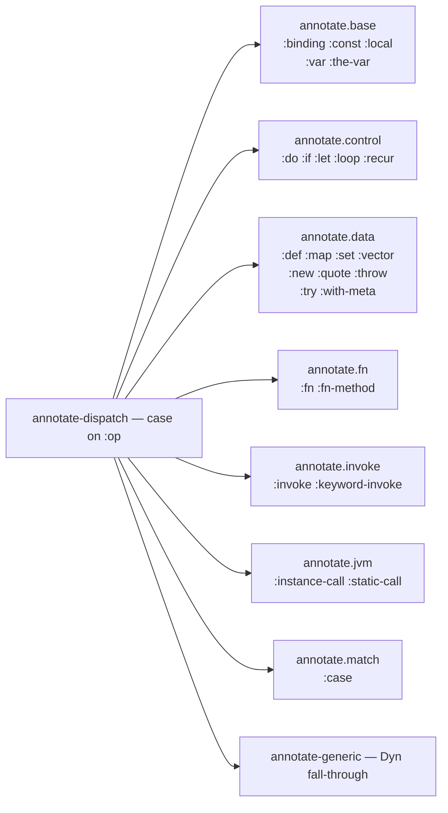

# Annotation: AST → Typed AST

> *Snapshot of state as of 2026-05-05.*

After admission produces the declaration dict, annotation walks each
top-level form's `tools.analyzer` AST and attaches a Type to every
node. The walk is *first-order* — it never invents a quantified Type
— and it is the layer in which most of Skeptic's "what does this
expression evaluate to?" reasoning happens. This spoke covers the
dispatcher, the seven sub-namespaces, the recursive runner pattern,
the API boundary every external reader uses, and the `:skeptic/type`
override hook.

## Prerequisites

[Spoke 03 (Type Domain)](03-type-domain.md), [04
(Provenance)](04-provenance.md), and [05 (Admission
Paths)](05-admission-paths.md). Working familiarity with
`tools.analyzer` AST `:op` keys (the spoke names them but does not
teach analyzer mechanics; reading the analyzer's docstring once
beforehand helps). If any of these are unfamiliar, the
[hub README's reading paths](README.md#reading-paths) point to the
right earlier reading.

## Where this fits

Sixth on the Contributor path. After this spoke, the reader can
open any file in `skeptic.analysis.annotate.*` and orient quickly.
The next two spokes ([07](07-closed-sum-exhaustiveness.md),
[08](08-narrowing-and-origins.md)) cover the refinements layered
on top of the basic annotation pass — closed-sum exhaustiveness
and flow-sensitive narrowing both run *inside* annotation.

## What annotation does

**This section teaches: what annotation produces, and why every
later phase depends on the *typed* AST shape rather than on the
raw analyzer AST.**

For each top-level form, the checker calls
`clojure.tools.analyzer.jvm/analyze` to get an analyzer AST, then
walks that AST attaching a Type to every node. The output is the
same AST shape as the analyzer produced, with extra keys: `:type`
on every node, `:output-type` on call-shaped nodes,
`:expected-argtypes` and `:actual-argtypes` on call sites,
`:origin` on local-binding nodes when the local aliases a
recognizable observable. Other phase-specific keys may appear
during the walk; `abr/strip-derived-types` removes the scratch
ones at the end so the cast engine sees only canonical fields.

The `:type` key on every node is what every later phase consumes.
The cast engine reads it for source-side Types in input casts,
the `def-output-results` phase reads it for the body's joined
Type in output casts, the projection layer reads it for finding
attribution. The annotator's *job* is to put a Type on every
node, faithfully, in one pass.

A non-trivial detail: the annotator threads provenance through
the walk via the analyzer ctx. Every constructed Type's `:prov`
is derived from `(prov/with-ctx ctx)` — the ctx-bound
Provenance — which the entry point seeds with
`(prov/inferred {:name name :ns ns})` for the enclosing
top-level form. So every inferred Type produced during annotation
of `classify` carries `:source :inferred` and a Provenance that
knows the form's name and namespace. This is what makes
`[source: inferred]` findings point at the right form in the
user's source.

## The first-order invariant

**This section teaches: the rule that annotation never produces
a `ForallT`, `TypeVarT`, or `SealedDynT` — and what would break
if it did.**

The annotation pass is *first-order*. The phrase has a precise
meaning: the annotation pass never produces a `ForallT`,
`TypeVarT`, or `SealedDynT`. Quantified types enter Skeptic
exclusively through admission (a declared `^{:skeptic/type T}`
override that contains a type variable, a future Malli admission
producing one) or through cast-time runtime traversal
([spoke 10](10-blame-for-all-and-projection.md)).

Concretely, every Type the annotator constructs is one of the
non-quantified kinds: `GroundT`, `MaybeT`, `UnionT`,
`IntersectionT`, `MapT`, `VectorT`, `SeqT`, `SetT`, `FunT`/
`FnMethodT`, `ConditionalT`, `ValueT`, `RefinementT`,
`AdapterLeafT`, `OptionalKeyT`, `VarT`, `PlaceholderT`,
`InfCycleT`, `DynT`, `BottomT`, `NumericDynT`. The cast engine
treats those as the analysis vocabulary; quantified Types are a
separate channel handled by a small set of dedicated cast rules.

What would break without this invariant?

If the annotator could produce a `ForallT` opportunistically —
say, when it saw a function whose body uses its argument
generically — every later cast would have to handle "maybe-
quantified" types pervasively. The seal/collapse machinery
([spoke 10](10-blame-for-all-and-projection.md)) would leak
into every call-site cast, even calls into ordinary first-order
functions. Cast-rule design would have to track binders all the
way through the dispatch ladder.

By keeping annotation strictly first-order, Skeptic confines all
quantified-type reasoning to one set of cast rules
(`check-quantified-cast`, `check-abstract-cast`). The rest of the
cast engine — 18 of its 20 dispatch clauses — operates on
first-order Types alone. The contributor adding a new Type kind
must decide which side of this fence it belongs on; the answer
is almost always "first-order, produced by annotation," because
quantified additions are the rare path.

A subtle corollary: `:inferred` Provenance never appears on a
quantified Type. The first-order invariant is enforced both by
the choice of constructors the annotator calls and by the
provenance discipline — `:inferred` is the analyzer's source,
and the analyzer doesn't produce quantified Types.

## The dispatch on `:op`

**This section teaches: that the annotator is one big `case` on
the analyzer's `:op` key, with each case delegating to a
sub-namespace, and that the case list is exhaustive enough for
any AST.**

`annotate-dispatch` in `skeptic/analysis/annotate.clj` is one big
`case` on the analyzer's `:op` key. There are **26 explicit
cases** plus a fall-through to a generic `Dyn` annotation. The
26 cases cover every `:op` `tools.analyzer` produces for ordinary
Clojure code:

```text
:binding   :const         :def          :do          :fn
:fn-method :if            :case         :instance-call
:invoke    :keyword-invoke :let         :loop        :local
:map       :new           :quote        :recur       :set
:static-call :the-var     :throw        :try         :var
:vector    :with-meta
```

Each case delegates to a sub-namespace under
`skeptic.analysis.annotate.*`. There are seven such
sub-namespaces:

| Sub-namespace                     | Owns                                                                      |
|-----------------------------------|---------------------------------------------------------------------------|
| `skeptic.analysis.annotate.base`     | `:binding`, `:const`, `:local`, `:var`, `:the-var`                       |
| `skeptic.analysis.annotate.control`  | `:do`, `:if`, `:let`, `:loop`, `:recur`                                  |
| `skeptic.analysis.annotate.data`     | `:def`, `:map`, `:set`, `:vector`, `:new`, `:quote`, `:throw`, `:try`, `:with-meta` |
| `skeptic.analysis.annotate.fn`       | `:fn`, `:fn-method`                                                       |
| `skeptic.analysis.annotate.invoke`   | `:invoke`, `:keyword-invoke`                                              |
| `skeptic.analysis.annotate.jvm`      | `:instance-call`, `:static-call`                                          |
| `skeptic.analysis.annotate.match`    | `:case`                                                                   |

Unknown `:op`s fall through to `annotate-generic`, which annotates
with `Dyn`. So Skeptic never crashes on an unfamiliar AST node;
it just doesn't reason about it. The fall-through exists because
`tools.analyzer` is occasionally extended with new ops, and a
crash there would be a brittle dependency.

The dispatch is shallow on purpose: each sub-namespace owns its
shape entirely; the dispatcher is just a switchboard. Adding a
new `:op` (rare) means adding one case to `annotate-dispatch` and
implementing the logic in the right sub-namespace. The
sub-namespace boundary is also where the API boundary lives —
`annotate.api` is the public surface; the sub-namespaces are the
implementation, and they are the only places that may read or
write node fields directly.

*Figure: The 26 `:op` cases grouped by sub-namespace; the
dispatcher is one node funnelling into seven owners.*



## The annotated-node API

**This section teaches: that node shape is hidden behind an API
namespace; what the rule is for who may bypass the API; and why
the rule exists.**

After annotation, the AST is no longer a plain analyzer AST —
it carries Skeptic-specific keys (`:type`, `:output-type`,
`:expected-argtypes`, `:actual-argtypes`, `:origin`, …).
Reading those keys directly from arbitrary code would couple
every reader to the node shape, making the shape impossible to
change. A new key tomorrow would mean tracking down every
`(:type some-node)` in the codebase.

`skeptic.analysis.annotate.api` is the public surface. It
exposes:

- **Accessors**: `node-op`, `node-form`, `node-type`,
  `node-output-type`, `node-origin`, `call-fn-node`, `call-args`,
  `function-methods`, `def-value-node`, `analyzed-def-entry`,
  `node-tag`, `unwrap-with-meta`, `local-node?`, `recur-node?`,
  `def-node?`, …
- **Mutators**: `with-type` is the only sanctioned way to
  attach a Type to a node from outside the `annotate.*` family.
  `strip-derived-types` (technically in `bridge/render.clj`)
  removes scratch keys.

The rule is: **code outside the `annotate.*` family must use the
API**. Direct `(:type node)` or `(assoc node :type T)` is
allowed only inside the `annotate.*` files that own the node
shape. The boundary is enforced by code review and by the
documented purpose of the API namespace, not by language-level
access controls.

```clojure
;; ✓ inside annotate.control — owner of node shape
(-> node
    (assoc :type joined-type)
    (assoc :origin branch-origin))

;; ✓ outside annotate.* — uses the API
(let [t  (aapi/node-type node)
      n2 (aapi/with-type node new-t)]
  ...)

;; ✗ outside annotate.* — reaches past the API
(:type node)
```

The contributor question this rule pre-empts: *"my new analysis
needs a node field the API doesn't expose. May I just read it
directly?"* The answer is no — extend the API. Adding a
`node-foo-bar` accessor in `annotate.api` is a small change; it
keeps the boundary intact, and the next contributor who needs
`:foo-bar` finds the accessor already present rather than
inventing their own.

The rule extends to tests: a test that reaches into `(:type
node)` directly is exactly as fragile as production code doing
the same. Tests in this repo go through the API or through
`annotate.test-api` (a sibling that exposes test-only helpers
for synthesizing nodes).

## Type overrides at annotation time

**This section teaches: how `^{:skeptic/type T}` metadata reaches
into the annotation pass and replaces the inferred Type for a
specific expression.**

`^{:skeptic/type T}` metadata on an expression is the
expression-level analogue of `.skeptic/config.edn`'s
`:type-overrides` (which apply to whole vars). Both produce
`:source :type-override` Provenance — see
[spoke 04](04-provenance.md). The expression-level version hooks
into the annotation pass.

The mechanism: `annotate-node` runs the dispatcher to produce
the inferred Type, then calls `apply-type-override`.
`apply-type-override` reads the form's metadata for
`:skeptic/type`; if present, it evaluates the form (via `eval` in
the form's namespace), validates that the evaluated value is in
the Plumatic schema domain (`ab/schema-domain?`), converts it
via `schema->type` with a fresh `:source :type-override`
Provenance, and replaces the dispatcher-produced Type with the
override Type via `aapi/with-type`.

Two non-obvious details:

- **The override is *Plumatic-shaped*, not Malli-shaped.** Even
  though the user might be writing Malli everywhere else,
  `:skeptic/type` calls `schema->type`. The `schema-domain?`
  guard rejects Malli forms with a clear error; this prevents
  silent misuse.
- **Bare literals can't carry metadata.** Numbers, strings,
  keywords — the Clojure reader doesn't preserve metadata on
  these. The user must wrap: `^{:skeptic/type s/Int} (identity 42)`.
  The rejection is at the reader level; Skeptic doesn't see the
  override at all on bare literals. A contributor writing
  documentation should mention this; users who write
  `^{:skeptic/type s/Int} 42` and wonder why nothing happens
  have hit this case.

The override's Provenance carries `:source :type-override` rank
0, which means subsequent merges (against any other source)
keep the override. This is the right behaviour: the user's
expression-level "trust me on this one" should beat any
inference.

## How the worked example annotates

**This section teaches: a step-by-step trace of the worked
example through the annotator, ending with the joined body Type
the cast engine will consume.**

`classify`'s `:def` node wraps a `:fn` of one method (one
arity, fixed). The method's `:fn-method` body is the `cond`
expression, which the analyzer desugars into a chain of `:if`
nodes — `cond` is a macro and the analyzer sees its expansion.

Walking the chain top-down:

1. `(zero? n)`: a `:invoke` node calling `clojure.core/zero?`.
   The annotator produces a node with `:output-type` `GroundT
   Bool` (from `zero?`'s native admission). This is the test of
   an `:if`.
2. The then-branch is `:zero` — a keyword literal. The `:const`
   annotator produces `ValueT (GroundT :keyword 'Keyword) :zero`.
3. The else-branch is the next `:if`: test `(even? n)`,
   then-branch `:even` (→ `ValueT (Keyword) :even`), else-branch
   the next `:if`.
4. The next `:if`: test is the truthy `:else` keyword (which
   `cond` rewrites as a true literal), then-branch `"odd"` (→
   `GroundT :str 'Str`).
5. The innermost `:if`'s else-branch is implicit `nil` (a `cond`
   without a `:else` arm has nil for the residual; with `:else`
   covering it, this branch is unreachable). The `:if`
   annotator joins the two branches by union.

Working back up, each `:if` joins its then- and else-Types via
the union combinator (with anchor Provenance — see
[spoke 04](04-provenance.md)). The joined Type for the cond body
is roughly:

```text
UnionT[ValueT(:zero) : GroundT Keyword,
       ValueT(:even) : GroundT Keyword,
       GroundT Str]
```

That joined Type becomes the `:fn-method` node's output Type,
which becomes the function's body output, which is what the cast
engine will compare against the declared `GroundT Keyword`.

`double-or-zero` follows the same pattern, with one important
difference. Its body is `(if (some? n) (* 2 n) 0)`. The `:if`
annotator does *not* just join the arms; it inspects the test
for *narrowability*. `(some? n)` is a recognized predicate over
the local `n`; the narrowing layer ([spoke 08](08-narrowing-and-origins.md))
attaches assumptions to each arm's ctx so that inside the
then-branch, the local `n`'s Type is refined from
`MaybeT[GroundT Int]` to `GroundT Int`.

The then-arm's `(* 2 n)` then annotates as a binary `:invoke` of
`clojure.core/*`; the call's input cast against
`[NumericDyn NumericDyn]` passes (see
[spoke 09](09-cast-dispatch.md)); the call's output Type is
`NumericDyn`. The else-arm's `0` annotates as
`ValueT (GroundT :int 'Int) 0`. The `:if` annotator joins them
to produce a body Type that fits the declared `GroundT Int`.

### In-depth: ctx-threading and the recursive runner

***Skip if reading the Gist path.***

A contributor adding a new annotator — a new sub-namespace, a
new branch, a new derived field — has to thread the ctx and
recurse correctly without breaking other sub-namespaces. The
mechanism is the recursive-runner pattern.

`annotate-node` is the runner: it owns recursion and ctx
threading. The actual code, paraphrased to highlight the
pattern:

```clojure
(s/defn annotate-node :- aas/AnnotatedNode
  [ctx :- s/Any node :- aas/AnnotatedNode]
  (let [ctx (assoc ctx :recurse annotate-node)]
    (-> (annotate-dispatch ctx node)
        (apply-type-override ctx node)
        abr/strip-derived-types)))
```

Three things happen in order:

1. **Self-reference is installed in ctx.** Every sub-namespace
   annotator that needs to recurse on a child (which is most of
   them) reads `(:recurse ctx)` and calls it. This means
   sub-namespaces never need to import each other or call
   `annotate-node` directly — the runner threads itself through
   the ctx so the dependencies stay flat.
2. **Dispatcher runs.** The case on `:op` selects the right
   sub-namespace's annotator and calls it with the enriched ctx
   and the node.
3. **Override hook runs.** `apply-type-override` checks for
   `:skeptic/type` metadata and replaces the Type if present.
4. **Derived-type strip runs.** Scratch keys are removed.

A sub-namespace annotator looks like this (paraphrasing
`annotate-if` from `annotate.control`):

```clojure
(defn annotate-if [ctx node]
  (let [recurse (:recurse ctx)
        test'   (recurse ctx (:test node))
        ;; — derive then-ctx and else-ctx from test' (narrowing) —
        then'   (recurse then-ctx (:then node))
        else'   (recurse else-ctx (:else node))]
    (-> node
        (assoc :test test')
        (assoc :then then')
        (assoc :else else')
        (assoc :type (join-types ...)))))
```

The sub-namespace annotators are *non-recursive* and call back
into the runner for child nodes. This shape is what the
"AGENTS.md" recursive-runner rule mandates: one small function
owns recursion, helpers do not call each other recursively, and
recursion stays contained.

The pattern's payoff: a contributor can read any single
sub-namespace annotator without worrying about the others. The
ctx is the only shared state. The runner is the only piece that
knows how recursion happens.

A second pattern this enables: **per-branch ctx**. The
narrowing layer ([spoke 08](08-narrowing-and-origins.md))
needs the then- and else-branches of an `:if` to see different
*locals* (the narrowed local in the then-branch, the negated
local in the else-branch). The runner pattern makes this a
local concern: `annotate-if` builds two child ctxs, one for
each branch, before recursing. Other sub-namespaces don't have
to know about narrowing at all.

### In-depth: stripping derived types and why `at/type=?` requires it

***Skip if reading the Gist path.***

A contributor noticing that `:type` carries some scratch key
they didn't put there, or wondering why `at/type=?` sometimes
disagrees with their mental shape comparison, needs to know
about the strip.

During annotation, the dispatcher and sub-namespace annotators
sometimes attach scratch keys to Types — derived sub-Types,
intermediate origin records, ConditionalT discriminator
placeholders, intermediate joining markers — that are useful
during the walk but should not survive into the cast engine's
input. `abr/strip-derived-types` (in
`skeptic/analysis/bridge/render.clj`) is the cleanup pass. It
walks the produced Type and removes the scratch keys, leaving
only the canonical record fields.

The strip runs at the end of every `annotate-node` call (the
last step in the runner shown above), so by the time a node's
Type reaches any consumer outside the annotator, the scratch
keys are gone.

Why this matters: leaving scratch keys would *pollute the
dict*, and worse, *confuse `at/type=?`*. `at/type=?` compares
all non-`:prov` fields; a scratch key on one Type but not
another would make two shape-equal Types compare unequal. A
union deduplicator would then think two structurally-identical
members were distinct and keep both, doubling the union's
size.

The contributor adding a new derived field has to either (a)
include the field in the strip's removal list (so it doesn't
leak), or (b) make the field part of the canonical Type shape
and update `at/type=?` and the constructors accordingly. The
former is for transient walking state; the latter is for
shape changes.

### In-depth: why annotation is one pass, not two

***Skip if reading the Gist path.***

A contributor designing a feature that "needs information
about a sibling node" might consider a two-pass annotator: a
first pass to gather information, a second pass to annotate.
Skeptic's annotator is one pass. Why?

One pass is sufficient because of two structural choices:

- **Pre-collected accessor summaries.** Information that
  spans multiple top-level forms — accessor summaries for
  classifier-`defn`s, declared types from cross-namespace
  vars — is collected by the project-state pass *before*
  annotation runs (see
  [spoke 01](01-pipeline-tour.md#in-depth-why-one-project-wide-dict-instead-of-per-namespace-dicts)).
  By the time annotation begins, every cross-form fact the
  annotator could need is already in the ctx.
- **Post-pass enrichment for ConditionalT.** The one piece of
  cross-form information that *is* deferred — ConditionalT
  discriminator slots — is filled by a separate
  enrich-conditional pass that runs over the dict, not over
  the annotated AST (see
  [spoke 03](03-type-domain.md#in-depth-conditionalt-and-the-discriminator-back-fill)).
  Annotation produces the discriminator placeholders; the
  enrich pass fills them.

The result: each annotator can produce a fully-formed Type for
its node, given the ctx it receives. No "I'll fix this later"
markers escape annotation (after strip), no second-pass
re-traversal is needed.

A contributor adding a new feature that *seems* to need cross-
node information should ask whether the information is really
cross-*node* (in which case the feature belongs in the project-
state pass or in the enrich pass) or whether it's available in
the parent's ctx (in which case threading it down is enough).
The two-pass-annotator solution would re-introduce the
ordering complexity that the project-state pass was designed
to eliminate.

## Marquee functions

| Function              | File                                          | Role                                                          |
|-----------------------|-----------------------------------------------|---------------------------------------------------------------|
| `annotate-node`       | `skeptic/analysis/annotate.clj`                | Top-level runner; threads ctx, dispatches, overrides, strips. |
| `annotate-dispatch`   | `skeptic/analysis/annotate.clj`                | The 26-case `case` on `:op`; central diagram.                 |
| `annotate-form-loop`  | `skeptic/analysis/annotate.clj`                | Analyzer + annotation, in one call.                           |
| `apply-type-override` | `skeptic/analysis/annotate.clj`                | The `^{:skeptic/type T}` hook.                                |
| `aapi/with-type`      | `skeptic/analysis/annotate/api.clj`            | Public mutator; the only sanctioned way to attach a Type.     |
| `aapi/node-op`        | `skeptic/analysis/annotate/api.clj`            | Representative API accessor; many siblings.                   |
| `abr/strip-derived-types` | `skeptic/analysis/bridge/render.clj`        | Scratch-key cleanup at the end of annotation.                 |

## Worked example here

`classify`'s body annotation produces the union of three leaf
types shown above. The result feeds into
[spoke 07](07-closed-sum-exhaustiveness.md) (cond exhaustiveness
analysis) and [spoke 09](09-cast-dispatch.md) (the cast against
`GroundT Keyword`).

`double-or-zero`'s `:if` node is annotated with per-branch
narrowing: the test `(some? n)` produces an assumption that
refines the local `n`'s Type inside the then-branch. The
joined body is `GroundT Int`. The full origin walk and
narrowing rules are in [spoke 08](08-narrowing-and-origins.md).

## Glossary terms introduced

- Annotation pass (full)
- First-order invariant
- `annotate-dispatch` (the dispatcher)
- Sub-namespace (annotation modularization)
- Annotated-node API
- Recursive runner pattern
- `apply-type-override` (the expression-level override hook)
- Derived-type strip

## Where to next

- **Continue (Contributor path):** [Closed-Sum Exhaustiveness (07)](07-closed-sum-exhaustiveness.md)
- **Return:** [Hub](README.md)
