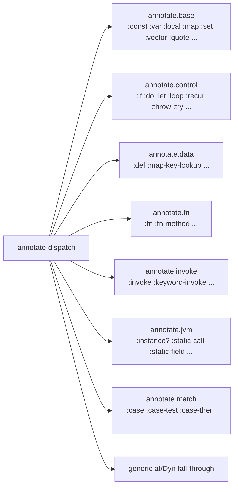

# Annotation: AST → Typed AST

> *Snapshot of state as of 2026-05-05.*

After admission produces the declaration dict, annotation walks each
top-level form's `tools.analyzer` AST and attaches a Type to every
node. The walk is *first-order*: it never invents a quantified Type.

## Prerequisites

[Spokes 03](03-type-domain.md), [04](04-provenance.md), and
[05](05-admission-paths.md). A passing familiarity with
`tools.analyzer` AST `:op` keys (the spoke names them but does not
teach them).

## Where this fits

Sixth on the Contributor path. After this spoke, the reader can open
any file in `skeptic.analysis.annotate.*` and orient quickly. The next
two spokes ([07](07-closed-sum-exhaustiveness.md),
[08](08-narrowing-and-origins.md)) cover the refinements layered on
top of the basic annotation pass.

## What annotation does

For each top-level form, the checker calls
`clojure.tools.analyzer.jvm/analyze` to get an analyzer AST, then
walks that AST attaching a Type to every node. The output is the same
AST shape with extra keys: `:type` on every node, sometimes
`:output-type` (on call-shaped nodes), sometimes `:origin` (on
local-binding nodes). Other phase-specific keys may appear and are
stripped before output.

The pass is *first-order*. That phrase has a precise meaning: the
annotation pass never produces a `ForallT`, `TypeVarT`, or
`SealedDynT`. Quantified types enter Skeptic only via admission (a
declared `^{:skeptic/type (forall [X] ...)}` override, say) or via
cast-time runtime traversal ([spoke 10](10-blame-for-all-and-projection.md)).
The annotator's job is to attach the *first-order* Type that the
analyzer can determine for each node, without speculating about
polymorphism the source code didn't express.

The first-order invariant matters because it lets the cast engine
treat quantified types as a separate channel. If the annotator
synthesized a `forall` whenever it saw a generic-looking shape, the
cast engine would have to handle quantified-vs-quantified casts
constantly. By keeping annotation first-order, quantified casts
remain a small and well-defined runtime mechanism.

## The dispatch on `:op`

`annotate-dispatch` in `skeptic/analysis/annotate.clj` is one big
`case` on the analyzer's `:op` key. There are 22 cases plus a
fall-through. Each case delegates to a sub-namespace —
`annotate.base`, `annotate.control`, `annotate.data`, `annotate.fn`,
`annotate.invoke`, `annotate.invoke-output`, `annotate.jvm`,
`annotate.match` — that owns the actual logic for that AST shape.
Unknown `:op`s fall through to a generic `at/Dyn` annotation, so
Skeptic never crashes on an unfamiliar AST node.

*Figure: The 22 `:op` cases, grouped by sub-namespace; one node per group.*



The dispatch is shallow on purpose: each sub-namespace owns its
shape entirely; the dispatcher is just a switchboard. Adding a new
`:op` (rare) means adding one branch to `annotate-dispatch` and
implementing the logic in the right sub-namespace.

## The annotated-node API

After annotation, the AST is no longer a plain analyzer AST — it
carries Skeptic-specific keys. Reading those keys directly inside
unrelated code would couple every reader to the node shape, making
the shape impossible to change.

`skeptic.analysis.annotate.api` is the public surface. It exposes:

- accessors: `node-op`, `node-form`, `node-type`, `node-output-type`,
  `node-origin`, `call-fn-node`, `call-args`, `function-methods`,
  `def-value-node`, `analyzed-def-entry`, …
- mutators: `with-type` (the only sanctioned way to attach a Type to
  a node).

The rule: code outside the `annotate.*` family must use the API.
Direct `(:type node)` or `(assoc node :type T)` is allowed *only*
inside the `annotate.*` files that own the node shape. The boundary
is enforced by review and by the API's documented purpose, not by
language-level access controls.

```clojure
;; ✓ inside annotate.control
(-> node
    (assoc :type joined-type)
    (assoc :origin branch-origin))

;; ✓ outside annotate.* — the API
(let [t  (aapi/node-type node)
      n2 (aapi/with-type node new-t)]
  ...)

;; ✗ outside annotate.* — reaches past the API
(:type node)
```

## Type overrides at annotation time

`^{:skeptic/type T}` metadata on an expression hooks into the
annotation pass via a private function `apply-type-override` inside
`annotate-node`. After the dispatcher has produced the inferred Type
for a node, `apply-type-override` checks the form's metadata for
`:skeptic/type`; if present, it converts the user-supplied schema
via `schema->type` (with `:type-override` provenance) and replaces
the inferred Type.

The user-supplied form must be a Plumatic Schema — the override
calls `schema->type`, not `malli-spec->type`. If `ab/schema-domain?`
returns false on the form, the override step throws with a clear
message. This prevents silently misusing the hook.

A note on Clojure metadata: bare literals (numbers, strings,
keywords) cannot carry metadata in Clojure. The user must wrap them:
`^{:skeptic/type s/Int} (identity 42)`. The rejection is at the
reader level; Skeptic doesn't see the override at all on bare
literals.

## How the worked example annotates

`classify`'s `:def` node wraps a `:fn` of one method (one arity,
fixed). The method's `:fn-method` body is the `cond` expression,
which the analyzer desugars into a chain of `:if`-tests. The
annotator walks the chain top to bottom:

- `(zero? n)` → a predicate node. The then-branch is `:zero` which
  annotates as `ValueT(:zero) : GroundT Keyword`.
- `(even? n)` → predicate; then-branch `:even` →
  `ValueT(:even) : GroundT Keyword`.
- `:else` → string `"odd"` → `GroundT Str`.

The `:if` annotator joins arms by union (after applying any
narrowing — see [spoke 08](08-narrowing-and-origins.md)). The
joined Type for the cond body is roughly:

```text
UnionT[ValueT(:zero), ValueT(:even), GroundT Str]
```

That joined Type becomes the `:fn-method` node's output Type, which
becomes the function's body output, which is what the cast engine
will compare against the declared `GroundT Keyword`.

`double-or-zero`'s annotation produces an `:if` whose test is
`(some? n)`. The narrowing layer (spoke 08) attaches assumptions to
the then- and else-branches, refining `n`'s Type within each. The
then-arm `(* 2 n)` annotates as `GroundT Int` (because by then `n`
is `GroundT Int`); the else-arm `0` annotates as `ValueT(0) :
GroundT Int`. The joined body is `GroundT Int`.

### In-depth: ctx-threading and the recursive runner

***Skip if reading the Gist path.***

The annotation pass is built around a recursive runner: the runner
function (`annotate-node`) owns recursion and ctx threading; the
sub-namespace annotators are non-recursive and call back into the
runner for child nodes.

The pattern, schematically:

```clojure
;; in annotate-node (the runner)
(defn annotate-node [ctx node]
  (let [op (:op node)
        annotator (annotate-dispatch op)]
    (annotator (assoc ctx :recurse #(annotate-node %1 %2))
               node)))

;; in annotate.control (a sub-namespace)
(defn annotate-if [ctx node]
  (let [recurse (:recurse ctx)
        test'   (recurse ctx (:test node))
        ;; derive then-ctx and else-ctx from test'
        then'   (recurse then-ctx (:then node))
        else'   (recurse else-ctx (:else node))]
    (-> node
        (assoc :test test')
        (assoc :then then')
        (assoc :else else')
        (assoc :type (join-types (:type then') (:type else'))))))
```

The runner threads its own self-reference via ctx so that
sub-namespace annotators never need to import each other. The
sub-namespace annotators are flat: they receive a ctx, build child
ctxs, recurse, aggregate. None calls another sub-namespace's
annotator directly.

This pattern shows up across the codebase. `annotate.control/annotate-if`
is the cleanest example: it accepts a ctx, derives child ctxs for
then/else (each carrying its own narrowed locals — see
[spoke 08](08-narrowing-and-origins.md)), recurses, then joins the
arms. The recursion is local; the helpers are non-recursive.

### In-depth: stripping derived types

***Skip if reading the Gist path.***

During annotation, the dispatcher and sub-namespace annotators
sometimes attach scratch keys — derived Types, intermediate origin
records, ConditionalT discriminator placeholders — that are useful
during the walk but should not survive into the cast engine's
input.

`abr/strip-derived-types` (in `skeptic/analysis/bridge/render.clj`)
is the cleanup pass. It walks the produced Type and removes the
scratch keys, leaving only the canonical record fields. The strip
runs at the end of every `annotate-form-loop` so by the time a
top-level form's Type reaches the cast engine, the scratch keys are
gone.

Why this matters: leaving scratch keys would pollute the dict and,
worse, confuse `at/type=?` (which compares all non-`:prov` fields).
A scratch key on one Type but not another would make two
shape-equal types compare unequal. Strip is the discipline that
keeps Type-shape equality stable.

## Marquee functions

| Function              | File                                          | Role                                                          |
|-----------------------|-----------------------------------------------|---------------------------------------------------------------|
| `annotate-node`       | `skeptic/analysis/annotate.clj`                | Top-level wrapper; runs dispatch + override + strip.           |
| `annotate-dispatch`   | `skeptic/analysis/annotate.clj`                | The `case` on `:op`; the central diagram.                      |
| `annotate-form-loop`  | `skeptic/analysis/annotate.clj`                | Analyzer + annotation, in one call.                            |
| `aapi/with-type`      | `skeptic/analysis/annotate/api.clj`            | Public setter; the only sanctioned way to attach a Type.       |
| `aapi/node-op`        | `skeptic/analysis/annotate/api.clj`            | Public reader; representative of the API style.                |
| `apply-type-override` | `skeptic/analysis/annotate.clj`                | The `^{:skeptic/type T}` hook; mentioned but not marquee.       |

## Worked example here

`classify`'s body annotation produces the union of three leaf types
shown above. The result feeds directly into
[spoke 07](07-closed-sum-exhaustiveness.md) (the cond's
exhaustiveness analysis) and [spoke 09](09-cast-dispatch.md) (the
cast against `GroundT Keyword`).

`double-or-zero`'s `:if` node is annotated; the resulting joined
body Type is `GroundT Int`. The full origin walk and narrowing
rules are in [spoke 08](08-narrowing-and-origins.md).

## Where to next

- **Continue (Contributor path):** [Closed-Sum Exhaustiveness (07)](07-closed-sum-exhaustiveness.md)
- **Return:** [Hub](README.md)
