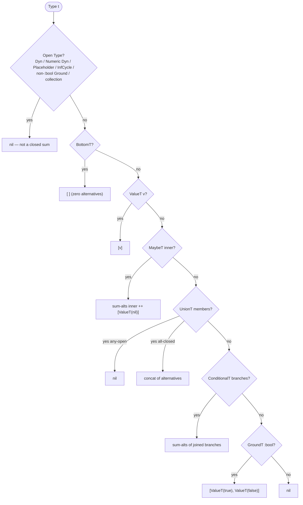

# Closed-Sum Exhaustiveness

> *Snapshot of state as of 2026-05-05.*

Some Types have a finite set of inhabitants — `MaybeT[T]` has its
inner alternatives plus `nil`; `GroundT :bool` has `true` and `false`;
a `UnionT` of `ValueT`s has whatever singletons are inside. When a
`case` or `cond` covers all alternatives of such a *closed sum*, the
default arm becomes unreachable and Skeptic drops it.

## Prerequisites

[Spoke 03](03-type-domain.md) (UnionT, MaybeT, ValueT, BottomT) and
[spoke 06](06-annotation-pass.md) (annotation produces the union you'll
be testing).

## Where this fits

Seventh on the Contributor path. Comes between annotation
([06](06-annotation-pass.md)) and narrowing
([08](08-narrowing-and-origins.md)) because closed-sum reasoning is a
property of *Types*, independent of flow-sensitive refinement, but it
is used by both annotation (deciding when a `case`'s default is
unreachable) and narrowing (deciding when a branch is impossible).

## What is a "closed sum"

A *closed sum* is a Type whose inhabitants can be enumerated finitely.
Skeptic's `sum-alternatives` function (`skeptic/analysis/sum_types.clj`)
recognizes:

- `BottomT` — zero alternatives.
- `ValueT v` — one alternative, the value `v`.
- `MaybeT[T]` — `T`'s alternatives plus `ValueT(nil)`.
- `UnionT[T₁ … Tₙ]` — the alternatives of every member, concatenated,
  *but only when every member is itself a closed sum*. A member that
  is open makes the whole union open.
- `ConditionalT` — the effective branches' Types, treated as a
  union.
- `GroundT :bool` — two alternatives: `ValueT(true)` and
  `ValueT(false)`.
- everything else — *not* closed.

Open Types are `Dyn`, `NumericDyn`, `PlaceholderT`, `InfCycleT`, plus
any non-`:bool` `GroundT` (`Int`, `Str`, `Keyword`, …) and the
collection Types. None of these has a finite inhabitant set, so
exhaustiveness doesn't apply to them.

The distinction matters. Exhaustiveness reasoning *only* applies to
closed sums. A `case` whose discriminator is a `GroundT Int` cannot
be exhausted by a finite list of arms (there are infinitely many
ints), so the default arm always remains reachable.

## `sum-alternatives`

`sum-alternatives` is the recursive enumerator. Its dispatch:

```text
open type             →  nil
BottomT               →  []
ValueT t              →  [t]
MaybeT inner          →  (sum-alternatives inner) ++ [ValueT(nil)]
UnionT members        →  (mapcat sum-alternatives members) — or nil if any member is open
ConditionalT branches →  (sum-alternatives (UnionT-of branch-types))
GroundT :bool         →  [ValueT(true), ValueT(false)]
else                  →  nil
```

`nil` means "this Type is open; no finite enumeration available."
`[]` (empty vector) means "this Type has zero alternatives" — i.e.,
`BottomT`. A non-empty seq is the actual alternative list.

The recursion is shallow: each kind asks for the alternatives of its
children, concatenates, and possibly adds its own constants
(`ValueT(nil)` for `MaybeT`, the two booleans for `GroundT :bool`).
There is no deeper analysis; if a member is open, the union is
open, full stop.

*Figure: `sum-alternatives` decision tree, drawn with example inputs at each branch.*



## Coverage and exhaustion

Two predicates use the alternative list.

`exhausted-by-types?` asks: "do these covered Types together cover
all alternatives of this sum?" It computes the sum's alternatives,
then walks the covered Types and removes each alternative they
match (using `at/type=?` for membership). If the alternative list
empties, the sum is exhausted.

`exhausted-by-values?` is a thin wrapper that builds `ValueT`s from
raw values first, then calls `exhausted-by-types?`. It's the
convenience shape called from `case` arm matching, where the user
wrote bare values rather than typed schemas.

Both predicates return `false` when the sum has no alternatives
(i.e., the Type is open). That's deliberate — an open Type cannot
be exhausted; the only honest answer is "no, this is not exhausted
by your covering set."

The auxiliary `sum-type?` is just `(boolean (seq (sum-alternatives
t)))` — "is this Type a closed sum with at least one alternative?"
It's used as a precondition before invoking `exhausted-by-types?`.

## Where it gets used

Exhaustiveness reasoning shows up in two places.

**Annotation of `case`.** When the annotator processes a `:case`
node, it joins the arms into a result Type. If the arms exhaust the
discriminator's sum, the *default* arm doesn't contribute to the
joined Type. The default arm's Type would otherwise widen the
result; dropping it lets Skeptic produce a tighter inferred Type.
This is what makes `case` over a boolean produce a Type that doesn't
include the default's contribution when both `true` and `false` are
covered.

**Narrowing's `assumption-truth`** ([spoke 08](08-narrowing-and-origins.md)).
When narrowing decides whether an assumption is statically `:always`
true, statically `:never` true, or `:dynamic`, it uses
`exhausted-by-types?` against alternatives. If the alternatives
positively-matched by the assumption cover the local's whole sum,
the assumption is `:always` true; if no alternative is matched, it's
`:never`. Otherwise `:dynamic`. The narrowing layer uses this to
collapse statically-decided branches.

## How the worked example exercises it

`classify`'s discriminator is `n :- s/Int`. Its inferred Type is
`GroundT Int`, which is *not* a closed sum (Int has infinitely many
alternatives). So `sum-alternatives` returns `nil`, and `case`-style
exhaustiveness doesn't apply: every cond arm including `:else`
remains reachable, and the joined result is a plain `UnionT` of all
arm Types.

For contrast, consider:

```clojure
(s/defn name-of-bool :- s/Keyword
  [b :- s/Bool]
  (case b
    true  :yes
    false :no))
```

Here the discriminator is `GroundT :bool`, a closed sum with two
alternatives. The arms cover both; the (implicit) default never
contributes. The joined result is `UnionT[ValueT(:yes),
ValueT(:no)]`, both of which are `Keyword`s and pass the cast
against the declared `GroundT Keyword` output.

The worked example doesn't run this path, but the contrast is the
point of the cluster.

### In-depth: `formulas-cover?` and the boolean prover

***Skip if reading the Gist path.***

Sometimes closed-sum reasoning isn't enough. Consider a narrowing
question like: "If we know `(string? x)` and we also know `(or
(integer? x) (keyword? x))`, can we conclude that `x` is a
`Keyword`?" The answer requires reasoning over conjunctions and
disjunctions of atomic propositions about the same value.

`formulas-cover?` runs a small bounded *truth-table prover* over a
bag of conjunctions and disjunctions of atomic propositions. Each
distinct atom (e.g., `(string? x)`, `(integer? x)`, `(keyword? x)`)
gets a propositional variable. The prover enumerates all 2^N
valuations of those variables and checks whether the formulas in
the bag are jointly satisfiable, contradictory, or determine the
truth of a target formula.

The bound is *12 atoms*. With 13+ atoms the prover refuses the
question rather than enumerate 8192+ valuations. In practice that
bound is generous: real Clojure code rarely accumulates more than 4
or 5 distinct predicate observations on a single value before the
local is shadowed or the function ends.

`formulas-cover?` is called from `assumption-truth` in
[spoke 08](08-narrowing-and-origins.md), specifically when the
assumption's positive side is a path-type-predicate and the
question is whether it's already implied by the active assumption
set. If the prover decides yes, the assumption is `:always`; if it
decides the negation, the assumption is `:never`; otherwise
`:dynamic`.

## Marquee functions

| Function               | File                                       | Role                                                                                       |
|------------------------|--------------------------------------------|--------------------------------------------------------------------------------------------|
| `sum-alternatives`     | `skeptic/analysis/sum_types.clj`            | The recursive enumerator; the spoke's central function.                                    |
| `exhausted-by-types?`  | `skeptic/analysis/sum_types.clj`            | The membership-cover predicate.                                                             |
| `exhausted-by-values?` | `skeptic/analysis/sum_types.clj`            | Convenience wrapper over `exhausted-by-types?` for raw values.                              |
| `sum-type?`            | `skeptic/analysis/sum_types.clj`            | "Is this Type a closed sum?" (`true` iff `sum-alternatives` returns a non-empty seq).       |
| `formulas-cover?`      | `skeptic/analysis/sum_types.clj`            | The bounded truth-table prover (≤ 12 atoms).                                                |

## Worked example here

`classify`'s cond is over `s/Int`, an open Type — closed-sum
reasoning is a no-op for it. The contrast example
(`name-of-bool`) above is the case where exhaustiveness *does*
apply.

`double-or-zero`'s argument is `MaybeT[GroundT Int]`. That *is* a
closed sum in name (its alternatives are "any Int" or `nil`), but
its first alternative — `GroundT Int` — is open, so the union of
the two is open. The result: closed-sum reasoning doesn't apply.
Narrowing in [spoke 08](08-narrowing-and-origins.md) handles
`MaybeT` cases through a different mechanism that doesn't require
exhaustiveness.

## Where to next

- **Continue (Contributor path):** [Narrowing and Origins (08)](08-narrowing-and-origins.md)
- **Return:** [Hub](README.md)
