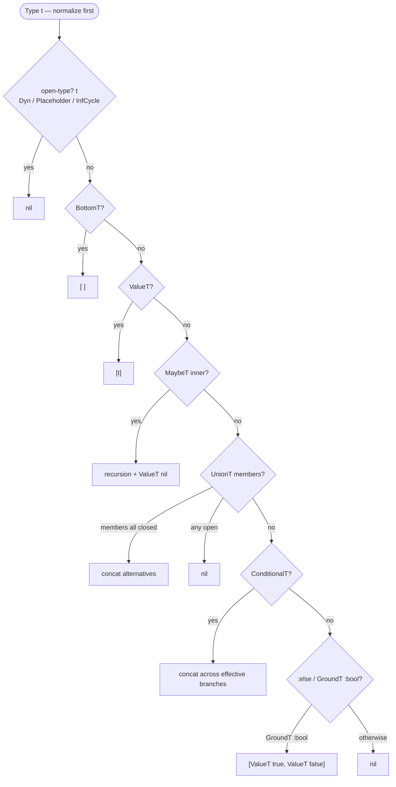

# Closed-Sum Exhaustiveness

> *Snapshot of state as of 2026-05-05.*

Some Types have a finite set of inhabitants — `MaybeT[ValueT(true),
ValueT(false)]` has three; `GroundT :bool` has two; a `UnionT` of
`ValueT`s has whatever singletons are inside. When a `case` or
`cond` covers all alternatives of such a *closed sum*, the default
arm becomes unreachable and Skeptic drops it from the joined result.
This spoke covers what counts as a closed sum, the recursive
enumerator that decides, the two predicates that consume the result,
and the bounded boolean prover that handles harder questions.

## Prerequisites

[Spoke 03](03-type-domain.md) (UnionT, MaybeT, ValueT, BottomT,
ConditionalT) and [spoke 06](06-annotation-pass.md) (annotation
produces the union you'll be testing for exhaustion). Light
familiarity with the idea that `(case x …)` and `(cond …)` desugar
to comparable AST shapes.

## Where this fits

Seventh on the Contributor path. Comes between annotation
([06](06-annotation-pass.md)) and narrowing
([08](08-narrowing-and-origins.md)) because closed-sum reasoning is
a property of *Types* — independent of flow-sensitive refinement —
but it is consumed by both annotation (deciding when a `case`'s
default is unreachable) and narrowing (deciding when an assumption
is statically `:always` or `:never` true).

## What is a "closed sum"

**This section teaches: which Types Skeptic treats as having a
finite enumerable inhabitant set, and why "closed" is the precise
word for the property.**

A *closed sum* is a Type whose inhabitants can be enumerated
finitely. The enumerator is `sum-alternatives` in
`skeptic/analysis/sum_types.clj`. It returns:

- `nil` if the Type is *open* — no finite enumeration is
  available.
- A *vector* of alternatives if the Type is closed. The vector
  may be empty (for `BottomT` — a closed sum with zero
  inhabitants).

Skeptic's "closed" notion is narrower than the conceptual one
might suggest. Concretely, the recognized closed-sum shapes are:

- **`BottomT`** — zero alternatives. No value inhabits it.
- **`ValueT v`** — one alternative, the Type itself.
- **`MaybeT[T]`** — `T`'s alternatives plus `ValueT(nil)`. Closed
  iff `T` is closed.
- **`UnionT[T₁ … Tₙ]`** — concatenated alternatives, *only when
  every member is itself a closed sum*. A single open member
  makes the whole union open.
- **`ConditionalT branches`** — the joined alternatives across
  effective branches (after narrowing's contribution to which
  branches are still possible).
- **`GroundT :bool`** — two alternatives: `ValueT(true)` and
  `ValueT(false)`.

Everything else — `Dyn`, `NumericDyn`, `PlaceholderT`,
`InfCycleT`, every non-`:bool` `GroundT`, every collection Type
(`MapT`, `VectorT`, `SeqT`, `SetT`), `FunT`, `RefinementT`,
`AdapterLeafT` — is open in this sense. Their inhabitant sets are
infinite or runtime-determined; no finite enumeration exists.

A subtle point worth pinning: `open-type?` (the predicate inside
`sum-alternatives`) only matches three kinds — `DynT`,
`PlaceholderT`, `InfCycleT`. Other Types that produce `nil` from
`sum-alternatives` get there by *falling through the cond and
ending up in `bool-alternatives`*, which returns `nil` for
anything that isn't `GroundT :bool`. So `Int`, `Str`, `Keyword`,
`Map`, `Vector`, etc. produce `nil` not by being "open" in the
predicate sense but by being "not a closed-sum shape." The
distinction matters when reading the source: `open-type?` is the
short-circuit fast path, not the complete definition of "open."

The reason `:bool` is the only ground type Skeptic enumerates is
practical: `Bool` has two inhabitants, so an arm covering both is
worth recognizing as exhausting; `Int` has 2^64+ inhabitants, so
no realistic `case` will ever cover them. The native admission
hand-codes the only Ground Skeptic enumerates; adding more would
just add false-exhaustiveness footguns.

## The `sum-alternatives` recursion

**This section teaches: the structure of the recursive enumerator
— seven cond branches in priority order — and why the recursion
is shallow.**

`sum-alternatives` is one `cond` over the input Type's normalized
form. Seven branches in priority order:

| Branch                     | Returns                                                                       |
|----------------------------|-------------------------------------------------------------------------------|
| `open-type?` (Dyn/Placeholder/InfCycle) | `nil`                                                                         |
| `bottom-type?`             | `[]` — zero alternatives                                                       |
| `value-type?`              | `[type]` — the Type itself is the only alternative                            |
| `maybe-type?`              | recursive call on inner, plus `ValueT(nil)` (or `nil` if inner is open)       |
| `union-type?`              | concatenated alternatives across members (or `nil` if any member is open)     |
| `conditional-type?`        | concatenated alternatives across effective branches                           |
| `:else`                    | `bool-alternatives` — `[true, false]` for `GroundT :bool`, else `nil`         |

The recursion is *shallow*. Each kind asks for the alternatives
of its children, concatenates, and possibly adds its own constants
(`ValueT(nil)` for `MaybeT`, the two booleans for
`GroundT :bool`). There is no deeper analysis of constituent
shape; if a member is open, the union is open, full stop.

The shallow rule is a deliberate choice. A deeper enumerator —
one that, say, considered an `IntersectionT` of Types — would
raise hard questions: when is an intersection of two closed sums
itself a closed sum (intersection of inhabitant sets), and when
would a non-trivial member break it? Skeptic chose to leave
intersection out of the closed-sum predicate entirely; an
intersection involving any non-singleton member is treated as
open. The cost is occasional false negatives (a closed sum that
Skeptic doesn't recognize); the benefit is a recursion small
enough to reason about line-by-line.

A second design choice: `nil` is the open marker. An empty
vector `[]` means *closed with zero inhabitants* — `BottomT`.
This distinction matters at the consumer side. Code that reads
`sum-alternatives` must check `nil?` first (the "I don't know"
case) before checking `empty?` (the "you're talking about
`BottomT`" case). Conflating them — treating `nil` and `[]` the
same way — would produce false-exhaustion verdicts on open Types.

*Figure: `sum-alternatives` decision tree, drawn with the cond
branches in priority order. `nil` means open; `[]` means closed-
with-zero; non-empty vectors are the alternative list.*



## Coverage and exhaustion

**This section teaches: how the alternative list is consumed by
two predicates, and what they collectively answer.**

Two predicates consume the alternative list.

**`exhausted-by-types?`** asks: "do these covered Types together
cover all alternatives of this sum?" It computes the sum's
alternatives, computes each covered Type's alternatives (recursing
through `cover-alternatives`, which falls back to `[type]` if the
covered Type isn't itself a sum), then checks that every
alternative in the sum is matched (via `at/type=?`) by some
covered alternative. If the sum's alternative list is `nil`
(open), the answer is `false` — open Types cannot be exhausted.

**`exhausted-by-values?`** is the convenience shape called from
`case` arm matching. The user wrote bare values (`true`, `false`,
`:zero`, `:even`); the predicate wraps each in a `ValueT` Type
using the sum's own provenance, then delegates to
`exhausted-by-types?`. The wrapping discipline is what lets
`exhausted-by-values?` compose with the same machinery
`exhausted-by-types?` uses.

Both predicates return `false` when the sum has no alternatives
(i.e., the Type is open). That's deliberate — an open Type
cannot be exhausted; the only honest answer is "no, not exhausted
by your covering set."

**`sum-type?`** is the auxiliary predicate that asks "is this Type
a closed sum with at least one alternative?" — `(boolean (seq
(sum-alternatives t)))`. Used as a precondition before invoking
`exhausted-by-types?`: code that wants to ask "do these arms
exhaust?" first checks "is the sum exhaustible?", and only then
proceeds.

A property worth noting: the membership check uses `at/type=?`,
not `=`. Two `ValueT(:zero)` Types from different sources are
shape-equal under `at/type=?` even though their `:prov` differs.
This is what lets a `case` arm written by the user — whose
`ValueT` carries `:source :inferred` from annotation — exhaust an
alternative carried by a `MaybeT` in the dict (whose `ValueT`s
carry `:source :schema`).

## Where exhaustiveness gets used

**This section teaches: the two consumers that act on
`exhausted-by-…?`'s verdict, and what each does with the answer.**

Two places consume the predicates.

**Annotation of `:case`.** When the annotator processes a `:case`
node, it joins the arms into a result Type. The naive join
includes the *default* arm's Type as one alternative. But if the
arms cover the discriminator's sum, the default is unreachable —
including its Type would falsely widen the result. The annotator
asks `exhausted-by-values?` (with the bare arm-test values
against the discriminator's Type); on `true`, it drops the
default's contribution from the join. So a
`(case bool true :yes false :no)` over a `Bool` discriminator
joins to `UnionT[ValueT(:yes), ValueT(:no)]`, not
`UnionT[ValueT(:yes), ValueT(:no), <default-Type>]`.

The cast layer downstream then sees the tighter Type and can
produce more specific findings — the joined result genuinely
*is* a Keyword union, not a Keyword-plus-whatever-the-default-
returned union.

**Narrowing's `assumption-truth`** ([spoke 08](08-narrowing-and-origins.md)).
When narrowing decides whether an assumption is statically
`:always` true, statically `:never` true, or `:dynamic`, it uses
`exhausted-by-types?` against alternatives. If the alternatives
positively-matched by the assumption cover the local's whole
sum, the assumption is `:always`; if no alternative is matched,
it's `:never`. Otherwise `:dynamic`. The narrowing layer then
collapses statically-decided branches: an `:always`-true test's
else-arm is dead code (the joined result drops it); an
`:always`-false test's then-arm is dead code (the join drops
it).

The two consumers share the predicate but use the verdict
differently. The `:case` consumer drops a contribution at *join*
time; the narrowing consumer drops a branch at *flow-control*
time. The shared predicate is what keeps the dropping rule
consistent across both.

## How the worked example exercises it

**This section teaches: that `classify`'s discriminator is open
(no exhaustiveness applies), and a contrast example shows where
it would.**

`classify`'s `cond` is over `n :- s/Int`. The discriminator's
inferred Type is `GroundT Int`, which is *not* a closed sum
(Int has infinitely many alternatives). So `sum-alternatives`
returns `nil`, and exhaustiveness doesn't apply: every arm
including `:else` remains reachable, and the joined result is a
plain `UnionT` of all arm Types
(`UnionT[ValueT(:zero), ValueT(:even), GroundT Str]`). The cast
against `GroundT Keyword` then fails on the `GroundT Str`
member.

A contrast that *does* exercise exhaustiveness:

```clojure
(s/defn name-of-bool :- s/Keyword
  [b :- s/Bool]
  (case b
    true  :yes
    false :no))
```

The discriminator is `GroundT :bool`, a closed sum with two
alternatives. The arms cover both. The implicit default's Type
is dropped from the join. The joined result is
`UnionT[ValueT(:yes), ValueT(:no)]`, both of which are
`Keyword`s and pass the cast against the declared `GroundT
Keyword` output. No finding.

The worked example doesn't run this path, but the contrast is
the point of the cluster — exhaustiveness is what makes
boolean-and-enum case-style code type-check tightly.

`double-or-zero`'s argument is `MaybeT[GroundT Int]`. *That* is
a closed sum *only if* its inner is closed. `GroundT Int` is
not closed, so `sum-alternatives` returns `nil` for the
argument's Type as a whole. The `MaybeT` doesn't get its
alternatives enumerated for exhaustion-style reasoning; instead,
narrowing in [spoke 08](08-narrowing-and-origins.md) handles
`MaybeT` cases through a *different* mechanism — the maybe-
target rule of the cast engine and the `(some? x)` /
`(nil? x)` test recognizers — that doesn't require
exhaustiveness.

### In-depth: `formulas-cover?` and the bounded boolean prover

***Skip if reading the Gist path.***

A contributor adding a new narrowing pattern that wants to
collapse logically-derivable conclusions hits the boolean prover
quickly. `sum-alternatives` answers "what are the inhabitants of
this Type?"; `formulas-cover?` answers "is this set of
propositional formulas jointly tautological over its atoms?"

The prover's setting: narrowing accumulates *assumptions* about
a value — `(string? x)` is true, `(integer? x)` is false, etc.
Each assumption can be a conjunction or disjunction over atomic
propositions. The narrowing question that requires the prover:
"given the active assumption set, is *this further assumption*
always true / always false / undetermined?"

`formulas-cover?` is the routine that decides the always-true
case, by asking "do these formulas cover every truth-valuation
of their atoms?" It works by a small bounded *truth-table
algorithm*:

1. **Extract atoms.** Walk every formula and collect the
   distinct atomic propositions. Each atom — a predicate
   form on the local — gets a propositional variable.
2. **Bail on size.** If there are more than **12 distinct
   atoms**, return `false` outright. With 13+ atoms the
   enumeration is 8192+ valuations, which is enough to slow
   the analyzer measurably. The bound is generous: real
   Clojure code rarely accumulates more than 4–5 distinct
   predicate observations on a single value before the local
   is shadowed or the function ends.
3. **Enumerate valuations.** For N atoms, generate all 2^N
   valuations using `bit-test` over `(range (bit-shift-left 1
   N))`. Each valuation is a `{atom → bool}` map.
4. **Check joint coverage.** For each valuation, check whether
   *some* formula in the bag is satisfied under it. If every
   valuation has at least one satisfying formula, the bag
   covers the truth space — return `true`.

The atom equality is `=` on the formula's `:expr` field, so two
syntactically-identical predicate calls (`(string? x)` and
`(string? x)`) collapse to one atom. Polarity is tracked
separately on the atom record: a literal `:atom` formula
records both the predicate and whether it's the positive or
negated assertion.

A subtle property worth knowing: the prover handles
*disjunctions* implicitly. If the active assumption set
contains `(or (integer? x) (keyword? x))` and a new question
asks "is `(or (integer? x) (keyword? x))` true?", the formula
appears in the bag and the question reduces trivially. But if
the question is "is `(integer? x)` true?", the prover must
enumerate valuations — and the `(or …)` formula will be
satisfied by both the integer-valuation and the keyword-
valuation, while the question's formula `(integer? x)` is only
satisfied by the integer-valuation. So the bag *doesn't* cover
all valuations, and the answer is "not always."

A contributor adding a new assumption shape needs to ensure the
shape becomes one of the three formula shapes the prover
recognizes (`:atom`, `:conjunction`, `:disjunction`). Anything
more — quantification, negated implication, equality between
two values — would require extending the prover, and the prover
is bounded for a reason. Most real Clojure narrowing patterns
fit the three shapes; the contributor who finds themselves
wanting more should ask whether the right answer is "use
`exhausted-by-types?` instead" or "leave the case `:dynamic`
and let the cast catch it."

### In-depth: why `MaybeT[Int]` is not closed

***Skip if reading the Gist path.***

A contributor reading the spoke might object: "but `MaybeT[Int]`
*does* have a finite-ish enumeration — `nil` plus any int. Why
isn't it closed?" The objection conflates two different
properties.

A *closed sum* in Skeptic's sense isn't just "finitely
classifiable." It's "every alternative can be written as a
single `ValueT`-shaped Type." The `nil` arm of `MaybeT[Int]`
satisfies this — it's `ValueT(nil)`. But the `Int` arm is
itself an open Type, not a single value. The recursion in
`maybe-alternatives` requires the inner's `sum-alternatives` to
be non-nil for the maybe to be closed, and `(sum-alternatives
GroundT-Int)` is `nil`.

The reason this matters: closed-sum reasoning's job is to let
the consumer (a `case` or an assumption-truth check) decide
*coverage* by enumerating arms against alternatives. A `case`
with arms `(case x nil :nil 0 :zero …)` against `MaybeT[Int]`
might cover `nil` and `0` but not the rest of `Int`'s
inhabitants — coverage by enumeration is impossible. So the
maybe is treated as open for exhaustiveness purposes, and the
default arm is always considered reachable.

There's an asymmetric case worth flagging: a `MaybeT` whose
inner is `BottomT` *is* closed. Its alternatives are just
`[ValueT(nil)]` — one inhabitant, the `nil` value. This is
unusual but representable; it shows up when narrowing has
refined a maybe so aggressively that the inner becomes
unreachable, and the `MaybeT[BottomT]` is effectively a
single-inhabitant Type. The `case` consumer correctly recognizes
that the `nil` arm exhausts it.

The same asymmetry applies to `MaybeT[ValueT(:zero)]`. Inner
is closed (one alternative); outer is closed (two:
`ValueT(:zero)` and `ValueT(nil)`). A two-arm case covering
both exhausts.

The pattern: closedness propagates from the inner upward; an
open inner makes the outer open, regardless of how the outer
wraps it.

## Marquee functions

| Function               | File                                       | Role                                                                                       |
|------------------------|--------------------------------------------|--------------------------------------------------------------------------------------------|
| `sum-alternatives`     | `skeptic/analysis/sum_types.clj`            | Recursive enumerator; the spoke's central function.                                       |
| `exhausted-by-types?`  | `skeptic/analysis/sum_types.clj`            | Coverage predicate over Type alternatives.                                                 |
| `exhausted-by-values?` | `skeptic/analysis/sum_types.clj`            | Convenience wrapper for raw values from `case` arms.                                       |
| `sum-type?`            | `skeptic/analysis/sum_types.clj`            | "Is this Type a closed sum with at least one alternative?"                                |
| `formulas-cover?`      | `skeptic/analysis/sum_types.clj`            | Bounded truth-table prover (≤ 12 atoms) for narrowing.                                     |

## Worked example here

`classify`'s cond is over `s/Int`, an open Type — closed-sum
reasoning is a no-op for it. Every cond arm including `:else`
contributes to the joined Type, which is why the failed cast
against `GroundT Keyword` exists at all (the `:else "odd"` arm
is what produces the `GroundT Str` member).

The contrast example (`name-of-bool` over `s/Bool`) above is the
case where exhaustiveness *does* apply.

`double-or-zero`'s argument `MaybeT[GroundT Int]` is also not a
closed sum — its inner is open. Narrowing handles maybe-shaped
arguments via a different mechanism in
[spoke 08](08-narrowing-and-origins.md).

## Glossary terms introduced

- Closed-sum exhaustiveness (the property)
- `sum-alternatives` (the enumerator)
- Open vs. closed Type (in this spoke's sense)
- Truth-table prover (`formulas-cover?`)

## Where to next

- **Continue (Contributor path):** [Narrowing and Origins (08)](08-narrowing-and-origins.md)
- **Return:** [Hub](README.md)
