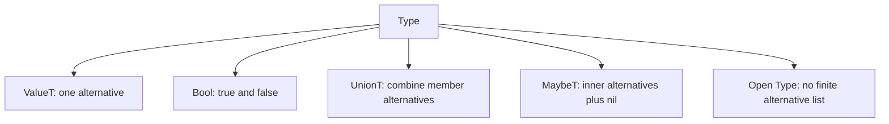

# Closed-Sum Exhaustiveness

The annotation pass introduced branch outputs. This spoke answers the next
reader question: when can Skeptic know that a branch structure has covered all
possible alternatives?

> **Snapshot:** state of Skeptic as of 2026-05-06.

## Prerequisites

[Type Domain (C04)](03-type-domain.md) for `UnionT`, `MaybeT`, `ValueT`, and
`BottomT`; [Annotation Pass (C06)](06-annotation-pass.md) for the way branch
nodes get inferred Types.

## Where this fits

Seventh on the Contributor path. It sits between basic annotation and narrowing:
closed-sum reasoning is about finite alternatives, and narrowing uses that
knowledge when deciding whether a branch is possible.

## What "Closed Sum" Means Here

A closed sum is a Type whose alternatives can be enumerated. An exact value has
one alternative. A boolean ground has two. A union of enumerable alternatives is
enumerable. A maybe Type is enumerable only if its inner Type is enumerable,
with nil added as another alternative.

An open Type such as `DynT` or an ordinary Int ground is not enumerable. There
are too many possible values, so Skeptic cannot prove coverage by listing them.

This distinction answers why two branch forms that look similar in source can
behave differently. A `case` over a finite literal union can prove its default is
dead. A `cond` over arbitrary integer predicates cannot, even if the programmer
believes the predicates cover the important cases.

*Figure: closed alternatives are enumerable; open alternatives stop the proof.*



## Coverage And Exhaustion

Once alternatives can be listed, coverage asks whether the tested arms cover all
of them. A `case` over a boolean that has both `true` and `false` arms is
exhaustive. A `case` over a string ground is not, because the possible strings
are not finite.

The reader should connect this to output Types. If the default arm is unreachable
because all alternatives were covered, its Type should not contribute to the
joined result. If the default is reachable, it must remain part of the result.

That is why exhaustiveness is not merely an optimization. It changes the inferred
Type that later casts see. Dropping an unreachable branch can turn a noisy union
into a precise value; keeping a reachable default can expose a real mismatch.

## Where Skeptic Uses It

Skeptic uses closed-sum reasoning in branch annotation and in branch assumptions.
For a `case`, exhaustive recognition can remove the default arm from the result.
For narrowing, the same style of proof can show that a test is always true,
always false, or still genuinely branchy.

This is not a proof of the whole program. It is a local finite-alternative proof.

The local nature matters. Skeptic can prove that `true` and `false` cover Bool
without proving anything about the rest of the program. Conversely, it will not
pretend that a set of numeric predicates exhausts all integers unless the Type
being tested has a finite set of alternatives.

## Worked Example Here

`classify` uses predicates over an Int:

```clojure
(cond
  (zero? n) :zero
  (even? n) :even
  :else     "odd")
```

The Int domain is not a closed finite set, so the `:else` branch is reachable.
That is exactly why `"odd"` remains part of the inferred output and can later
fail against the declared Keyword output.

This is the reader-state payoff: the string branch is not a documentation
artifact. It remains in the Type because the branch is reachable under the Type
Skeptic has for `n`.

For contrast, a boolean case can be exhaustive:

```clojure
(case b
  true  :yes
  false :no)
```

Here the two arms cover the finite alternatives of Bool.

If that boolean case had a default arm returning `"unexpected"`, exhaustiveness
would let Skeptic ignore that default for the joined output Type. The reader can
now predict the difference between a reachable default and a syntactically
present but unreachable one.

## Reader Checkpoint

Ask two questions before applying closed-sum reasoning:

1. Can Skeptic list the alternatives of the tested Type?
2. Do the tested arms cover those listed alternatives?

If the first answer is no, there is no exhaustiveness proof. If the second answer
is no, the default branch remains reachable. If both answers are yes, the
uncovered branch can disappear from the joined Type.

That small checklist prevents over-reading the feature. It is tempting to look at
`classify` and say that zero, even, and odd cover the interesting integer cases.
But Skeptic does not have a finite integer alternative list, and the source does
not encode "odd" as a closed-sum arm. The else branch is therefore live.

## Effect On Later Casts

Closed-sum reasoning changes the source Type that later reaches cast dispatch.
If an unreachable default is removed, the cast engine never sees that default's
Type. If a reachable default remains, the cast engine must check it like any
other alternative. This is why exhaustiveness lives before casting in the
walkthrough: it helps determine the source Type, not the compatibility rule.

### In-depth: Boolean Formula Coverage

***Skip if reading the Gist path.***

Some branch shapes are not plain value coverage. Skeptic also has a bounded
boolean-formula helper for small collections of propositions. The reader should
understand its role narrowly: when closed-sum membership is not enough, the
helper can still answer whether a small proposition set covers the cases.

## Source Pointers

- `skeptic/analysis/sum_types.clj:sum-alternatives` - enumerates alternatives when finite.
- `skeptic/analysis/sum_types.clj:exhausted-by-types?` - checks Type coverage.
- `skeptic/analysis/sum_types.clj:exhausted-by-values?` - checks raw value coverage.
- `skeptic/analysis/sum_types.clj:sum-type?` - recognizes closed sums.
- `skeptic/analysis/sum_types.clj:formulas-cover?` - bounded formula coverage helper.

## Glossary Terms Introduced

- Closed-sum exhaustiveness
- Bottom type
- Coverage

## Where To Next

- **Continue (Contributor path):** [Narrowing and Origins](08-narrowing-and-origins.md)
- **Return:** [Hub](README.md)
