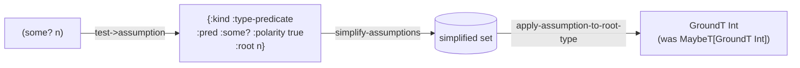
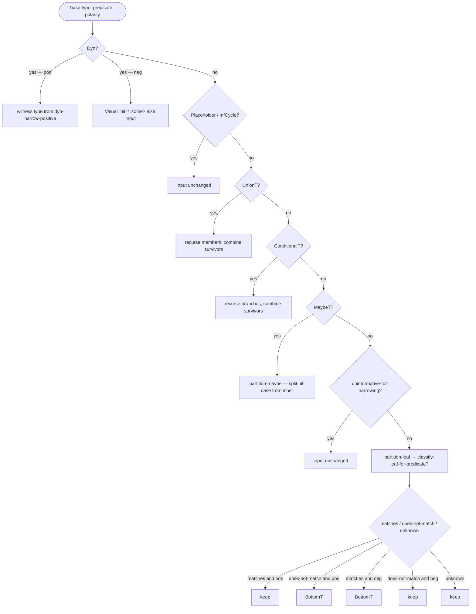

# Narrowing and Origins

> *Snapshot of state as of 2026-05-05.*

Narrowing is how Skeptic refines a local's Type along a branch —
`(some? n)` says "in the then-arm, `n` is not nil." The mechanism
splits into three concerns that other type-checkers sometimes mix:
*assumptions* (facts proved by tests), *origins* (where a local came
from), and *types* (the result of refining the origin's Type by the
active assumptions). This spoke walks each piece, the dispatcher
tables that decide what to do, and the worked example end-to-end.

## Prerequisites

[Spoke 03](03-type-domain.md) (UnionT, MaybeT, ValueT, BottomT,
ConditionalT), [spoke 06](06-annotation-pass.md) (annotation
produces the typed AST narrowing operates on), and
[spoke 07](07-closed-sum-exhaustiveness.md) (closed-sum reasoning
is what `assumption-truth` calls into for static `:always`/`:never`
verdicts). Comfort with the idea that a value's Type can change
between branches based on what was tested.

## Where this fits

Eighth on the Contributor path. Closes the annotation half of the
pipeline. The next spoke ([09](09-cast-dispatch.md)) covers the
cast engine, which consumes the narrowed Types this spoke produces.
A reader on the Diagnose-finding path skips this spoke (narrowing
is upstream of the cast and irrelevant to backward-tracing a
failing finding).

## The split: assumption → origin → type

**This section teaches: that Skeptic's narrowing keeps three
concerns separate that often get mixed elsewhere, and why the
separation pays off.**

Skeptic separates three concerns:

**Assumptions** are the *facts* proved by a test expression.
`(some? n)` proves an assumption "`n` matches the predicate
`some?`, positively." `(= x :foo)` proves "the value of `x` equals
`:foo`." `(:k m)` returning truthy proves "the result of looking
up `:k` in `m` is truthy." Assumptions are flow-sensitive — they
hold inside one branch and not its sibling — and they accumulate
as the analyzer enters nested branches.

**Origins** record *how a value got into the locals map*. A
function parameter has origin `:root` (qualified by the
parameter's symbol). A `let` binding whose Type is known but
whose identity is opaque gets `:opaque`. A `(:k m)` lookup,
recognized as a known accessor, produces a `:map-key-lookup`
origin tagged with the root local and the path. An `if` that
produces a value whose Type depends on its test produces a
`:branch` origin carrying the test plus the per-arm origins.

**Types** are the *result* of refining the origin's Type by the
active assumptions. A parameter `n :- (s/maybe s/Int)` has root
origin and base Type `MaybeT[GroundT Int]`. Inside the then-arm
of `(some? n)`, the active assumption set includes
`{:type-predicate :some? polarity true}` rooted at `n`. Applying
that assumption to `MaybeT[GroundT Int]` removes `nil` from the
union, leaving `GroundT Int`.

Why this split matters: each piece has a different lifecycle.

- **Origins are immutable once created.** A parameter's
  `:root` origin is created when the binding is established; it
  never changes. A `:map-key-lookup` origin is created when the
  let-binding form `(let [k (:k m)] …)` is recognized; it never
  changes. The locals map is keyed by local-binding name; the
  value is `{:type base-type :origin origin-record}`.
- **Assumptions accumulate and shrink.** As the analyzer enters
  the then-branch of an `:if`, it adds the test's assumption (or
  its inverse) to the active set. As it leaves the branch, the
  set reverts. The set lives in the ctx; the recursive runner
  ([spoke 06](06-annotation-pass.md#in-depth-ctx-threading-and-the-recursive-runner))
  threads it through every child.
- **Types are derived on demand.** The local's *current* Type is
  not stored as a primary attribute that could go stale. Instead,
  `effective-type` walks the local's origin and applies every
  assumption that targets that origin's root, producing the
  refined Type each time it's needed.

The alternative — storing a Type per local per branch — is what
makes other type-checkers' narrowing logic hard to extend. Each
new test shape would force updating "the current Type" in every
branch, and forgetting one would silently produce stale Types.
The origin/assumption split lets Skeptic add a new test shape by
adding (a) an assumption-kind constructor and (b) a branch to
`apply-assumption-to-root-type`. The locals layer doesn't change.

*Figure: Test → assumption → simplify → apply, on
`double-or-zero`'s `(some? n)`. The four arrows are the four
non-trivial operations the narrowing layer performs.*



## Assumption kinds

**This section teaches: the catalogue of assumption kinds and
which test shapes produce each.**

There are 12 assumption kinds in `skeptic/analysis/origin.clj`.
Each is a small map shape; each has a constructor; each is
documented in the schema namespace.

| Kind                       | Constructor                          | Carries                                      |
|----------------------------|--------------------------------------|----------------------------------------------|
| `:type-predicate`          | `type-predicate-assumption`           | `:root :pred :polarity` (and `:class` for `:instance?`) |
| `:value-equality`          | `value-equality-assumption`           | `:root :values :polarity`                    |
| `:path-type-predicate`     | `path-type-predicate-assumption`      | `:root :path :pred :polarity` (and `:class`) |
| `:path-value-equality`     | `path-value-equality-assumption`      | `:root :path :values :polarity`              |
| `:contains-key`            | `contains-key-assumption`             | `:root :key :polarity`                        |
| `:truthy-local`            | `truthy-local-assumption`             | `:root :polarity`                             |
| `:blank-check`             | `blank-check-assumption`              | `:root :polarity`                             |
| `:boolean-proposition`     | (built inline)                        | `:expr :polarity` (no root in the same sense) |
| `:conditional-branch`      | (built by the `:if` annotator)        | `:narrowed-type`                              |
| `:conjunction`             | `conjunction-assumption`              | `:parts`                                      |
| `:disjunction`             | `disjunction-assumption`              | `:parts`                                      |
| `:contradicted`            | (literal value)                       | (no fields)                                   |

Most kinds carry a `:polarity` flag. The boolean kinds are
*invertible* via `invert-assumption`, which swaps polarity (so
`:type-predicate :some? true` becomes `:type-predicate :some?
false`) or, for compound kinds, applies De Morgan (a
`:conjunction` of invertible parts becomes a `:disjunction` of
each part's negation). `:conjunction` of non-invertible parts and
plain `:disjunction` cannot be inverted (returning `nil`); the
caller must handle that case explicitly.

The `:contradicted` kind is special. It's the marker that the
assumption set is internally contradictory (a simplification step
detected `A ∧ ¬A`). When `apply-assumption-to-root-type` sees
`:contradicted`, it returns `BottomT` regardless of the input
Type. Downstream code reading a `BottomT` understands "this branch
is unreachable" — the closed-sum machinery treats it as zero
inhabitants, the cast engine treats it as a bottom-source success.

The `:boolean-proposition` kind is the *opaque carrier* for tests
Skeptic doesn't recognize as a more specific shape. The narrowing
layer can't refine a Type from a `:boolean-proposition` (no shape
to project onto), but the assumption stays in the set so combinator
reasoning (the boolean prover in
[spoke 07](07-closed-sum-exhaustiveness.md#in-depth-formulas-cover-and-the-bounded-boolean-prover))
can still combine it with other assumptions.

## `test->assumption` — recognizing test shapes

**This section teaches: how a `:test` AST node becomes an
assumption (or `nil` if Skeptic doesn't recognize the shape).**

`test->assumption` is the dispatcher that reads an analyzer test
node and produces an assumption. Its dispatch is a 13-branch
`cond` plus an `:else` fallback (14 total). The branches are tried
in order, and the first match wins. The shapes recognized:

| Branch | Test shape                                           | Result                                              |
|--------|------------------------------------------------------|-----------------------------------------------------|
| 1      | A *stable-identity* local (truthy position)          | `:truthy-local` true                                |
| 2      | `(instance? C x)` (analyzer `:instance?` op)         | `:type-predicate :instance? :class C` true          |
| 3      | `(not <inner>)` — invoke + not-call-sym              | `invert-assumption(<inner>)`                        |
| 4      | `(= x literal)` — invoke + equality-call-sym         | `:value-equality` or `:path-value-equality`         |
| 5      | static-call equivalent of `=`                         | as above                                            |
| 6      | An invoke whose fn is a recognized predicate        | `:type-predicate` or `:path-type-predicate`         |
| 7      | `(clojure.string/blank? s)` — blank-call-sym         | `:blank-check` true                                 |
| 8      | `(:k m)` — keyword-invoke on a local                 | `:contains-key`                                     |
| 9      | `(contains? m :k)` — contains-call-sym               | `:contains-key`                                     |
| 10     | static-call equivalent of `contains?`                | as above                                            |
| 11     | static-call equivalent of `nil?`                     | `:type-predicate :nil?`                             |
| 12     | a `:let` whose body is itself a recognized test      | recurse on the body                                  |
| 13     | an `:if` whose then-branch is a recognized test      | recurse on the then-branch                           |
| `:else`| anything else                                        | `:boolean-proposition` or `nil`                       |

Several non-obvious behaviours are worth flagging.

The `:not` branch (3) inverts the inner assumption *if it's
invertible*. `(not (some? n))` produces a `:type-predicate :some?`
with negated polarity. `(not (or (string? x) (integer? x)))`
produces nothing — the inner is a `:disjunction`, which isn't
invertible — so the negation falls through to
`:boolean-proposition` or to `nil`. Skeptic prefers an honest "I
don't know" over a guessed assumption.

The `:let` branch (12) and `:if` branch (13) handle test shapes
the analyzer macroexpands. `(when-let [b expr] body)` macroexpands
to `(let [b expr] (if b body nil))`; the test in the resulting
`:if` is the local `b`, which by itself proves nothing. The let-
recurse rule lets `test->assumption` see *through* the let to the
underlying test expression.

The `:else` branch is the fallback. If the test node has a Type
that is exhausted by `[true false]` (i.e., the test is statically
boolean) and isn't already a stable-identity local,
`boolean-proposition-assumption` wraps it as a
`:boolean-proposition`. Otherwise the result is `nil` — the
caller treats nil as "no assumption to add, treat the branch as
open."

The dispatch is closed: anything not on the list becomes
`:boolean-proposition` (or nil). That's intentional — Skeptic
prefers "opaque but combinable" over "guess at the meaning." The
contributor adding a new test shape adds a branch to
`test->assumption` (in priority order against the existing
branches), an assumption-kind constructor in `origin.clj`, and a
branch in `apply-assumption-to-root-type` to consume it.

## Origin kinds

**This section teaches: the four origin kinds, how each is built,
and what each enables downstream.**

Origins live in the locals map alongside the local's Type. There
are four kinds:

- **`:root`** — a function parameter or a top-level binding. Built
  by `root-origin sym type`. Carries the parameter's symbol so
  cross-namespace assumptions can target it (the local `n` in
  `double-or-zero` has root sym `'n`; assumptions about `n`
  identify by symbol).
- **`:opaque`** — a wrapping for values whose Type is known but
  whose identity is not. Typical of `let`-bound values whose
  binding expression is a non-recognized call. Built by
  `opaque-origin type`. An opaque origin's `origin-type` returns
  its `:type` directly without consulting assumptions; assumptions
  rooted at this local's symbol don't apply to opaque origins
  because there's no root to attach to.
- **`:map-key-lookup`** — built by accessor-summary detection in
  admission's `analyzed-def-entry`. Tags the local as "the result
  of `(:k m)`" or a longer path, carrying the root local and the
  path. Built by `map-key-lookup-origin root path defaults`. This
  origin is what lets `:path-value-equality` and
  `:path-type-predicate` target the right path.
- **`:branch`** — built when an `if` produces a value whose Type
  depends on its test. Carries the test plus the per-arm origins.
  Built by `branch-origin test then-origin else-origin`. The
  `origin-type` of a branch origin consults `assumption-truth` on
  the test: `:true` returns the then-origin's Type, `:false`
  returns the else-origin's Type, otherwise the join of both.

Origins are immutable once created. The locals map is keyed by
local-binding name; the value is `{:type base-type :origin
origin-record}`. Refining the local produces a new Type but does
*not* mutate the origin. That's why the recursive runner pattern
([spoke 06](06-annotation-pass.md#in-depth-ctx-threading-and-the-recursive-runner))
can derive child ctxs cleanly: the child sees the same origin,
just with a refined Type and additional assumptions.

The `:branch` origin is the structural home for `ConditionalT`'s
discriminator slot. When the project-state pass enriches
conditional descriptors ([spoke 03](03-type-domain.md#in-depth-conditionalt-and-the-discriminator-back-fill)),
it walks branch origins and back-fills the discriminator from the
recognized observable in the test. So `:branch` is what makes
`ConditionalT` work end-to-end.

## Refining a Type by assumptions

**This section teaches: the dispatch table that maps an
assumption kind to a refining function, and what each function
does.**

`apply-assumption-to-root-type` is the dispatch table. Given a
base Type and an assumption, it produces a refined Type. The
literal cases in priority order:

| Assumption kind             | Refines via                                                                 |
|-----------------------------|-----------------------------------------------------------------------------|
| `:contradicted`             | returns `BottomT`                                                            |
| `:truthy-local`             | `apply-truthy-local` — drops nil/false from unions/maybes                   |
| `:blank-check`              | non-blank means the inner is a non-empty string; refines via `partition-type-for-predicate` with `:some?` then `:string?` |
| `:contains-key`             | `amo/refine-by-contains-key` — adjusts `MapT` entries                        |
| `:type-predicate`           | `partition-type-for-predicate`                                              |
| `:value-equality`           | `partition-type-for-values`                                                 |
| `:path-value-equality`      | `amo/refine-map-path-by-values`                                             |
| `:path-type-predicate`      | `amo/refine-map-path-by-predicate`                                          |
| `:conditional-branch`       | returns the assumption's `:narrowed-type` directly                          |
| (default — `:boolean-proposition`, `:conjunction`, `:disjunction`) | no-op (Type unchanged; the assumption stays for combinator reasoning) |

Two things worth internalizing.

The default branch is *not* a no-op for *narrowing* — it returns
the Type unchanged. But the assumption *stays in the active set*.
Why? Because `assumption-truth` (which decides if a later
assumption is statically true/false) reads the active set
including these "no-op for type" entries. A `:boolean-proposition`
assumption can't refine a Type, but it can refute a later
assumption that would have been added.

`:conjunction` and `:disjunction` are no-ops at this layer
because their components are individually applied via
`expand-assumptions-once` in `simplify-assumptions`. By the time
`apply-assumption-to-root-type` runs on a refined-locals build,
the conjunction has been hoisted to its parts; the disjunction
has either been collapsed (if all-but-one part is refuted) or
left as the disjunction. So the dispatcher doesn't need a special
case for them.

A subtle property of `:contradicted`: it always returns
`BottomT`, regardless of the base Type. This means a single
contradicted assumption in the active set makes *every* local
narrow to `BottomT`. That's the right answer — if the assumption
set is internally inconsistent, no value can satisfy it, so every
local in scope is unreachable.

## Narrowing primitives

**This section teaches: the two workhorses
(`partition-type-for-predicate`, `partition-type-for-values`) and
their dispatch shapes.**

`partition-type-for-predicate` is the primary refining function.
It takes a Type, a predicate descriptor, and a polarity, and
returns the Type refined to "the part that matches" (positive
polarity) or "the part that does not match" (negative polarity).
The dispatch is in `partition-type-for-predicate*` —
**7 cond branches** plus an `:else` that calls `partition-leaf`:

| Branch                         | Shape                                                                                                |
|--------------------------------|------------------------------------------------------------------------------------------------------|
| `dyn-type?`                    | If polarity true: try `dyn-narrow-positive` (e.g., `:string? → GroundT Str`); else `dyn-narrow-negative`. Fall back to the input Dyn unchanged if no specialization. |
| `placeholder-type?`            | Return unchanged (recursive types are not refined here).                                              |
| `inf-cycle-type?`              | Return unchanged.                                                                                     |
| `union-type?`                  | Recurse on each member; combine survivors via `combine-parts` (which drops `BottomT`s and unifies).  |
| `conditional-type?`            | Recurse on effective branches; combine like union.                                                    |
| `maybe-type?`                  | `partition-maybe`: classify nil against the predicate (matches/does-not-match/unknown) and split.    |
| (uninformative for narrowing)  | Return unchanged.                                                                                     |
| `:else`                        | `partition-leaf`: ask `classify-leaf-for-predicate?` and either keep, drop (→ `BottomT`), or pass.   |

`classify-leaf-for-predicate?` is the leaf-level classifier. It
asks "given this leaf Type and this predicate, does the leaf
*match*, *not-match*, or is the answer *unknown*?" The dispatch
is large — about **20 outer cond branches**: 11 short-circuit
cases that return `:unknown` (Refinement, AdapterLeaf,
Intersection, TypeVar, Forall, SealedDyn, Var, plus Dyn /
Placeholder / InfCycle), 3 cases with their own inner predicate
case (`value-type`, `ground-type`, `numeric-dyn-type`), 5
collection-shaped cases (Map, Vector, Set, Seq, Fun, each with a
4-clause inner case), and an `:else → :unknown`.

The inner predicate-case for value-type and ground-type covers
the same 14 named predicates: `:nil?`, `:some?`, `:string?`,
`:keyword?`, `:integer?`, `:number?`, `:boolean?`, `:symbol?`,
`:map?`, `:vector?`, `:set?`, `:seq?`, `:fn?`, `:instance?`. The
verdict for each is computed against the leaf's stored value
(value-type) or ground tag (ground-type). For numeric-dyn the
case is similar but knows that a numeric-dyn matches any number-
related predicate.

The classifier's three-valued return (`:matches`,
`:does-not-match`, `:unknown`) is what makes
`partition-type-for-predicate` honest. `:unknown` means "I can't
tell," and the partition returns the input unchanged on those
cases — refusing to commit a refinement that might be wrong.

`partition-type-for-values` is the equality-shaped sibling. It
takes a Type, a list of values, and a polarity, and returns the
part of the Type whose value-set is included in the literal list
(positive) or excluded (negative). It dispatches on union/
conditional/maybe (recursing) and falls through to
`partition-values-leaf` which is a smaller cond on `dyn`,
`value-type` (compares the leaf's value to the list), and a
default that drops everything for positive (no value-type to
match) and keeps everything for negative.

## How the worked example narrows

**This section teaches: the literal walk through
`double-or-zero`'s body, naming what each step produces.**

`double-or-zero`'s body is `(if (some? n) (* 2 n) 0)`. Walking
it:

1. **Binding setup.** The argument `n` is bound with origin
   `:root` (with sym `'n`) and base Type `MaybeT[GroundT Int]`
   from the declared `(s/maybe s/Int)`.
2. **The `:if` annotator inspects the test.** `(some? n)` is an
   `:invoke` of `clojure.core/some?` with one argument, the
   stable-identity local `n`. `test->assumption` matches branch 6
   (recognized predicate) and produces
   `{:kind :type-predicate :pred :some? :root <root-origin-of-n>
   :polarity true}`.
3. **The annotator builds two child ctxs.** The then-ctx adds the
   assumption with positive polarity; the else-ctx adds it with
   inverted polarity (`{:kind :type-predicate :pred :some?
   :polarity false}`). Both child assumption sets are simplified
   by `simplify-assumptions` (no-op here — neither set has
   collapsible disjunctions).
4. **In the then-ctx, `effective-type` runs.** It calls
   `refine-root-type` on `n`'s origin, which folds
   `apply-assumption-to-root-type` over each applicable
   assumption.
   - The `:type-predicate :some?` assumption dispatches to
     `partition-type-for-predicate`.
   - The base is `MaybeT[GroundT Int]`. Branch 6 of
     `partition-type-for-predicate*` fires (`maybe-type?`).
   - `partition-maybe` classifies `nil` against `:some?`:
     `:does-not-match`. Then it partitions the inner `GroundT Int`
     against `:some?` positive — `partition-leaf` calls
     `classify-leaf-for-predicate?` which returns `:matches` for
     ground-Int against `:some?`. So the inner positive is
     `GroundT Int`, the inner negative is `BottomT`.
   - The polarity is true; `nil` doesn't match; so the result is
     just the inner positive: `GroundT Int`.
   - Refined type for `n` in the then-branch: `GroundT Int`.
5. **`(* 2 n)` annotates as a binary `:invoke` of
   `clojure.core/*`.** The native admission of `*` has a binary
   `FnMethodT` with inputs `[NumericDynT NumericDynT]` and output
   `NumericDynT`. The call's input cast pairs are `(GroundT Int)`
   against `NumericDynT` (passes via leaf-overlap, see
   [spoke 09](09-cast-dispatch.md)). The call's output Type is
   `NumericDynT`.
6. **In the else-ctx, the inverted assumption applies.** Same
   dispatch: `partition-type-for-predicate` on `MaybeT[GroundT
   Int]` with `:some?` polarity false. `partition-maybe`
   classifies `nil` as `:does-not-match` for `:some?`; with
   polarity false, the nil case returns `:matches`. The inner
   `GroundT Int` against `:some?` negative is `BottomT`.
   Combine: just `ValueT(nil)`. Refined type for `n` in the
   else-branch: `ValueT(nil)`.
7. **The else-arm `0` annotates as `ValueT(GroundT :int 'Int) 0`.**
   The local `n` is in scope but unused; its else-branch
   refinement to `ValueT(nil)` doesn't affect this annotation.
8. **The `:if` joins the arms.** `av/join` (with anchor prov from
   the `:if` node's ctx) takes `[NumericDynT, ValueT(0)]` and
   produces a union. After deduplication and simplification, the
   joined Type fits `GroundT Int` for cast purposes (NumericDyn
   overlaps Int via leaf-overlap; the literal 0 is also Int). The
   declared output `GroundT Int` is satisfied. No finding.

The full annotation walk threads the assumption through the
recursive runner: every child ctx the runner derives from the
parent inherits the parent's locals and the active assumption
set, modified by whatever the parent's annotator added.

*Figure: `partition-type-for-predicate` decision tree,
abbreviated to the eight most-used outer cond branches plus the
leaf-classifier dispatch.*



### In-depth: `simplify-assumptions` and the disjunction-collapse fixpoint

***Skip if reading the Gist path.***

A contributor adding new test shapes that produce disjunction-
shaped assumptions — `(or (string? x) (integer? x))`,
`(or (= status :ok) (= status :pending))` — needs to know how
the active set absorbs them.

After accumulating assumptions on a branch, the set may contain
disjunctions whose parts are individually refuted by the rest of
the set. `simplify-assumptions` is a fixpoint pass that hoists
the unique surviving alternative.

The literal mechanism (paraphrased):

```text
{(or A B C), ¬A, ¬B}
─────────────────────
expand-assumptions-once: ¬A and ¬B refute the first two parts of
the disjunction; the only surviving part is C. Hoist C and drop
the disjunction:

{C, ¬A, ¬B}

expand-assumptions-once again: nothing changes. Fixpoint.
```

The pass iterates `expand-assumptions-once` until the result
equals the input — that is, until `=` returns true on consecutive
iterations. Termination is guaranteed because each non-fixpoint
iteration either reduces the set's size (a 0-survivor disjunction
becomes `:contradicted`) or replaces a disjunction with a strictly-
smaller part (a 1-survivor disjunction becomes one of its parts).
Both quantities are bounded below by zero.

A subtle behaviour: `expand-assumptions-once` decides whether a
disjunction part is refuted by calling `assumption-truth` against
*the rest of the set*. If `assumption-truth` returns `:false`, the
part is refuted; if `:true` or `:unknown`, the part survives. So
the simplification is incremental — it only collapses
disjunctions whose refutation is provable from other facts already
in the set.

The contributor adding a new shape needs to ensure the new shape
is recognized by `assumption-truth` if the contributor wants the
shape to participate in disjunction collapse. A new
`:type-predicate` for a recognized predicate already participates
(via `type-predicate-classification`); a new `:contains-key`
already participates (via `contains-key-type-classification`). A
shape that only `:apply-assumption-to-root-type` knows how to use
won't refute disjunction parts on its own.

The cost is bounded: real assumption sets are tiny (a handful of
facts at any one branch entry), so even a naive O(N²) refutation
check is cheap. The bound on `formulas-cover?` (≤ 12 atoms — see
[spoke 07](07-closed-sum-exhaustiveness.md#in-depth-formulas-cover-and-the-bounded-boolean-prover))
is the only place the cost grows non-trivially.

### In-depth: `region-conjuncts` and the let+if shape recognizer

***Skip if reading the Gist path.***

A contributor wondering why `(or x y)` and `(when-let [b expr] body)`
produce the right narrowing — even though their macroexpansion
hides the test — needs the `region-conjuncts` mechanism.

`(or x y)` macroexpands to `(let [b x] (if b b y))`. Naively, the
let-bound `b` would not get its narrowing right: the test in the
`if` is just the symbol `b`, which by itself proves only
`:truthy-local` on `b`. The deeper fact — that `x` is truthy in
the then-region and statically falsy in the `y`-region — is lost.

`region-conjuncts` recognizes the `(let [b test] (if b a c))`
shape (and its mirror `(let [b test] (if b a c))` regardless of
arm order). When recognized, it derives per-region conjuncts by
walking the structural pattern:

- For `(if g g y)` (test re-used as then-arm): the false-region
  is `¬g ∧ ¬y` (a conjunction of negated tests); the true-region
  is the De-Morgan negation of the false-region's conjunction
  (which the function builds via `negate-conjunct-list`).
- For `(if g y g)` (test re-used as else-arm): the symmetric
  shape — true-region is `g ∧ y`, false-region is the
  negation.
- For non-recognized shapes: the leaf form's conjuncts are just
  `[primary, init-assumption]` for the then-region (the test's
  own assumption plus the let-init's assumption if applicable)
  and the inverted versions for the else-region.

So `(or x y)` macroexpanding to `(let [b x] (if b b y))`
produces correct narrowing in `y`'s region: `x` is statically
falsy there (because the disjunction has been negated). The
`alias-map` carrying `b → x` lets the recognizer follow the
let-bound symbol back to its init expression.

A non-obvious property: `region-conjuncts` is *purely
structural*. It doesn't know that `or` macroexpands to this
shape; it just recognizes the shape itself. So `(when-let [b
expr] body)` and `(if-let [b expr] body)` and
`(when-some [b expr] body)` all benefit from the same
recognizer, even though Skeptic doesn't have a list of known
macros to handle.

`branch-local-envs` is the public entry point that combines
`region-conjuncts`, `simplify-assumptions`, and
`refine-locals-for-assumption` into per-branch envs. Its return
shape — `{:then-locals :then-assumptions :else-locals
:else-assumptions}` — is what the `:if` annotator hands to its
two child ctxs. It also has a fast path: if the simplified
then-assumptions equal the simplified else-assumptions (which
happens when both arms add no new assumptions), it shares the
refined locals between branches to avoid redundant work.

### In-depth: `assumption-truth` and the three-valued logic

***Skip if reading the Gist path.***

A contributor adding a new assumption kind that should
participate in disjunction collapse, contradiction detection, or
dead-branch elimination needs to know what `assumption-truth`
expects.

`assumption-truth` answers "given this assumption set, is *this
candidate assumption* statically true, statically false, or
undetermined?" The return is `:true`, `:false`, or `:unknown`.
The dispatch:

1. **Direct match.** If any assumption in the set is
   `same-assumption?` to the candidate, return `:true`. The
   `same-assumption?` predicate is exact: same kind, same root,
   same polarity, same payload.
2. **Direct contradiction.** If any assumption in the set is
   `opposite-assumption?` to the candidate, return `:false`.
   `opposite-assumption?` calls `opposite-polarity` on one side
   and then `same-assumption?`.
3. **Kind-specific reasoning.** For `:contains-key`,
   `:type-predicate`, `:path-type-predicate`, `:value-equality`:
   call into the corresponding classification function (e.g.,
   `contains-key-type-classification`,
   `type-predicate-classification`). These read the local's base
   Type (refined by the *other* assumptions, via
   `assumption-base-type`), partition it positively and
   negatively, and decide `:always` (all inhabitants match) /
   `:never` (no inhabitant matches) / `:unknown`.
4. **Combinator reasoning.** `:conjunction` and `:disjunction`
   recurse on parts: a conjunction is `:true` only if all parts
   are; a disjunction is `:true` if any part is.
5. **Boolean-prover fallback.** For shapes the kind-specific
   reasoning didn't decide, the function builds a propositional
   formula from the candidate and from the active set's
   assumptions, and asks `formulas-cover?` whether the
   candidate-plus-negated-set is tautological (`:true`) or
   contradictory (`:false`).
6. **Default.** `:truthy-local`, `:blank-check`,
   `:conditional-branch` return `:unknown` directly — no static
   classification reaches them.

The three-valued logic is what keeps disjunction-collapse
honest. A `:false` verdict refutes a disjunction part; a
`:true` verdict satisfies the whole disjunction (so the
disjunction can be dropped); `:unknown` leaves the part as-is.
A two-valued logic — "true or assume false" — would over-collapse
disjunctions whose parts are merely *unknown*, producing
unsound narrowings.

The contributor adding a new `:type-predicate` for a new
recognized predicate gets all of the above for free, *if* the
new predicate is added to `classify-leaf-for-predicate?`'s case
table. The classifier's three-valued output drives
`type-predicate-classification` which drives
`assumption-truth`'s `:always`/`:never`/`:unknown` verdict. So
the gating list of recognized predicates is
`classify-leaf-for-predicate?`'s case table, not a separate
registry.

## Marquee functions

| Function                          | File                              | Role                                                                  |
|-----------------------------------|-----------------------------------|-----------------------------------------------------------------------|
| `test->assumption`                | `skeptic/analysis/origin.clj`     | Tests → assumptions; the entry point for narrowing input.             |
| `apply-assumption-to-root-type`   | `skeptic/analysis/origin.clj`     | Assumption + Type → refined Type; the matched dispatch table.         |
| `assumption-truth`                | `skeptic/analysis/origin.clj`     | Three-valued classification of an assumption against an active set.   |
| `partition-type-for-predicate`    | `skeptic/analysis/narrowing.clj`  | The predicate-shaped Type splitter.                                   |
| `simplify-assumptions`            | `skeptic/analysis/origin.clj`     | The fixpoint disjunction-collapse pass.                               |
| `region-conjuncts`                | `skeptic/analysis/origin.clj`     | Per-region conjuncts under let+if shapes.                             |
| `branch-local-envs`               | `skeptic/analysis/origin.clj`     | Per-branch refined locals + assumptions; consumed by `:if` annotator. |

## Worked example here

`double-or-zero` is the central example for the whole spoke,
annotated fully line by line above. `classify` is not exercised
here — its body has no flow-sensitive narrowing (every cond arm
has a fixed-shape test that doesn't refine `n`'s declared
`GroundT Int`).

A contrast worth flagging for the reader: in `classify`, the
test `(zero? n)` *is* a recognized predicate, so
`test->assumption` produces a `:type-predicate :zero?
:polarity true` assumption rooted at `n`. But `n`'s declared Type
is `GroundT Int`, which is open in the closed-sum sense. The
narrowing applied to the then-branch refines `n` to *the part of
GroundT Int that satisfies `:zero?`* — which is
`ValueT (GroundT :int 'Int) 0` (the value 0 specifically). This
is real narrowing; it just doesn't matter for `classify`'s body
because the body doesn't reference `n` after the predicate test.

## Glossary terms introduced

- Narrowing
- Origin (the four kinds)
- Assumption (the 12 kinds)
- Polarity
- `assumption-truth` (three-valued)
- Disjunction-collapse fixpoint
- Region conjuncts (let+if recognizer)

## Where to next

- **Continue (Contributor path):** [Cast Dispatch (09)](09-cast-dispatch.md)
- **Diagnose-finding path:** continue (reverse) to [Annotation Pass (06)](06-annotation-pass.md)
- **Return:** [Hub](README.md)
