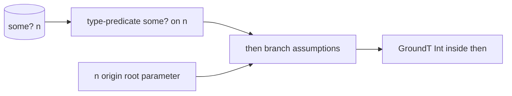
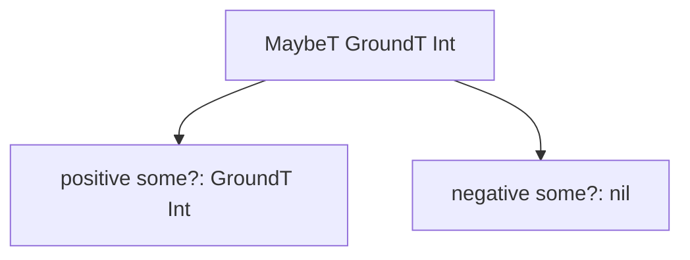

# Narrowing And Origins

The reader has seen that some branch facts are finite. Now the question becomes
flow-sensitive: how does a test like `(some? n)` change the Type of `n` inside a
branch?

> **Snapshot:** state of Skeptic as of 2026-05-06.

## Prerequisites

[Type Domain (C04)](03-type-domain.md), [Annotation Pass (C06)](06-annotation-pass.md),
and [Closed-Sum Exhaustiveness (C07)](07-closed-sum-exhaustiveness.md). You should
know that annotation walks AST nodes and that branch results can be joined.

## Where this fits

Eighth on the Contributor path. This closes the annotation-side story. The next
spoke, [Cast Dispatch](09-cast-dispatch.md), consumes the refined Types that
annotation produced.

## The Split: Test, Assumption, Origin, Type

The reader arrives with `(some? n)` in mind. Skeptic does not directly rewrite
the local. It separates the problem into three parts:

1. A test expression produces an **assumption**.
2. A local has an **origin**, describing what value the local represents.
3. The origin's current Type is refined under the active assumptions.

*Figure: narrowing turns a branch test into refined local Types.*



This split lets the checker reason about more than direct locals. A map-key
lookup, a branch result, or an alias can carry an origin that later assumptions
refine.

The reader should notice what is not happening: Skeptic is not globally changing
the declared Type of `n`. It is deriving a branch-local Type. Outside the
then-branch, the parameter is still maybe-typed.

## Assumption Kinds

An assumption is a compact fact about a branch. Common examples are:

| Assumption | Reader meaning |
|---|---|
| `:type-predicate` | A predicate such as `some?`, `string?`, or `integer?` matched or did not match. |
| `:value-equality` | A value equals or does not equal a literal. |
| `:path-value-equality` | A projected path, such as a map key, equals a literal. |
| `:contains-key` | A map contains a key. |
| `:truthy-local` | A local was tested for truthiness. |
| `:contradicted` | The active assumptions describe an impossible branch. |

The table is not a new taxonomy to memorize. It answers why `(some? n)` can
refine maybe, while `(= (:kind m) :user)` can refine a map path.

Assumptions usually carry polarity. The positive branch of `(some? n)` says "n
is some." The negative branch says "n is not some." A useful narrowing system
needs both halves, because the else branch may be the only place where nil is
known.

## Origin Kinds

An origin is where the value being refined came from. A function parameter has a
root origin. A value produced by an `if` can have a branch origin. A map lookup
can have a map-key origin. When an assumption names a value, origins let Skeptic
find the Type that should be refined.

This is why `double-or-zero` can refine `n`: the parameter has a stable root
origin, and the test names that same local.

Origins also explain why some apparently obvious tests do not narrow. If a value
has been transformed in a way Skeptic cannot connect back to a stable origin, the
test may still be true at runtime but unusable for Type refinement.

## Refining By Predicate

The leaf-level narrowing question is: given a Type and a predicate, what remains
on the positive branch and what remains on the negative branch?

For `MaybeT[GroundT Int]` and positive `some?`, nil is removed and the inner
`GroundT Int` remains. For the negative branch, the nil arm remains. For a union,
the same operation runs across members and keeps the pieces that fit.

That gives narrowing a compositional shape. `MaybeT` has its own split, unions
split member by member, and maps can refine values at paths. The result is still
a Type, so cast dispatch does not need to know which assumption produced it.

*Figure: `(some? n)` partitions maybe Int.*



## How The Worked Example Narrows

The body of `double-or-zero` is:

```clojure
(if (some? n)
  (* 2 n)
  0)
```

Before the test, `n` has admitted Type `MaybeT[GroundT Int]`. The test produces a
positive type-predicate assumption for the then-branch. Applying that assumption
to the root origin of `n` leaves `GroundT Int`, so the multiplication call checks
against numeric expectations. In the else-branch, the negated assumption leaves
nil, but the branch returns `0`, so the function output still fits `s/Int`.

Read the branch from left to right:

| Step | Then branch state |
|---|---|
| Before test | `n` is `MaybeT[GroundT Int]`. |
| Test recognized | Assumption says `some?` holds for root `n`. |
| Local env refined | `n` is `GroundT Int` inside the then branch. |
| Invocation checked | `(* 2 n)` sees numeric arguments. |
| Branch output | Then branch returns Int. |

The else branch has a different local state, but it returns a literal Int. The
function therefore has no finding even though the input declaration allowed nil.

## Why This Is Not Cast Logic

The cast engine should not have to rediscover `(some? n)`. By the time checking
sees the multiplication call, annotation has already produced the branch-local
Type for `n`. This is the clean division of responsibility: narrowing refines
the source Type; cast dispatch compares the refined source Type to the target.

That division gives the reader a debugging shortcut. If a nil-related finding
appears inside a branch that obviously checked `some?`, first ask whether the
test produced an assumption and whether the local had a usable origin. Only after
the source Type is correctly narrowed should you inspect cast compatibility.

## Branches As Local Worlds

Each branch gets its own local environment. The then-branch of
`double-or-zero` can know `n` is Int without changing the else-branch and without
changing callers' understanding of the function parameter. When the branches
rejoin, their output Types are joined into the expression Type of the `if`.

This explains why narrowing is flow-sensitive rather than declaration-changing.
The declared function still accepts nil. The body proves that the nil case does
not reach multiplication.

## Reader Checkpoint

Trace `double-or-zero` without looking back:

1. Admission gives `n` the Type `MaybeT[GroundT Int]`.
2. Annotation reaches the `if` test.
3. The test becomes a positive assumption in the then branch.
4. The root origin of `n` connects that assumption to the parameter Type.
5. Narrowing refines the branch-local Type to `GroundT Int`.
6. Cast dispatch later checks multiplication against that refined Type.

If any of those links is broken, the function can produce a false finding. The
links are deliberately separate so a contributor can locate the break: test
recognition, origin preservation, assumption application, or later cast.

## Why Origins Matter More Than They First Appear

Origins are the reason narrowing can survive common Clojure shapes instead of
only direct `(if (some? n) ...)` forms. A value can be bound, projected from a
map, or produced by a branch and still carry enough identity for a later
assumption to refine it. That identity is the difference between "the test was
true" and "the test tells us something useful about this Type."

That distinction is especially important in Clojure, where macros often reshape
the source before analysis. The reader should expect narrowing to follow stable
semantic relationships, not merely the exact surface spelling in the original
file.

### In-depth: Simplifying Branch Assumptions

***Skip if reading the Gist path.***

Macroexpanded Clojure often turns boolean expressions into nested `let` and `if`
forms. Skeptic simplifies accumulated assumptions so a branch does not carry a
pile of facts that says the same thing three ways. The reader-facing effect is
that narrowing follows common Clojure shapes such as `or`, `and`, and aliases of
test expressions.

### In-depth: Map-Key Origins

***Skip if reading the Gist path.***

A lookup such as `(:kind m)` can carry an origin that points back to key `:kind`
inside map `m`. If a branch tests that lookup against a literal, Skeptic can
refine the map's value at that path. The Type change is still local and
flow-sensitive; it just travels through an origin richer than a bare local.

## Source Pointers

- `skeptic/analysis/origin.clj:test->assumption` - turns test nodes into assumptions.
- `skeptic/analysis/origin.clj:apply-assumption-to-root-type` - refines a root Type under an assumption.
- `skeptic/analysis/narrowing.clj:partition-type-for-predicate` - predicate-based Type partition.
- `skeptic/analysis/origin.clj:simplify-assumptions` - simplifies branch fact sets.
- `skeptic/analysis/origin.clj:region-conjuncts` - derives then/else facts from branch shapes.
- `skeptic/analysis/origin.clj:branch-local-envs` - produces per-branch local environments.

## Glossary Terms Introduced

- Flow-sensitive narrowing
- Assumption
- Origin
- Type predicate
- Map-key origin

## Where To Next

- **Continue (Contributor path):** [Cast Dispatch](09-cast-dispatch.md)
- **Return:** [Hub](README.md)
