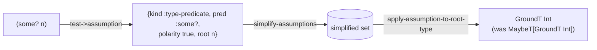
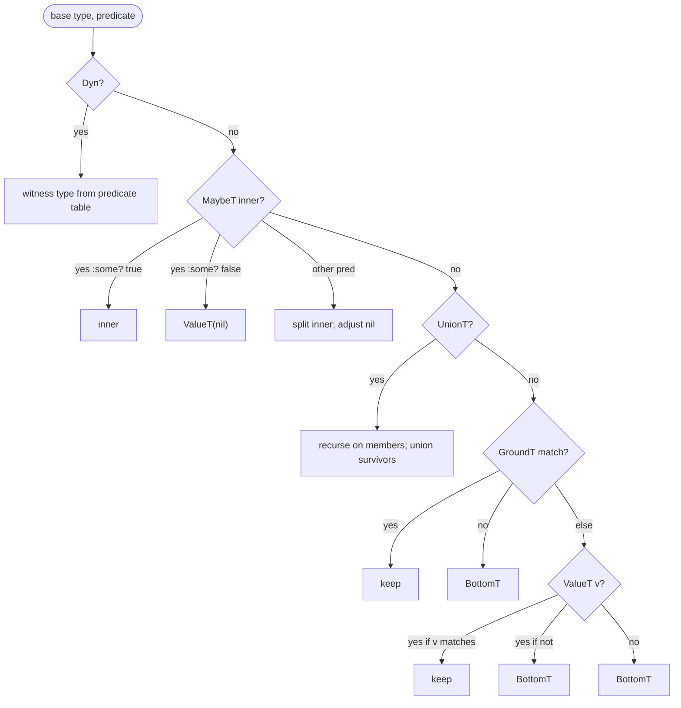

# Narrowing and Origins

> *Snapshot of state as of 2026-05-05.*

Narrowing is how Skeptic refines a local's Type along a branch — `(some?
n)` says "in the then-arm, `n` is not nil." This spoke explains the
three-part architecture (assumption → origin → type) that makes
narrowing work.

## Prerequisites

[Spokes 03](03-type-domain.md), [06](06-annotation-pass.md), and
[07](07-closed-sum-exhaustiveness.md). Comfort with the idea that a
value's Type can change between branches based on what was tested.

## Where this fits

Eighth on the Contributor path. Closes the annotation half of the
pipeline. The next spoke ([09](09-cast-dispatch.md)) covers the cast
engine, which consumes the narrowed Types this spoke produces.

## The split: assumption → origin → type

Skeptic separates three concerns that other type-checkers sometimes
mix together.

**Assumptions** are the *facts* proved by a test expression.
`(some? n)` proves an assumption "`n` matches the predicate `some?`,
positively." `(= x :foo)` proves "the value of `x` equals `:foo`."
`(:k m)` returning truthy proves "the result of looking up `:k` in
`m` is truthy." Assumptions are flow-sensitive — they hold inside
one branch and not its sibling.

**Origins** are how a value got into the locals map. A function
parameter has origin `:root` (qualified by the parameter's symbol).
A `let` binding has origin `:opaque` if its type is known but its
identity is not. A `(:k m)` lookup, recognized as a known accessor,
produces a `:map-key-lookup` origin tagged with `[m :k]`. An `if`
that produces a value whose Type depends on its test produces a
`:branch` origin.

**Types** are the result of *refining* the origin's Type by the
active assumptions. A parameter `n :- (s/maybe s/Int)` has root
origin and base Type `MaybeT[GroundT Int]`. Inside the then-arm of
`(some? n)`, the active assumption set includes
`{:type-predicate :some? polarity true}` rooted at `n`. Applying
that assumption to `MaybeT[GroundT Int]` removes `nil` from the
union, leaving `GroundT Int`.

The split matters because each piece has a different lifecycle.
Origins are created once at binding-time and never change. Assumptions
accumulate as the analyzer enters branches and disappear as it
leaves. Types are *derived* on demand from origin + active
assumptions; they are never stored as a primary attribute that could
go stale.

*Figure: Test → assumption → simplify → apply, on `double-or-zero`'s `(some? n)`.*



## Assumption kinds

The assumption kinds (in `skeptic/analysis/origin.clj`) cover the
shapes Skeptic recognizes:

- `:type-predicate` — `(string? x)`, `(some? x)`, `(integer? x)`,
  `(instance? C x)` — applies a predicate to a target.
- `:value-equality` — `(= x literal)` where `x` is a simple local;
  pins `x` to a specific value.
- `:path-value-equality` — `(= (:k m) literal)` — pins the result of
  a path expression to a specific value.
- `:path-type-predicate` — same shape but with a predicate, e.g.
  `(string? (:name m))`.
- `:contains-key` — `(contains? m :k)` — proves a key is present in
  a map.
- `:truthy-local` — a stable identity used in a truthy position;
  proves the local is truthy.
- `:blank-check` — `(clojure.string/blank? s)` — pins string-ness
  and emptiness.
- `:boolean-proposition` — fall-through for tests Skeptic doesn't
  recognize as one of the above; carries the test form opaquely so
  later boolean reasoning can still combine it.
- `:conditional-branch` — used internally to mark "this branch was
  taken under predicate X."
- `:conjunction`, `:disjunction` — combinators built by
  `region-conjuncts` from `and` / `or` shapes.
- `:contradicted` — a marker that the assumption set is internally
  contradictory; refining produces `BottomT`.

Most kinds carry a `polarity` flag. The boolean kinds are
invertible via `invert-assumption`, which swaps polarity
(`:type-predicate :some? true` becomes `:type-predicate :some?
false`) or, for compound kinds, applies De Morgan.

## Test → assumption

`test->assumption` reads an analyzer test node and produces an
assumption (or `nil` if the node is too dynamic for any kind to
fit). The dispatch is on the *shape* of the test:

```text
test                              → assumption kind / polarity
─────────────────────────────────────────────────────────────────
local symbol (truthy position)    → :truthy-local
(instance? C x)                   → :type-predicate :instance? true
(some? x)                         → :type-predicate :some? true
(nil? x)                          → :type-predicate :some? false
(string? x), (integer? x), …      → :type-predicate (the named pred)
(= x literal)                     → :value-equality
(= (:k m) literal)                → :path-value-equality
(string? (:k m)), (some? (:k m))  → :path-type-predicate
(contains? m :k)                  → :contains-key
(clojure.string/blank? s)         → :blank-check
(not <inner>)                     → invert-assumption(<inner>)
(and a b …)                       → :conjunction
(or  a b …)                       → :disjunction
else                              → :boolean-proposition (opaque)
```

`not-call-syms` is the negation hook: it lists the symbols Skeptic
recognizes as boolean negation (just `clojure.core/not` and a couple
of synonyms). Calls to anything else with one truthy argument do not
get their assumption inverted.

The dispatch is closed: anything not on the list becomes
`:boolean-proposition`. That's intentional — Skeptic prefers
"opaque but combinable" over "guess at the meaning."

## Origin kinds

Origins (also in `skeptic/analysis/origin.clj`) tag *where a value
came from*:

- `:root` — a function parameter; carries the parameter's qualified
  symbol so cross-namespace assumptions can target it.
- `:opaque` — a wrapping for values whose Type is known but whose
  identity is not (typical of `let`-bound values whose binding
  expression is a non-recognized call).
- `:map-key-lookup` — built by accessor-summary detection in
  admission's `analyzed-def-entry`. Tags the local as "the result of
  `(:k m)`," carrying `[m :k]`. This origin is what lets
  `:path-value-equality` target the right path.
- `:branch` — built when an `if` produces a value whose Type depends
  on its test. The branch origin carries the predicate, the test
  form's stable identity, and the per-arm Types. This origin is what
  makes `ConditionalT` work end-to-end:
  `enrich-conditional-type` later fills in the discriminator slot
  from the branch origin's data.

Origins are immutable once created. The locals map is keyed by
local-binding name; the value is `{:type base-type :origin
origin-record}`. Refining the local produces a new Type but does
*not* mutate the origin. That's why the recursive runner pattern
([spoke 06](06-annotation-pass.md#in-depth-ctx-threading-and-the-recursive-runner))
can derive child ctxs cleanly: the child sees the same origin, just
with a refined Type and additional assumptions.

## Refining a Type by assumptions

`apply-assumption-to-root-type` is the dispatch table. Given an
assumption and a base Type, it produces a refined Type:

| Assumption kind             | Refines via                                                                 |
|-----------------------------|-----------------------------------------------------------------------------|
| `:type-predicate`           | `partition-type-for-predicate`                                              |
| `:value-equality`           | `partition-type-for-values`                                                 |
| `:path-type-predicate`      | `amo/refine-map-path-by-predicate`                                          |
| `:path-value-equality`      | `amo/refine-map-path-by-values`                                             |
| `:contains-key`             | `amo/refine-by-contains-key`                                                |
| `:truthy-local`             | `apply-truthy-local`                                                        |
| `:blank-check`              | `apply-blank-check`                                                         |
| `:contradicted`             | returns `BottomType`                                                        |
| `:boolean-proposition`      | no-op (Type unchanged; the proposition stays for combinator reasoning)      |
| `:conjunction`/`:disjunction` | recursively combines via children's effects                              |

The refining functions live in `skeptic/analysis/narrowing.clj` and
`skeptic/analysis/map_ops.clj`. Each function is a small dispatcher
on the input Type's kind: a predicate-refinement on `MaybeT` peels
the maybe; on a `UnionT` it recurses on members; on a `Dyn` it
returns the predicate's witness Type (`:string?` → `GroundT Str`,
etc.).

## Narrowing primitives

`partition-type-for-predicate` is the workhorse. Its dispatch on
the input Type's leaf kind:

- on a `Dyn`, the positive partition takes the predicate's witness:
  `:string?` → `GroundT Str`, `:integer?` → `GroundT Int`,
  `:keyword?` → `GroundT Keyword`, `:some?` → `Dyn` (anything
  non-nil), and so on for the recognized predicate set
  (`classify-leaf-for-predicate?`).
- on a `MaybeT[T]`, `:some?` true removes `nil` and returns `T`;
  `:some?` false returns `ValueT(nil)`. Other predicates split
  `MaybeT[T]` by recursing on `T` and adjusting `nil`.
- on a `UnionT[T₁ … Tₙ]`, recurse on each member; take the union of
  the survivors.
- on a `GroundT t :foo`, the predicate either matches the ground
  (return `T`) or doesn't (return `BottomT`).
- on a `ValueT v : T`, similar — does `v` match the predicate?
- on `BottomT`, return `BottomT` (already empty).

The negative partition is the symmetric operation. Together they
let `dyn-narrow-positive` and `dyn-narrow-negative` route the
predicate's effect through any input shape.

## How the worked example narrows

`double-or-zero`'s body is `(if (some? n) (* 2 n) 0)`. Walk it:

1. The argument `n` is bound with origin `:root` (qualified
   `skeptic.walkthrough.example/double-or-zero/n`) and base Type
   `MaybeT[GroundT Int]`.
2. The `:if` annotator inspects the test `(some? n)` and calls
   `test->assumption`. The result is
   `{:kind :type-predicate, :pred :some?, :polarity true, :root n}`.
3. The annotator builds two child ctxs. The then-ctx carries the
   assumption with positive polarity; the else-ctx carries it with
   inverted polarity (via `invert-assumption`).
4. In the then-ctx, `apply-assumption-to-root-type` dispatches the
   assumption: `:type-predicate` →
   `partition-type-for-predicate`. The base is `MaybeT[GroundT Int]`;
   `:some?` true peels the maybe; the refined Type is `GroundT Int`.
   The then-branch sees `n` as `GroundT Int`.
5. `(* 2 n)` annotates as `GroundT Int` (via the native dict for
   `clojure.core/*`).
6. In the else-ctx, the inverted assumption is
   `{:type-predicate, :some?, polarity false}`. Applied to
   `MaybeT[GroundT Int]`, the negative partition leaves
   `ValueT(nil)`. The else-branch sees `n` as `ValueT(nil)`.
7. The else-arm `0` annotates as `ValueT(0) : GroundT Int`.
8. The `:if` joins the arms: `UnionT[GroundT Int, ValueT(0) :
   GroundT Int]`. The Value's inner is `GroundT Int`, so the union
   normalizes to `GroundT Int`.

The body Type is `GroundT Int`, which fits the declared output
`GroundT Int`. Skeptic reports no finding.

*Figure: `partition-type-for-predicate` decision tree, abbreviated to the eight most-used cases.*



### In-depth: `simplify-assumptions` and the disjunction collapse

***Skip if reading the Gist path.***

After accumulating assumptions on a branch, the set may contain
disjunctions whose parts are individually refuted by the rest of
the set. `simplify-assumptions` walks the assumption set looking
for those:

```text
set: {(or A B C), ¬A, ¬B}
─────────────────────────
collapse: ¬A and ¬B refute the first two parts of the disjunction;
the only surviving part is C, so hoist C and discard the
disjunction.

set: {C, ¬A, ¬B}
```

The pass continues until fixpoint — until one full traversal
returns the set unchanged. Termination is guaranteed because each
non-fixpoint iteration reduces the set's size or replaces a
disjunction with one of its strictly-smaller parts; both
quantities are bounded below by zero.

The cost is bounded: real assumption sets are tiny (at most a
handful of accumulated facts at any one branch entry), so even a
naive O(N²) refutation check is cheap.

### In-depth: `branch-local-envs` and let+if shapes

***Skip if reading the Gist path.***

`(or x y)` macroexpands into `(let [b x] (if b b y))` — a let+if
shape. Naively, the let-bound `b` would not get its narrowing
right: the test in the `if` is just the symbol `b`, which by itself
proves nothing useful about `x`.

`region-conjuncts` recognizes the `(let [b test] (if b a c))`
shape (and its mirror `(let [b test] (if b a c))` regardless of
order). When recognized, it derives per-region conjuncts:

- inside `a`: the assumption from `test`, positively, plus the
  truthy-local assumption on `b`.
- inside `c`: the assumption from `test`, negatively.

So `(or x y)` macroexpanding to a let+if produces correct narrowing
in `y`'s region: `x` is statically falsy there.

`branch-local-envs` is the public entry point for this region
analysis. It returns the per-branch refined locals + assumption
sets, ready to be passed into the child ctxs.

The shape recognition matters because Skeptic depends on it for
real Clojure idioms — `or`, `and`, `when-let`, and `when-some` all
macroexpand to let+if patterns whose narrowing only works through
this shape recognizer.

## Marquee functions

| Function                          | File                              | Role                                                                  |
|-----------------------------------|-----------------------------------|-----------------------------------------------------------------------|
| `test->assumption`                | `skeptic/analysis/origin.clj`     | Tests → assumptions; the entry point for narrowing input.             |
| `apply-assumption-to-root-type`   | `skeptic/analysis/origin.clj`     | Assumption + Type → refined Type; the matched dispatch table.         |
| `partition-type-for-predicate`    | `skeptic/analysis/narrowing.clj`  | The leaf-level type splitter.                                         |
| `simplify-assumptions`            | `skeptic/analysis/origin.clj`     | The fixpoint disjunction-collapse pass.                               |
| `region-conjuncts`                | `skeptic/analysis/origin.clj`     | Then/else conjunct derivation under let+if shapes.                    |
| `branch-local-envs`               | `skeptic/analysis/origin.clj`     | Per-branch refined locals + assumptions; consumed by `:if` annotator. |

## Worked example here

`double-or-zero` is the central example for the whole spoke,
annotated fully line by line above. `classify` is not exercised here —
its body has no flow-sensitive narrowing (every cond arm has a
fixed-shape test that doesn't refine `n`'s declared `GroundT Int`).

## Where to next

- **Continue (Contributor path):** [Cast Dispatch (09)](09-cast-dispatch.md)
- **Diagnose-finding path:** continue (reverse) to [Annotation Pass (06)](06-annotation-pass.md)
- **Return:** [Hub](README.md)
