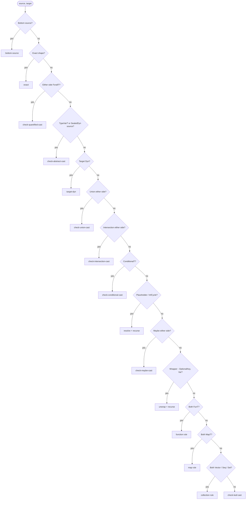
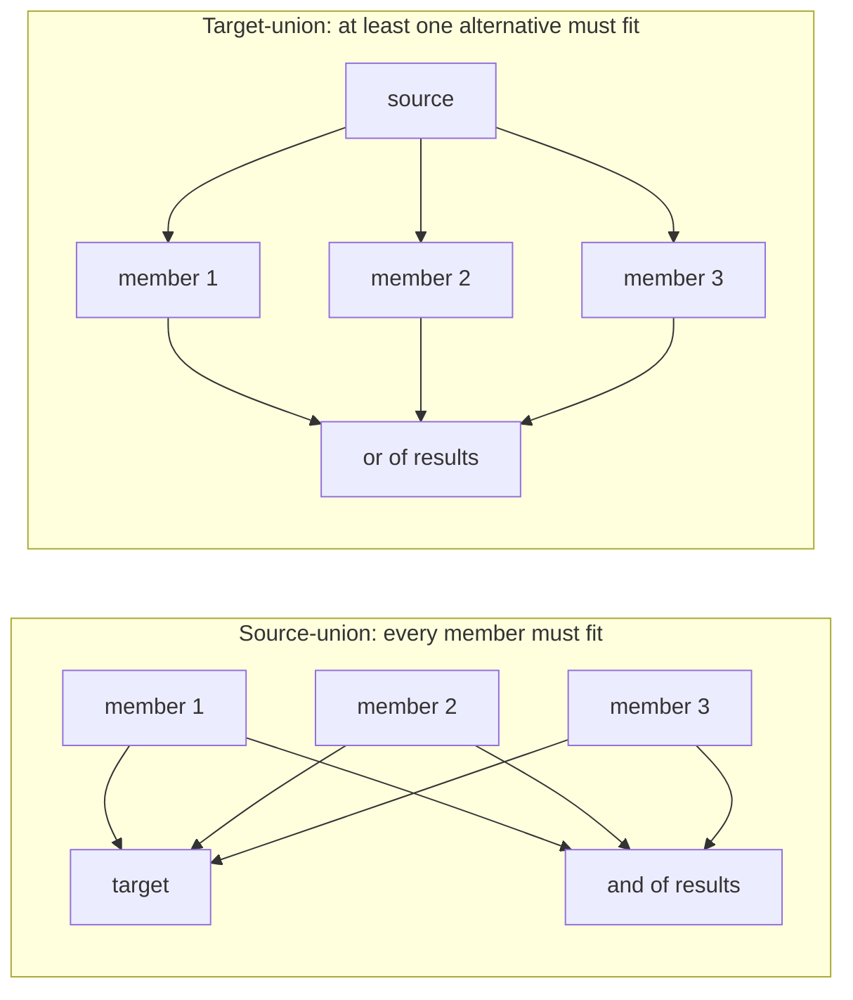
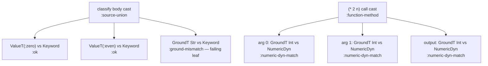

# Cast Dispatch

> *Snapshot of state as of 2026-05-05.*

The cast engine is Skeptic's checker. Given an inferred source Type
and a declared target Type, it asks "does the source fit the target?"
and produces a result tree explaining why or why not. This spoke walks
the dispatch ladder: how a source/target pair selects a rule, and
what each structural rule does.

## Prerequisites

[Spokes 03](03-type-domain.md), [04](04-provenance.md),
[06](06-annotation-pass.md), and [08](08-narrowing-and-origins.md).
Comfort with the idea of a directional check between two Types ("can
a value of type S be used where type T is expected?").

## Where this fits

Ninth on the Contributor path. After this spoke, the reader can read
any file in `skeptic.analysis.cast.*` and predict what rule fires for
a given source/target pair. The next spoke
([10](10-blame-for-all-and-projection.md)) covers the polymorphic
boundary and how cast results become findings.

## The cast engine, conceptually

A cast is a *directional* check. Source is the inferred Type; target
is the declared Type; the question is "fit." The contract is
asymmetric: a `MaybeT[Int]` source against an `Int` target *fails*
(the source admits `nil` which the target doesn't); the reverse
*succeeds* (every `Int` is a non-nil `MaybeT[Int]`). Direction
matters.

`check-cast` (in `skeptic/analysis/cast.clj`) is the public entry. It
returns a `CastResult`:

```clojure
{:ok?            true|false
 :rule           keyword       ; e.g. :function-method, :exact, :ground-mismatch
 :blame-side     :term|:context|:global|:none
 :blame-polarity :positive|:negative|:global|:none
 :source-type    Type
 :target-type    Type
 :children       [CastResult …] ; recursive child casts, with paths
 :reason         keyword|nil    ; e.g. :type-mismatch, :nullable
 :path           [path-segment …]}
```

`:children` is the recursive-cast tree. The structural rules
(function, map, vector, set, …) compose child casts; the leaf rule
does the final compatibility check on Type-domain values that have
nothing left to decompose. `:path` records the structural location
(e.g. `[:function-domain 0]`, `[:map-key :foo]`, `[:vector-index 2]`)
so `inconsistence/path.clj` can render
`"argument 1 → field :foo → index 2"` for the user.

The dispatcher decides which rule fires. The structural rules
compose. The leaf rule is the base case.

## The dispatch ladder

`dispatch-cast` (private, in `skeptic/analysis/cast.clj`) is one big
`cond` that walks roughly eighteen rules in priority order. The
order is *load-bearing*: change it and Skeptic's behaviour changes
visibly. The ladder, top to bottom:

1. **`:bottom-source`** — a `BottomT` source always fits anywhere.
   `BottomT` represents an unreachable value; a cast check on
   unreachable code passes vacuously.
2. **`:exact`** — `at/type=?` short-circuit. If the two Types are
   shape-equal, return `cast-ok` immediately. Skips structural
   recursion when no work is needed.
3. **Quantified** — if either side is a `ForallT`, hand off to
   `check-quantified-cast` (see [spoke 10](10-blame-for-all-and-projection.md)).
   This branch comes *before* unions, maybes, leaves because
   quantified types are not structurally transparent. Treating
   `ForallT[X. T]` as if it were `T` would discard the binder.
4. **Abstract** — if either side is a `TypeVarT`, or the source is
   a `SealedDynT`, hand off to `check-abstract-cast`. This handles
   `:seal`, `:sealed-collapse`, `:type-var-source`,
   `:type-var-target`, and `:sealed-conflict` — also covered in
   [spoke 10](10-blame-for-all-and-projection.md).
5. **`:target-dyn`** — cast to `Dyn` always succeeds. This branch is
   subordinate to abstract above, so a cast of `SealedDyn(X)` into
   `Dyn` becomes a `:seal` (preserving the binder), not a
   `:target-dyn`.
6. **Unions** — `check-union-cast`. A target-union splits into "fits
   one of the target's members" (try each; succeed on the first
   that fits). A source-union splits into "every member of the
   source fits the target" (recurse on each member; aggregate).
   The union semantics are different on the two sides.
7. **Intersections** — `check-intersection-cast`. Symmetric to
   unions: a source-intersection means "satisfies one of these
   suffices"; a target-intersection means "must satisfy all."
8. **Conditionals** — `check-conditional-cast`. Treats branches as a
   union with a discriminator; the cast either picks the right
   branch (when the discriminator selects) or recurses on all
   branches as a union.
9. **Placeholder/InfCycle target** — resolve the placeholder to its
   referent and recurse, with a stack guard. If the guard already
   contains the placeholder, return `:residual-dynamic`.
10. **Placeholder/InfCycle source** — symmetric.
11. **Maybe** — `check-maybe-cast`. A `MaybeT[T]` source against a
    target splits into "the nil case" (does the target accept
    `nil`?) and "the inner case" (recurse on `T` against the
    target).
12. **Wrappers** — `OptionalKeyT`, `VarT`. Unwrap and recurse.
    Wrappers carry metadata (an exact key marker, a referenced var)
    but have no semantic content of their own.
13. **`:function`** — both sides are `FunT`. Pair methods by arity
    via `at/select-method`; for each pair, flip blame polarity for
    inputs (functions are contravariant in arguments), recurse on
    each input, recurse on the output.
14. **`:map`** — both sides are `MapT`. Pair entries by key
    compatibility (exact-key entries match by `at/type=?`; broad-key
    entries fall through to broad-key candidate selection).
    Recurse on each value.
15. **`:vector`**, **`:seq`** — both sides matching collection.
    Recurse on the prefix tuple (if any), then on the rest element.
16. **`:vector` ↔ `:seq` crossings** — vectors viewed as seqs (or
    seqs constructible from vectors) get explicit rules so a
    declared `[Int]` schema accepts an inferred seq result and vice
    versa.
17. **`:set`** — both sides `SetT`. Recurse on member Types.
18. **Leaf** — `check-leaf-cast`. The fallback compatibility check
    over `GroundT`, `NumericDynT`, `RefinementT`, `AdapterLeafT`,
    `ValueT`. Returns `:ground-match` on success, `:ground-mismatch`
    on failure, or finer-grained leaf rules where applicable.

The diagram below visualizes the ladder. Each layer is one branch
of the cond.

*Figure: The 18-step dispatch ladder.*



## Children, polarity, and paths

Each structural rule produces *children* — the recursive cast results
on its sub-parts. A function rule's children are the per-argument
casts and the output cast. A map rule's children are the per-entry
casts. A vector rule's children are per-position casts plus a rest
cast.

`aggregate-children` (in `cast/support.clj`) builds the parent's
result from the children's:

```clojure
;; in cast/support.clj
(defn aggregate-children [parent-shape children]
  (let [ok? (every? :ok? children)]
    (-> parent-shape
        (assoc :ok? ok?
               :children children)
        (carry-first-failure-rule children))))
```

The contract: the parent is `:ok?` exactly when *every* child is
`:ok?`. On failure, the parent's `:rule` is set to the first failing
child's rule (or to a parent-specific rule if the parent itself
contributes the diagnostic). Diagnostic projection in
[spoke 10](10-blame-for-all-and-projection.md) uses the children
list to find leaves.

**Polarity flips on function inputs.** A cast on a function-method's
input is contravariant: the *caller* must supply something the
callee accepts, not the other way around. So when a function rule
recurses on input casts, it flips polarity from `:positive` to
`:negative`. Output casts remain positive. This shows up in blame:
an input-side leaf failure carries `:negative`, which the renderer
translates to "context blame" (the caller is at fault); an
output-side failure carries `:positive`, "term blame" (the callee
returned the wrong type). The rest of the structural rules pass
polarity through unchanged.

## Cast paths and how they get rendered

`with-cast-path` (in `cast/support.clj`) adds a path segment to a
child cast result. The cumulative path on a leaf failure is the
chain from the root cast down to the leaf — for example,
`[:function-domain 1, :map-key :foo, :vector-index 0]`.

The path is internal to the cast tree. When projection runs
([spoke 10](10-blame-for-all-and-projection.md)),
`path/render-visible-path` filters out non-displayable segments
(`:target-union-branch`, `:source-union-branch`, internal
synthetic markers) and joins the rest into a user-facing string:
`"argument 2 → field :foo → index 0"`. The display is a separate
concern from the structural path; the cast engine produces the raw
path and the projection layer converts it.

## How the worked example casts

Two casts to walk: one passing, one failing.

**Passing — `(* 2 n)` in `double-or-zero`**.

After narrowing ([spoke 08](08-narrowing-and-origins.md)), `n` is
`GroundT Int` inside the then-branch. The call is to
`clojure.core/*`, native-admitted with the schema
`FunT[FnMethodT[NumericDyn NumericDyn → NumericDyn], …]` (multiple
arities; we pick the binary one). The argument cast pairs are:

- arg 0: source `GroundT Int`, target `NumericDynT`. The leaf rule
  fires (both are leaf-shaped); a `GroundT Int` fits `NumericDynT`
  by the leaf-overlap relation. Result: `cast-ok` rule
  `:numeric-dyn-match`.
- arg 1: source `GroundT Int`, target `NumericDynT`. Same outcome.

`aggregate-children` reports the parent as `:ok? true` rule
`:function-method`. No finding.

**Failing — `classify`'s output cast**.

The body's annotated Type is `UnionT[ValueT(:zero), ValueT(:even),
GroundT Str]`. The declared output is `GroundT Keyword`. The
dispatcher reaches the unions branch (rule 6); since the source is
a union, it splits into per-member casts against the target:

- `ValueT(:zero) : GroundT Keyword` against `GroundT Keyword`:
  passes (the inner Type matches; `:zero` is a Keyword).
- `ValueT(:even) : GroundT Keyword` against `GroundT Keyword`:
  passes likewise.
- `GroundT Str` against `GroundT Keyword`: fails. The leaf rule
  fires, ground tags `:string` and `:keyword` differ; result
  `cast-fail` rule `:ground-mismatch` reason `:type-mismatch`.

`aggregate-children` reports the parent (a `:source-union`) as
`:ok? false`, with the failing child as the headline. The path on
the child carries the structural location of the failed-arm leaf;
projection renders the path as `"return value"` (the per-member
sub-path of a `:source-union` is filtered out as not visible).

*Figure: Function-cast polarity flip.*

```mermaid
flowchart LR
  call[Call site]
  call --> args["Per-argument casts<br/>polarity ← :negative<br/>(contravariance)"]
  call --> out["Output cast<br/>polarity ← :positive"]
  args --> agg[aggregate-children]
  out --> agg
  agg --> result["FunT cast result<br/>:ok? = and of children"]
```

*Figure: Source-union vs. target-union behaviours, side by side.*



*Figure: Two cast paths from the worked example, drawn as labeled trees of cast results.*



### In-depth: residual dynamic and the placeholder cycle

***Skip if reading the Gist path.***

Self-referential schemas — `(s/eq nil)` aside, more meaningfully a
`(s/cond-pre s/Int Tree)` where `Tree` references itself — admit to
Types that contain `PlaceholderT` markers. When the cast engine
hits one, it tries to resolve.

The resolve uses a stack guard. If the placeholder's referent is
already being resolved (i.e., the guard contains it), the engine
returns a special result with rule `:residual-dynamic`: an
"okay-but-incomplete" verdict that the downstream pipeline treats
as `Dyn`-style for further reasoning. The intuition: when we can't
finish proving fit because the schema is recursive, default to
"can't tell" rather than diverging.

The guard is implemented via `resolve/with-active`, which
pushes/pops the placeholder identity as the engine traverses
recursively-defined Types. Both placeholder-target and
placeholder-source rules use it.

### In-depth: union of unions and dedup

***Skip if reading the Gist path.***

Casting one union into another could explode combinatorially —
M source members times N target members. Skeptic dodges the
explosion by deduplicating at union construction time, via
`at/dedup-types`. By the time the cast engine sees a union,
shape-distinct members are unique. The cast still does M × N member
checks in the worst case, but M and N are bounded by the *shape*
count, not by the textual member count.

In practice unions are small (at most a handful of distinct
shapes), so the worst case rarely materializes. When it does,
profiling shows it: the `cast-leaf` rule is the hotspot. There are
no further optimizations (no caching, no memoization) because the
hot path is rare and the cost is bounded.

### In-depth: how to add a new dispatch rule

***Skip if reading the Gist path.***

To add a rule for a new Type kind, six steps:

1. **Add the type-record (and predicate)** in
   `skeptic/analysis/types.clj`: a `defrecord` with `:prov` first;
   extend `proto/SemanticType`; add a `kind?-type?` predicate; add
   the per-record tag keyword.
2. **Add a branch to `dispatch-cast`** in
   `skeptic/analysis/cast.clj`, in the right priority slot. Quantified
   rules go above abstract; abstract above target-dyn; target-dyn
   above unions; unions above maybe; maybe above wrappers; wrappers
   above structural collections; structural collections above leaf.
   A Bottom-source check should always be first; an exact-match
   check should always be second.
3. **Implement the rule** in a sub-namespace under
   `skeptic.analysis.cast.*`. Pick by what the rule does:
   `cast.branch` for branching kinds (union/intersection/conditional/maybe);
   `cast.collection` for vectors/seqs/sets/leaves;
   `cast.function` for function casts;
   `cast.map` for map-specific work;
   `cast.quantified` for ForallT/TypeVarT/SealedDynT.
4. **Add cast-result metadata and any new path segments** in
   `cast.support` if the rule introduces new structural locations
   (a new path-segment kind, a new aggregation pattern).
5. **Update display** in `inconsistence/path.clj` if the new path
   segment is visible in messages — add a `render-path-segment`
   case for it.
6. **Add tests** against both leaf cases and structural composition.
   Tests in `test/skeptic/analysis/cast_test.clj` and per-sub-namespace
   files (`cast_branch_test.clj`, `cast_collection_test.clj`, …).
   Use `at/type=?` for shape comparisons, never `=`.

The order of priority slots is the contract; getting it wrong is the
single most common bug in cast extension. See
[spoke 12](12-contributor-surfaces.md) for the pitfall write-up.

## Marquee functions

| Function                | File                                       | Role                                                                |
|-------------------------|--------------------------------------------|---------------------------------------------------------------------|
| `check-cast`            | `skeptic/analysis/cast.clj`                 | Public entry; normalizes source/target, then runs the dispatcher.    |
| `dispatch-cast`         | `skeptic/analysis/cast.clj` (private)       | The ~18-step cond; the spoke's central diagram.                      |
| `cast-ok` / `cast-fail` | `skeptic/analysis/cast/support.clj`         | Cast-result constructors carrying rule, polarity, children, path.    |
| `aggregate-children`    | `skeptic/analysis/cast/support.clj`         | Parent-result builder for the structural rules.                      |
| `compatible?`           | `skeptic/analysis/cast.clj`                 | Boolean wrapper over `check-cast`'s `:ok?`.                          |
| `polarity->side`        | `skeptic/analysis/bridge/render.clj`        | Maps polarity to blame side at result-construction time.              |

## Worked example here

Both definitions exercised. `classify`'s output cast is the central
failing case (rule `:source-union` parent, `:ground-mismatch` leaf).
`double-or-zero`'s `(* 2 n)` is the central passing case (rule
`:function-method` parent, leaves all `:numeric-dyn-match`).

## Where to next

- **Continue (Contributor path):** [Blame for All and Projection (10)](10-blame-for-all-and-projection.md)
- **Continue (Gist path):** [User-Facing Surfaces (11)](11-user-facing-surfaces.md)
- **Diagnose-finding path:** continue (reverse) to [Narrowing and Origins (08)](08-narrowing-and-origins.md)
- **Return:** [Hub](README.md)
