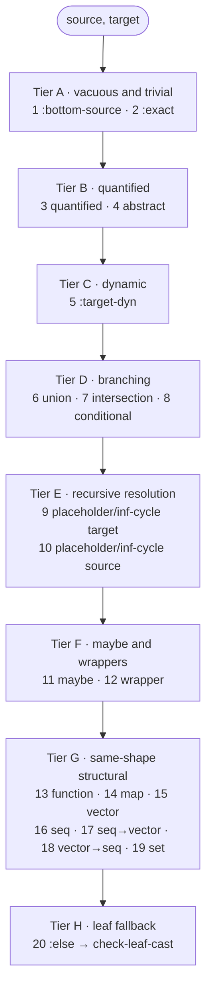
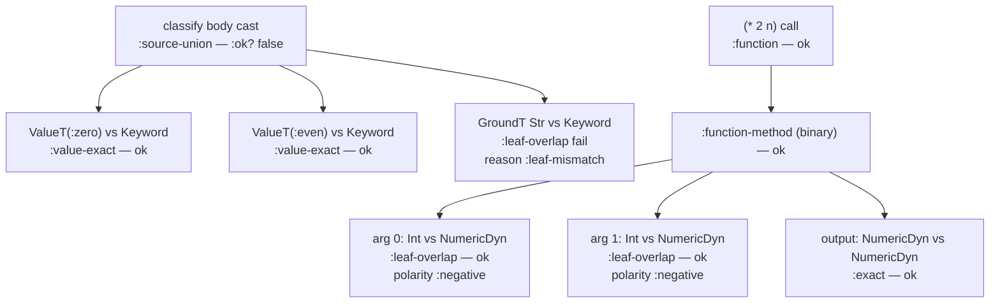
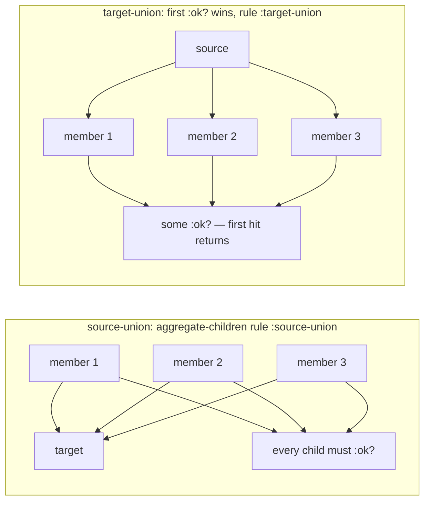

# Cast Dispatch

> *Snapshot of state as of 2026-05-05.*

The cast engine is Skeptic's checker. Given an inferred source Type
and a declared target Type, it asks "does the source fit the
target?" and produces a result tree explaining why or why not. This
spoke covers the dispatch ladder, the structural-rule pattern, the
polarity discipline that makes function-input blame land on the
caller, the cast-result tree shape, and the worked example end to
end.

## Prerequisites

[Spokes 03](03-type-domain.md), [04](04-provenance.md),
[06](06-annotation-pass.md), and
[08](08-narrowing-and-origins.md). Comfort with the idea of a
directional check between two Types ("can a value of type S be used
where type T is expected?"). If any of those prerequisites are
unfamiliar, the [hub README's reading paths](README.md#reading-paths)
point to the right earlier reading.

## Where this fits

Ninth on the Contributor path. After this spoke, the reader can
read any file in `skeptic.analysis.cast.*` and predict what rule
fires for a given source/target pair. The next spoke
([10](10-blame-for-all-and-projection.md)) covers the polymorphic
boundary and how cast results become findings. A reader on the
Diagnose-finding path enters here from the cast-rule named on a
finding and traces back to the structure the rule expresses.

## The cast engine, conceptually

**This section teaches: that a cast is a directional check, what
asymmetry that direction encodes, and what shape the result takes.**

A cast is a *directional* check. Source is the inferred Type;
target is the declared Type; the question is "fit." The contract
is asymmetric: a `MaybeT[Int]` source against an `Int` target
*fails* (the source admits `nil` which the target doesn't); the
reverse *succeeds* (every `Int` is a non-nil `MaybeT[Int]`).
Direction matters because the *consumer* of the value is the
target, and the consumer's contract is what's being checked.

`check-cast` (in `skeptic/analysis/cast.clj`) is the public entry.
It normalizes both inputs (so two structurally identical Types
with different surface representations compare equal), records
the polarity in the opts (positive by default — every input
cast that doesn't go through a function-domain flip stays
positive), and runs the dispatcher.

The result is a `CastResult` map carrying:

- `:ok?` — true when the cast succeeds, false otherwise.
- `:rule` — a keyword naming what the cast did
  (`:exact`, `:source-union`, `:function-method`, `:leaf-overlap`,
  …).
- `:blame-side` — `:term` (the value/source is at fault),
  `:context` (the calling context is at fault), `:global` (the
  polymorphic contract itself was violated), or `:none` (success
  or internal-only).
- `:blame-polarity` — `:positive`, `:negative`, `:global`, or
  `:none`. The mapping to side is mechanical:
  `:positive ↔ :term`, `:negative ↔ :context`.
- `:source-type`, `:target-type` — the two Types the cast
  compared.
- `:children` — the recursive cast-result tree. Structural rules
  populate this; leaf rules produce empty children.
- `:reason` — a keyword on failures (`:leaf-mismatch`,
  `:source-branch-failed`, `:arity-mismatch`, `:missing-key`,
  …) that distinguishes *why* the rule failed when the rule name
  alone wouldn't tell.
- A few conditional extras merged from `details`:
  `:path` (a structural location pointer like
  `{:kind :map-key :key :foo}`), `:sealed-type` (on `:seal`
  results), `:binder` and `:instantiated-type` (on
  `:generalize`/`:instantiate`), `:actual-key`, `:expected-key`,
  `:source-key-domain` (on map-cast errors), `:chosen-rule` (on
  `:target-union` successes).

The contract is that *every cast result is a node in a tree*. A
leaf rule's node has no children but reports a verdict on its
own. A structural rule's node has children — one per sub-cast —
and its verdict is computed from theirs.

## The dispatch ladder

**This section teaches: the priority-ordered cond that decides
which rule fires, why the order is load-bearing, and the
intuition behind each tier.**

`dispatch-cast` (private, in `skeptic/analysis/cast.clj`) is one
big `cond`. Reading it literally there are **twenty** clauses:
nineteen explicit predicates plus an `:else` fallback to the
leaf rule. The order is *load-bearing* — change it and Skeptic's
behaviour changes visibly.

The clauses, top to bottom, grouped by what they encode:

**Vacuous and trivial cases.**

1. **`bottom-type? source`** → `:bottom-source`. A `BottomT`
   source is unreachable; a cast of unreachable code passes
   vacuously. This is *first* because every later clause would
   try to do real work.
2. **`type=? source target`** → `:exact`. If the two Types are
   shape-equal, return success immediately without descending
   into structural decomposition. This short-circuit is what
   makes large structural casts fast on identical types.

**Quantified types — strict precedence.**

3. **either side is `forall-type?`** → `check-quantified-cast`.
   Treating `ForallT[X. T]` as if it were `T` would discard the
   binder; the polymorphism is lost.
4. **either side is `type-var-type?` or source is
   `sealed-dyn-type?`** → `check-abstract-cast`. Type variables
   and sealed values are *abstract* and need their own dispatch;
   structural rules below would treat them as opaque leaves and
   produce wrong answers.

**The dynamic short-circuit.**

5. **`dyn-type? target`** → `:target-dyn`. Cast to `Dyn` always
   succeeds. This sits *below* the abstract clause so a cast of
   `SealedDynT(X)` into `Dyn` becomes a `:seal` (preserving the
   binder) rather than a `:target-dyn` that would discard it.

**The branching family.**

6. **either side is `union-type?`** → `check-union-cast`.
7. **either side is `intersection-type?`** →
   `check-intersection-cast`.
8. **either side is `conditional-type?`** →
   `check-conditional-cast`.

These three are conceptually similar — distribute over branches
— but with different rules for which branches must succeed. The
dispatcher tries them in this priority order so a `UnionT`
either side fires first; an `IntersectionT` either side fires
second; a `ConditionalT` either side fires third. A composite
that's both (e.g., a `UnionT` containing a `ConditionalT`) is
handled by the union rule first, recursing into the conditional
on the next dispatch.

**Recursive-type resolution.**

9. **target is `placeholder-type?` or `inf-cycle-type?`** →
   resolve target then recurse, else `:residual-dynamic`.
10. **source is `placeholder-type?` or `inf-cycle-type?`** →
    same on source.

The `:residual-dynamic` rule is the cast engine's surrender
flag: when the placeholder can't be resolved (it's already
mid-resolution further up the stack), the cast returns success
without claiming anything. Downstream treats it as `Dyn`.

**Maybe and wrappers.**

11. **either side is `maybe-type?`** → `check-maybe-cast`.
12. **either side is `optional-key-type?` or `var-type?`** →
    `check-wrapper-cast`. Wrappers carry metadata but no semantic
    content; the rule unwraps and recurses.

**Same-shape structural rules.**

13. **both sides are `fun-type?`** → `check-function-cast`.
14. **both sides are `map-type?`** → `check-map-cast`.
15. **both sides are `vector-type?`** → `check-vector-cast`.
16. **both sides are `seq-type?`** → `check-seq-cast`.
17. **source is `seq-type?` and target is `vector-type?`** →
    `check-seq-to-vector-cast` (the cross cast).
18. **source is `vector-type?` and target is `seq-type?`** →
    `check-vector-to-seq-cast`.
19. **both sides are `set-type?`** → `check-set-cast`.

**Leaf fallback.**

20. **`:else`** → `check-leaf-cast`. The base case: leaf-shaped
    Types (`GroundT`, `ValueT`, `RefinementT`, `AdapterLeafT`,
    `NumericDynT`) compared via `leaf-overlap?` and friends.

The two things the order most encodes:

- **Quantified before structural.** The cast engine has a
  separate sub-system for polymorphic types; structural rules
  would mishandle them. Clauses 3–4 ensure quantified types
  never reach structural rules.
- **Abstract before `:target-dyn`.** A cast crossing the
  polymorphic boundary into Dyn must seal the binder, not
  short-circuit. Clause 4 catches the abstract case before
  clause 5 turns Dyn into a free pass.

The order is also what enables additivity: a contributor adding
a new Type kind picks the priority slot based on what the kind
*is* — does it need to short-circuit other rules (top), is it a
branching shape (middle), or is it a leaf-shaped value
(bottom)? The placement determines correctness.

*Figure: The dispatch ladder, top to bottom, with the four
priority tiers labelled. The ladder is one cond; the tiers are
the reading aid.*



## Children, polarity, and paths

**This section teaches: how structural rules build their result
from children, what polarity means, and how paths get attached
to leaf failures.**

Each structural rule produces *children* — the recursive cast
results on its sub-parts. A function rule's children are the
per-argument casts and the output cast. A map rule's children
are the per-entry casts. A vector rule's children are per-
position casts plus a tail cast.

The shared aggregator is `aggregate-children` in
`skeptic/analysis/cast/support.clj`. Its contract is simple: the
parent is `:ok?` exactly when every child is `:ok?`. On success,
the parent's `:rule` is the structural rule (e.g.,
`:function-method`, `:map`, `:vector`); on failure, the parent
records the same structural `:rule` plus a *reason* keyword
(`:function-cast-failed`, `:map-cast-failed`,
`:vector-element-failed`, …) describing what went wrong, and
the children stay attached so projection ([spoke
10](10-blame-for-all-and-projection.md)) can find the actual
failing leaf later.

This contract — parent's rule reflects the structural decision,
*not* the first failing child's rule — is deliberate. The
projection layer walks the tree to find the *first leaf*
failure, but it does so *aware* of the structural rule that
frames it. A contributor reading a finding like "rule
`:source-union` reason `:source-branch-failed`" understands that
the failure is "not all members of the source union fit"; the
specific failing member is below in the children. If the
aggregator overwrote the parent's rule with the failing child's
rule, that frame would be lost.

**Polarity flips on function inputs.** This is where blame
attribution earns its precision. When a function-cast recurses
on a function method's inputs, it builds a *domain request* that
swaps source and target *and* flips polarity from `:positive`
to `:negative`. The output recurses as a *range request*: source
and target stay in their natural positions and polarity stays
positive.

The reason is contravariance. The caller of a function provides
arguments; if the caller passes the wrong shape, the *caller* is
at fault. So an input-side leaf failure must point to the
*caller* — that's `:context` blame, encoded as `:negative`
polarity. The output of a function flows out to whoever consumed
the return; an output-side leaf failure must point to the
*function*, the term — `:term` blame, `:positive` polarity.

The mapping is mechanical: `cast/support.clj`'s `cast-result`
constructor reads polarity and computes blame side via
`abr/polarity->side`. `:positive → :term`, `:negative →
:context`, `:global → :global`, `:none → :none`. So the only
thing the cast engine has to get right is the polarity flip;
the side mapping is automatic.

A subtle property: polarity is captured at *cast-result-
construction time*. By the time a leaf cast runs and produces a
result, the polarity stamped on the result is whatever the cast
engine had in `opts` when calling that leaf — which is the
cumulative effect of every flip on the path down. Function-
domain children flip; nothing else does. So a leaf nested four
levels deep inside a function-domain inside a map-key inside a
vector inside a function-output carries the polarity inherited
from its outermost function-domain ancestor (or the original
positive polarity if no function-domain was crossed).

## Cast paths and how they get rendered

**This section teaches: how structural locations are recorded
during the cast and translated to a user-facing path string at
projection time.**

The cast engine records the *structural location* of every leaf
failure as a vector of *path segments*. Each segment is a small
map naming a kind and the disambiguator within that kind:

- `{:kind :function-domain :index n}` — argument position n
  inside a function method.
- `{:kind :function-range}` — the function method's output
  position.
- `{:kind :map-key :key K}` — entry value at key K inside a map.
- `{:kind :vector-index :index i}` — position i inside a vector.
- `{:kind :seq-index :index i}` — position i inside a seq.
- `{:kind :set-member :member M}` — element M inside a set.
- `{:kind :maybe-value}` — the inner of a `MaybeT` (when the
  source is `MaybeT` and the cast is recursing through the
  inner).
- `{:kind :source-union-branch :index i}`,
  `{:kind :target-union-branch :index i}`,
  `{:kind :source-intersection-branch :index i}`,
  `{:kind :target-intersection-branch :index i}` — internal
  branch markers used by the union/intersection cast results
  for diagnostic walking. These are *not* user-visible.

Path segments are added by `with-cast-path`, which appends to
the result's `:path` vector. Branch and collection rules use
`indexed-request` to wrap a child request with a path segment
in one step.

The cumulative path on a leaf failure is the chain from the
root cast down to the leaf — for example, `[function-domain 1,
map-key :foo, vector-index 0]`. This is internal to the cast
tree.

When projection runs ([spoke
10](10-blame-for-all-and-projection.md)),
`path/render-visible-path` filters the path for *display
segments* (`:function-domain`, `:function-range`, `:map-key`,
`:vector-index`, `:seq-index`, `:set-member`) and renders the
survivors as a user-facing string: `"argument 2 → field :foo →
index 0"`. The internal branch markers are filtered out — they
exist for the cast engine's own structural reasoning but the
user doesn't care which alternative of a union the recursion
was on.

## How the worked example casts

**This section teaches: a step-by-step trace of the worked
example through the dispatcher, ending with the cast-result
trees the projection layer will consume.**

Two casts to walk: one passing, one failing.

**Passing — `(* 2 n)` in `double-or-zero`.**

After narrowing ([spoke 08](08-narrowing-and-origins.md)), `n`
is `GroundT Int` inside the `(some? n)` then-branch. The call is
to `clojure.core/*`. Native admission gives it a `FunT` with
several `FnMethodT`s; the binary one has inputs `[NumericDynT
NumericDynT]` and output `NumericDynT`.

The call-site cast is *input* casts at each argument position
plus an *output* cast on the call's result. Walking the input
casts:

- The dispatcher receives source `GroundT Int`, target
  `NumericDynT`, polarity `:negative` (function-domain flip
  applied).
- Tier A: not bottom; not exactly equal.
- Tier B: neither is forall, neither is type-var, source isn't
  sealed-dyn.
- Tier C: target isn't `Dyn`.
- Tier D: neither is union, intersection, or conditional.
- Tier E: neither is placeholder or inf-cycle.
- Tier F: neither is maybe, neither is optional-key or var.
- Tier G: source isn't fun, both aren't fun, etc. — none of the
  same-shape pairs match (one side is leaf, the other is
  numeric-dyn).
- Tier H: `:else` → `check-leaf-cast`.

Inside `check-leaf-cast`: source is `GroundT`, target is
`NumericDynT`. The `numeric-dyn-type? source` clause doesn't
fire (source is `GroundT`, not `NumericDynT`); the `ground-type?
source` clause does. `leaf-overlap?` returns true (Int overlaps
the NumericDyn family). Result: `cast-ok rule :leaf-overlap`.

Same for arg 1.

The output cast: source `NumericDynT`, target `NumericDynT`,
polarity `:positive`. Tier A: not bottom; `type=? source target`
is true. Result: `cast-ok rule :exact`.

Aggregation: the binary method's children are
`[input-0, input-1, output]`, all `:ok?`. The method-result
wraps them as `cast-ok rule :function-method`. The outer
function aggregator wraps method results as `cast-ok rule
:function`. No finding.

**Failing — `classify`'s output cast.**

The body's annotated Type is `UnionT[ValueT(Keyword :zero),
ValueT(Keyword :even), GroundT Str]`. The declared output is
`GroundT Keyword`. Polarity is `:positive` (this is an output
cast).

The dispatcher walks the ladder:

- Tier A: not bottom; not exactly equal.
- Tier B: neither side is quantified.
- Tier C: target isn't `Dyn`.
- Tier D: source is `UnionT`. Clause 6 fires. The dispatcher
  hands off to `check-union-cast`.

Inside `check-union-cast`: source is union, so the
`source-union-result` path runs. It builds three children, one
per source member, each a recursive cast `[member, target]`:

- Child 0: `ValueT(Keyword :zero)` against `GroundT Keyword`.
  Tier A — not bottom, not type=? — Tier B–G — none match — Tier
  H → `check-leaf-cast`. Source is `ValueT`. The leaf rule asks
  `value-satisfies-type?`: does `:zero` satisfy `GroundT
  Keyword`? Yes (`:zero` is a Keyword). Result:
  `cast-ok rule :value-exact`.
- Child 1: `ValueT(Keyword :even)` against `GroundT Keyword`.
  Same: `cast-ok rule :value-exact`.
- Child 2: `GroundT Str` against `GroundT Keyword`. Same path
  through Tiers A–G; reaches Tier H → `check-leaf-cast`.
  `ground-type? source` is true. `leaf-overlap?` returns *false*
  (Str and Keyword are disjoint ground tags). Result:
  `cast-fail rule :leaf-overlap reason :leaf-mismatch
  polarity :positive`.

`source-union-result` aggregates: two children pass, one fails.
The aggregator returns `cast-fail rule :source-union polarity
:positive reason :source-branch-failed`, with all three
children attached.

The cast-result tree the projection layer will walk:

```text
:source-union — :ok? false — polarity :positive
├── :value-exact — :ok? true
├── :value-exact — :ok? true
└── :leaf-overlap — :ok? false — reason :leaf-mismatch
    actual GroundT Str   expected GroundT Keyword
```

`leaf-diagnostics` ([spoke
10](10-blame-for-all-and-projection.md)) recognizes `:source-
union` as a *source-aggregate* rule; it doesn't descend into
the children for the headline leaf, because the user-facing
finding is "this whole union of inferred outputs doesn't fit."
The failing branch is still findable in `:children` for
detail-line construction.

*Figure: Two cast trees from the worked example, side by side.*



*Figure: Source-union vs. target-union behaviours, side by side.
Source-union is "every member must fit"; target-union is "first
hit wins."*



### In-depth: residual-dynamic and the placeholder cycle

***Skip if reading the Gist path.***

A contributor working with recursive schemas — a `(s/defschema
Tree (s/cond-pre s/Int [Tree]))` or a pair of mutually-
referential map schemas — needs to understand why
`:residual-dynamic` exists and what its presence in a cast
trace means.

The mechanism: clauses 9 and 10 of the dispatcher try to
*resolve* placeholder Types. Resolution looks up the
placeholder's referent (the Type the placeholder stands for)
and, if found, recurses on the resolved Type while pushing the
placeholder's identity onto a per-call thread-local stack
(`with-active`). Recursive references to the same placeholder
during that recursion will see "already resolving" and
short-circuit to `:residual-dynamic`. If resolution fails up
front (the ref isn't bound at all), the same `:residual-dynamic`
result fires immediately.

`:residual-dynamic` is `cast-ok` — the cast *passes*. It is the
cast engine saying "I can't finish proving non-fit, so I won't
claim a finding." Downstream treats the result as `Dyn`-like.

Why pass instead of fail? Three reasons.

- **Termination.** A recursive schema's resolution would loop
  forever if the engine kept descending into the placeholder.
  The stack guard short-circuits, but the short-circuit must
  produce *some* result.
- **Honesty.** Failing on a recursive schema would produce a
  false positive in nearly every real recursive use case (where
  the recursion is actually fine). Passing matches the user's
  expectation: "my Tree schema works for tree-shaped values."
- **Composition.** If one recursive cast in a larger structure
  short-circuited as a failure, the whole containing cast would
  fail spuriously. Passing lets the rest of the structural cast
  reach its real verdicts.

The cost is real: legitimate mismatches inside recursive
schemas can be missed when they manifest only inside the
recursion. For example, a `Tree` declared as `(s/cond-pre s/Int
[Tree])` casting against a `(s/cond-pre s/Str [Tree])` would
ideally fail on the `Int → Str` mismatch, but if the engine
short-circuits at the inner `[Tree]` recursion, it might miss
the outer `Int` member's failure too. In practice this is rare
because the outer member's leaf cast is run at the first level,
not during recursion; only the recursive members short-circuit.

Concrete trace — recursive `Tree` cast against `(MaybeT (GroundT
Int))`:

1. Source `Tree` (a `PlaceholderT (ref Tree)`), target
   `(MaybeT (GroundT Int))`. Clause 10 fires.
2. `resolve-named` returns the canonical `Tree` body, e.g.
   `UnionT[GroundT Int, VectorT[Tree]]`. Engine recurses inside
   `(with-active (ref Tree) …)`.
3. The recursion hits clause 6 (source-union). Each member casts
   against the same target.
4. The `GroundT Int` member: leaf-overlap against `MaybeT[Int]`
   — passes via the maybe rule's "value satisfies inner" path.
5. The `VectorT[Tree]` member: tier G clause for vector-vector
   doesn't fire (target is `MaybeT`, not vector). The maybe rule
   fires on the target — and the inner cast `VectorT[Tree]` vs.
   `GroundT Int` falls through to leaf-cast, which fails (vector
   vs. int).
6. The vector-recursion would eventually reach the inner `Tree`
   reference. Clause 10 fires again. `with-active` already
   contains it → `resolve-named` returns nil → `cast-ok rule
   :residual-dynamic`.

The contributor reading a `:residual-dynamic` rule on a finding
should understand: "this cast hit a recursive schema and bailed
gracefully; the verdict here is 'pass without proving.'"

### In-depth: aggregate-children and how parents get built

***Skip if reading the Gist path.***

A contributor writing a new structural rule needs to know how to
build its result; the workhorse is `aggregate-children`.

The contract: take the per-child cast results, decide if they're
all `:ok?`, and produce either a successful parent (with the
structural rule and the children list) or a failing parent
(with the same rule and a reason keyword). The parent's `:rule`
field stays as the *structural* rule passed in — the function
doesn't try to surface the first failing child's rule. That
choice matters because projection later walks the tree to find
the leaf, but it does so framed by the parent's rule. A
short-circuited rule (parent reflects child's rule) would lose
the structural frame.

Two consequences worth internalizing:

- **The parent's rule is the structural rule.** A failing
  function cast has parent rule `:function`; the failing child
  has rule `:function-method`; the failing leaf below that has
  `:leaf-overlap`. The leaf walker uses a *structural-rules
  set* — a small fixed set of rules to descend through —
  including `:target-union`, `:source-union`,
  `:target-intersection`, `:source-intersection`, `:maybe-both`,
  `:maybe-target`, `:generalize`, `:instantiate`, `:function`,
  `:function-method`, `:map`, `:vector`, `:seq`, `:set`. A new
  rule that should be descended through must be added to that
  set when introducing it.
- **Polarity is captured at construction.** `cast-ok` records
  `:blame-polarity :none`; `cast-fail` records the polarity
  passed in. So the polarity on a failing leaf is whatever the
  ladder had in `opts` at *that* leaf's call — which is the
  cumulative effect of every flip on the path down. The
  function-domain rule flips; nothing else does.

A pattern of *not* using `aggregate-children`: target-union
casts. Target-union semantics are "first hit wins" — every
member is tried, success is the first that fits, failure is
"none fit." That's not all-or-nothing aggregation, so the
target-union rule does its own assembly: it picks the first
`:ok?` child as the success, recording its `:rule` as
`:chosen-rule` extra detail; if no child is ok, it builds a
`cast-fail rule :target-union reason :no-union-branch` carrying
all children. The contributor adding a similar "any one
suffices" semantics needs to match this pattern, not call
`aggregate-children`.

### In-depth: function casts — contravariance and arity selection

***Skip if reading the Gist path.***

A contributor adding cast support for a new function-shaped
type, or extending the existing function rule, needs the
contravariance + arity story.

`check-function-cast` walks the *target's* methods, not the
source's. For each target method, it asks "does the source have
a method that accepts the same arity?" and recurses if yes,
fails with `:function-arity` if no.

The arity matching is `matching-source-method`, which scans the
source's methods looking for one that accepts the target
method's input count. The acceptance rule is in
`method-accepts-arity?`: a fixed-arity source method accepts
*exactly* its `:min-arity`; a variadic source method accepts any
arity ≥ its `:min-arity`. So a variadic source can satisfy
multiple target methods; a fixed-arity source can satisfy only
one.

Once a source method is paired with a target method, the
recursion runs:

- For each input position, build a *domain request* with
  source/target *swapped* and polarity *flipped*. The swap is
  what makes function inputs contravariant.
- For the output, build a *range request* with source/target in
  natural order and polarity unchanged.

Each child cast runs through the dispatcher. The
domain/range distinction lives in the path segments
(`{:kind :function-domain :index n}` /
`{:kind :function-range}`), which the visible-path renderer
later turns into `argument n+1` / `return value`.

The aggregation is two-level: per-method casts produce
`:function-method` results (success when all domain casts and
the range cast pass; failure with reason
`:function-component-failed` otherwise). The outer function
aggregator wraps method results as a `:function` result
(success when all target methods are matched and pass; failure
with reason `:function-cast-failed`).

A concrete trace — declaring `[Int → Str]` against an inferred
`[Int Int → Str]`:

1. Target methods: one `FnMethodT[Int → Str]`.
2. For the target's arity-1 method, `matching-source-method`
   scans source. The source has one method with `:min-arity 2`,
   `:variadic? false`. `method-accepts-arity?` checks `(= 1 2)`
   → false. No match.
3. `missing-method` returns
   `cast-fail rule :function-arity reason :arity-mismatch`,
   carrying the target method as `:target-method` extra detail.
4. Outer aggregator: one failing child → `cast-fail rule
   :function reason :function-cast-failed`.

The path on a function-arity failure has no structural segments
to add; the visible-path renderer for an empty visible path
renders the cast as `"the function itself"`.

### In-depth: map cast — exact-key and broad-key entries

***Skip if reading the Gist path.***

A contributor extending map-cast — adding a new entry-classification
rule, supporting a new map-schema convenience — needs the entry-
classification model.

Map types in Skeptic distinguish *exact-key* entries from
*domain-key* entries. An exact-key entry is one whose key is a
`ValueT` carrying a literal value (`:foo`, `"name"`, …); the
entry binds the value-Type for *that exact key*. A domain-key
entry is one whose key is a more general Type (`Keyword`, a
union of grounds, …); the entry binds the value-Type for *any
key in that domain*.

`check-map-cast` runs in three phases, each contributing children
to the eventual `aggregate-children` call:

- **Phase 1 — exact target entries.** For each exact-key entry
  on the target side, check whether the source has an exact entry
  at the same key, an optional entry, or a domain entry whose
  domain covers the key. If none of those, and the target entry
  is *required*, emit `cast-fail rule :map-missing-key reason
  :missing-key`. If the source's matching entry is optional but
  the target's is required, emit `cast-fail rule
  :map-nullable-key reason :nullable-key`.
- **Phase 2 — extra source exact entries.** For each source
  exact-key entry that didn't match a target exact, route it
  through the target's domain entries. If no domain matches,
  emit `cast-fail rule :map-unexpected-key reason
  :unexpected-key`.
- **Phase 3 — source domain entries.** For each source broad-key
  entry, find target domain entries whose domain *covers* the
  source domain. If no target domain matches, emit `cast-fail
  rule :map-key-domain reason :map-key-domain-not-covered`.

The four failure rules each have a corresponding *path segment*
(via `with-map-path`) carrying the offending key, so the
visible-path renderer can produce `"field :foo"`-style output.

A concrete trace — source `{:foo Int, :bar Str}`, target
`{(s/optional-key :foo) Int}`:

1. Target's exacts: `[{:key :foo :kind :optional-explicit
   :exact-value :foo …}]`. Target's domains: `[]`.
2. Source's exacts: two entries (`:foo`, `:bar`). Extra-exacts
   filters to those whose `:exact-value` isn't in the target's
   exact-key set: just `{:bar Str}`.
3. **Phase 1** — for target `:foo`, candidates from source
   include the source's `:foo` entry (matches by exact-key).
   Recurse: `Int` vs. `Int` → `:exact`. No nullable-key issue
   (target is *optional*; source is *required*; that asymmetry
   is fine — required values trivially satisfy optional slots).
4. **Phase 2** — for `extra-exacts {:bar Str}`, walk
   target-domains (empty). No match → `cast-fail rule
   :map-unexpected-key reason :unexpected-key actual-key :bar`.
5. **Phase 3** — source has no domain entries.
6. Outer `aggregate-children` rule `:map` reason
   `:map-cast-failed`.

The user-facing leaf: `unexpected key :bar`.

### In-depth: vector and seq, including cross casts

***Skip if reading the Gist path.***

A contributor seeing four nearly-identical clauses for vector
and seq casts (15–18 in the dispatcher) might wonder why the
duplication; the answer is path-segment kind and rule keyword
parameterization.

All four clauses delegate to `prefix-tail-collection-result` in
`cast/collection.clj`, which is parameterized by:

- a path-segment kind (`:vector-index` or `:seq-index`),
- a parent rule keyword (`:vector`, `:seq`, `:seq-to-vector`,
  `:vector-to-seq`),
- an item-failure reason keyword
  (`:vector-element-failed` etc.),
- an arity-failure reason keyword
  (`:vector-arity-mismatch` etc.).

The shared logic is the same: decide arity compatibility from
the source's `:items`/`:tail` and the target's `:items`/`:tail`;
if compatible, run per-position child casts via
`prefix-tail-children` and aggregate.

The arity compatibility check has a few cases:

- A purely *homogeneous* source — `items=[]`, `tail=T` — never
  arity-fails. Its runtime length is unknown; the cast checks
  the tail-Type against every target slot.
- A target with no tail (closed shape) and a source with a tail
  always arity-fails: the source could be longer than the
  target.
- A source whose prefix is shorter than the target's prefix
  arity-fails.
- Two closed shapes (no tails, source and target) of different
  prefix lengths arity-fail.
- Otherwise, arity is compatible.

The cross casts (seq→vector, vector→seq) exist so a declared
`[Int]` schema cleanly accepts an inferred seq result and vice
versa. Without the explicit cross-cast clauses, the dispatcher
would either need a coercion step (which would invent shape
that isn't there) or fall through to the leaf rule (which would
fail on the wrong grounds). The cross casts are the right
mechanism: same prefix-tail logic, different path-segment kind
(matching the *target's* shape), different rule keyword.

A contributor adding a new collection shape — say, a *deque*
type — would copy the parameterization pattern: write a new
`check-deque-cast` that calls `prefix-tail-collection-result`
with deque-specific kind and rule keywords.

### In-depth: how to add a new dispatch rule

***Skip if reading the Gist path.***

A contributor extending the cast engine for a new Type kind
goes through six steps. Each is small but has a non-obvious
consideration.

1. **Add the type-record.** In `skeptic/analysis/types.clj`,
   define the `defrecord` with `:prov` first; extend
   `proto/SemanticType`; add a `kind?-type?` predicate; register
   the per-record tag keyword and add it to
   `known-semantic-type-tags`. The `at/type=?` and `dedup-types`
   functions auto-handle the new kind via `semantic-tag`
   dispatch, but custom shape comparisons (e.g., the new kind
   has unordered members like `UnionT` does) require a branch
   in `semantic-type=?`.
2. **Pick a priority slot in `dispatch-cast`.** Where in the
   ladder does the rule belong? Quantified above abstract;
   abstract above target-dyn; target-dyn above
   union/intersection/conditional; recursive resolution above
   maybe; maybe above wrappers; wrappers above structural
   collections; structural collections above leaf. Bottom-source
   first; exact-match second. The placement determines whether
   the rule short-circuits other rules or falls through to them.
3. **Implement the rule** in a sub-namespace under
   `skeptic.analysis.cast.*`. Pick by what the rule does:
   - `cast.branch` for branching kinds (union, intersection,
     conditional, maybe, wrapper).
   - `cast.collection` for vector, seq, set, leaf.
   - `cast.function` for function casts.
   - `cast.map` for map-specific work.
   - `cast.quantified` for ForallT, TypeVarT, SealedDynT.
4. **Use `cast-ok` / `cast-fail` / `aggregate-children`** in
   `cast/support.clj` to construct results. Pass an explicit
   structural rule keyword for the parent and a descriptive
   reason keyword for failures. If the new parent rule should
   be *descended through* by leaf-diagnostics (i.e., the
   user-facing finding should look at the children for the
   actual leaf), add it to the structural-rules set in
   `cast/result.clj`.
5. **Update display.** If the new path segment is visible to
   users, add a `render-path-segment` case in
   `inconsistence/path.clj`. Internal-only segments
   (union-branch markers, etc.) don't need a render case; the
   visible-path filter drops them.
6. **Tests.** Add tests against both leaf cases (the new kind
   alone) and structural composition (the new kind inside a
   `UnionT`, inside a `MapT` value position, etc.). Use
   `at/type=?` for shape comparisons in tests, never `=`
   (defrecord `=` compares `:prov` too and tests will
   intermittently fail).

The order of priority slots is the contract; getting it wrong is
the single most common bug in cast extension. See [spoke
12](12-contributor-surfaces.md) for the pitfall write-up.

## Marquee functions

| Function                | File                                       | Role                                                                |
|-------------------------|--------------------------------------------|---------------------------------------------------------------------|
| `check-cast`            | `skeptic/analysis/cast.clj`                 | Public entry; normalizes source/target, then runs the dispatcher.    |
| `dispatch-cast`         | `skeptic/analysis/cast.clj` (private)       | The 20-clause cond; central to the spoke.                           |
| `cast-ok` / `cast-fail` | `skeptic/analysis/cast/support.clj`         | Cast-result constructors carrying rule, polarity, children, path.    |
| `aggregate-children`    | `skeptic/analysis/cast/support.clj`         | Parent-result builder for the structural rules.                      |
| `matching-source-method`| `skeptic/analysis/cast/support.clj`         | Arity-compatible method lookup for function casts.                   |
| `compatible?`           | `skeptic/analysis/cast.clj`                 | Boolean wrapper over `check-cast`'s `:ok?`.                          |
| `polarity->side`        | `skeptic/analysis/bridge/render.clj`         | Maps polarity to blame side at result-construction time.             |

## Worked example here

Both definitions exercised. `classify`'s output cast is the
central failing case (rule `:source-union` parent, leaf rule
`:leaf-overlap` with reason `:leaf-mismatch`).
`double-or-zero`'s `(* 2 n)` is the central passing case (rule
`:function` parent, `:function-method` inner, leaves
`:leaf-overlap` for arguments and `:exact` for the output).

## Glossary terms introduced

- Cast (full)
- Cast-result tree
- Blame
- Blame polarity
- Dispatch ladder
- Structural rule
- Leaf rule
- Cast path
- Polarity flip (function-domain)
- Residual-dynamic

## Where to next

- **Continue (Contributor path):** [Blame for All and Projection (10)](10-blame-for-all-and-projection.md)
- **Continue (Gist path):** [User-Facing Surfaces (11)](11-user-facing-surfaces.md)
- **Diagnose-finding path:** continue (reverse) to [Narrowing and Origins (08)](08-narrowing-and-origins.md)
- **Return:** [Hub](README.md)
