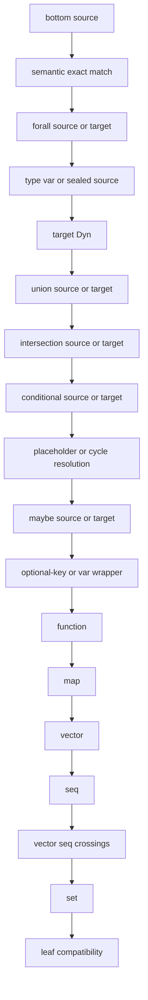
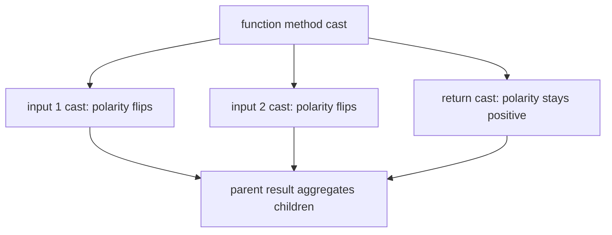

# Cast Dispatch

The reader now has both sides: declared target Types from admission and inferred
source Types from annotation. Cast dispatch answers the central checking
question: given source and target, which rule decides whether the program is
acceptable?

> **Snapshot:** state of Skeptic as of 2026-05-06.

## Prerequisites

[Type Domain (C04)](03-type-domain.md), [Provenance (C05)](04-provenance.md),
[Annotation Pass (C06)](06-annotation-pass.md), and
[Narrowing and Origins (C08)](08-narrowing-and-origins.md). You should know what
source and target Types are before reading this spoke.

## Where this fits

Ninth on the Contributor path and the last spoke on the Gist path. After this,
[Blame for All and Projection](10-blame-for-all-and-projection.md) explains how
failed cast results become findings.

## The Cast Contract

A cast is directional. The **source Type** is what the program produced or what a
callee offers. The **target Type** is what the surrounding context expects. The
cast result records whether the check succeeded, which rule ran, which child
checks were needed, and where a failure occurred inside a structure.

The direction matters most for functions. Function outputs are covariant: a
function that promises Keyword must actually return Keyword. Function inputs are
contravariant: a caller is at fault when it passes an argument shape that the
callee cannot accept.

This gives the reader a reliable diagnostic habit. Whenever a cast looks
surprising, identify source, target, and position before looking for a rule. A
string returned from `classify` is source in return position. An argument passed
to `*` is source from the caller and target from the callee's admitted method.
The same two Types can assign responsibility differently if their structural
position changes.

## What A Cast Result Stores

The cast result is both a yes/no answer and an explanation tree. At minimum, the
reader should expect:

| Field idea | Why the reader cares |
|---|---|
| success or failure | Whether this pair was compatible. |
| rule | Which dispatch branch made the decision. |
| source and target Types | The two sides of the directional check. |
| polarity and blame side | Who is responsible if the check fails. |
| children | Recursive checks inside functions or collections. |
| path | Structural location later rendered for the user. |

This is why projection can be a separate phase. Checking records enough detail
for later output, but it does not yet decide which detail should be the headline.

## The Dispatch Ladder

The reader is positioned to ask "which rule fires first?" because many Types are
composite. A maybe Type may contain a union; a union may contain a map; a map may
contain maybe values. Skeptic handles that with a priority ladder.

*Figure: cast dispatch priority, top to bottom.*



Each branch either returns a result or recurses into children. The order is
reader-visible because it determines what explanation appears in a finding. A
`ForallT` is handled before ordinary structural rules. A source union splits
before a leaf mismatch can be reported. A target `DynT` succeeds after sealed
values have had a chance to preserve the polymorphic boundary.

The ladder also prevents premature answers. If the source is a union, Skeptic
does not immediately compare the union object to the target leaf. It asks whether
each possible runtime alternative fits. If the target is a maybe Type, Skeptic
does not treat nil as an ordinary value hidden inside a leaf rule; it uses the
maybe rule to split nil from the inner Type.

| Priority region | Why it is early |
|---|---|
| Bottom and exact | Cheap decisive answers. |
| Quantified and abstract | Preserve polymorphic boundaries before shape checks. |
| Dynamic target | Gradual acceptance after sealed values are handled. |
| Branching Types | Split possible alternatives before structural leaves. |
| References | Resolve named or recursive Types before ordinary shape checks. |
| Structural Types | Recurse with paths into functions and collections. |
| Leaf | Final compatibility fallback. |

## Structural Children, Polarity, And Paths

Structural casts create child casts. A vector cast checks items; a map cast
checks keys and values; a function cast checks method inputs and outputs. Each
child receives a path segment so a later message can say "return value" or
"argument 1 -> field :k" instead of only "the function failed."

*Figure: a function cast has input children and an output child.*



Polarity explains who is blamed. Return-value failures usually blame the term
that produced the value. Input failures can blame the caller because the function
parameter position is contravariant.

For a function method, the return child asks whether the actual return Type fits
the declared return Type. The input child asks the dual question: can the
declared caller-provided argument be accepted by the source function's parameter?
That is why the same word "cast" covers both ordinary output checking and caller
responsibility for arguments.

## Unions

Unions answer two different questions depending on side. A source union must have
every alternative fit the target, because any of those alternatives may be
produced at runtime. A target union succeeds if the source fits at least one
target alternative, because the context accepts any of them.

This distinction is what makes `classify` legible. Its inferred body includes a
string alternative, and that alternative must fit the declared Keyword output.
It does not.

The useful reader shortcut is "source union means all; target union means one."
If actual output can be `A` or `B`, both must be acceptable to the declaration.
If the declaration accepts `A` or `B`, the actual only needs to fit one branch.

## Nullables

Maybe casts split the nil arm from the inner arm. This is why
`double-or-zero` depends on narrowing. Before `(some? n)`, the argument Type is
maybe Int. Inside the then-branch, narrowing has removed nil, so the cast for
`(* 2 n)` sees Int rather than maybe Int.

Without that earlier narrowing, the cast engine would have to check a maybe Type
against a numeric input expectation. The failure would not be a multiplication
bug; it would be a missing proof that nil has been removed. The walkthrough keeps
the two concerns separate so the reader can diagnose the right phase.

## Maps, Vectors, Sequences, And Sets

Collection casts use the same recursive pattern. A map cast pairs entries and
casts values at key paths. A vector cast compares fixed item positions and any
tail Type. A sequence cast focuses on element shape. A set cast checks element
compatibility and, when exact sets are involved, cardinality-sensitive cases.

The reader does not need the full algebra here. The key is that collection casts
produce paths. If a later finding says a field or index is wrong, that path was
created by a structural cast child, not by output rendering inventing a location.

## Leaf Compatibility

The leaf rule is where simple mismatches finally land. Ground-to-ground,
value-to-ground, numeric-dynamic, refinement, and adapter-like cases are decided
after every higher-priority shape has had a chance to run. In the worked example,
the string branch of `classify` eventually reaches a leaf comparison against the
Keyword target.

That late position is why the reported failure can still carry context. By the
time a leaf fails, parent rules have already established that the leaf is inside
a return, union branch, map entry, or other structure.

## How The Worked Example Casts

For `double-or-zero`, the successful path is the point. The multiplication call
is checked after `n` has been narrowed to Int. Its argument casts succeed, and
the branch returns an Int. The else branch returns `0`, also Int. The output cast
against declared `s/Int` succeeds.

For `classify`, the declared output is Keyword. The inferred body has keyword
alternatives and a string alternative. The source-side union check recurses into
each alternative. The keyword alternatives fit; the string alternative fails.
The parent cast result is therefore a failure and carries the child path that
later becomes the return-value finding.

The reader can now predict the high-level outcome without running the example:
`double-or-zero` has no finding because narrowing feeds Int into numeric calls
and the function returns Int. `classify` has a finding because every possible
source-union member must fit Keyword, and the string member does not.

## Predicting Before Running

For a small finding, the prediction process is:

1. Identify the declared target Type from admission.
2. Identify the inferred source Type from annotation and narrowing.
3. Find the first matching branch in the dispatch ladder.
4. If the rule is structural, follow its children until a leaf succeeds or fails.
5. Keep the path segments created along the way.

Apply that to `classify`: target is Keyword, source is a union of branch outputs,
source-union requires every member to fit, the string member reaches a leaf
mismatch, and the failure is under the function return path. That is enough to
predict the finding shape before reading output.

For `double-or-zero`, the same process predicts success: the target for `*`
expects numeric inputs, narrowing has made `n` an Int in the then branch, the
literal `2` is numeric, and the function's declared output is Int. No source
alternative remains that can produce nil at the multiplication site.

### In-depth: Placeholder And Cycle Resolution

***Skip if reading the Gist path.***

Some admitted Types refer to named schemas that may be recursive. The dispatcher
resolves placeholder and cycle Types before ordinary structural checks when a
referent is available. If resolution cannot safely decide more, Skeptic returns a
residual dynamic result rather than recurring forever.

### In-depth: Adding A Dispatch Rule

***Skip if reading the Gist path.***

To add a new rule, identify the Type shape, decide where it belongs in the
priority ladder, implement the rule in the cast namespace that matches the shape,
and make sure its result has useful child paths. The test should cover both the
direct pair and the way the new rule behaves inside a structure such as a union,
map, or function.

## Worked Example Here

```clojure
;; failing cast idea in classify
source: ValueT(:zero) | ValueT(:even) | GroundT Str
target: GroundT Keyword

;; passing cast idea in double-or-zero after narrowing
source: GroundT Int
target: numeric input expected by *
```

The exact display forms are covered in the output spoke. This spoke is about
which rule checks the pair.

## Source Pointers

- `skeptic/analysis/cast.clj:check-cast` - public cast entry point.
- `skeptic/analysis/cast.clj:dispatch-cast` - priority ladder.
- `skeptic/analysis/cast/support.clj:cast-ok` - successful result constructor.
- `skeptic/analysis/cast/support.clj:cast-fail` - failed result constructor.
- `skeptic/analysis/cast/support.clj:aggregate-children` - structural parent result builder.
- `skeptic/analysis/bridge/render.clj:polarity->side` - maps polarity to blame side.

## Glossary Terms Introduced

- Cast
- Cast result
- Blame polarity
- Source Type
- Target Type

## Where To Next

- **Continue (Contributor path):** [Blame for All and Projection](10-blame-for-all-and-projection.md)
- **Continue (Gist path):** [User-Facing Surfaces](11-user-facing-surfaces.md)
- **Return:** [Hub](README.md)
