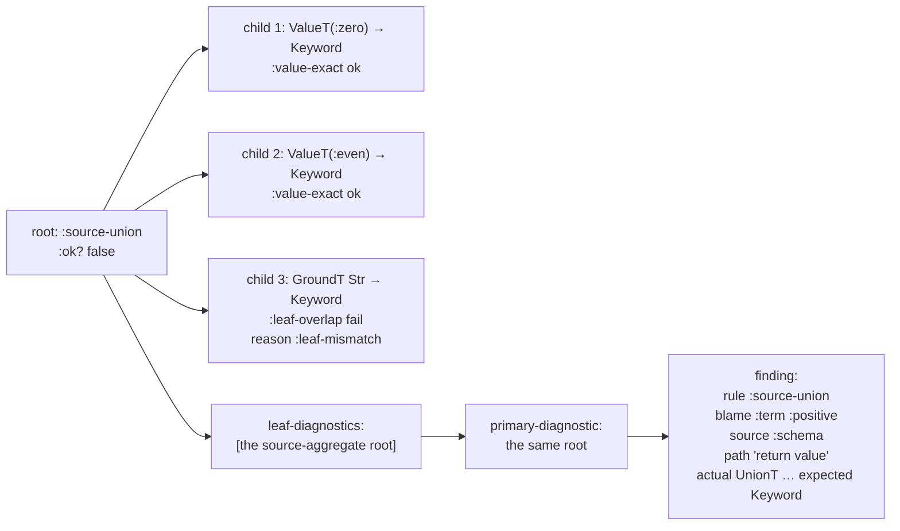
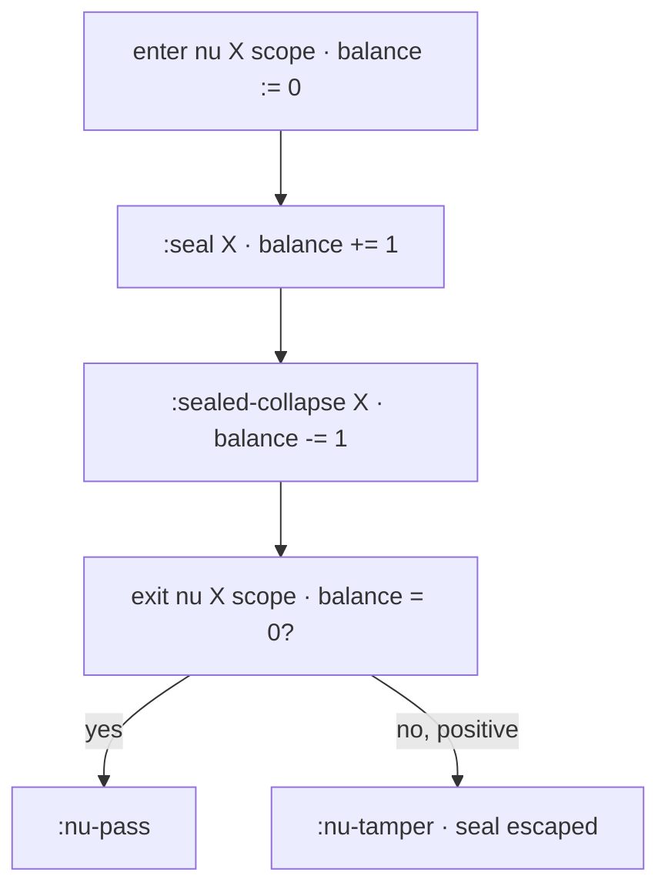

# Blame for All and Projection

> *Snapshot of state as of 2026-05-05.*

This spoke has two halves. The first explains the *polymorphic
boundary*: the part of Skeptic's cast engine derived from the
*Blame for All* paper, where quantified types and sealed dynamic
values meet. The second explains *projection*: how cast results
become findings — the records the user finally sees.

## Prerequisites

[Spokes 03](03-type-domain.md), [04](04-provenance.md), and
[09](09-cast-dispatch.md). No prior knowledge of the BfA paper
required; this spoke teaches the operational subset Skeptic uses.
If any of those prerequisites are unfamiliar, the
[hub README's reading paths](README.md#reading-paths) point to the
right earlier reading.

## Where this fits

Tenth on the Contributor path. The spoke has two halves:

1. **The polymorphic boundary** — the spot where Skeptic
   implements an operational subset of the Blame-for-All
   algorithm. Quantified types, sealed dynamic values, generalize
   and instantiate, the seal-balance check.
2. **Blame projection** — how cast results become findings:
   walking the tree, picking a primary diagnostic, computing a
   visible path, and packaging the result for the printers.

Together they close the cast-engine story. The next spoke
([11](11-user-facing-surfaces.md)) consumes finding records and
turns them into text or JSONL output. A reader on the Diagnose-
finding path enters this spoke from the projection half — given a
finding, the spoke says how the finding was constructed.

## The polymorphic boundary, in plain terms

**This section teaches: why quantified types need their own
treatment, and what the alternative — naive substitution — would
break.**

Skeptic admits some quantified types: most directly through a
hand-written `^{:skeptic/type T}` override or an admitted
Schema/Malli form that contains a type variable. When such a
type appears as the source or target of a cast, the ordinary
structural rules don't apply.

Naive substitution is the obvious alternative and the wrong one.
Suppose Skeptic sees a cast from `Int` to `forall X. X -> X`.
Substituting `X := Int` would give the cast `Int → Int → Int`, a
fine-looking shape. But it would forget that the function is
*supposed* to work for *every* type, not just `Int`. The user's
intent — "this is a generic identity, parametric in X" — would
be lost; subsequent casts of the same value at a different
type would silently succeed even when the function actually
inspects its argument and assumes it's an `Int`.

The Ahmed-Findler-Siek-Wadler paper *Blame for All* (POPL 2011)
gives an algorithm for handling these casts in a way that
preserves *parametricity at runtime*. Skeptic implements an
operational subset of that algorithm. The full paper covers
proof machinery, static casts, and the Jack-of-All-Trades
principle; the runtime mechanism is what Skeptic needs to give
honest answers when quantified types meet first-order ones.

## Sealing, in three sentences

**This section teaches: what a sealed dynamic value is, what
mechanism makes the seal "tamper-protected," and when the seal
gets discharged.**

When a value of an abstract type variable `X` is cast into Dyn,
Skeptic produces a **sealed dynamic value** — a `SealedDynT(X)`
that wraps the original value and carries the binder name `X`.

The seal is *tamper-protected* in two senses. First, *inspecting*
the seal — asking "is this value an Int?" or any other
ground-style predicate test — raises `:is-tamper`, which is a
global blame failure (the polymorphic contract itself was
violated). Second, *smuggling* the seal across the binder's
scope — letting a sealed value of binder `X` outlive the `nu X`
scope that gave the binder its meaning — raises `:nu-tamper`,
also global blame.

The seal is *discharged* (rule `:sealed-collapse`) only when it
is cast back into its own `X` — the binder identity matches and
the original value re-emerges. A cast back into a *different*
binder fails with `:sealed-ground-mismatch`. A cast back into
some non-type-var target fails with `:type-var-source` and
reason `:abstract-source-mismatch`.

The mechanism is what makes parametric polymorphism honest under
gradual typing. Without sealing, casting an `Int` through a
`forall X. X -> X` and back out could produce an `Int` that
masquerades as polymorphic; with sealing, the polymorphic claim
is enforced — the function literally cannot inspect the value it
received without raising tampering, and the seal cannot escape
its scope.

## Generalize and instantiate

**This section teaches: the two polymorphic *moves* the cast
engine uses, what each does to the cast tree, and why
instantiation always uses Dyn.**

There are exactly two polymorphic moves in `check-quantified-cast`.

**`:generalize`.** A cast *into* `forall X. B` produces a
polymorphic value, deferring the choice of `X`. Operationally:

```text
;; cast: V : A  =>  forall X. B
;; result: a polymorphic value waiting for type-application
;;
;; when the value is applied to some Y:
;;   nu X := Y. (V : A => B)
;;   — open a fresh binder and recurse on the inner cast
```

The *binder is preserved at runtime* (in the cast engine's
sense). The cast's choice of binder (`X`) is not the same as a
substitution — it's a wrapper that defers the substitution.

A subtle precondition: `:generalize` requires that `X` does not
already appear free in `A` (the source type). If it does, the
cast fails with reason `:forall-capture` — the source already
references the binder we're about to introduce, so generalizing
would *capture* the existing reference and change its meaning.
The cast engine refuses rather than produce a wrong answer.

**`:instantiate`.** A cast *out of* `forall X. A` substitutes
`X := Dyn` and recurses:

```text
;; cast: V : forall X. A  =>  B
;; result: V's instantiation at Dyn  =>  B
;;   — substitute X := Dyn in A, then cast as usual
```

The choice of Dyn — not some concrete type, not the target's
shape — is the paper's *Jack-of-All-Trades* principle.
Instantiating `X := Dyn` is at least as permissive as
instantiating with any concrete type: anything that works under
some specific `X` choice will work under Dyn. So if the cast
succeeds at Dyn, it succeeds at every choice; if it fails at
Dyn, the user has a real problem at any choice. Substituting Dyn
is the conservative-and-precise option.

A subtle property of both moves: each one wraps its child cast
inside a `nu`-scope check. After the inner cast completes,
`exit-nu-scope` runs to verify that the seal balance is zero —
no sealed values escaped — before reporting the polymorphic move
as successful. If a seal escaped, the parent cast fails with
`:nu-tamper`.

## The mini-example, walked through

**This section teaches: a concrete reduction showing seal,
collapse, nu-pass, and the tampering counter-examples.**

A small worked-out reduction shows the rules in action.

```text
;; Source value:    id : Dyn  (carrying (lambda (y) y))
;; Target type:     forall X. X -> X
;;
;; Reduction (per Skeptic's check-quantified-cast):
;;
;;   step 1.  generalize:        (id : Dyn  =>  forall X. X -> X)
;;            -> Lambda X. (id : Dyn  =>  X -> X)
;;
;;   step 2.  type-app at Int:   ((Lambda X. body) Int)
;;            -> nu X := Int. body
;;
;;   step 3.  argument cast:     42 : Int  =>  X
;;            -> :seal              ; produces  SealedDyn(X) wrapping 42
;;
;;   step 4.  function body returns the sealed value unchanged.
;;
;;   step 5.  result cast back:  SealedDyn(X)  =>  X
;;            -> :sealed-collapse   ; the seal's binder matches the target X
;;
;;   step 6.  exit nu scope:     seal-balance is 0; emit :nu-pass.
```

Two contrast cases show the tampering rules.

```text
;; Contrast — a body that inspects its argument:
;;   (lambda (y) (if (zero? y) 0 y))
;;
;; In step 4 above, the body would call (zero? y).
;; (zero? y) inspects a sealed value:
;;            -> :is-tamper
```

```text
;; Contrast — a body that smuggles the seal out through Dyn:
;;   (lambda (y) y) cast to forall X. X -> Dyn
;;
;; In the result cast (step 5 alternative), the seal would
;; cross out to plain Dyn:
;;            -> :nu-tamper          ; sealed value escapes binder scope
```

In all three cases — pass, `:is-tamper`, `:nu-tamper` — the seal
mechanism is what makes the verdict precise. Without seals, the
type-checker would have to choose between treating the
polymorphic function as too permissive (anything goes) or too
restrictive (anything fails). Seals let it be exactly as
permissive as the parametric promise allows.

*Figure: The reduction of the BfA mini-example. Each step is one
firing of a rule the spoke names; the bottom row is `:nu-pass`
(zero seal balance on exit).*

```mermaid
sequenceDiagram
    participant V as Source value (id : Dyn)
    participant Cast as Cast engine
    participant Body as forall body
    Cast->>V: cast against forall X. X -> X
    V-->>Cast: :generalize → Lambda X. inner-cast
    Cast->>Body: type-app at Int
    Body-->>Cast: nu X := Int. body
    Cast->>V: arg cast 42 : Int → X
    V-->>Cast: :seal → SealedDyn(X)
    Body->>Cast: returns sealed value
    Cast->>V: result cast SealedDyn(X) → X
    V-->>Cast: :sealed-collapse
    Cast->>Cast: exit nu; seal-balance = 0; :nu-pass
```

## Quantified types in Skeptic

**This section teaches: where quantified types come from and
where the cast engine's quantified rules live.**

`ForallT` is the type-domain representation of `forall X. T`;
`TypeVarT` is a bound type variable; `SealedDynT` is a sealed
value in flight. All three appear only at admission or at
runtime under cast — never produced by annotation (the
first-order invariant from
[spoke 06](06-annotation-pass.md#the-first-order-invariant)).

The cast engine has two clauses dedicated to quantified
machinery — clauses 3 and 4 of the dispatch ladder
([spoke 09](09-cast-dispatch.md#the-dispatch-ladder)):

- Clause 3 fires when either side is a `ForallT`. It hands off
  to `check-quantified-cast`, which dispatches between
  `:generalize` (if the *target* is forall) and `:instantiate`
  (if only the source is forall — the target side already
  matched would have meant the source was also forall, which is
  the generalize case).
- Clause 4 fires when either side is a `TypeVarT`, or the source
  is a `SealedDynT`. It hands off to `check-abstract-cast`, which
  has four branches: `:seal` (cast from a `TypeVarT` source into
  a `Dyn` target), `:sealed-collapse` (cast from a `SealedDynT`
  source into a matching `TypeVarT` target), `:type-var-source`
  / `:type-var-target` (other type-var dispositions), and
  `:sealed-conflict` (a sealed value cast into a mismatched
  binder).

Both `check-quantified-cast` and `check-abstract-cast` live in
`skeptic/analysis/cast/quantified.clj`. The seal-balance
machinery (`exit-nu-scope`, `rule-seal-delta`, `seal-balance`,
`leaked-sealed-type`) lives alongside the other support helpers
in `skeptic/analysis/cast/support.clj`.

## The quantified boundary check

**This section teaches: the seal-balance invariant and how
`exit-nu-scope` enforces it.**

When a cast crosses a quantified boundary, the engine maintains
a **seal balance**: the running difference of `:seal` rules
fired *minus* `:sealed-collapse` rules fired, restricted to the
specific binder of the surrounding `nu` scope. The balance must
be zero on exit; a non-zero balance means either a seal escaped
(positive) or a collapse fired without a matching seal
(negative; this is a structural bug in the cast tree itself, not
a user-facing failure).

`exit-nu-scope` is the function called at the close of a
quantified boundary. It walks the child cast-result tree
counting `:seal` and `:sealed-collapse` deltas, plus walking the
*types* in the result for any sealed-ground inhabitants whose
binder matches. If the cumulative balance is positive, the
`leaked-sealed-type` helper finds the offending sealed type and
the parent reports `:nu-tamper`. If the balance is zero,
`:nu-pass` is emitted as the success indicator.

The balance is *per-binder*. A cast that opens two `nu` scopes
for two different `X`s tracks them independently; a seal of `X`
doesn't contribute to the balance of `Y`. This is what makes
nested polymorphism work: each `nu` scope is its own scope, and
seals from inside one scope don't leak into the outer scope's
accounting.

A subtle property: `exit-nu-scope` operates on the *cast-result
tree below the polymorphic boundary*, not on the source/target
Types directly. The walk inspects the tree for `:seal` and
`:sealed-collapse` deltas, *and* it inspects the result's
target-type for sealed-ground inhabitants matching the current
binder. The latter check catches the case where a value-level
result Type mentions a sealed-ground that should have collapsed
but didn't — the seal would otherwise *escape* via the value-
level type without crossing a `:sealed-collapse` rule firing.

## Tampering rules

**This section teaches: the two tamper rules, when each fires,
and how the cast engine's blame attribution treats them.**

Two tamper rules guard the seal.

**`:is-tamper`.** The `check-type-test` helper runs the
predicate-style test that Skeptic uses inside `check-leaf-cast`
when the source is a `SealedDynT`. The cast engine reaches the
test when a sealed value would have to be inspected to decide a
verdict — `(zero? y)` on a sealed `y`, in the BfA example.
Inspecting a seal is a violation of the parametric promise; the
test produces a `cast-fail rule :is-tamper polarity :global
reason :is-tamper`.

The polarity `:global` is the tell: tampering isn't a *term*
or *context* failure — it's the polymorphic contract itself
being violated. The blame side is `:global`, the rendered
finding has no specific side at fault.

**`:nu-tamper`.** Fires from `exit-nu-scope` when the seal
balance for the surrounding binder is positive after the inner
cast completes. The cause: a sealed value escaped its scope. The
escape can happen either through a value-level Type that
contains a sealed-ground (the seal "leaked" outward through the
result Type) or through an unbalanced `:seal` count (more seals
opened than closed). The fail rule is `:nu-tamper` with
`:global` polarity and `:nu-tamper` reason.

A third rule worth naming for completeness:
`:dynamic-test`. This is the *successful* counterpart to
`:is-tamper` — when a `check-type-test` is invoked on a non-
sealed source, the result is `cast-ok rule :dynamic-test` with a
`:matches?` field reporting whether the value's type equals the
ground being tested. So the test sites use the same machinery
for sealed and unsealed inputs; only the sealed inputs trigger
tampering.

Both tamper rules are reported as findings with `:blame-side
:global` and `:blame-polarity :global`. The user-facing rendering
([spoke 11](11-user-facing-surfaces.md)) renders these as
"attempts to inspect a sealed value" / "attempts to move a
sealed value out of scope" rather than as a normal mismatch.

## Blame side and polarity in failures

**This section teaches: the mechanical mapping from the cast's
polarity to the finding's blame side, and what each side means
to the user.**

For ordinary (non-tamper) failures, the cast result carries a
`:blame-side` and `:blame-polarity`. The mapping is mechanical:

- `:blame-polarity :positive` ↔ `:blame-side :term`. The *term*
  — the value being checked, the source of the cast — is at
  fault. Output-cast failures (function returning the wrong
  shape) carry `:positive` / `:term`. The user-facing message
  reads as "this expression returns the wrong type."
- `:blame-polarity :negative` ↔ `:blame-side :context`. The
  *context* — the surrounding code calling into the term — is
  at fault. Input-cast failures (caller passing the wrong shape)
  carry `:negative` / `:context`. The polarity flip happens at
  the function-domain rule (see
  [spoke 09](09-cast-dispatch.md#children-polarity-and-paths)).
  The user-facing message reads as "this call site passes the
  wrong type."
- `:blame-side :global` and `:blame-polarity :global` mean the
  failure is the polymorphic contract itself — `:is-tamper` or
  `:nu-tamper`.
- `:blame-side :none` and `:blame-polarity :none` mean a missing
  or internal-only failure (rare; usually a structural
  placeholder).

The mapping lives in `abr/polarity->side`, called from
`cast-result`'s constructor. Cast rules don't compute blame side
directly; they compute polarity, and the mapping is automatic.

The user-facing rendering ([spoke
11](11-user-facing-surfaces.md)) turns these into the human
strings that appear in findings — the colored output lines and
the JSONL `blame_side` / `blame_polarity` fields. The cast
engine's job is just to record the polarity correctly; the
mapping to side and the rendering of side as text are
downstream.

## From cast result to a finding

**This section teaches: the projection pipeline that turns a
cast-result tree into the flat finding record the printer
consumes.**

Once `check-cast` returns, *blame projection* takes over. The
cast result is a tree — possibly dozens of nodes deep on a
complex map cast — and the user wants a flat finding with one
headline diagnostic, one expected/actual pair, and one path.
Projection is the lossy compression from the tree to that
finding.

Projection runs in three stages, all in
`skeptic/analysis/cast/result.clj` and
`skeptic/inconsistence/report.clj`.

**Stage 1 — collect failing leaves.** `cast-result/leaf-diagnostics`
walks the cast-result tree, descending through *structural
rules* (the rules in the `structural-rules` set —
`:target-union`, `:source-union`, `:target-intersection`,
`:source-intersection`, `:maybe-both`, `:maybe-target`,
`:generalize`, `:instantiate`, `:function`, `:function-method`,
`:map`, `:vector`, `:seq`, `:set`) and stopping at non-structural
leaves. The result is a flat list of leaf diagnostics, each
carrying its own source/target, rule, reason, blame side and
polarity, and the cumulative path from root.

A subtle exception: `:source-union` and `:source-intersection`
are special. The walker treats them as *source-aggregate* rules
— it projects the rule's *parent* itself rather than recursing
into children. The reason is that the user-facing finding for "a
source union doesn't fit" is the union as a whole; the failing
member is findable via `:children` for detail-line construction
but the headline leaf is the union.

**Stage 2 — pick a primary diagnostic.** When multiple leaves
fail, `report/ordered-output-leaves` ranks them. Three keys, in
order:

1. **Visible-structural-leaf first.** A leaf whose path renders
   to a non-empty visible string (i.e., the path has at least
   one display segment like `:function-domain`, `:map-key`,
   `:vector-index`) ranks before a leaf with no visible path.
2. **Concrete-actual-type next.** A leaf whose `actual-type`
   isn't a `Dyn`-shaped open Type ranks before a leaf with a
   `Dyn` actual-type. The reasoning: a `Dyn` leaf rarely tells
   the user something they can act on; "expected `Int`, got
   `Dyn`" is barely better than "expected something specific,
   got something unspecified."
3. **Original tree order** as the tie-breaker.

`primary-actionable-output-leaf` is `(first (filter
actionable-output-leaf? (ordered-output-leaves report)))`. The
`actionable-output-leaf?` predicate is `(or
(visible-structural-leaf? leaf) (not (dynamic-display-type?
(:actual-type leaf))))` — actionable means "either has a visible
path or has a concrete actual type." When the only failing leaf
is `Dyn`-shaped without a visible path, projection accepts it
anyway — no concrete leaf is available — and the user sees a
`Dyn`-shaped diagnostic. That's a signal to add a
`^{:skeptic/type T}` override or to tighten an upstream schema.

**Stage 3 — project the path.** The path is a vector of
structural segments, like `[{:kind :function-domain :index 1}
{:kind :map-key :key :foo}]`. `path/render-visible-path` filters
out the internal-only segments
(`:source-union-branch`, `:target-union-branch`, etc., which
exist for the cast engine's own structural reasoning but have
no user-facing meaning) and joins the rest into a string:
`"argument 2 → field :foo"`. An empty visible path on an output-
side mismatch renders as `"return value"` (the default for the
output-side path).

The packaged finding records: namespace, file, line/column, the
blamed expression, the inferred-vs-declared type pair, the
primary rule, the visible path, the cumulative error messages,
and the *source* (read from the blamed Type's `:prov`, telling
the user which admission source's claim the cast was checking).

## How the worked example projects

**This section teaches: the literal projection of `classify`'s
failed cast into a finding record.**

`classify`'s failed cast tree (from
[spoke 09](09-cast-dispatch.md#how-the-worked-example-casts)):

```text
:source-union — :ok? false — polarity :positive
├── :value-exact — :ok? true
├── :value-exact — :ok? true
└── :leaf-overlap — :ok? false — reason :leaf-mismatch
    actual GroundT Str   expected GroundT Keyword
```

Stage 1 — `leaf-diagnostics` walks the tree. The root rule is
`:source-union`, which is in the source-aggregate subset of the
structural-rules set. So `leaf-diagnostics` does *not* descend
into children for the headline; it projects the parent itself
as the leaf. Result: a one-element list of leaf diagnostics, the
union itself, with rule `:source-union`, reason
`:source-branch-failed`, source-type the `UnionT`, target-type
`GroundT Keyword`, blame side `:term`, blame polarity
`:positive`, and an empty path.

Stage 2 — `ordered-output-leaves` ranks one leaf alone. Trivially
the primary. The leaf's `actual-type` is the union; the union
isn't `Dyn`-shaped, so the leaf is actionable.

Stage 3 — path projection. The visible path on the leaf is
empty (no display segments). `render-visible-path` returns nil;
the output-side default fires. The user-facing path is
`"return value"`.

The detail line is built by `mismatch-detail` (in
`inconsistence/path.clj`): given the path-text "return value",
the source-text "Str" (from the `GroundT Str` member that
actually failed — found by walking the children for the failing
member), and the target-text "Keyword", the function produces
`"return value has Str but expected Keyword"` (or the multi-
line block form if the types are long enough to exceed a
threshold).

The packaged finding includes:

- `:rule` `:source-union` (the headline rule).
- `:cast-summary` `{:rule :source-union, :actual-type the-union,
  :expected-type Keyword, …}`.
- `:cast-diagnostics` `[{the source-aggregate leaf}]`.
- `:blame-side` `:term`.
- `:blame-polarity` `:positive`.
- `:source` `:schema` (from `prov/source` on the actual-type's
  prov; merged at cast-root construction time in `cast-report`).
- `:errors` `["in classify, …"]` (the rendered message).

The whole record then flows to the printer, which renders it
according to the active output mode
([spoke 11](11-user-facing-surfaces.md)).

`double-or-zero` produces no failing cast and no finding. Its
projection is trivial — the cast-report function returns
`{:ok? true :errors [] …}` with `:source` set from the cast's
declared-side prov, but no error rendering happens.

*Figure: `classify`'s cast-result tree on the left, the flat leaf
list `leaf-diagnostics` produces in the middle, and the
projected finding shape on the right.*



*Figure: Seal balance integrated over a cast tree. Each `:seal`
adds 1; each `:sealed-collapse` subtracts 1. Exit checks zero;
positive balance fires `:nu-tamper`.*



### In-depth: seal balance and `exit-nu-scope`

***Skip if reading the Gist path.***

A contributor extending the quantified cast — adding a new
quantified Type kind, a new sealing rule, a new seal-aware
helper — needs the seal-balance accounting in detail.

Three pieces in `skeptic/analysis/cast/support.clj` cooperate:

- **`rule-seal-delta`** — the per-result delta. For a
  `:seal` result whose `:sealed-type` carries the binder under
  inspection, the delta is +1. For a `:sealed-collapse` result
  whose `:source-type` is a `SealedDynT` carrying the binder,
  the delta is −1. Anything else is 0. The function reads
  `sealed-ground-name` to extract the binder from a sealed-dyn
  type.
- **`seal-balance`** — the running total. Walks the cast result
  tree (via `tree-seq`) and sums `rule-seal-delta` for the
  binder under inspection. Returns the integer balance.
- **`leaked-sealed-type`** — finds the *first* sealed type that
  contributed +1 to the balance, for diagnostic purposes. This
  is what `exit-nu-scope` attaches as `:sealed-type` on a
  `:nu-tamper` result.

`exit-nu-scope` ties them together. Given a cast result
artifact (typically the inner cast's result from a generalize or
instantiate) and a binder, it computes `seal-balance` over the
artifact's children. Three branches:

- **Positive balance** — fail with `:nu-tamper`. The leaked
  sealed type is the one returned by `leaked-sealed-type`. The
  source-type is set to the leaked type; the target-type is a
  freshly-constructed `TypeVarT` carrying the binder name; the
  reason is `:nu-tamper`; the blame-polarity is `:global`.
- **Zero balance** — success with `:nu-pass`. The source-type
  is whatever the artifact's target-type was; the target-type is
  a `TypeVarT` for the binder; the children carry the artifact.
- **Negative balance** — Skeptic considers this a structural bug.
  In source, the function still returns a fail-shaped result,
  but the situation shouldn't arise in practice — it would mean
  `:sealed-collapse` fired without a corresponding `:seal`,
  which the cast rules don't allow.

A second variant of `exit-nu-scope` handles the case where the
artifact is itself a Type (not a cast-result map) — for example,
when the cast tree didn't produce a wrapped result. The Type-
shaped variant inspects the Type for sealed-ground inhabitants
matching the binder via `contains-sealed-ground?`. If found,
the result is `:nu-tamper`; otherwise `:nu-pass` over the
constructed `TypeVarT`.

The contributor adding new quantified machinery has to ensure
that any new rule producing or consuming a seal updates
`rule-seal-delta` to recognize the new rule's contribution. A
new rule that closes a seal but isn't `:sealed-collapse` would
miss the −1 accounting and produce false `:nu-tamper`s.

### In-depth: actionable output leaves and the `Dyn`-shaped fallback

***Skip if reading the Gist path.***

A contributor wondering why the projection has *two* concepts —
"actionable" and "ordered" — and why the predicate distinguishes
them needs the diagnostic-quality story.

When a cast tree has multiple failing leaves, projection picks
one for the headline. The naive choice — depth-first first —
works in most cases, but sometimes it produces a leaf whose
`actual-type` is `Dyn` or another open Type. A `Dyn` leaf rarely
tells the user something they can act on; "expected `Int`, got
`Dyn`" is barely better than "expected something specific, got
something unspecified."

Two functions cooperate to do better:

`actionable-output-leaf?` is the predicate: a leaf is actionable
if its path is a visible-structural-path (has at least one
display segment) *or* its actual-type isn't a Dyn-shaped open
Type. The two conditions are intentionally permissive: even a
leaf with no path is actionable if the actual-type is concrete.

`ordered-output-leaves` is the ranker: sort by `(visible-structural?
0 1)` first, then by `(if (and (not visible-structural?)
(dynamic-display?)) 1 0)` second, then by original tree order.
The first key prefers visible-path leaves over no-path leaves;
the second key, applied only when *no* visible path is present,
prefers concrete-type leaves over Dyn leaves.

`primary-actionable-output-leaf` then picks the first actionable
leaf in the ordered list. If the list has no actionable leaves,
it returns nil — and projection falls back to the cast-summary
itself for the headline, which the user sees as a Dyn-shaped
diagnostic.

The contributor question this design is answering: *what's the
best leaf we can show the user?* If a finding has both a deep
concrete leaf and a shallow Dyn leaf, the deep concrete one is
more useful — it points at a specific structural location and a
specific type expectation. The Dyn leaf is a fallback: if it's
the only thing we have, show it; otherwise prefer concrete.

The cost of this design is a minor amount of bookkeeping at
projection time (sorting, predicate testing). The benefit is
that real findings against `Dyn`-tainted code give the user
*something* — a structural path, a concrete leaf — rather than
just "everything is dyn."

### In-depth: the four detail builders

***Skip if reading the Gist path.***

A contributor adding a new failure rule that produces a
user-facing detail line — a new map-cast failure, a new
function-arity failure shape — needs to know which detail
builder to extend.

`inconsistence/path.clj` exports four detail builders, each
keyed by a *reason*:

- **`missing-detail`** — for `reason :missing-key` (target
  required a key the source didn't have). Renders as
  `"<path> is missing"` or `"<path> is missing required key
  matching <key>"`.
- **`nullable-detail`** — for `reason :nullable-key` (target
  required a key that the source declares optional). Renders as
  `"<path> is potentially nullable, but the type doesn't allow
  that"`.
- **`unexpected-detail`** — for `reason :unexpected-key` (source
  has an exact entry with no target slot). Renders as `"<path>
  is not allowed by the declared type"`.
- **`mismatch-detail`** — the default, for everything else.
  Renders as `"<path> has <source-text> but expected
  <target-text>"`, with a multi-line block fallback when types
  are long.

The dispatch in `detail-line` (in `path.clj`) uses the
diagnostic's `:reason` field to pick the right builder. New
rules introducing a new reason keyword need to either match an
existing builder (via a new case in `detail-line`'s dispatch) or
add a new builder with its own rendering shape.

`with-path-detail` is the universal post-processor: it appends
`"Path: <path>"` to the message when the visible path is non-
empty. So every finding's detail line has a path appended,
regardless of which builder produced the body of the line.

A second related function: `union-alternatives-line`. When the
cast root is a target-union with no displayed path and the
failed members all share an actual type, the detail line is
augmented with `"<actual-type> does not match any of:
<alt-1>, <alt-2>, …"`. This is a special case for "I tried all
of these alternatives and none fit"; the augmentation appears as
an extra bullet in the detail-line list.

### In-depth: cast-report and output-cast-report

***Skip if reading the Gist path.***

A contributor adding a new finding kind — say, a new
declaration-side check that produces findings of its own —
needs to know how to package the cast result into the finding-
shape map the printer consumes.

Two packaging functions in `inconsistence/report.clj`:

`cast-report` is the *generic* packager. It runs `check-cast` on
the given source and target, walks the result, and produces:

- On success: `{:ok? true, :errors [], :source <prov-source>,
  :cast-summary <root>, :cast-diagnostics [], :blame-side :none,
  :blame-polarity :none, :rule <root-rule>, :expected-type
  <target>, :actual-type <source>}`.
- On failure: `(merge {:ok? false, :source <prov-source>, :errors
  [<rendered-messages>]} (cast-report-metadata raw))`. The
  `cast-report-metadata` reads `root-summary`, `leaf-diagnostics`,
  and `primary-diagnostic` from the raw cast result and assembles
  the report's `:cast-summary`, `:cast-diagnostics`, `:blame-side`,
  `:blame-polarity`, `:rule`, `:expected-type`, `:actual-type`.

`output-cast-report` is the *output-side* variant. Same shape as
`cast-report`, but on failure it prepends a single rendered
message via `mismatched-output-schema-msg` (a specific message
shape for output-side failures, with a "has inferred output type:
… but expected: …" framing). The output-side variant is used by
`def-output-results` in the pipeline; the generic variant is
used by every other call site.

The shape these functions produce is what the projection layer
consumes. A contributor adding a new check that runs after the
cast (a new structural validator, a new accessor-summary check)
should produce the same shape and let the existing renderer
machinery handle it.

A subtle property: the `:source` field on the report comes from
`(prov/source (prov/of actual-type))` — the *actual-type*'s
prov, not the cast root's. Why? Because the actual-type is the
*declared* side at admission time (the dict's entry); its prov
is the *declaration*'s source. Reading from the cast root's prov
would sometimes pick up `:inferred` (when the cast was on an
inferred body against a declared output), losing the
declaration-source attribution the user needs.

## Marquee functions

| Function                       | File                                              | Role                                                                       |
|--------------------------------|---------------------------------------------------|----------------------------------------------------------------------------|
| `check-quantified-cast`        | `skeptic/analysis/cast/quantified.clj`             | Generalize/instantiate dispatch.                                           |
| `check-abstract-cast`          | `skeptic/analysis/cast/quantified.clj`             | Type-var / sealed source dispatch (`:seal`, `:sealed-collapse`, etc.).      |
| `exit-nu-scope`                | `skeptic/analysis/cast/support.clj`                | Seal-balance check on exit; emits `:nu-pass` or `:nu-tamper`.               |
| `cast-result/leaf-diagnostics` | `skeptic/analysis/cast/result.clj`                 | The cast-result-tree → flat-leaf-list projection.                          |
| `inrep/cast-report`            | `skeptic/inconsistence/report.clj`                 | The packaging step: cast result + ctx → finding-shape map.                  |
| `path/render-visible-path`     | `skeptic/inconsistence/path.clj`                   | The user-facing path string.                                                |

## Worked example here

`classify`'s finding is fully constructed: cast-result tree
above, leaf diagnostic (the `:source-union` leaf with
`:source-branch-failed` reason and a child `GroundT Str` →
`GroundT Keyword` failure with rule `:leaf-overlap` and reason
`:leaf-mismatch`), message text, path text, source attribution
`:schema`. The BfA mini-example is the second half's central
artefact; the worked-example BfA case is illustrative because
the user-facing example doesn't admit any quantified Types.

## Glossary terms introduced

- Sealed dynamic value (full operational definition)
- Quantified type (operational meaning)
- Quantified boundary check (`exit-nu-scope`)
- Tampering (`:is-tamper`, `:nu-tamper`)
- Generalize / instantiate (rules)
- Seal balance
- Blame projection
- Actionable output leaf
- Detail line builders (the four)

## Where to next

- **Continue (Contributor path):** [User-Facing Surfaces (11)](11-user-facing-surfaces.md)
- **Diagnose-finding path:** continue (reverse) to [Cast Dispatch (09)](09-cast-dispatch.md)
- **Return:** [Hub](README.md)
