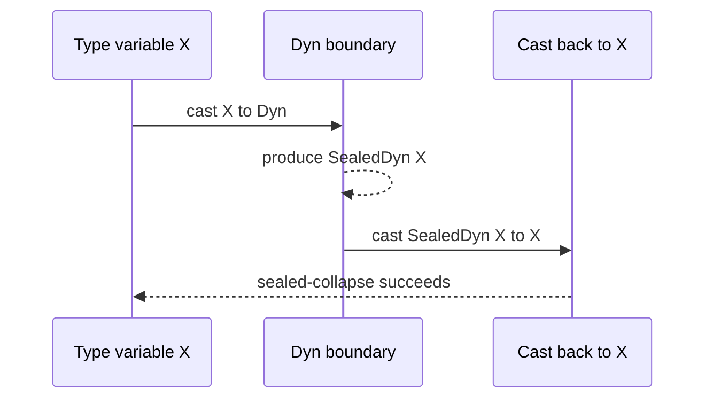
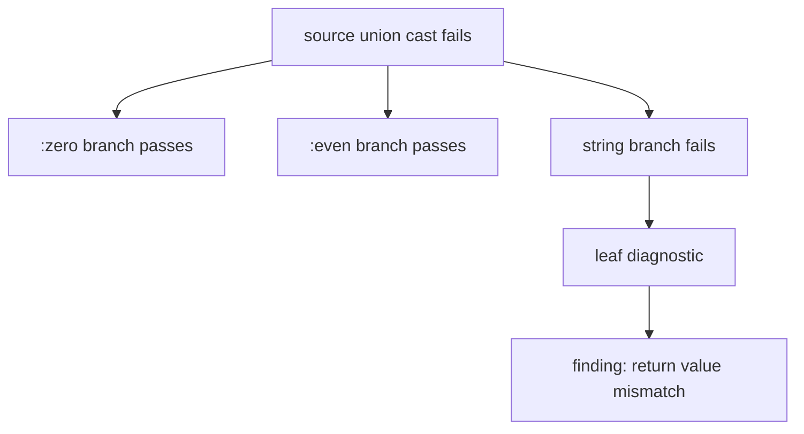

# Blame For All And Projection

Cast dispatch tells the reader which rule ran. This spoke answers two follow-up
questions: how does Skeptic handle polymorphic boundaries, and how does a failed
cast-result tree become one user-facing finding?

> **Snapshot:** state of Skeptic as of 2026-05-06.

## Prerequisites

[Type Domain (C04)](03-type-domain.md), [Provenance (C05)](04-provenance.md),
and [Cast Dispatch (C09)](09-cast-dispatch.md). No prior knowledge of the
polymorphic blame literature is required; the operational subset is introduced
here.

## Where this fits

Tenth on the Contributor path and third on the Diagnose-finding path. It closes
the cast-engine story by explaining both successful polymorphic boundaries and
failed ordinary casts.

## The Polymorphic Boundary, In Plain Terms

Most casts compare concrete shapes: Int to Keyword, map to map, function to
function. Quantified Types are different. A `ForallT` says a value must behave
uniformly for an abstract type variable. Skeptic cannot check that by pretending
the variable is an ordinary ground type.

The quantified cast rules preserve the boundary with seals. The reader should
hold one idea: values that cross from an abstract type variable into dynamic
space are wrapped so later code cannot inspect or smuggle them as if the
abstraction did not exist.

This topic appears after ordinary cast dispatch for a reason. The reader first
needs to understand source, target, children, and polarity. Quantified casts use
the same result machinery, but they protect a different invariant: an abstract
type variable must remain abstract even when gradual `DynT` is involved.

## Sealing In Three Moves

First, casting a type variable value into `DynT` creates a sealed dynamic value
that remembers the binder. Second, casting that sealed value back to the same
type variable discharges the seal. Third, inspecting the sealed value or letting
it escape the binder scope is tampering.

The seal is not a user-facing runtime object in this walkthrough. It is the
conceptual marker that lets the cast engine distinguish "the value passed through
parametrically" from "the value was inspected or leaked through dynamic code."

*Figure: a sealed value can only collapse back to its own binder.*



## Generalize And Instantiate

Casting into a `forall` generalizes: Skeptic checks the body under a fresh
abstract binder. Casting out of a `forall` instantiates: Skeptic substitutes a
dynamic representative and continues. These are the only polymorphic moves the
walkthrough needs. Everything else is ordinary recursive casting under the
boundary those moves create.

Generalize is used when the context expects a polymorphic value. Instantiate is
used when a polymorphic source is used at a particular boundary. In both cases,
Skeptic avoids choosing a concrete ground type for the abstract variable.

## Mini-Example

```text
Source value: id as Dyn
Target type: forall X. X -> X

1. Generalize into forall X.
2. Apply the polymorphic value at Int.
3. Cast argument 42 from Int into X, then into Dyn: create SealedDyn(X).
4. The body returns the sealed value unchanged.
5. Cast SealedDyn(X) back to X: sealed-collapse.
6. Leave the binder scope with no escaped seal.
```

If the body inspected the sealed value with a predicate, the cast result would
record an inspection tamper. If the body returned the seal through a dynamic
result beyond the binder scope, the cast result would record an escape tamper.

That is enough BfA machinery for the rest of Skeptic. The walkthrough does not
need formal reduction rules; it needs the reader to recognize why quantified
casts sit above ordinary structural rules in dispatch and why sealed values have
special failure modes.

## Why The Worked Example Does Not Use Seals

`classify` and `double-or-zero` are intentionally first-order. They carry the
main pipeline without forcing polymorphism into every spoke. Quantified casts are
introduced here as a local mini-example because the reader now knows enough cast
machinery to understand why seals exist.

This is a general walkthrough pattern: use the threaded example when it naturally
answers the reader's current question, and use a local mini-example when the
threaded example would distort the topic.

### In-depth: Seal Balance

***Skip if reading the Gist path.***

Skeptic can check whether a binder scope exits cleanly by counting seals and
matching collapses in the result tree for that binder. A positive balance means
something sealed remained outside the scope that created it, which is reported as
tampering rather than as an ordinary leaf mismatch.

## From Cast Result To Finding

The second half of the spoke returns to the worked example. `classify` does not
exercise quantified casts; it exercises projection from a failed ordinary cast.

A cast result is a tree. Projection walks that tree, collects failed leaves, keeps
their paths, and chooses the primary diagnostic. That primary diagnostic becomes
the headline of the finding, while the full set of leaves can still contribute
details.

Projection is where the reader's mental model turns from checker internals back
to user action. A cast tree may be precise but unreadable. A finding should say
where the user can look and which expectation was violated.

*Figure: failed cast tree projected to one visible finding.*



## Path Rendering

Paths are structural. A function return has a return-value path. A function input
has an argument path. A map value can add a field path. A vector can add an index
path. Projection filters internal bookkeeping segments and renders the path the
reader can act on.

For `classify`, the useful path is the return value. That answers the reader's
question "where did the wrong shape appear?" without exposing every internal
branch in the union check.

| Cast path segment | User-facing idea |
|---|---|
| function range | return value |
| function domain | argument |
| map key/value | field or key path |
| vector item | index |
| union branch | usually internal unless needed for detail |

The output path is therefore not just decoration. It is the bridge from a nested
cast result to a concrete edit location.

## How The Worked Example Projects

The failed child is the string alternative in `classify`. The expected side is
the declared Keyword output. The actual side is the inferred string output. The
finding can therefore say, in user terms, that `classify` has an inferred return
branch that does not fit the declared return type.

`double-or-zero` has no corresponding projection because its casts succeed after
narrowing.

If a reader is diagnosing this finding backward, the route is now clear:
rendered output -> visible return path -> projected failed leaf -> source-union
cast -> annotated body alternatives -> admitted `s/Keyword` output.

## Diagnosing Backward From Output

Suppose the terminal says the return value of `classify` does not fit the
declared output. Start with the visible path. "Return value" tells you the
failing child was in a function range position. The actual/expected display tells
you the leaf mismatch was string versus Keyword. The rule tells you whether the
failure was a direct leaf or inside a parent such as source union.

Only after those facts are clear should you go backward to annotation and
admission. Annotation explains why the actual side included a string. Admission
explains why the target side was Keyword. Projection is the hinge between the two
directions: it preserves enough cast detail to let the reader walk backward
without dumping the entire tree into the first message.

## Blame Is Not Just A Side Label

Blame side is tied to polarity and structural position. In the worked example,
the return value came from the term being checked, so the term side is the useful
responsibility. In a function input mismatch, polarity can flip and the caller's
context can be responsible. That is why the cast result carries polarity before
projection turns it into a report.

## Projection Checkpoint

A reader who reaches this point should be able to separate three layers:

1. **Compatibility:** the cast rule decided whether source fits target.
2. **Responsibility:** polarity and structural position determined blame side.
3. **Presentation:** projection chose visible path and message.

Those layers often change independently. A compatibility bug belongs in cast
rules. A responsibility bug belongs in polarity or blame-side mapping. A message
bug belongs in projection or output.

For the worked example, compatibility fails on string versus Keyword,
responsibility lands on the returned term, and presentation points at the return
value.

### In-depth: Actionable Output Leaves

***Skip if reading the Gist path.***

When several failed leaves are available, the best headline is usually the leaf
with a visible path and concrete expected/actual Types. Purely dynamic leaves can
be true but not helpful. Projection therefore prefers diagnostics that tell the
reader where to edit.

## Worked Example Here

```text
classify:
  root check: inferred output -> declared output
  failing leaf: string branch -> Keyword expectation
  visible path: return value
  emitted result: one finding

double-or-zero:
  narrowed branch checks successfully
  emitted result: no finding
```

## Source Pointers

- `skeptic/analysis/cast/quantified.clj:check-quantified-cast` - generalize and instantiate.
- `skeptic/analysis/cast/quantified.clj:check-abstract-cast` - type-variable and sealed-value casts.
- `skeptic/analysis/cast/support.clj:exit-nu-scope` - binder-scope exit check.
- `skeptic/analysis/cast/result.clj:leaf-diagnostics` - cast tree to failed leaves.
- `skeptic/inconsistence/report.clj:cast-report` - packages a cast failure as a report.
- `skeptic/inconsistence/path.clj:render-visible-path` - renders structural paths.

## Glossary Terms Introduced

- Blame
- Blame projection
- Quantified type
- Sealed dynamic value
- Tampering
- Finding

## Where To Next

- **Continue (Contributor path):** [User-Facing Surfaces](11-user-facing-surfaces.md)
- **Return:** [Hub](README.md)
