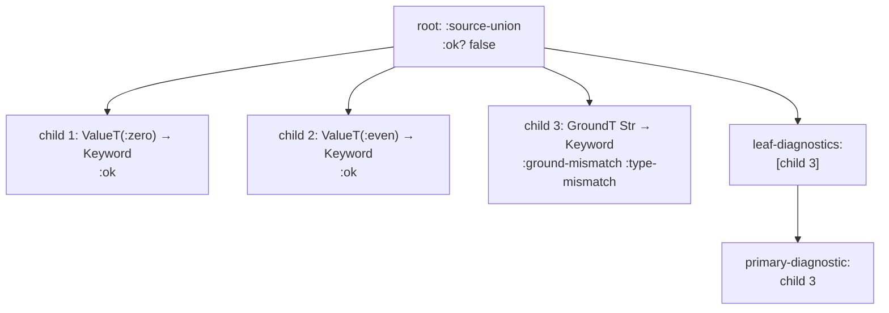
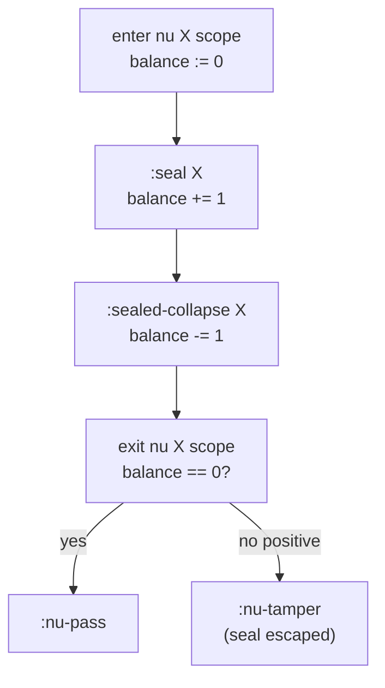

# Blame for All and Projection

> *Snapshot of state as of 2026-05-05.*

This spoke has two halves. The first explains the polymorphic
boundary: the part of Skeptic's cast engine derived from the *Blame
for All* paper, where quantified types and sealed dynamic values
meet. The second explains *projection*: how cast results become
findings — the records the user finally sees.

## Prerequisites

[Spokes 03](03-type-domain.md), [04](04-provenance.md), and
[09](09-cast-dispatch.md). No prior knowledge of the BfA paper
required; this spoke teaches the operational subset.

## Where this fits

Tenth on the Contributor path. The spoke has two halves:
(1) the polymorphic boundary, the spot where Skeptic implements a
subset of the Blame-for-All algorithm; (2) blame projection — how
cast results become findings. Together they close the cast-engine
story.

## The polymorphic boundary, in plain terms

Skeptic admits some quantified types — most directly through a
hand-written `^{:skeptic/type T}` override or an admitted Schema/Malli
form that contains a type variable. When such a type appears as
source or target of a cast, the ordinary structural rules don't
apply. *Casting into* `forall X. T` cannot just check `T` because
the binder must be preserved for a later instantiation. *Casting out
of* `forall X. T` cannot just substitute concretely because the
runtime might never know what `X` would be.

The Ahmed-Findler-Siek-Wadler paper *Blame for All* (POPL 2011)
gives an algorithm for handling these casts in a way that preserves
parametricity at runtime. Skeptic implements an operational subset
of that algorithm. The full paper covers proof machinery, static
casts, and the Jack-of-All-Trades principle; the runtime mechanism
is what Skeptic needs.

## Sealing, in three sentences

When a value of an abstract type variable `X` is cast into `Dyn`,
Skeptic produces a **sealed dynamic value** — `SealedDynT(X)` — that
wraps the original value and carries the binder name `X`. The seal
is *tamper-protected*: inspecting it (with `is`-like predicates or
type tests) raises `:is-tamper`; smuggling it across the binder's
scope (so the seal would outlive its meaning) raises `:nu-tamper`.
The seal is *discharged* (`:sealed-collapse`) only when cast back
into its own `X` — the binder identity matches and the original
value re-emerges.

The mechanism is what makes parametric polymorphism honest under
gradual typing. Without sealing, casting an `Int` through a
`forall X. X -> X` and back out could produce an `Int` that masquerades
as polymorphic; with sealing, the polymorphic claim is enforced —
the function literally cannot inspect the value it received.

## Generalize and instantiate

There are exactly two polymorphic moves at the cast level.

**`:generalize`**. A cast *into* `forall X. B` produces a polymorphic
value, deferring the choice of `X`. Operationally:

```text
;; cast: V : A  =>  forall X. B
;; result: a polymorphic value waiting for type-application
;;
;; when the value is applied to some Y:
;;   nu X := Y. (V : A => B)
;;   — open a fresh binder and recurse on the inner cast
```

The *binder is preserved at runtime*. The cast's choice of binder
(`X`) is not the same as a substitution — it's a wrapper that defers
the substitution.

**`:instantiate`**. A cast *out of* `forall X. A` substitutes
`X := Dyn` and recurses:

```text
;; cast: V : forall X. A  =>  B
;; result: V's instantiation at Dyn  =>  B
;;   — substitute X := Dyn in A, then cast as usual
```

The Jack-of-All-Trades principle from the paper supplies the
justification: instantiating `X` with `Dyn` is at least as
permissive as instantiating with any concrete type. So if the cast
succeeds at `Dyn`, it succeeds at every alternative; if it fails at
`Dyn`, the user has a real problem at any choice. Substituting
`Dyn` is the conservative choice that always-or-never gives a
verdict.

## The mini-example, walked through

A small worked-out reduction shows the rules in action.

```text
;; Source value:    id : Dyn  (carrying (lambda (y) y))
;; Target type:     forall X. X -> X
;;
;; Reduction (per Skeptic's check-quantified-cast):
;;
;;   step 1.  generalize:        (id : Dyn  =>  forall X. X -> X)
;;            -> Lambda X. (id : Dyn  =>  X -> X)
;;
;;   step 2.  type-app at Int:   ((Lambda X. body) Int)
;;            -> nu X := Int. body
;;
;;   step 3.  argument cast:     42 : Int  =>  X
;;            -> :seal              ; produces  SealedDyn(X) wrapping 42
;;
;;   step 4.  function body returns the sealed value unchanged.
;;
;;   step 5.  result cast back:  SealedDyn(X)  =>  X
;;            -> :sealed-collapse   ; the seal's binder matches the target X
;;
;;   step 6.  exit nu scope:     seal-balance is 0; emit :nu-pass.
```

Two contrast cases show the tampering rules.

```text
;; Contrast — a body that inspects its argument:
;;   (lambda (y) (if (zero? y) 0 y))
;;
;; In step 4 above, the body would call (zero? y).
;; (zero? y) inspects a sealed value:
;;            -> :is-tamper
```

```text
;; Contrast — a body that smuggles the seal out through Dyn:
;;   (lambda (y) y) cast to forall X. X -> Dyn
;;
;; In the result cast (step 5 alternative), the seal would
;; cross out to plain Dyn:
;;            -> :nu-tamper          ; sealed value escapes binder scope
```

In all three cases — pass, `:is-tamper`, `:nu-tamper` — the seal
mechanism is what makes the verdict precise. Without seals, the
type-checker would have to choose between treating the polymorphic
function as too permissive (anything goes) or too restrictive
(anything fails). Seals let it be exactly as permissive as the
parametric promise allows.

*Figure: The five-step reduction of the BfA mini-example.*

```mermaid
sequenceDiagram
    participant V as Source value (id : Dyn)
    participant Cast as Cast engine
    participant Body as forall body
    Cast->>V: cast against forall X. X -> X
    V-->>Cast: :generalize → Lambda X. inner-cast
    Cast->>Body: type-app at Int
    Body-->>Cast: nu X := Int. body
    Cast->>V: arg cast 42 : Int → X
    V-->>Cast: :seal → SealedDyn(X)
    Body->>Cast: returns sealed value
    Cast->>V: result cast SealedDyn(X) → X
    V-->>Cast: :sealed-collapse
    Cast->>Cast: exit nu; seal-balance = 0; :nu-pass
```

## Quantified types in Skeptic

`ForallT` is the type-domain representation of a quantified type;
`TypeVarT` is a bound type variable; `SealedDynT` is a sealed value
in flight. All three appear only at admission or at runtime under
cast — never produced by annotation (the first-order invariant from
[spoke 06](06-annotation-pass.md)).

`check-quantified-cast` (in `skeptic/analysis/cast/quantified.clj`)
dispatches between `:generalize` and `:instantiate` based on which
side carries the `ForallT`. `check-abstract-cast` handles the rest:
`:seal` (cast from `TypeVarT` source into `Dyn` target),
`:sealed-collapse` (cast from `SealedDynT` source into matching
`TypeVarT` target), `:type-var-source` and `:type-var-target` (other
type-var dispositions), `:sealed-conflict` (a sealed value into a
mismatched binder).

## The quantified boundary check

When a cast crosses a quantified boundary, the engine maintains a
**seal balance**: how many `:seal` rules fired on entry minus how
many `:sealed-collapse` rules fired on exit, restricted to one
binder. The balance must be zero on exit; a non-zero balance means
either a seal escaped (positive) or a collapse fired without a
matching entry (negative).

`exit-nu-scope` (in `cast/support.clj`) checks the balance on the
way out. Positive balance emits `:nu-tamper` (a sealed value
escaped); negative is a structural bug in the cast tree (Skeptic
would have called collapse without a corresponding seal). On a
zero balance, `:nu-pass` is emitted as the success indicator.

## Tampering rules

Two tamper rules guard the seal.

**`:is-tamper`** — fires when the cast engine would have to inspect
a sealed value to decide a verdict. Predicate-test casts on a
sealed value (`is`-like operations from the paper) hit this. In
Skeptic, the operational case is a cast from `SealedDynT` against a
non-matching ground or value-test target.

**`:nu-tamper`** — fires when a sealed value crosses out of its
binder scope. The cast engine sees this when a seal-balance check
on exit detects positive balance.

Both tamper rules are reported as findings with `blame-side
:global` (no specific side is at fault — the polymorphic contract
itself was violated) and `blame-polarity :global`.

## Blame side and polarity in failures

For ordinary (non-tamper) failures, the cast result carries a
`:blame-side` and `:blame-polarity`. The mapping is mechanical:

- `:blame-polarity :positive` ↔ `:blame-side :term`. The *term* —
  the value being checked, the source of the cast — is at fault.
  Output-cast failures (function returning the wrong shape) carry
  `:positive` / `:term`.
- `:blame-polarity :negative` ↔ `:blame-side :context`. The
  *context* — the surrounding code calling into the term — is at
  fault. Input-cast failures (caller passing the wrong shape) carry
  `:negative` / `:context`. The polarity flip happens at the
  function-domain rule (see [spoke 09](09-cast-dispatch.md)).
- `:blame-side :global` and `:blame-polarity :global` mean the
  failure is the polymorphic contract itself — `:is-tamper` or
  `:nu-tamper`.
- `:blame-side :none` and `:blame-polarity :none` mean a missing or
  internal-only failure (rare; usually a structural placeholder).

The user-facing rendering ([spoke 11](11-user-facing-surfaces.md))
turns these into the human strings "context( value )" (for `:term`),
"context( value )" with reversed brightness (for `:context`),
"scope escape" (for `:global`), or "<missing>" (for `:none`).

## Path projection

Once `check-cast` returns, *blame projection* takes over. The cast
result is a tree; the user wants a flat finding with one headline
diagnostic. Projection lives in
`skeptic/analysis/cast/result.clj` and `skeptic/inconsistence/path.clj`.

`cast-result/leaf-diagnostics` walks the cast-result tree, collecting
every non-okay leaf into a flat list. A leaf is a cast result with
no children (or, more precisely, a cast result whose rule is not
in the `structural-rules` set — structural rules aggregate
children but don't have a leaf-level verdict of their own).

`cast-result/primary-diagnostic` picks the *first* leaf for the
finding's headline. "First" is in the depth-first order of the
cast tree, which corresponds to the source-code order in which a
human would encounter the failure.

`cast-result/ok?` and `cast-result/root-summary` are the predicate
and the top-level summary; the latter carries the cast root's rule
and side / polarity even when the actual blame leaf is several
levels deep.

## From cast result to a finding

`inconsistence/report.clj`'s `cast-report` is the packaging
function. It runs a cast (via the supplied `check-fn`), walks the
result tree, computes the metadata (rule, blame side / polarity,
actual / expected types, focuses, source attribution), and produces
a finding-shaped map.

`output-cast-report` is the output-side wrapper: it takes the
cast-report metadata and folds in display strings, rendered paths,
expanded expressions, and any additional error messages from the
namespace. The output is the map the printer
([spoke 11](11-user-facing-surfaces.md)) renders.

`path/visible-path` filters the structural path to display
segments. Rules like `:source-union-branch` and
`:target-union-branch` are bookkeeping — they record which member
of a union the recursion was on, but the user doesn't care.
`:function-domain`, `:map-key`, `:vector-index` are user-facing.
`path/render-visible-path` joins the survivors into a string —
`"argument 1 → field :foo → index 0"` — using
`render-path-segment` for the per-kind rendering.

`path/missing-detail`, `nullable-detail`, `unexpected-detail`,
`mismatch-detail` produce per-leaf detail lines. They are picked
by reason: `:type-mismatch` reasons render with `mismatch-detail`,
`:nullable` reasons with `nullable-detail`, and so on.

`report/cast-result->message` is the top-level message builder. It
assembles the headline (path + side + polarity), the diagnostic
detail line, and any contributing-leaf summaries. The result is
the multi-line string the text printer prints (with ANSI colour)
and the porcelain printer ships verbatim under the
`messages` JSONL field.

`display/describe-type` and `describe-type-block` format Types for
human display. `describe-type` produces a compact one-line form;
`describe-type-block` produces a multi-line block with structural
indentation. Both honor the `--explain-full` flag and the
foldable-source rule from [spoke 05](05-admission-paths.md).

## How the worked example projects

`classify`'s failed cast:

- The cast root is `:source-union` — Source: `UnionT[ValueT(:zero),
  ValueT(:even), GroundT Str]`, Target: `GroundT Keyword`.
- Three children. Two okay (the `ValueT` arms cast cleanly into
  `Keyword`); one fails (`GroundT Str` against `GroundT Keyword`).
- `leaf-diagnostics` returns one entry: the failing leaf, with rule
  `:ground-mismatch`, reason `:type-mismatch`, source-type
  `GroundT Str`, target-type `GroundT Keyword`.
- `primary-diagnostic` is that leaf.
- The leaf's path, after `:source-union-branch` filtering, is empty.
  `render-visible-path` on an empty visible path renders as
  `"return value"` (the cast root's role: the function's body).
- `cast-result->message` renders something like:
  *"in `classify`, the inferred output type `Str` does not fit the
  declared return type `Keyword`."*
- `display/describe-type-block` formats each Type for inclusion in
  the verbose output.
- Source attribution: the cast root's `:prov` is the merge of the
  source-type's `:inferred` prov and the target-type's `:schema`
  prov. The merge picks the lower rank (`:schema`), so the
  finding's `:source` is `schema`.

The whole record then flows to the printer, which renders it
according to the active output mode ([spoke 11](11-user-facing-surfaces.md)).

*Figure: Cast result tree of `classify`'s failure; arrow to the resulting flat leaf list.*



*Figure: Seal/collapse pairing; visualizing how `seal-balance` integrates over a tree.*



### In-depth: seal balance and `exit-nu-scope`

***Skip if reading the Gist path.***

Each cast result carries enough information to recompute the seal
balance for any binder in scope. The relevant data lives in
`cast/support.clj`:

- `seal-balance` — the running difference, computed by walking the
  cast subtree below a `nu` scope and counting `:seal` rules
  positive and `:sealed-collapse` rules negative.
- `leaked-sealed-type` — when the balance is non-zero, this is the
  sealed Type that was found to be in flight at exit. It's the
  diagnostic data attached to a `:nu-tamper` finding.

`exit-nu-scope` is the function called at the close of a quantified
boundary. It computes `seal-balance` over the children, compares to
zero, and emits `:nu-pass` (zero balance) or `:nu-tamper` (positive
balance, with `leaked-sealed-type` attached). Negative balance is a
bug in cast construction and signals an internal error.

The balance is *per-binder*. A cast that opens two `nu` scopes for
two different `X`s tracks them independently; a seal of `X` doesn't
contribute to the balance of `Y`.

### In-depth: actionable output leaves

***Skip if reading the Gist path.***

When the cast tree has multiple failing leaves, projection picks
one for the headline. The naive choice — depth-first first — works
in most cases, but sometimes it produces a leaf whose `actual-type`
is `Dyn` or another open Type. A `Dyn` leaf rarely tells the user
something they can act on; "expected `Int`, got `Dyn`" is barely
better than "expected something specific, got something
unspecified."

`actionable-output-leaf?` (in `inconsistence/report.clj`) and
`ordered-output-leaves` together produce a priority list. A leaf is
*actionable* if its `actual-type` is concrete and its path renders
to a non-empty visible string. Skeptic prefers actionable leaves
over `Dyn`-shaped ones for the headline diagnostic.

When the only failing leaf is `Dyn`-shaped, projection accepts it —
no concrete leaf is available — and the user sees a `Dyn`-shaped
diagnostic. That's a signal to add a `^{:skeptic/type T}` override
or to tighten an upstream schema.

## Marquee functions

| Function                       | File                                              | Role                                                                       |
|--------------------------------|---------------------------------------------------|----------------------------------------------------------------------------|
| `check-quantified-cast`        | `skeptic/analysis/cast/quantified.clj`             | Generalize/instantiate dispatch.                                           |
| `check-abstract-cast`          | `skeptic/analysis/cast/quantified.clj`             | Type-var / sealed source dispatch (`:seal`, `:sealed-collapse`, etc.).      |
| `exit-nu-scope`                | `skeptic/analysis/cast/support.clj`                | Seal-balance check on exit; emits `:nu-pass` or `:nu-tamper`.               |
| `cast-result/leaf-diagnostics` | `skeptic/analysis/cast/result.clj`                 | The cast-result-tree → flat-leaf-list projection.                          |
| `inrep/cast-report`            | `skeptic/inconsistence/report.clj`                 | The packaging step: cast result + ctx → finding-shape map.                  |
| `path/render-visible-path`     | `skeptic/inconsistence/path.clj`                   | The user-facing path string.                                                |

## Worked example here

`classify`'s finding is fully constructed: cast result tree (above),
leaf diagnostic (the failing `GroundT Str → GroundT Keyword`),
message text, path text. The BfA mini-example is the second half's
central artefact; the worked-example BfA case is illustrative
because the user-facing example doesn't admit any quantified Types.

## Where to next

- **Continue (Contributor path):** [User-Facing Surfaces (11)](11-user-facing-surfaces.md)
- **Diagnose-finding path:** continue (reverse) to [Cast Dispatch (09)](09-cast-dispatch.md)
- **Return:** [Hub](README.md)
