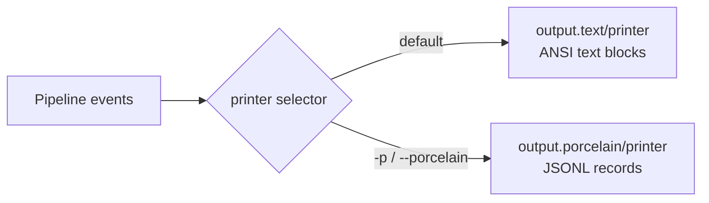

# User-Facing Surfaces

> *Snapshot of state as of 2026-05-05.*

Skeptic emits findings in two output modes — ANSI text (default)
and newline-delimited JSON (`-p`). Both share the same internal
lifecycle but produce different records. This spoke shows the
shapes, the configuration knobs, the type-display rules that
govern both modes, and the three suppression mechanisms users
have for asking Skeptic to step back.

## Prerequisites

[Spoke 10 (Blame for All and Projection)](10-blame-for-all-and-projection.md)
— you have a finding in hand. Optional but useful:
[spoke 04](04-provenance.md) and [spoke 05](05-admission-paths.md)
for provenance and admission, since both surface in the
displayed records. If any of those are unfamiliar, the
[hub README's reading paths](README.md#reading-paths) point to
the right earlier reading.

## Where this fits

Eleventh on the Contributor path. First stop on the Diagnose-
finding reading path (you reach this spoke from a finding in
your terminal and then walk backward through 10 → 09). After
this spoke, the contributor knows how to extract maximum
information from a Skeptic run, switch between output modes,
and apply the right suppression mechanism when Skeptic is
producing noise.

## Two output modes

**This section teaches: that there are exactly two output
modes, that they share an internal lifecycle, and what selects
between them.**

The default is a human-readable, ANSI-coloured report — one
block per inconsistency, grouped by namespace, ending with a
per-namespace summary. With `-p` (or `--porcelain`), Skeptic
emits newline-delimited JSON instead — one JSON record per
event, structured for downstream processing (CI gates, editor
integrations, dashboards, anything that wants a stable
machine-readable format).

Both modes go through the same `printer` selector
(`skeptic.output/printer`). The selector reads the `:porcelain`
opt and returns either `output.text/printer` or
`output.porcelain/printer`. Both printers are *lifecycle maps*:
maps from phase-event keys to single-event handler functions.
The events:

```clojure
{:run-start      (fn [opts namespaces] ...)
 :discovery-warn (fn [{:keys [path message]}] ...)
 :ns-start       (fn [ns source-file opts] ...)
 :finding        (fn [ns result summary opts] ...)
 :form-debug     (fn [ns record opts] ...)
 :ns-end         (fn [ns count opts] ...)
 :run-end        (fn [errored? totals opts] ...)}
```

The pipeline calls these callbacks at fixed points
([spoke 01](01-pipeline-tour.md#in-depth-the-lifecycle-protocol-shared-by-both-printers)
covers the protocol in detail). Both printers implement every
callback; the text printer suppresses output where the porcelain
printer emits a record (and vice versa). The shared protocol is
what lets each mode stream incrementally — findings appear as
each namespace finishes, not batched at the end.

The two-mode design — rather than one mode with a "machine
readable" toggle — is deliberate. The text printer's job is
*human readability*: ANSI colors, multi-line per-finding blocks,
trailing summary, suppression of noisy zero-count namespaces.
The porcelain printer's job is *line discipline*: every line is
a self-describing JSON record, exit code reflects errored
status, the run *always* ends with a `run-summary` record
(including on clean runs). Trying to make one printer serve
both audiences would force compromises in both directions.

*Figure: Pipeline events flow into a selector; the selector
forks into the two printer implementations.*



## The text printer

**This section teaches: the structure of a finding block in
text mode, what changes under verbose, and how the per-namespace
summary fits in.**

The text printer is driven by `report-fields`, which produces
an ordered `[[label value] ...]` list for the printer to render.
`report-fields` is public for testability. It branches on
`:report-kind`: `:exception` records render with a phase-and-
class header; ordinary findings render the per-finding fields
in a fixed order.

A finding block looks roughly like:

```text
---------
Namespace:     skeptic.walkthrough.example
Location:      example.clj:8:5 [source: schema]
Blame:         context( value )
```

The first line is a horizontal rule; the next three are the
*essentials* — namespace, location with source attribution,
and a brief blame indicator. The blame indicator's text varies
by side: `context( value )` for context blame (caller is at
fault), `value( context )` for term blame, scope-escape phrasing
for global blame.

In *verbose* mode (`-v` / `--verbose`), additional rows appear
after the essentials: cast rule, actual type, expected type,
source expression, focused argument, enclosing form, and the
analyzer's expanded expression. Each row is one line, label-
aligned. After the rows comes the rendered error messages,
ANSI-coloured (yellow for type names, magenta for expressions),
followed by a closing `---` separator.

The per-namespace inconsistency summary prints at the end of the
run, sorted with the worst-offending namespace first. Zero-count
namespaces are hidden unless `-v / --verbose`. The summary
table has two columns — namespace name and finding count — and
ends with either `No inconsistencies found` (clean run) or a
total-tally line.

The text printer also drives `:run-end`'s "No inconsistencies
found" message on a clean run. Findings have already been
printed by then; the closing message is a confirmation when the
count was zero.

A subtle property: the text printer produces *human-only*
output. Anything that wants to parse it should be using
porcelain instead. The text printer's commitment is to
readability and to ANSI compatibility on common terminals; its
commitment is *not* to a stable machine-parsable line format.

## The porcelain (JSONL) printer

**This section teaches: the five JSON record kinds, the fields
each carries, and the discipline that keeps every line self-
contained.**

The porcelain printer emits five record kinds:

| Kind                       | When                                                                     | Key fields                                            |
|----------------------------|--------------------------------------------------------------------------|-------------------------------------------------------|
| `ns-discovery-warning`     | Per non-blocking namespace load failure                                   | `path`, `message`                                     |
| `finding`                  | Per type-mismatch finding                                                 | `ns`, `report_kind`, `location`, `blame`, `blame_side`, `blame_polarity`, `rule`, `actual_type`, `expected_type`, `actual_type_str`, `expected_type_str`, `messages` |
| `exception`                | Per namespace-local failure during checking                               | `ns`, `phase`, `location`, `exception_class`, `exception_message`, `messages` |
| `namespace-error-summary`  | Once per run, immediately before `run-summary`                            | `counts` (sorted map of namespace → count)            |
| `run-summary`              | Always last; one per run, including clean runs                            | `errored`, `finding_count`, `exception_count`, `namespace_count`, `namespaces_with_findings` |

Every record is one JSON object, written with
`clojure.data.json`, followed by a newline. Empty fields are
dropped (via `drop-empties`) to keep the records compact, *except
in `:debug` mode* where the full shape is preserved including
the raw cast result. The `:debug` mode is for development; it's
not part of the stable consumer contract.

A `finding` record carries a nested `location` object with
`file`, `line`, `column`, and `source`. The source field maps
directly to the `:prov` source name on the blamed Type
(`schema`, `malli`, `native`, `type-override`, `inferred` — see
[spoke 04](04-provenance.md)). A consumer reading
`location.source` knows which admission source's claim the cast
was checking.

The `actual_type` and `expected_type` fields are *tagged JSON
data* produced by `bridge.render/type->json-data*` — a recursive
walk over the Type that emits `{kind, …}` for each Type kind
plus per-kind fields. The `actual_type_str` and `expected_type_str`
are the *human-readable display strings* (the same strings text
mode would print). Both are present so downstream consumers can
pick the form that fits their needs — structural data for
programmatic processing, display strings for direct rendering.

ANSI escape codes are stripped from `messages` via `strip-ansi`
(a regex over `\[[0-9;]*m`). The text printer's coloured
output lives only in the text mode; porcelain consumers see
plain strings.

The `run-summary` record is the run's last line:

```json
{"kind": "run-summary", "errored": false, "finding_count": 0, "exception_count": 0, "namespace_count": 12, "namespaces_with_findings": 0}
```

Even on a clean run with zero findings, `run-summary` appears.
This makes downstream processing simpler: every run produces
exactly one `run-summary` record, no special "did the run
actually finish" check needed. Consumers can count the
`finding_count` to gate CI; consumers can count
`namespaces_with_findings` to detect "lots of namespaces have
issues" patterns.

When `--profile` is also set, the profile summary is written to
**stderr** so stdout stays pure JSONL. When `-o` is also set,
the JSONL still goes to the chosen output file and the profile
summary still goes to stderr. The discipline is that *stdout
is never polluted with non-JSONL data* under porcelain mode —
which is what makes streaming consumers (jq pipelines, log
shippers) work without extra filtering.

## How types are rendered

**This section teaches: how a Type becomes a display string,
what folding is, and which sources can fold.**

Inside both printers, semantic Types render via
`bridge.render/render-type` (text-side) and
`bridge.render/type->json-data` (JSONL-side). Both honour the
`--explain-full` flag.

By default — without `--explain-full` — declared schema names
*fold*. A `MaybeT[GroundT Int]` whose `:prov` source is
`:schema`, `:malli`, or `:type-override` and whose
`qualified-symbol` resolves to a known declared name is rendered
as that name (e.g., `(maybe Int)`). The folding is the user-
facing contract for *abstraction*: the user wrote a name, the
user gets the name back. A `MaybeT[GroundT Int]` admitted from
`(s/maybe s/Int)` displays as `(maybe Int)`; the same Type
admitted from `[:maybe :int]` (Malli) displays the same way; the
same Type from `:type-overrides` displays the same way.

With `--explain-full`, the *structural* form is printed
regardless. So `MaybeT[GroundT Int]` always reads as the unfolded
structural form, never folded into a declared alias. Useful when
the folded display hides the cause of a mismatch — say, when
the user defined `(s/defschema MyInt s/Int)` and the finding
hinges on a comparison against `MyInt` in one place and against
`s/Int` in another. Without `--explain-full`, both display as
`Int` (the canonical name) and the distinction is lost.

`:inferred` and `:native` Types *never* fold. They have no
declared name to fold to; the structural form is the only form
they have. This is why a `[source: native]` finding always
shows the structural type — the native admission has no
user-recognizable name to display.

The foldable-source set is `#{:schema :malli :type-override}`.
The choice reflects the responsibility ladder
([spoke 04](04-provenance.md#the-five-named-sources)) — the
sources where a user-recognizable *name* exists are the
sources allowed to fold. Adding a new admission source means
deciding whether it joins the foldable set; the answer is yes
if the new source admits values with user-supplied declared
names, no if its admissions are anonymous.

## Suppression mechanisms

**This section teaches: the three opt-out mechanisms users
have, what scope each affects, and when to reach for which.**

Skeptic provides three opt-out mechanisms for cases where its
inference is wrong, too dynamic, or outright unhelpful. Each
suppresses checks in a different scope. All three produce the
same Provenance source — `:type-override` rank 0 — when they
introduce a Type, so they win against any other admission in a
merge.

### `:skeptic/ignore-body`

Suppresses checks *inside* a function body. The declared schema
still applies to all callers — the contract is unchanged
externally.

```clojure
(s/defn my-fn :- s/Int
  {:skeptic/ignore-body true}
  [x :- s/Int]
  (int-add nil x))
```

Inside `my-fn`, the call `(int-add nil x)` would normally fail
(passing `nil` to a function declared to accept `s/Int`). With
`:skeptic/ignore-body true`, the body is not analyzed; no
findings come from inside. Callers are still checked against
`:- s/Int` — passing a non-Int still fails at the call site.

The mechanism: the admission boundary admits the var's metadata
into a per-namespace `:ignore-body` set. The pipeline's
`check-resolved-form` consults the set and skips the body's
casts for any qualified symbol in it.

Use case: the body is doing something Skeptic can't analyze
(a Java interop bridge, a clever macro that expands to forms
Skeptic doesn't recognize, a deeply imperative implementation),
but the function's *external contract* is correct.

### `:skeptic/opaque`

Treats a function as a black box. Callers see it as accepting
`s/Any` and returning `s/Any` — *neither* the body nor the
schema is checked.

```clojure
(s/defn my-fn :- s/Int
  {:skeptic/opaque true}
  [x :- s/Int]
  "not-an-int")
```

The body is not checked, *and* the declared `:- s/Int` is not
enforced on callers. Callers passing a string get no warning;
callers expecting an Int return get no warning either.

This is *stronger* than `:skeptic/ignore-body`: opaque means "I
don't want Skeptic involved at all"; ignore-body means "trust
the schema, not the body."

The mechanism: the admission boundary skips the var entirely.
There's no entry in the dict, no provenance, no ignore-body
set. Callers resolve the var as if it were unrecognized —
`s/Any` for both inputs and outputs.

Use case: a function whose schema is wrong and the user is
unable or unwilling to fix it, or a function whose declared
schema would require expressing something Skeptic doesn't yet
support (a higher-rank polymorphic shape, a custom predicate
that doesn't admit cleanly).

### `^{:skeptic/type T}` metadata

Pins a single expression's inferred Type to a user-supplied
schema:

```clojure
(let [y ^{:skeptic/type s/Int} (some-call-that-returns-any)]
  (int-add y 1))
```

The expression's Type is treated as `s/Int` for subsequent
checks. The mechanism is `apply-type-override` in
`skeptic/analysis/annotate.clj`: after the dispatcher computes
the expression's inferred Type, the override hook reads
`:skeptic/type` from the form's metadata, evaluates it as a
Plumatic schema, and replaces the inferred Type with one
admitted via `schema->type` and stamped with
`:source :type-override`.

The wrapper around the call is necessary because Clojure does
not allow metadata on bare literal values (numbers, strings,
keywords). If `T` is meant to apply to a literal, wrap it:

```clojure
^{:skeptic/type s/Int} (identity 42)
```

The override is *Plumatic-shaped* — it goes through
`schema->type`, not `malli-spec->type`. Even users writing Malli
elsewhere must use Plumatic syntax for this hook. The
`schema-domain?` guard rejects Malli forms with a clear error.

Use case: a known-typed value that Skeptic can't infer (a
global atom's deref'd value whose schema is implicit, a result
from a non-Plumatic library function, a value whose origin
Skeptic can't trace).

### When to use which

| Need to … | Use |
|-----------|-----|
| Suppress only the *internal* checks; keep the schema enforced for callers | `:skeptic/ignore-body` |
| Suppress *all* checks (internal + the function's contract on callers) | `:skeptic/opaque` |
| Pin one *expression's* type without affecting the surrounding function | `^{:skeptic/type T}` |
| Apply across many call sites at once via configuration | `:type-overrides` (see below) |

The progression is "smaller scope first." Reach for
`^{:skeptic/type T}` if a single expression is the problem;
reach for `:skeptic/ignore-body` if the body is the problem
but the contract is right; reach for `:skeptic/opaque` only
when the function is genuinely unanalyzable end-to-end. Going
the other way — reaching for `:skeptic/opaque` when
`^{:skeptic/type T}` would have done — silences too much and
hides real problems.

## Configuration via `.skeptic/config.edn`

**This section teaches: the project-level configuration file's
two main keys and what each affects.**

Skeptic reads optional project-level configuration from
`.skeptic/config.edn` at the project root. The file is EDN;
every key is optional.

```clojure
{:exclude-files ["src/fixtures/*.clj"
                 "test/**/*_examples.clj"]
 :type-overrides {clojure.tools.logging/infof {:output (s/eq nil)}}}
```

`:exclude-files` is a vector of glob patterns matched against
each file's path *relative to the project root*. Matched files
are skipped entirely — their namespaces are never loaded or
checked. Patterns use the platform's
`java.nio.file.PathMatcher` glob syntax (`*`, `**`, `?`,
character classes). Excludes apply *before* `-n` /
`--namespace` selection, so excluding a file and then naming
its namespace via `-n` results in the run checking nothing.

`:type-overrides` is a map from fully-qualified symbol to an
override map with `:schema`, `:output`, or `:arglists`. Values
are Plumatic Schema expressions evaluated with `[schema.core
:as s]` in scope. The override replaces whatever Skeptic would
otherwise infer or collect for that symbol at call sites.

The example above — `clojure.tools.logging/infof` overridden to
return `(s/eq nil)` — silences noise from variadic logging
functions whose declared schemas are unhelpful. Call sites of
`infof` are checked as returning `nil` (not `s/Any`, not
whatever the logging library declares). The override applies
across the entire project; the user doesn't have to repeat it
at every call site.

`:type-overrides` produces `:source :type-override` Provenance
just like `^{:skeptic/type T}` does. The two mechanisms differ
only in *scope* — one is per-expression, the other is
per-symbol-across-the-project — and in *where they live* — one
is in user code, the other is in the config file.

A subtle property: overrides admit through Plumatic, even when
the user otherwise writes Malli. The config-file overrides go
through `schema->type` (with the `s/` namespace alias in scope
during evaluation); the metadata overrides go through the same
`schema->type` via `apply-type-override`. Both are
Plumatic-flavored. A future contributor wanting Malli-shaped
overrides would have to decide whether to extend the override
semantics or admit them differently — a decision that hasn't
been made.

## Exit codes

**This section teaches: that exit code reflects the run's
errored status, and that the rule is the same in both modes.**

The exit code follows the run-summary's `errored` flag: `0`
when the run produced zero findings *and* zero exceptions, `1`
otherwise. Both modes share the rule.

CI integrations key on the exit code: a non-zero return from
`lein skeptic` is the gate condition. The text mode and
porcelain mode both return the same code; switching modes for
machine-readability doesn't change CI behaviour.

A consumer wanting *finer* granularity than "passed or failed"
should read `run-summary` — `finding_count` distinguishes
"passed" (zero) from "two findings" from "two hundred findings"
without changing exit-code semantics.

A subtle case: `--profile` writes profile output to stderr, but
the exit code is unaffected. A passing run with `--profile`
returns `0`; a failing run with `--profile` returns `1`. The
profile summary is *informational*, not evaluative.

### In-depth: the lifecycle map and how to add a new printer

***Skip if reading the Gist path.***

A contributor adding a new output mode — a CSV exporter, a
machine-readable diff format, an editor-LSP feed — needs to
implement the lifecycle protocol. This in-depth describes what
that means concretely.

The protocol is a map of seven phase-event keys to single-event
handler functions:

- **`:run-start`** — receives `[opts namespaces]`. Called once
  at run start. Used by text mode to print the run header
  (none currently); ignored by porcelain.
- **`:discovery-warn`** — receives `{:keys [path message]}`.
  Called once per non-blocking namespace load failure. Text
  mode prints a yellow warning line; porcelain emits one
  `ns-discovery-warning` record.
- **`:ns-start`** — receives `[ns source-file opts]`. Called
  once per namespace at namespace-check start. Text mode prints
  the per-namespace header; porcelain ignores (records emit on
  per-finding events instead).
- **`:finding`** — receives `[ns result summary opts]`. Called
  once per finding, *and* once per exception (the handler reads
  `report-kind` from the summary to distinguish). Text mode
  prints a per-finding block via `report-fields`; porcelain
  emits one `finding` or `exception` JSON record.
- **`:form-debug`** — receives `[ns record opts]`. Called only
  when `-a` / `--analyzer` is set; emits the analyzer's
  expanded form for the user. Text mode prints; porcelain
  emits a JSON object via `json-safe`.
- **`:ns-end`** — receives `[ns count opts]`. Called once per
  namespace at namespace-check end. Text mode uses this to
  suppress headers for empty namespaces (suppression decision
  happens *here*, not at `:ns-start`); porcelain ignores.
- **`:run-end`** — receives `[errored? totals opts]`. Called
  once at run end. Text mode prints the per-namespace summary
  and the closing message; porcelain emits a
  `namespace-error-summary` record followed by a `run-summary`
  record.

The protocol's load-bearing property is *each handler is
self-contained*. The runtime never buffers and never threads
"prior event" state through the handlers; if a printer needs
cross-event state (e.g., text mode's suppression of empty-
namespace headers), it threads its own state through closures
or atoms. Porcelain mode is entirely stateless — every JSON
record is self-describing.

The protocol's other property is *streaming-by-default*. A
batch-style printer that prefers to collect everything and emit
at `:run-end` is allowed (record on every event, flush at the
end). A streaming-style printer that prefers to emit on every
event is allowed (the default for both built-in printers). The
choice is the printer's; the runtime doesn't impose either
discipline.

A contributor adding a new output mode writes a new printer
namespace, builds the lifecycle map, exposes a `printer` value
(can be a constant map or a function returning a map), and
adds a selector branch in `output/printer`. Six events, no
buffering, no inter-event state required — typically under 100
lines per printer.

A subtle decision worth flagging: the contributor must decide
whether their new mode runs *alongside* text/porcelain (a
third option in the selector) or *replaces* one of them under
a flag. The current design accommodates both via the selector.
A new mode that's strictly more expressive than text could
deprecate text; a new mode that's a sibling (e.g., XML output
for legacy consumers) sits as a third option.

## Marquee functions

| Function                          | File                                         | Role                                                                  |
|-----------------------------------|----------------------------------------------|-----------------------------------------------------------------------|
| `output/printer`                  | `skeptic/output.clj`                          | Selects text or porcelain based on opts.                              |
| `output.text/report-fields`       | `skeptic/output/text.clj`                     | The `[[label value] ...]` builder driving the text printer.           |
| `output.porcelain/printer` (map)  | `skeptic/output/porcelain.clj`                | The lifecycle map (`:run-start`, `:finding`, `:run-end`, …).          |
| `bridge.render/render-type`       | `skeptic/analysis/bridge/render.clj`          | Type → display-form string (text mode).                              |
| `bridge.render/type->json-data`   | `skeptic/analysis/bridge/render.clj`          | Type → JSON-friendly tagged data (JSONL mode).                       |
| `apply-type-override`             | `skeptic/analysis/annotate.clj`               | The expression-level `^{:skeptic/type T}` hook.                       |

## Worked example here

`classify`'s finding renders both ways. The cast root is
`:source-union` (the failing root rule —
[spoke 09](09-cast-dispatch.md#how-the-worked-example-casts)); the
failing leaf in the cast tree is `:leaf-overlap` with reason
`:leaf-mismatch`. The projection's primary diagnostic is the
source-aggregate root.

In text mode (verbose):

```text
---------
Namespace:           skeptic.walkthrough.example
Location:            example.clj:8:5 [source: schema]
Blame:               value( context )
Cast rule:           source-union
Actual type:         (or :zero :even Str)
Expected type:       Keyword
Expression:          "odd"
In enclosing form:   (s/defn classify ...)
```

The actual-type renders folded — the inferred body Type is the
union of three members; the renderer collapses
`UnionT[ValueT(:zero), ValueT(:even), GroundT Str]` into the
display-friendly `(or :zero :even Str)` form. The expected-type
renders folded as `Keyword`. The blame indicator `value(
context )` is the term-side blame display (positive polarity).

In porcelain mode:

```json
{
  "kind": "finding",
  "ns": "skeptic.walkthrough.example",
  "report_kind": "type-mismatch",
  "location": {
    "file": "example.clj",
    "line": 8,
    "column": 5,
    "source": "schema"
  },
  "blame": "(:else \"odd\")",
  "blame_side": "term",
  "blame_polarity": "positive",
  "rule": "source-union",
  "actual_type": {"kind": "union", "members": [
    {"kind": "value", "value": ":zero", "inner": {"kind": "ground", "tag": "keyword"}},
    {"kind": "value", "value": ":even", "inner": {"kind": "ground", "tag": "keyword"}},
    {"kind": "ground", "tag": "string", "name": "Str"}
  ]},
  "expected_type": {"kind": "ground", "tag": "keyword", "name": "Keyword"},
  "actual_type_str": "(or :zero :even Str)",
  "expected_type_str": "Keyword",
  "messages": ["..."]
}
```

`location.source` is `"schema"` because the merged Provenance
on the cast root reads the declared (target) side: the
`:- s/Keyword` annotation carries `:source :schema`, which beats
the inferred body's `:source :inferred` per the rank table
([spoke 04](04-provenance.md#source-rank-and-merge-provenances)).
That attribution tells the user "this constraint comes from
your declared schema."

`double-or-zero` produces no finding in either mode — its body
casts cleanly against the declared output.

## Glossary terms introduced

- Output mode (text and porcelain)
- Lifecycle map / lifecycle protocol
- Folding (display-side alias resolution)
- `--explain-full` (force structural display)
- Suppression flag (the three mechanisms)
- Foldable source

## Where to next

- **Continue (Contributor path):** [Contributor Surfaces and Pitfalls (12)](12-contributor-surfaces.md)
- **Diagnose-finding path:** continue (reverse) to [Blame for All and Projection (10)](10-blame-for-all-and-projection.md)
- **Return:** [Hub](README.md)
