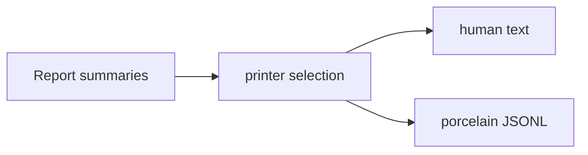

# User-Facing Surfaces

The reader now knows how a finding is produced. This spoke answers the practical
question: what does the user see, and how should they interpret or suppress it?

> **Snapshot:** state of Skeptic as of 2026-05-06.

## Prerequisites

[Blame for All and Projection (C10)](10-blame-for-all-and-projection.md). For the
Diagnose-finding path, this spoke can also be read first: use it to identify the
pieces of a finding, then walk backward to projection and cast dispatch.

## Where this fits

Eleventh on the Contributor path and first on the Diagnose-finding path. The
next and final spoke, [Contributor Surfaces](12-contributor-surfaces.md), turns
the model into edit entry points.

## Two Output Modes

Skeptic has two output surfaces. The default is human-readable text. Porcelain
mode emits newline-delimited JSON records for tools. The same findings feed both
printers; only the representation changes.

This means output mode should not change whether a mismatch exists. It changes
how the same report is packaged. If text and JSONL appear to disagree, compare
their fields before debugging admission or cast logic.

*Figure: one report stream, two printers.*



## Text Output: Anatomy Of A Finding

A text finding is optimized for a person reading a terminal. It gives the
namespace and location, the expression or declaration involved, the rendered
actual and expected Types, and one or more message lines. A schematic finding for
the worked example has this shape:

```text
skeptic.walkthrough.example
  classify

return value:
  actual:   Str
  expected: Keyword

Skeptic inferred a string branch for classify, but the declared return type
expects Keyword.
```

The exact wording depends on the renderer and options. The reader should learn
which parts matter: location, path, actual Type, expected Type, and message.

The path is the quickest way to choose a next spoke. A return-value path sends
the reader to cast projection and function output checking. An argument path
sends the reader to function-domain casts and caller blame. A field or index path
sends the reader to structural collection casts.

## Porcelain JSONL

Porcelain mode is for programs. Each line is one JSON object. The important
record kinds are:

| Kind | Role |
|---|---|
| `finding` | One mismatch or reportable inconsistency. |
| `exception` | A localized exception report. |
| `ns-discovery-warning` | Namespace discovery warning. |
| `namespace-error-summary` | Per-namespace counts. |
| `run-summary` | Final run totals. |

A schematic `finding` record for `classify` looks like this:

```json
{"kind":"finding","ns":"skeptic.walkthrough.example","rule":"source-union","blame_side":"term","actual_type_str":"Str","expected_type_str":"Keyword","messages":["return value does not match declared output"]}
```

JSONL is not prettier than text; it is more stable for downstream tools.

Porcelain records also make it possible to summarize a run without parsing human
phrasing. The final `run-summary` record tells a tool whether the run was clean,
how many namespaces were checked, and how many findings or exceptions were seen.

## How Types Are Rendered

The checker carries semantic Types, but output must show something readable.
Rendering can display compact declared forms when a named declaration is
available, or a fuller structural form when the user asks for more explanation.
That is why the same underlying Type may appear as a familiar schema-shaped
string in one context and as a structural Type in another.

The important diagnostic habit is to treat rendering as a view. If the compact
view is too lossy for the question in front of you, switch to the fuller
explanation mode rather than assuming the checker has lost the underlying Type
structure.

## Suppression Mechanisms

Suppression is a user-facing boundary, so it belongs here rather than in earlier
algorithm spokes.

`:skeptic/ignore-body` skips body checking for a function while preserving its
declared type for callers. Use it when a body is intentionally outside Skeptic's
current analysis, but callers should still see the contract.

`:skeptic/opaque` treats a function as opaque to callers. Use it when the
function should behave like a boundary rather than a checked implementation.

`^{:skeptic/type T}` pins an expression to a supplied Schema-domain type that is
admitted into the Type domain. Use it when the expression's local inference needs
an explicit user assertion.

These mechanisms answer different reader needs. `ignore-body` keeps the public
contract but stops checking the implementation. `opaque` hides details from
callers. A metadata type override changes one expression's inferred Type. They
are not interchangeable.

## Configuration

`.skeptic/config.edn` can exclude files and provide type overrides. Exclusion is
for run selection. Type overrides replace or supplement declarations when the
project needs Skeptic to know a type that source annotations do not provide.

Config belongs at the edge of the run. It should not be used to paper over a
misunderstood cast; read the finding first, then choose the smallest surface that
matches the reason you want Skeptic to stop reporting it.

## Choosing The Right Surface

Use text output when a human is going to fix the code immediately. It is ordered
for reading, and it spends space on message text. Use porcelain when another
program needs to count findings, group them by namespace, or attach them to a
review tool. Use fuller Type explanations when compact rendering hides the
distinction you are debugging.

The suppression mechanisms should come last in that decision. A finding is
evidence that source, admission, annotation, and cast reached a specific
conclusion. Suppress only after you can name which part of that conclusion is
intentionally outside Skeptic's current model.

## Worked Example Output Reading

For `classify`, the important fields are the path, actual Type, expected Type,
and rule. The namespace and form tell you where to look. The path tells you it is
about the return value. The actual/expected pair tells you the body produced a
string where Keyword was declared. The rule tells you which cast path created the
finding. Those four facts are enough to choose the Diagnose-finding path in the
hub.

If a report is clean, that is also information. `double-or-zero` is absent from
the output because every relevant cast succeeded after annotation and narrowing.
No output is not a skipped explanation; it is the observable result of the
pipeline accepting the definition.

## Worked Example Here

`classify` appears as one finding in both surfaces. `double-or-zero` appears only
by absence: the clean function does not produce a finding.

## Source Pointers

- `skeptic/output.clj:printer` - selects text or porcelain printer.
- `skeptic/output/text.clj:report-fields` - builds text report fields.
- `skeptic/output/porcelain.clj:printer` - porcelain printer lifecycle map.
- `skeptic/analysis/bridge/render.clj:render-type` - renders Types as text.
- `skeptic/analysis/bridge/render.clj:type->json-data` - renders Types as JSON data.

## Glossary Terms Introduced

- Porcelain
- Finding
- Suppression
- Type override

## Where To Next

- **Continue (Contributor path):** [Contributor Surfaces](12-contributor-surfaces.md)
- **Return:** [Hub](README.md)
