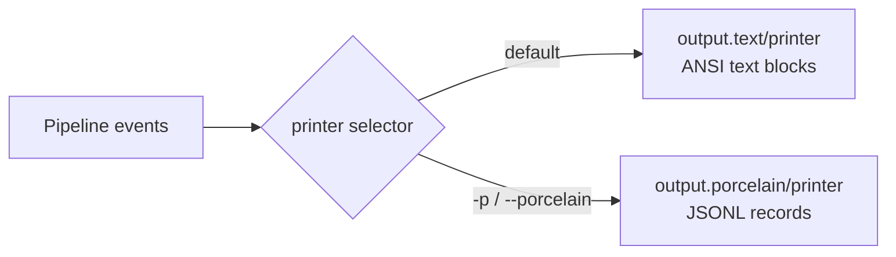

# User-Facing Surfaces

> *Snapshot of state as of 2026-05-05.*

Skeptic emits findings in two output modes — ANSI text (default) and
newline-delimited JSON (`-p`). Both share the same internal lifecycle
but produce different records. This spoke shows the shapes, the
configuration knobs, and the suppression mechanisms.

## Prerequisites

[Spoke 10 (Blame for All and Projection)](10-blame-for-all-and-projection.md)
— you have a finding in hand. Optional:
[spokes 04](04-provenance.md) and [05](05-admission-paths.md) for
provenance and admission, since both surface here.

## Where this fits

Eleventh on the Contributor path. First stop on the Diagnose-finding
reading path (you reach this spoke from a finding in your terminal
and then walk backward through 10 → 09 → 08).

## Two output modes

The default is a human-readable, ANSI-coloured report — one block per
inconsistency, grouped by namespace. With `-p` (or
`--porcelain`), Skeptic emits newline-delimited JSON instead — one
JSON record per event, structured for downstream processing.

Both modes go through the same `printer` selector
(`skeptic.output/printer`), but the two printers
(`output.text/printer`, `output.porcelain/printer`) emit different
records. The selector is a small switch:

```clojure
(defn printer [opts]
  (if (:porcelain opts) porcelain/printer text/printer))
```

Each printer is a *map* of phase callbacks — one entry per
lifecycle event:

```clojure
{:run-start      (fn [opts namespaces] ...)
 :discovery-warn (fn [{:keys [path message]}] ...)
 :ns-start       (fn [ns source-file opts] ...)
 :finding        (fn [ns result summary opts] ...)
 :form-debug     (fn [ns record opts] ...)
 :ns-end         (fn [ns count opts] ...)
 :run-end        (fn [errored? totals opts] ...)}
```

The pipeline calls these callbacks at fixed points. Both printers
implement every callback; the text printer suppresses output where
the porcelain printer emits a record (and vice versa).

*Figure: One pre-printer node, two arrows splitting into text and porcelain.*



## The text printer

The text printer is driven by `report-fields`, which produces an
ordered `[[label value] ...]` list for the printer to render.
`report-fields` is public for testability. It branches on
`:report-kind`: `:exception` records render with a phase-and-class
header; ordinary findings render the per-finding fields.

A finding block looks roughly like:

```text
---------
Namespace:     skeptic.walkthrough.example
Location:      example.clj:8:5 [source: schema]
Blame:         context( value )
```

In verbose mode (`-v` / `--verbose`), additional rows appear: cast
rule, actual type, expected type, source expression, affected input,
enclosing form, analyzed expression. A trailing `---` separates the
inline error messages.

The block ends with a horizontal rule (`---------`); per-namespace
inconsistency counts print at the end of the run, sorted with the
worst-offending namespace first. Zero-count namespaces are hidden
unless `-v / --verbose`.

The text printer also drives `:run-end`'s "No inconsistencies found"
message on a clean run. Findings have already been printed by then;
the closing message is just a confirmation when the count was zero.

## The porcelain (JSONL) printer

The porcelain printer emits five record kinds:

| Kind                       | When                                                                     | Example field                                         |
|----------------------------|--------------------------------------------------------------------------|-------------------------------------------------------|
| `ns-discovery-warning`     | Per non-blocking namespace load failure                                   | `path`, `message`                                     |
| `finding`                  | Per type-mismatch finding                                                 | `ns`, `report_kind`, `location`, `blame`, `blame_side`, `blame_polarity`, `rule`, `actual_type`, `expected_type`, `messages` |
| `exception`                | Per namespace-local failure during checking                               | `ns`, `phase`, `location`, `exception_class`, `exception_message`, `messages` |
| `namespace-error-summary`  | Once per run, immediately before the closing summary                      | `counts` (sorted map of namespace → count)            |
| `run-summary`              | Always last; one per run, including clean runs                            | `errored`, `finding_count`, `exception_count`, `namespace_count`, `namespaces_with_findings` |

Every record is one JSON object, written with `clojure.data.json`,
followed by a newline. Empty fields are dropped (via `drop-empties`)
to keep the records compact, except in `:debug` mode where the full
shape is preserved.

A `finding` record carries a nested `location` object:

```json
{
  "kind": "finding",
  "ns": "skeptic.walkthrough.example",
  "report_kind": "type-mismatch",
  "location": {"file": "example.clj", "line": 8, "column": 5, "source": "schema"},
  "blame": "(:else \"odd\")",
  "blame_side": "term",
  "blame_polarity": "positive",
  "rule": "ground-mismatch",
  "actual_type": {"kind": "ground", "tag": "string", "name": "Str"},
  "expected_type": {"kind": "ground", "tag": "keyword", "name": "Keyword"},
  "actual_type_str": "Str",
  "expected_type_str": "Keyword",
  "messages": ["..."],
  "focuses": [],
  "enclosing_form": "(s/defn classify ...)"
}
```

The `actual_type` and `expected_type` fields are tagged JSON data
produced by `bridge.render/type->json-data*`. The `actual_type_str`
and `expected_type_str` are the human-readable display strings; both
are present so downstream consumers can pick whichever they need.
ANSI escape codes are stripped from `messages` via `strip-ansi`.

The `run-summary` record is the run's last line:

```json
{"kind": "run-summary", "errored": false, "finding_count": 0, "exception_count": 0, "namespace_count": 12, "namespaces_with_findings": 0}
```

Even on a clean run with zero findings, `run-summary` appears. This
makes downstream processing simpler — every run produces a summary,
no special "did the run actually finish" check needed.

When `--profile` is also set, the profile summary is written to
**stderr**, so stdout stays pure JSONL. When `-o` is also set, the
JSONL still goes to the output file and the profile summary still
goes to stderr.

## How types are rendered

Inside both printers, semantic Types render via
`bridge.render/render-type` (text-side) and
`bridge.render/type->json-data` (JSONL-side). Both honor the
`--explain-full` flag.

By default — without `--explain-full` — declared schema names *fold*.
A `MaybeT[GroundT Int]` whose `:prov` source is `:schema`,
`:malli`, or `:type-override` and whose qualified-symbol resolves to
a known declared name is rendered as that name (e.g.,
`(maybe Int)`). The folding is the user-facing contract for
abstraction: the user wrote a name, the user gets the name back.

With `--explain-full`, the *structural* form is printed regardless
— so `MaybeT[GroundT Int]` always reads as `(maybe Int)` in
structural form, never folded into a declared alias. Useful when the
folded display hides the cause of a mismatch.

`:inferred` and `:native` Types never fold. They have no declared
name to fold to; the structural form is the only form they have.

## Suppression mechanisms

Skeptic provides three opt-out mechanisms for cases where its
inference is wrong, too dynamic, or outright unhelpful. Each
suppresses checks in a different scope.

### `:skeptic/ignore-body`

Suppresses checks *inside* a function body. The declared schema
still applies to all callers — the contract is unchanged externally.

```clojure
(s/defn my-fn :- s/Int
  {:skeptic/ignore-body true}
  [x :- s/Int]
  (int-add nil x))
```

Inside `my-fn`, the call `(int-add nil x)` would normally fail
(passing `nil` to `int-add`). With `:skeptic/ignore-body true`, the
body is not analyzed; no findings come from inside. Callers are
still checked against `:- s/Int`.

Use case: the body is doing something Skeptic can't analyze (a Java
interop bridge, a clever macro), but the function's external
contract is correct.

### `:skeptic/opaque`

Treats a function as a black box. Callers see it as accepting
`s/Any` and returning `s/Any` — neither the body nor the schema is
checked.

```clojure
(s/defn my-fn :- s/Int
  {:skeptic/opaque true}
  [x :- s/Int]
  "not-an-int")
```

The body is not checked, *and* the declared `:- s/Int` is not
enforced on callers. This is stronger than `:skeptic/ignore-body`:
opaque is "I don't want Skeptic involved at all"; ignore-body is
"trust the schema, not the body."

Use case: a function whose schema is wrong but the user is unable
or unwilling to fix it; or a function whose declared schema would
require expressing something Skeptic doesn't yet support.

### `^{:skeptic/type T}` metadata

Pins a single expression's inferred Type to a user-supplied schema:

```clojure
(let [y ^{:skeptic/type s/Int} (some-call-that-returns-any)]
  (int-add y 1))
```

The expression's Type is treated as `s/Int` for subsequent checks
(via `schema->type` with `:type-override` provenance — see
[spoke 04](04-provenance.md)). The wrapper around the call is
necessary because Clojure does not allow metadata on bare literal
values; if `T` is meant to be a literal, wrap it:

```clojure
^{:skeptic/type s/Int} (identity 42)
```

Use case: a known-typed value that Skeptic can't infer (a global
atom's deref'd value whose schema is implicit, a result from a
non-Plumatic library function, a value whose origin Skeptic can't
trace).

### When to use which

| Need to … | Use |
|-----------|-----|
| Suppress only the *internal* checks; keep the schema enforced for callers | `:skeptic/ignore-body` |
| Suppress *all* checks (internal + the function's contract on callers) | `:skeptic/opaque` |
| Pin one *expression's* type without affecting the surrounding function | `^{:skeptic/type T}` |
| Apply across many call sites at once via configuration | `:type-overrides` (see below) |

## Configuration via `.skeptic/config.edn`

Skeptic reads optional project-level configuration from
`.skeptic/config.edn` at the project root. The file is EDN; every
key is optional.

```clojure
{:exclude-files ["src/fixtures/*.clj"
                 "test/**/*_examples.clj"]
 :type-overrides {clojure.tools.logging/infof {:output (s/eq nil)}}}
```

`:exclude-files` is a vector of glob patterns matched against each
file's path *relative to the project root*. Matched files are
skipped entirely — their namespaces are never loaded or checked.
Patterns use the platform's `java.nio.file.PathMatcher` glob syntax
(`*`, `**`, `?`, character classes). Excludes apply *before*
`-n` / `--namespace` selection.

`:type-overrides` is a map from fully-qualified symbol to an
override map with `:schema`, `:output`, or `:arglists`. Values are
Plumatic Schema expressions evaluated with `[schema.core :as s]`
in scope. The override replaces whatever Skeptic would otherwise
infer or collect for that symbol at call sites.

The example above — `clojure.tools.logging/infof` overridden to
return `(s/eq nil)` — silences noise from variadic logging
functions whose declared schemas are unhelpful. Call sites of
`infof` are then checked as returning `nil` (not `s/Any`, not
whatever the logging library declares).

## Marquee functions

| Function                          | File                                         | Role                                                                  |
|-----------------------------------|----------------------------------------------|-----------------------------------------------------------------------|
| `output/printer`                  | `skeptic/output.clj`                          | Selects text or porcelain based on opts.                              |
| `output.text/report-fields`       | `skeptic/output/text.clj`                     | The `[[label value] ...]` builder driving the text printer.            |
| `output.porcelain/printer` (map)  | `skeptic/output/porcelain.clj`                | The lifecycle map (`:run-start`, `:finding`, `:run-end`, …).           |
| `bridge.render/render-type`       | `skeptic/analysis/bridge/render.clj`          | Type → display-form string (text mode).                               |
| `bridge.render/type->json-data`   | `skeptic/analysis/bridge/render.clj`          | Type → JSON-friendly tagged data (JSONL mode).                        |

## Worked example here

`classify`'s finding renders both ways. In text mode (verbose):

```text
---------
Namespace:           skeptic.walkthrough.example
Location:            example.clj:8:5 [source: schema]
Blame:               context( value )
Cast rule:           ground-mismatch
Actual type:         Str
Expected type:       Keyword
Expression:          (:else "odd")
In enclosing form:   (s/defn classify ...)
```

In porcelain mode:

```json
{"kind":"finding","ns":"skeptic.walkthrough.example","report_kind":"type-mismatch","location":{"file":"example.clj","line":8,"column":5,"source":"schema"},"blame":"(:else \"odd\")","blame_side":"term","blame_polarity":"positive","rule":"ground-mismatch","actual_type":{"kind":"ground","tag":"string","name":"Str"},"expected_type":{"kind":"ground","tag":"keyword","name":"Keyword"},"actual_type_str":"Str","expected_type_str":"Keyword","messages":["..."]}
```

`double-or-zero` produces no finding in either mode.

## Where to next

- **Continue (Contributor path):** [Contributor Surfaces and Pitfalls (12)](12-contributor-surfaces.md)
- **Diagnose-finding path:** continue (reverse) to [Blame for All and Projection (10)](10-blame-for-all-and-projection.md)
- **Return:** [Hub](README.md)
