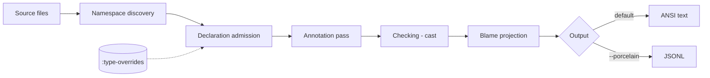

# Skeptic Walkthrough

> **Snapshot:** state of Skeptic as of 2026-05-05. Refreshed informally on
> major refactor; consult the source on conflict.

A self-contained, human-facing tour of Skeptic's algorithm — admission,
annotation, casting, blame, and output. For a Clojure programmer with basic
type-systems vocabulary who wants to understand the system, contribute to it,
or both.

## Overview

Skeptic is a static type-checker for Clojure projects that use [Plumatic
Schema](https://github.com/plumatic/schema). It reads your source code,
infers a type for every expression, and reports the places where the inferred
type disagrees with the type you declared on a function's inputs or output.

Internally Skeptic runs a fixed sequence of phases. Source files are
discovered by walking the project's source paths. Each namespace is
*admitted*: declared schemas, Malli `:malli/schema` metadata, native
function descriptors, and `:type-overrides` from `.skeptic/config.edn` are
converted into a single dictionary of semantic Types keyed by qualified
symbol. Each top-level form is then *annotated*: a `tools.analyzer` AST
walk attaches a Type to every node. The annotated AST is *checked* — for
each call site and each function return, the cast engine compares the
inferred Type against the declared Type. Failed casts are *projected* into
findings carrying a path, blame side, and message. The findings are then
*rendered* — by default as ANSI-coloured text, or as newline-delimited
JSON when `-p` is set.

*Figure: Skeptic from CLI to output. Each phase is a spoke in this Walkthrough.*



The Walkthrough is a snapshot, not a living document. When the source
disagrees with what's written here, the source wins. The hub above and
each spoke below carry their own snapshot dates so drift is visible.

This Walkthrough assumes working Clojure (`defrecord`, protocols, lazy
seqs, multimethods, metadata) and basic type-systems vocabulary
(variance, gradual typing, blame, soundness). It assumes a Mermaid
renderer (GitHub, IDE preview, or local). It does not assume that you
will run any of the example code.

The artifact is hub-and-spoke. There is no required linear order — pick
the reading path that matches your goal.

## The worked example

A small two-definition Plumatic-Schema namespace threads through every
spoke. Spokes refer back to it; you don't need to memorize it.

```clojure
(ns skeptic.walkthrough.example
  (:require [schema.core :as s]))

(s/defn classify :- s/Keyword
  "Demonstrates output-cast blame:
   the :else branch returns a string, but :- s/Keyword expects a Keyword.
   Skeptic reports an output mismatch on classify."
  [n :- s/Int]
  (cond
    (zero? n) :zero
    (even? n) :even
    :else     "odd"))                 ;; ← inferred Str does not fit declared Keyword

(s/defn double-or-zero :- s/Int
  "Demonstrates flow-sensitive narrowing on a maybe-typed argument:
   inside the (some? n) branch, n narrows from (maybe Int) to Int,
   so (* 2 n) type-checks cleanly. The else branch returns 0, which fits.
   Skeptic reports nothing for this definition."
  [n :- (s/maybe s/Int)]
  (if (some? n)
    (* 2 n)
    0))
```

`classify` drives every spoke that exercises declared output vs. inferred
output. `double-or-zero` drives every spoke that exercises flow-sensitive
refinement.

## Reading paths

Pick the path that matches your goal. Each path lists spokes in order.
In-depth sections inside a spoke are clearly marked; the Gist path skips
them.

### Gist path (~30–45 min)

For "what is Skeptic, conceptually." Skip every `### In-depth:` section.

1. [Pipeline Tour](01-pipeline-tour.md)
2. [Three Domains](02-three-domains.md)
3. [Type Domain — marquee only](03-type-domain.md)
4. [Cast Dispatch — marquee only](09-cast-dispatch.md)
5. [User-Facing Surfaces](11-user-facing-surfaces.md)

### Contributor path (~3–4 h)

Read in numeric order; in-depth sections enabled throughout.

1. [Pipeline Tour](01-pipeline-tour.md)
2. [Three Domains](02-three-domains.md)
3. [Type Domain](03-type-domain.md)
4. [Provenance](04-provenance.md)
5. [Admission Paths](05-admission-paths.md)
6. [Annotation Pass](06-annotation-pass.md)
7. [Closed-Sum Exhaustiveness](07-closed-sum-exhaustiveness.md)
8. [Narrowing and Origins](08-narrowing-and-origins.md)
9. [Cast Dispatch](09-cast-dispatch.md)
10. [Blame for All and Projection](10-blame-for-all-and-projection.md)
11. [User-Facing Surfaces](11-user-facing-surfaces.md)
12. [Contributor Surfaces and Pitfalls](12-contributor-surfaces.md)

### Diagnose-finding path (~60 min)

For a contributor with a finding already in their terminal. Reverse
pipeline order.

1. [User-Facing Surfaces](11-user-facing-surfaces.md) — read the finding's shape
2. [Blame for All and Projection](10-blame-for-all-and-projection.md) — how the finding was projected
3. [Cast Dispatch](09-cast-dispatch.md) — which rule fired
4. [Narrowing and Origins](08-narrowing-and-origins.md) — what types fed the cast
5. Optionally back to [Annotation Pass](06-annotation-pass.md) and [Admission Paths](05-admission-paths.md)

## Cluster index

| #  | File                                                                | Title                                  | Objective                                                                                  |
|----|---------------------------------------------------------------------|----------------------------------------|--------------------------------------------------------------------------------------------|
| 01 | [01-pipeline-tour.md](01-pipeline-tour.md)                          | Pipeline Tour                          | Trace one finding from source through every phase, on the worked example.                  |
| 02 | [02-three-domains.md](02-three-domains.md)                          | Three Domains: Schema, MalliSpec, Type | Establish that Schema and MalliSpec are external; Type is internal; conversion is one-way. |
| 03 | [03-type-domain.md](03-type-domain.md)                              | The Type Domain                        | The 24 Type record kinds, with the 8 most-used in detail.                                  |
| 04 | [04-provenance.md](04-provenance.md)                                | Provenance                             | Every Type carries `:prov`; combinators take an explicit anchor; source rank governs merge. |
| 05 | [05-admission-paths.md](05-admission-paths.md)                      | Admission: Schema, Malli, Native, Override | The boundary that converts external schemas into Types; the dict-after-admission invariant. |
| 06 | [06-annotation-pass.md](06-annotation-pass.md)                      | Annotation: AST → Typed AST            | The first-order analyzer pass that attaches a Type to every node, dispatched by `:op`.      |
| 07 | [07-closed-sum-exhaustiveness.md](07-closed-sum-exhaustiveness.md)  | Closed-Sum Exhaustiveness              | How `case`, `cond`, and `condp` over a finite sum let the default branch drop.             |
| 08 | [08-narrowing-and-origins.md](08-narrowing-and-origins.md)          | Narrowing and Origins                  | Flow-sensitive refinement: the assumption→origin→type pipeline.                             |
| 09 | [09-cast-dispatch.md](09-cast-dispatch.md)                          | Cast Dispatch                          | The dispatch ladder: how a source/target pair selects a rule.                              |
| 10 | [10-blame-for-all-and-projection.md](10-blame-for-all-and-projection.md) | Blame for All and Projection      | The polymorphic boundary (seals, `nu`, generalize/instantiate) and how cast results become findings. |
| 11 | [11-user-facing-surfaces.md](11-user-facing-surfaces.md)            | User-Facing Surfaces                   | Text, JSONL, configuration, suppression mechanisms.                                        |
| 12 | [12-contributor-surfaces.md](12-contributor-surfaces.md)            | Contributor Surfaces and Pitfalls      | Where to add things; common mistakes and why they fail.                                    |

## Glossary

Alphabetical. One-line gloss plus the spoke where the term is defined in
detail.

| Term                           | Gloss                                                                                                                                            | Home  |
|--------------------------------|--------------------------------------------------------------------------------------------------------------------------------------------------|-------|
| Admission                      | The boundary that converts external schemas (Schema, Malli, native, type-override) into Skeptic Types.                                           | 05    |
| Anchor provenance              | The Provenance a combinator stamps on a composite Type; not derived from constituents.                                                           | 04    |
| Annotation pass                | The recursive walk over a `tools.analyzer` AST that attaches a Type to every node.                                                               | 06    |
| Assumption                     | A flow-sensitive fact (`type-predicate`, `value-equality`, `truthy-local`, etc.) carried in the analyzer ctx.                                    | 08    |
| Blame                          | Assignment of cast-failure responsibility to either source side (`:term`) or target side (`:context`).                                           | 10    |
| Blame polarity                 | `:positive` or `:negative`; flipped by function-domain casts (contravariance).                                                                   | 09    |
| Bottom type                    | `BottomT` — the empty type; produced by contradicted assumptions and exhausted unions.                                                           | 03    |
| Cast                           | A directional check between an inferred (source) Type and a declared (target) Type.                                                              | 09    |
| Cast result                    | The data produced by `check-cast`: `{ok? rule blame-side blame-polarity source-type target-type children path…}`.                                | 09    |
| Closed-sum exhaustiveness      | Recognition that `case`/`cond`/`condp` arms cover a finite sum, allowing the default to drop.                                                    | 07    |
| Conditional type               | `ConditionalT` — a value whose type depends on which branch of a discriminator was taken.                                                        | 03    |
| Declaration dict               | The per-namespace map `{qualified-sym → Type}` produced after admission.                                                                         | 05    |
| Dynamic type                   | `DynT` — the gradual `?` type; cast to `Dyn` always succeeds.                                                                                    | 03    |
| Finding                        | A single emitted mismatch record with location, blame, rule, actual/expected types, and rendered messages.                                       | 10    |
| First-order invariant          | The annotation pass never produces a quantified type. Quantified types enter only via admission and external types.                              | 06    |
| Flow-sensitive narrowing       | Refinement of a local's Type along a branch, using assumptions derived from the test expression.                                                 | 08    |
| Generalize rule                | Cast into `forall X. B`: produce a polymorphic value, deferring the choice of `X`.                                                               | 10    |
| Ground type                    | `GroundT` — a primitive named type (`Int`, `Str`, `Keyword`, `Bool`, `Symbol`, plus class grounds).                                              | 03    |
| Instantiate rule               | Cast out of `forall X. A`: substitute `X := ?` and continue.                                                                                     | 10    |
| Marquee function               | The 3–6 named functions per spoke that anchor the spoke's mental model.                                                                          | hub   |
| Maybe type                     | `MaybeT` — `T` or `nil`. Created by `s/maybe`, optional-key values, and union with `nil`.                                                        | 03    |
| Numeric Dyn                    | `NumericDynT` — the gradual numeric supertype; matches numbers without committing to int vs. float.                                              | 03    |
| Origin                         | A structured record of where a node's type came from: `:root`, `:opaque`, `:map-key-lookup`, or `:branch`.                                       | 08    |
| Polymorphic blame calculus     | The Ahmed-Findler-Siek-Wadler runtime model that assigns blame across casts under parametric polymorphism.                                       | 10    |
| Porcelain                      | The JSONL output mode (`-p`) — one JSON record per finding plus discovery, exception, summary, and run-summary.                                  | 11    |
| Provenance                     | The `:prov` field carried on every Type, recording its named source and (when applicable) the qualified symbol.                                  | 04    |
| Quantified type                | `ForallT` — a `forall X. T` construct; targets and sources of generalize/instantiate.                                                            | 10    |
| Sealed dynamic value           | `SealedDynT` — a value cast from a type variable into Dyn; carries the binder name and is tamper-protected.                                      | 10    |
| Snapshot policy                | The Walkthrough is a point-in-time guide; refresh is informal on major refactor.                                                                 | hub   |
| Source rank                    | The total order over Provenance sources used by `merge-provenances`: `:type-override` < `:malli` < `:schema` < `:native` < `:inferred`.          | 04    |
| Type domain                    | Skeptic's internal semantic representation of types; distinct from external schema and malli-spec forms.                                         | 03    |
| Union type                     | `UnionT` — a Type whose members are alternatives. Built by `union-type`; deduplicated via `type=?`.                                              | 03    |

## Conventions

- **Snapshot.** Each spoke carries the date of its last refresh. Drift between spokes is allowed and informative — it tells you which spoke last got attention.
- **File pointers.** Marquee functions are referenced as `path/file.clj:fn-name` with no line numbers. Line numbers drift faster than function names.
- **In-depth sections.** Marked with `### In-depth: <topic>` and a leading italic-bold *Skip if reading the Gist path.* callout. Skippable for the Gist reader.
- **Type-record naming.** Bare PascalCase in prose (`MaybeT`, `FunT`, `ConditionalT`); the `at/->` constructor form when the reader needs to find the constructor.
- **Provenance source values.** Keyword form (`:schema`, `:malli`, `:native`, `:type-override`, `:inferred`).
- **Diagrams.** Mermaid is the default medium; diagrams whose content is fundamentally tabular use plain Markdown tables instead. Every diagram has been validated against the GitHub Markdown Mermaid renderer; alternative renderers may show minor styling differences.
- **Code fences.** `clojure` for source; `mermaid` for diagrams; `text` for ASCII output and tables; `json` for JSONL records.
