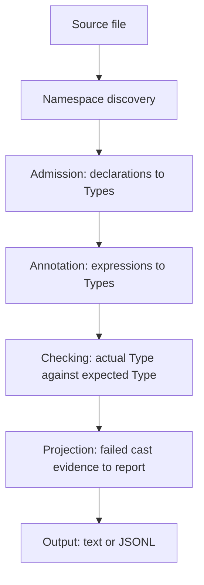

# Skeptic Walkthrough

> *Snapshot of state as of 2026-05-06.*

This walkthrough follows one small namespace through Skeptic: declarations enter
as Schema, become Types, attach to analyzer nodes, get checked by casts, and
surface as text or JSONL findings. The goal is to make each handoff visible.

## The Worked Example

```clojure
(ns skeptic.walkthrough.example
  (:require [schema.core :as s]))

(s/defn classify :- s/Keyword
  [n :- s/Int]
  (cond
    (zero? n) :zero
    (even? n) :even
    :else     "odd"))

(s/defn double-or-zero :- s/Int
  [n :- (s/maybe s/Int)]
  (if (some? n)
    (* 2 n)
    0))
```

The two functions exercise different parts of Skeptic.

`classify` has a declared output of Keyword. Its body can return `:zero`,
`:even`, or `"odd"`. The first two values fit the declaration. The string does
not. The walkthrough uses this function to follow a failed output boundary from
declaration, through annotation, into a source-union cast, and out to a finding.

`double-or-zero` has a maybe Int input. Its body checks `(some? n)` before using
`n` in multiplication. The walkthrough uses this function to show how branch
facts refine locals before call checking and why no output finding is produced.

## The Run Shape



Read the diagram as data movement. The declared `s/Keyword` output does not
remain a Schema form. Admission imports it as a Type. The body of `classify`
does not remain just source text. Annotation computes a body Type with all
reachable alternatives. Checking compares those two Types. Projection and output
turn the failed comparison into a report a programmer can act on.

## Reading Paths

The full Contributor path is:

1. [Pipeline Tour](01-pipeline-tour.md)
2. [Three Domains](02-three-domains.md)
3. [Type Domain](03-type-domain.md)
4. [Provenance](04-provenance.md)
5. [Admission Paths](05-admission-paths.md)
6. [Annotation Pass](06-annotation-pass.md)
7. [Closed-Sum Exhaustiveness](07-closed-sum-exhaustiveness.md)
8. [Narrowing and Origins](08-narrowing-and-origins.md)
9. [Cast Dispatch](09-cast-dispatch.md)
10. [Blame For All And Projection](10-blame-for-all-and-projection.md)
11. [User-Facing Surfaces](11-user-facing-surfaces.md)
12. [Contributor Surfaces](12-contributor-surfaces.md)

For diagnosing a finding, start with the report surface, then walk backward:
11 explains output fields, 10 explains report construction, 09 explains the cast
rule evidence, 06 and 08 explain annotated actual Types, and 05 explains the
declared expected Type.

For a quick conceptual pass, read 01, 02, 03, 09, and 10. That path explains the
pipeline, the input and Type domains, the main Type shapes, the cast engine, and
the way failed cast evidence becomes a finding.

## What Each Spoke Adds

| Spoke | What it adds to the example |
|---|---|
| 01 | The full run from namespace selection to output. |
| 02 | Why `s/Keyword` and `(s/maybe s/Int)` become Type values. |
| 03 | The Type shapes carried by the two functions. |
| 04 | The provenance attached to declared and inferred Types. |
| 05 | How the function declarations enter the dictionary. |
| 06 | How bodies acquire computed Types. |
| 07 | Why the `classify` fallback branch remains reachable. |
| 08 | Why `(some? n)` narrows `n` in `double-or-zero`. |
| 09 | Why the `classify` source union fails against Keyword. |
| 10 | How failed cast evidence becomes an output report. |
| 11 | How that report is rendered as text or JSONL. |
| 12 | Where contributors change each part of the path. |

## Glossary

- **Admission** - the boundary where declarations become Types.
- **Annotation** - the pass that attaches computed Types to analyzer nodes.
- **Assumption** - a fact produced by a branch test.
- **Cast** - a directional check from actual Type to expected Type.
- **Closed sum** - a Type whose alternatives can be enumerated.
- **Finding** - a user-visible report built from failed check evidence.
- **MalliSpec** - Malli syntax used as an admission source.
- **Narrowing** - branch-local Type refinement.
- **Origin** - the route that connects a branch fact to a value.
- **Provenance** - source metadata carried by Types.
- **Schema** - Plumatic Schema syntax used as an admission source.
- **Type** - Skeptic's semantic model for checking.
