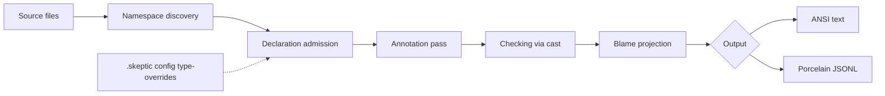

# Skeptic Walkthrough

A self-contained tour of Skeptic's algorithm: admission, annotation, casting,
blame, and output. The reader is assumed to know Clojure well and to have basic
type-systems vocabulary, but not to know Skeptic's architecture.

> **Snapshot:** state of Skeptic as of 2026-05-06. This is a point-in-time
> walkthrough; when behavior and source disagree, the source wins.

## Overview

Skeptic reads Clojure namespaces, admits declared schemas into an internal Type
domain, annotates analyzer ASTs with inferred Types, casts inferred Types against
declared Types, projects failed casts into blame, and renders findings as text or
JSONL.

*Figure: Skeptic from source files to output.*



The important turn in the diagram is admission. Before admission, the project
contains external descriptions: Plumatic Schema annotations, limited Malli
metadata, native function descriptors, and optional config overrides. After
admission, later phases speak one language: Skeptic Types. Annotation produces
more Types from code. Checking compares the two.

The walkthrough is hub-and-spoke rather than one long chapter. Each spoke starts
from a reader state and moves it forward: first the whole run, then the input
domains, then the Type language, provenance, admission, annotation, narrowing,
casting, blame, output, and finally contributor entry points.

## The Worked Example

The same small namespace is threaded through the spokes. It has one function
that fails because the inferred return value does not fit the declared output,
and one function that passes because branch narrowing makes a maybe-typed value
usable.

```clojure
(ns skeptic.walkthrough.example
  (:require [schema.core :as s]))

(s/defn classify :- s/Keyword
  "Demonstrates output-cast blame:
   the :else branch returns a string, but :- s/Keyword expects a Keyword.
   Skeptic reports an output mismatch on classify."
  [n :- s/Int]
  (cond
    (zero? n) :zero
    (even? n) :even
    :else     "odd"))

(s/defn double-or-zero :- s/Int
  "Demonstrates flow-sensitive narrowing on a maybe-typed argument:
   inside the (some? n) branch, n narrows from (maybe Int) to Int,
   so (* 2 n) type-checks cleanly. The else branch returns 0, which fits.
   Skeptic reports nothing for this definition."
  [n :- (s/maybe s/Int)]
  (if (some? n)
    (* 2 n)
    0))
```

## Reading Paths

**Gist path, about 30-45 minutes.** Read [01 Pipeline Tour](01-pipeline-tour.md),
[02 Three Domains](02-three-domains.md), the marquee sections of
[03 Type Domain](03-type-domain.md), the marquee sections of
[09 Cast Dispatch](09-cast-dispatch.md), and
[11 User-Facing Surfaces](11-user-facing-surfaces.md). Skip every
`### In-depth:` section.

**Contributor path, about 3-4 hours.** Read the numbered spokes in order,
including in-depth sections. This path is for a reader who wants to make
non-trivial changes without reconstructing the architecture from source first.

**Diagnose-finding path, about 60 minutes.** Start with a finding in hand:
[11 User-Facing Surfaces](11-user-facing-surfaces.md) ->
[10 Blame for All and Projection](10-blame-for-all-and-projection.md) ->
[09 Cast Dispatch](09-cast-dispatch.md) ->
[08 Narrowing and Origins](08-narrowing-and-origins.md), then optionally back to
[06 Annotation Pass](06-annotation-pass.md) and
[05 Admission Paths](05-admission-paths.md).

## Cluster Index

| # | File | Title | Objective |
|---|---|---|---|
| 01 | [01-pipeline-tour.md](01-pipeline-tour.md) | Pipeline Tour | Trace one finding through every phase. |
| 02 | [02-three-domains.md](02-three-domains.md) | Three Domains | Separate external schema forms from internal Types. |
| 03 | [03-type-domain.md](03-type-domain.md) | Type Domain | Recognize the Type values later phases exchange. |
| 04 | [04-provenance.md](04-provenance.md) | Provenance | Explain how Types and findings remember origin. |
| 05 | [05-admission-paths.md](05-admission-paths.md) | Admission Paths | Follow declarations into the namespace Type dict. |
| 06 | [06-annotation-pass.md](06-annotation-pass.md) | Annotation Pass | See how analyzer AST nodes receive inferred Types. |
| 07 | [07-closed-sum-exhaustiveness.md](07-closed-sum-exhaustiveness.md) | Closed-Sum Exhaustiveness | Know when a finite set of alternatives is covered. |
| 08 | [08-narrowing-and-origins.md](08-narrowing-and-origins.md) | Narrowing and Origins | Trace a branch test into a refined local Type. |
| 09 | [09-cast-dispatch.md](09-cast-dispatch.md) | Cast Dispatch | Predict which cast rule checks a source/target pair. |
| 10 | [10-blame-for-all-and-projection.md](10-blame-for-all-and-projection.md) | Blame for All and Projection | Turn cast results into blame, paths, and findings. |
| 11 | [11-user-facing-surfaces.md](11-user-facing-surfaces.md) | User-Facing Surfaces | Read text and JSONL output and choose suppression tools. |
| 12 | [12-contributor-surfaces.md](12-contributor-surfaces.md) | Contributor Surfaces | Find the right edit point for common extensions. |

## Glossary

| Term | Gloss | Home |
|---|---|---|
| Admission | Boundary that converts external declarations into Skeptic Types. | [05](05-admission-paths.md) |
| Annotation pass | Recursive analyzer-AST walk that attaches an inferred Type to nodes. | [06](06-annotation-pass.md) |
| Assumption | Flow-sensitive fact produced from a branch test. | [08](08-narrowing-and-origins.md) |
| Blame | Responsibility assigned when a cast fails. | [10](10-blame-for-all-and-projection.md) |
| Cast | Directional check from source Type to target Type. | [09](09-cast-dispatch.md) |
| Cast result | Tree returned by `check-cast`, with rule, status, children, and path data. | [09](09-cast-dispatch.md) |
| Closed-sum exhaustiveness | Recognition that a finite Type's alternatives are all covered. | [07](07-closed-sum-exhaustiveness.md) |
| Declaration dict | Per-namespace map from qualified symbols to admitted Types. | [05](05-admission-paths.md) |
| Flow-sensitive narrowing | Refining a local Type under a branch assumption. | [08](08-narrowing-and-origins.md) |
| Origin | Structured explanation of where an analyzer value came from. | [08](08-narrowing-and-origins.md) |
| Porcelain | JSONL output mode for tools. | [11](11-user-facing-surfaces.md) |
| Provenance | The `:prov` value on a Type, recording named source and references. | [04](04-provenance.md) |
| Quantified type | `ForallT`, a polymorphic Type handled by the quantified cast rules. | [10](10-blame-for-all-and-projection.md) |
| Sealed dynamic value | Protected dynamic wrapper for a value crossing a polymorphic boundary. | [10](10-blame-for-all-and-projection.md) |
| Type domain | Skeptic's internal semantic representation of types. | [03](03-type-domain.md) |

## Conventions

- Source pointers use `path/file.clj:fn-name`, without line numbers.
- In-depth sections are marked `### In-depth: <topic>` and begin with
  `***Skip if reading the Gist path.***`.
- Type records are named as `MaybeT`, `FunT`, `UnionT`, and so on.
- Provenance source values are shown as keywords: `:schema`, `:malli`,
  `:native`, `:type-override`, `:inferred`.
- Mermaid diagrams are used when the shape matters; tables are used when the
  reader needs comparison more than flow.
